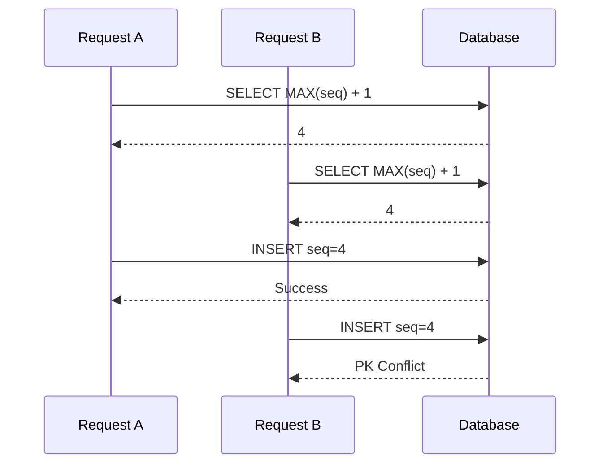
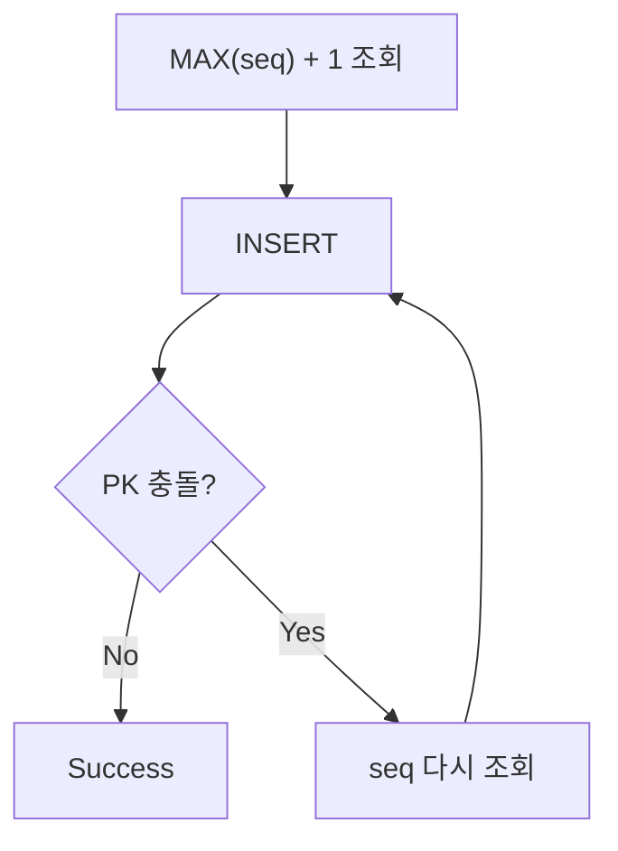

# MAX(seq) + 1과 동시성 문제

이력 데이터를 저장하는 API를 개발하면서 특정 ID와 날짜를 기준으로 순번을 관리해야 할 일이 있었다.

예를 들어 PK가 다음과 같이 구성되어 있다고 해보자.

```text
(id, date, seq)
```

같은 ID와 날짜 안에서는 `seq`가 1부터 순서대로 증가해야 한다.

```text
A / 20260812 / 1
A / 20260812 / 2
A / 20260812 / 3
```

처음에는 다음 순번을 구하는 방법이 자연스럽게 보였다.

```sql
SELECT NVL(MAX(seq), 0) + 1
FROM history
WHERE id = :id
  AND date = :date;
```

현재 최대값이 `3`이면 다음 값은 `4`다.

단일 요청만 생각하면 별다른 문제가 없어 보인다.

그런데 동시 요청까지 생각해보니 한 가지 의문이 생겼다.

**두 요청이 거의 같은 시점에 `MAX(seq) + 1`을 조회하면 어떻게 될까?**

이 문제를 따라가 보니 핵심은 `MAX()` 함수 자체가 아니라 **순번을 조회하는 시점과 실제 INSERT하는 시점이 분리되어 있다는 것**이었다.

이 글에서는 `MAX(seq) + 1` 방식에서 Race Condition이 발생하는 이유와, PK Constraint와 Retry가 각각 어떤 역할을 하는지 정리해본다.

---

## 단일 요청에서는 문제가 없어 보인다

현재 데이터가 다음과 같다고 해보자.

```text
A / 20260812 / 1
A / 20260812 / 2
A / 20260812 / 3
```

다음 SQL을 실행하면

```sql
SELECT NVL(MAX(seq), 0) + 1
FROM history
WHERE id = 'A'
  AND date = '20260812';
```

결과는 `4`다.

이 값을 이용해 INSERT한다.

```sql
INSERT INTO history (
    id,
    date,
    seq
)
VALUES (
    'A',
    '20260812',
    4
);
```

결과는 예상한 대로다.

```text
A / 20260812 / 1
A / 20260812 / 2
A / 20260812 / 3
A / 20260812 / 4
```

문제는 이 과정이 하나의 연산이 아니라는 데 있다.

```text
1. 다음 seq 조회

        ↓

2. INSERT
```

조회와 INSERT 사이에는 시간이 존재한다.

바로 이 구간에서 다른 요청이 들어올 수 있다.

---

## 두 요청은 같은 다음 순번을 조회할 수 있다

현재 `MAX(seq) = 3`인 상태에서 Request A와 Request B가 거의 동시에 들어왔다고 해보자.

A가 다음 순번을 조회한다.

```text
A → MAX(seq) + 1 = 4
```

A가 아직 INSERT하기 전에 B도 같은 SQL을 실행할 수 있다.

```text
B → MAX(seq) + 1 = 4
```

이 시점에는 둘 다 같은 값을 가지고 있다.

```text
Request A → seq = 4
Request B → seq = 4
```

이후 두 요청이 각각 INSERT를 시도한다.



두 요청 모두 각자 실행한 SELECT 결과만 보면 정상적인 `4`를 얻었다.

하지만 전체 시스템 관점에서는 같은 순번을 동시에 선택한 것이다.

이것이 `MAX(seq) + 1` 방식에서 발생하는 Race Condition이다.

---

## 문제는 MAX가 아니라 READ와 WRITE 사이에 있다

처음에는 `MAX(seq) + 1`이라는 SQL 자체가 동시성에 안전하지 않다고 생각하기 쉽다.

하지만 조금 더 정확히 보면 문제는 `MAX()` 함수 자체에 있는 것이 아니다.

다음 두 작업이 분리되어 있다는 것이 핵심이다.

```text
READ
→ MAX(seq) + 1 조회

WRITE
→ 조회한 seq로 INSERT
```

각 요청은 다음과 같이 동작한다.

```text
Request A

READ  → 4
        │
        │ 경쟁 구간
        ▼
WRITE → seq=4
```

```text
Request B

READ  → 4
        │
        │ 경쟁 구간
        ▼
WRITE → seq=4
```

두 요청 사이에는

```text
"내가 4를 조회한 이후
다른 요청도 4를 선택하지 않았는가?"
```

를 보장해주는 장치가 없다.

따라서 `SELECT MAX(seq) + 1`의 결과가 조회 시점에는 정확하더라도, **INSERT하는 시점까지 그 값이 유효하다는 보장은 없다.**

동시성 문제에서 자주 등장하는 **Check-Then-Act** 형태와 비슷한 구조다.

```text
현재 상태 확인
      ↓
그 결과를 기반으로 판단
      ↓
실제 변경

그 사이 다른 요청이 상태를 변경할 수 있음
```

---

## PK Constraint는 무엇을 막아주는가?

복합 PK가 다음과 같이 정의되어 있다고 해보자.

```text
PK (id, date, seq)
```

A가 먼저 `seq=4`를 INSERT하면

```text
A / 20260812 / 4
```

가 저장된다.

이후 B가 동일한 PK를 INSERT하면 DB는 중복 데이터를 허용하지 않는다.

```text
B / 20260812 / 4
        ↓
PK Constraint 위반
```

즉 데이터가 다음과 같이 저장되는 것은 막을 수 있다.

```text
A / 20260812 / 4
A / 20260812 / 4
```

여기서 PK Constraint의 역할을 구분해서 볼 필요가 있다.

PK는 두 요청이 같은 `seq`를 선택하는 Race Condition 자체를 막아주는 것은 아니다.

```text
A → 4 선택
B → 4 선택
```

이 상황은 이미 발생했다.

PK가 하는 일은 그 결과가 실제 중복 데이터로 저장되는 것을 막는 것이다.

```text
Race Condition
      ↓
동일 PK INSERT 시도
      ↓
PK Constraint
      ↓
한 요청 실패
```

즉 PK Constraint는 **동시성 제어의 예방 장치라기보다 데이터 정합성을 지키는 최종 방어선**으로 볼 수 있다.

---

## 그렇다면 실패한 요청은 어떻게 처리할까?

중복 데이터는 저장되지 않았지만 B 요청은 실패했다.

```text
A → seq=4 INSERT 성공

B → seq=4 INSERT 실패
```

하지만 B의 작업 자체가 반드시 실패해야 하는 것은 아니다.

A가 이미 `4`를 저장했다면 B가 현재 상태를 다시 조회했을 때 다음 순번은 이제 `5`다.

```text
MAX(seq) + 1
       ↓
       5
```

따라서 B가 다시 순번을 조회하고 INSERT하면 성공할 수 있다.

```text
B Retry

MAX(seq) + 1 → 5
        ↓
INSERT seq=5
        ↓
Success
```

Java에서는 예를 들어 다음과 같은 형태로 구현할 수 있다.

```java
for (int retry = 0; retry < 3; retry++) {

    try {
        int seq = mapper.selectNextSeq(id, date);

        mapper.insert(id, date, seq);

        break;

    } catch (DuplicateKeyException e) {

        if (retry == 2) {
            throw e;
        }
    }
}
```

여기서 중요한 점은 **INSERT만 다시 실행하면 안 된다는 것**이다.

첫 번째 시도에서 얻었던 `seq=4`를 그대로 사용하면 다시 같은 충돌이 발생한다.

```text
잘못된 Retry

seq = 4
   ↓
INSERT 실패
   ↓
다시 seq = 4 INSERT
   ↓
또 실패
```

Retry할 때는 DB 상태가 이미 달라졌기 때문에 다음 순번을 다시 계산해야 한다.

```text
Retry

다시 MAX(seq) + 1 조회
        ↓
새로운 seq 획득
        ↓
INSERT
```

---

## Retry는 Race Condition을 없애는 것이 아니다

여기서 Retry의 역할도 구분할 필요가 있다.

`MAX(seq) + 1 + Retry`를 적용했다고 해서 두 요청이 같은 순번을 가져가는 문제가 사라지는 것은 아니다.

여전히 다음 상황은 발생할 수 있다.

```text
A → seq=4
B → seq=4
```

차이는 그 이후다.

```text
A → INSERT 성공

B → PK Conflict
        ↓
다시 seq 조회
        ↓
seq=5
        ↓
INSERT 성공
```

전체 구조는 다음과 같다.



즉 Retry는 Race Condition을 예방하는 방식이 아니라 **충돌이 실제로 발생했을 때 복구하는 전략**이다.

이 차이는 꽤 중요하다.

```text
PK Constraint
→ 잘못된 데이터 저장 방지

Retry
→ 충돌한 요청 복구
```

두 장치가 함께 동작하면서 결과적으로 요청을 처리할 수 있는 구조다.

---

## 이 방식은 언제까지 괜찮을까?

충돌이 드문 환경이라면 이 방식은 비교적 단순하다.

예를 들어 동일한 `(id, date)`에 동시에 여러 INSERT가 발생할 가능성이 매우 낮다고 해보자.

대부분의 요청은 다음과 같이 한 번에 성공한다.

```text
MAX(seq) + 1
      ↓
INSERT
      ↓
Success
```

가끔 충돌이 발생할 때만 Retry가 동작한다.

```text
Conflict
   ↓
Retry
   ↓
Success
```

이 경우 복잡한 Lock 구조를 추가하는 것보다 PK Constraint를 안전장치로 두고 충돌한 요청만 복구하는 것이 실용적인 선택일 수 있다.

하지만 같은 `(id, date)`에 요청이 집중된다면 이야기가 달라진다.

```text
A → 4
B → 4
C → 4
D → 4
```

한 요청만 성공하고 나머지는 모두 충돌한다.

```text
A → Success

B ─┐
C ─┼→ PK Conflict → Retry
D ─┘
```

Retry한 요청끼리 다시 경쟁할 수도 있다.

따라서 충돌 빈도가 높아질수록 Retry 비용과 DB 요청도 함께 증가한다.

이 경우에는 **순번 생성 구조 자체를 다시 검토할 필요가 있다.**

---

## Oracle Sequence라면 해결할 수 있을까?

Oracle에는 동시 요청에서도 서로 다른 증가값을 얻을 수 있는 Sequence가 있다.

```sql
SELECT MY_SEQ.NEXTVAL
FROM DUAL;
```

예를 들어 여러 요청이 동시에 실행해도 각각 다른 값을 얻을 수 있다.

```text
Request A → 101

Request B → 102

Request C → 103
```

따라서 단순히 시스템 전체에서 고유한 증가값이 필요하다면 `MAX(seq) + 1`보다 Sequence가 훨씬 자연스러운 선택이다.

하지만 처음 요구사항으로 돌아가면 순번의 범위가 다르다.

필요한 값은 다음과 같은 형태였다.

```text
A / 20260812 → 1, 2, 3 ...

B / 20260812 → 1, 2, 3 ...

A / 20260813 → 1, 2, 3 ...
```

즉 `(id, date)`라는 그룹마다 독립적인 순번이 필요하다.

반면 하나의 일반적인 Sequence는 다음과 같이 전체적으로 증가한다.

```text
1 → 2 → 3 → 4 → 5 ...
```

따라서 단순히 하나의 Sequence로 교체하면 **고유한 번호를 만드는 문제는 해결할 수 있지만 그룹별 연속 순번이라는 요구사항은 그대로 해결되지 않는다.**

이 경우에는 별도의 순번 관리 구조나 Lock을 이용해 그룹별 순번을 직렬화하는 방식 등을 검토해야 한다.

중요한 것은 특정 기술을 바로 선택하는 것이 아니라 **순번에 실제로 어떤 보장이 필요한지 먼저 구분하는 것**이다.

```text
전체에서 고유하면 되는가?

그룹별 순번이어야 하는가?

중간 번호가 비어도 되는가?

동일 그룹의 동시 요청이 얼마나 많은가?
```

이 요구사항에 따라 적절한 생성 방식도 달라진다.

---

## 처음 생각했던 MAX(seq) + 1과 실제 문제

처음에는 다음 SQL만 보고 생각했다.

```sql
SELECT MAX(seq) + 1
```

현재 최대값에 1을 더하니 다음 순번을 구하는 방법으로는 문제가 없어 보였다.

하지만 동시성을 고려하면 실제 동작 단위는 SQL 한 줄이 아니었다.

```text
SELECT
   ↓
Application
   ↓
INSERT
```

그리고 바로 이 사이에 다른 Transaction이 들어올 수 있다.

```text
Request A

SELECT → 4
           \
            INSERT → 4


Request B

SELECT → 4
           \
            INSERT → 4
```

결국 문제의 본질은

> `MAX(seq) + 1`이 잘못된 값을 계산한다.

가 아니라

> **조회한 값이 INSERT 시점까지 여전히 유효하다는 보장이 없다.**

는 데 있었다.

이 관점으로 보면 PK와 Retry의 역할도 더 명확해진다.

```text
Race Condition
      ↓
같은 seq 선택
      ↓
PK Constraint로 충돌 감지
      ↓
실패한 요청이 상태를 다시 조회
      ↓
새로운 seq로 Retry
```

---

## 정리

`MAX(seq) + 1`은 단일 요청만 생각하면 간단하고 직관적인 순번 생성 방식이다.

```text
MAX = 3
  ↓
NEXT = 4
```

하지만 실제 애플리케이션에서는 순번을 조회한 뒤 INSERT하기까지 시간이 존재한다.

```text
SELECT MAX(seq) + 1
        ↓
        ↓ 다른 요청이 들어올 수 있음
        ↓
INSERT
```

두 요청이 같은 상태를 조회하면 동일한 다음 순번을 선택할 수 있다.

```text
A → 4
B → 4
```

PK Constraint가 있다면 중복 데이터 저장 자체는 방지할 수 있다.

하지만 PK가 Race Condition을 없애는 것은 아니다.

```text
Race Condition
→ 그대로 존재

PK Constraint
→ 실제 중복 저장 방지
```

실패한 요청에서 다음 순번을 다시 조회하고 Retry하면 충돌을 복구할 수 있다.

```text
DuplicateKeyException
        ↓
MAX(seq) + 1 재조회
        ↓
새로운 seq
        ↓
Retry
```

따라서 `MAX(seq) + 1 + PK Constraint + Retry` 구조는 **동시성 충돌을 예방하는 구조라기보다 충돌을 DB에서 감지하고 애플리케이션에서 복구하는 구조**에 가깝다.

이 글을 정리하면서 가장 중요하다고 느낀 부분은 `MAX(seq) + 1`이라는 SQL 자체보다 **READ와 WRITE 사이의 경쟁 구간을 보는 것**이었다.

```text
READ
 ↓
Business Logic
 ↓
WRITE
```

동시성 문제는 흔히 개별 SQL만 보면 잘 보이지 않는다.

**조회한 상태를 바탕으로 다음 동작을 수행하는 순간, 그 상태가 실제 변경 시점까지 유효하다는 보장이 있는지를 같이 봐야 한다.**

그리고 충돌이 발생할 수 있다면 그다음 질문은

```text
충돌을 애초에 막을 것인가?

        or

충돌을 감지한 뒤 복구할 것인가?
```

가 된다.

`MAX(seq) + 1` 문제도 결국 이 질문의 한 사례였다.
