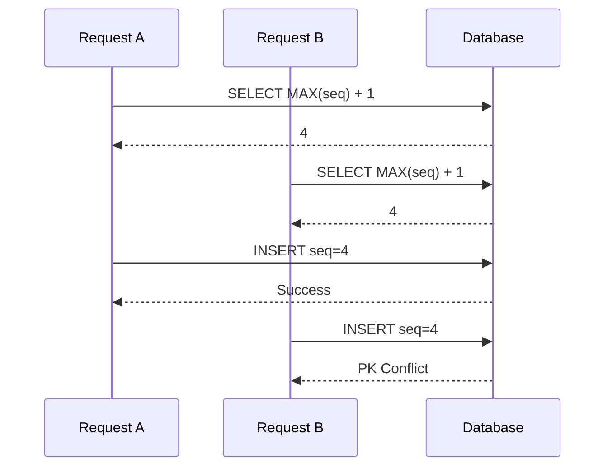
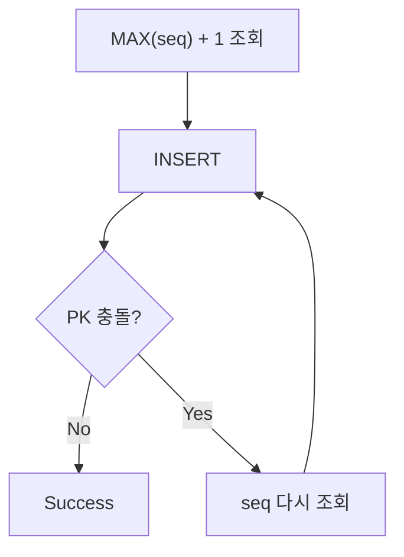

# MAX(seq) + 1과 동시성 문제

이력 데이터를 저장하는 API를 개발하면서 특정 ID와 날짜를 기준으로 순번을 관리해야 할 일이 있었다. PK가 `(id, date, seq)`로 구성되어 있고, 같은 ID와 날짜 안에서는 `seq`가 1부터 순서대로 증가해야 한다.

```text
A / 20260812 / 1
A / 20260812 / 2
A / 20260812 / 3
```

해당 조건만 고려한다면 다음 순번을 구하는 로직이 복잡하지 않다.

```sql
SELECT NVL(MAX(seq), 0) + 1
FROM history
WHERE id = :id
  AND date = :date;
```

현재 최대값이 `3`이면 다음 값은 `4`이다. 단일 요청만 생각한다면 문제가 없어 보인다. 그러나 동시 요청에 대해 고려해본다면 문제가 조금 복잡해진다. **두 요청이 거의 같은 시점에 `MAX(seq) + 1`을 조회하면 어떻게 될까?**

이 문제를 따라가 보니 핵심은 `MAX()` 함수 자체가 아니라 **순번을 조회하는 시점과 실제 INSERT하는 시점이 분리되어 있다는 것**이었다. 이 글에서는 `MAX(seq) + 1` 방식에서 Race Condition이 발생하는 이유와, PK Constraint와 Retry가 각각 어떤 역할을 하는지 정리해보고자 한다.

---

## 두 요청은 같은 다음 순번을 조회할 수 있다

`MAX(seq) = 3`인 상태에서 Request A와 Request B가 거의 동시에 들어왔다고 하자. 둘 다 아직 상대의 INSERT를 보지 못한 채 같은 SQL을 실행한다.



두 요청 모두 각자의 SELECT 결과만 보면 정상적인 `4`를 얻었다. 하지만 전체 시스템 관점에서는 같은 순번을 동시에 선택한 것이다. 이것이 `MAX(seq) + 1` 방식에서 발생하는 Race Condition이다.

---

## 문제는 MAX가 아니라 READ와 WRITE 사이에 있다

`SELECT MAX(seq) + 1`이라는 SQL 자체가 동시성에 안전하지 않다고 생각하기 쉽지만, 정확히는 다음 두 작업이 시간적으로 분리되어 있다는 것이 핵심이다.

```text
READ  → MAX(seq) + 1 조회
             │  경쟁 구간
             ▼
WRITE → 조회한 seq로 INSERT
```

두 요청 사이에는 "내가 4를 조회한 이후 다른 요청도 4를 선택하지 않았는가"를 보장해주는 장치가 없다. 즉 `SELECT MAX(seq) + 1`의 결과가 조회 시점에는 정확하더라도, **INSERT하는 시점까지 그 값이 유효하다는 보장이 없다.** 동시성 문제에서 자주 등장하는 **Check-Then-Act** 형태와 같은 구조이다.

```text
현재 상태 확인 → 그 결과를 기반으로 판단 → 실제 변경
(그 사이 다른 요청이 상태를 변경할 수 있음)
```

---

## PK Constraint는 무엇을 막아주는가

복합 PK가 `(id, date, seq)`로 정의되어 있다면, A가 먼저 `seq=4`를 INSERT한 뒤 B가 동일한 PK로 INSERT를 시도하면 DB는 중복을 허용하지 않는다.

```text
A / 20260812 / 4  → 저장됨
B / 20260812 / 4  → PK Constraint 위반
```

여기서 PK Constraint의 역할을 구분해서 볼 필요가 있다. **PK는 두 요청이 같은 `seq`를 선택하는 Race Condition 자체를 막아주지 않는다**.

```text
Race Condition → 동일 PK INSERT 시도 → PK Constraint → 한 요청 실패
```

즉 PK Constraint는 **동시성 제어의 예방 장치라기보다 데이터 정합성을 지키는 최종 방어선**이다.

---

## 실패한 요청은 Retry로 복구한다

B의 INSERT는 실패했지만, A가 이미 `4`를 저장했다면 이제 다음 순번은 `5`다. 따라서 B가 순번을 다시 조회하고 INSERT하면 성공할 수 있다.

```java
for (int retry = 0; retry < 3; retry++) {
    try {
        int seq = mapper.selectNextSeq(id, date);
        mapper.insert(id, date, seq);
        break;
    } catch (DuplicateKeyException e) {
        if (retry == 2) throw e;
    }
}
```

여기서 중요한 것은 **INSERT만 다시 실행하면 안 된다는 것**이다. 첫 시도에서 얻었던 `seq=4`를 그대로 재사용하면 다시 같은 충돌이 난다. DB 상태가 이미 달라졌으므로 Retry할 때는 순번도 다시 계산해야 한다.



여기서 Retry의 역할도 구분할 필요가 있다. `MAX(seq)+1 + Retry`를 적용해도 두 요청이 같은 순번을 가져가는 상황(A→4, B→4) 자체가 사라지는 것은 아니다. A는 성공하고, B는 PK Conflict 후 재조회하여 `seq=5`로 성공한다. 즉 **Retry는 Race Condition을 예방하는 게 아니라, 충돌이 실제로 발생했을 때 복구하는 전략**이다.

```text
PK Constraint → 잘못된 데이터 저장 방지
Retry         → 충돌한 요청 복구
```

두 장치가 함께 동작하면서 결과적으로 요청을 정상적으로 처리할 수 있는 구조가 된다.

---

## Retry 방식의 한계

충돌이 드문 환경이라면 Retry 방식이 적합할 수 있다. 대부분의 요청은 `MAX(seq)+1 → INSERT → Success`로 한 번에 끝나고, 가끔 충돌이 발생할 때만 Retry가 동작한다. 이런 경우라면 복잡한 Lock 구조를 추가하기보다 PK Constraint를 안전장치로 두고 충돌한 요청만 복구하는 게 실용적일 수 있다.

하지만 같은 `(id, date)`에 요청이 집중되면 이야기가 달라진다.

```text
A → 4 (Success)
B, C, D → 4 (모두 PK Conflict → Retry)
```

Retry한 요청끼리 다시 경쟁할 수도 있어서, 충돌 빈도가 높아질수록 Retry 비용과 DB 요청도 함께 증가한다. 이러한 경우에는 **순번 생성 구조 자체를 다시 검토할 필요가 있다.**

---

## Oracle Sequence로 대체할 수 없는 이유

Oracle의 Sequence는 동시 요청에서도 서로 다른 증가값을 보장한다.

```sql
SELECT MY_SEQ.NEXTVAL FROM DUAL;
-- A → 101, B → 102, C → 103
```

시스템 전체에서 고유한 증가값이 필요하다면 `MAX(seq)+1`보다 훨씬 자연스러운 선택이다. 하지만 처음 요구사항은 순번의 범위가 달랐다.

```text
A / 20260812 → 1, 2, 3 ...
B / 20260812 → 1, 2, 3 ...
A / 20260813 → 1, 2, 3 ...
```

즉 `(id, date)`라는 그룹마다 독립적인 순번이 필요한데, 일반적인 Sequence는 `1 → 2 → 3 → 4 → 5`처럼 전체적으로 하나만 증가한다. Sequence로 교체한다면 **고유한 번호를 만드는 문제는 해결되지만, 그룹별 연속 순번이라는 요구사항은 해결되지 않는다.** 이러한 경우엔 별도의 순번 관리 구조나 그룹별 직렬화 Lock 같은 방식을 검토해야 한다.

중요한 것은 특정 기술을 바로 고르는 게 아니라, **순번에 실제로 어떤 보장이 필요한지 먼저 구분하는 것**이다.

```text
전체에서 고유하면 되는가?
그룹별 순번이어야 하는가?
중간 번호가 비어도 되는가?
동일 그룹의 동시 요청이 얼마나 많은가?
```

요구사항에 따라 적절한 생성 방식도 달라진다.

---

## 정리

`MAX(seq) + 1`은 단일 요청만 보면 간단하고 직관적인 순번 생성 방식이다. 하지만 실제로는 순번을 조회한 뒤 INSERT하기까지 텀이 있고, 그 사이 다른 요청이 같은 값을 조회할 수 있다.

```text
SELECT MAX(seq) + 1
        ↓  (다른 요청이 들어올 수 있는 구간)
INSERT
```

문제의 본질은 "`MAX(seq)+1`이 잘못된 값을 계산한다"가 아니라, **"조회한 값이 INSERT 시점까지 여전히 유효하다는 보장이 없다"**는 데에 있다. PK Constraint가 있으면 중복 데이터 저장은 막을 수 있지만, Race Condition 자체를 없애지는 못한다. 대신 실패한 요청이 순번을 다시 조회해 Retry하면 충돌을 복구할 수 있다.

```text
Race Condition → 같은 seq 선택 → PK Constraint로 충돌 감지 → 재조회 → Retry
```

즉 `MAX(seq) + 1 + PK Constraint + Retry` 구조는 **동시성 충돌을 예방하는 구조라기보다, 충돌을 DB에서 감지하고 애플리케이션에서 복구하는 구조**에 가깝다.

이 글을 정리하면서 가장 중요하게 느낀 건 `MAX(seq) + 1`이라는 SQL 자체보다 **READ와 WRITE 사이의 경쟁 구간을 보는 것**이었다.

```text
READ → Business Logic → WRITE
```

동시성 문제는 개별 SQL만 보면 잘 드러나지 않는다. **조회한 상태를 바탕으로 다음 동작을 수행하는 순간, 그 상태가 실제 변경 시점까지 유효하다는 보장이 있는 지를 함께 보아야 한다.** 그리고 충돌이 발생할 수 있다면 다음 질문은 "충돌을 애초에 막을 것인가, 아니면 감지한 뒤 복구할 것인가"가 된다. `MAX(seq) + 1` 문제도 결국 이 질문의 한 가지 좋은 사례였다.
