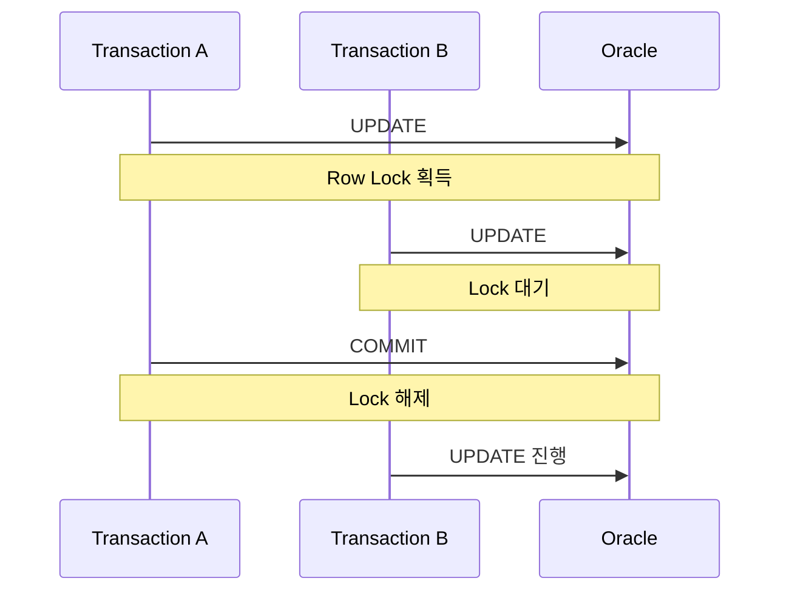
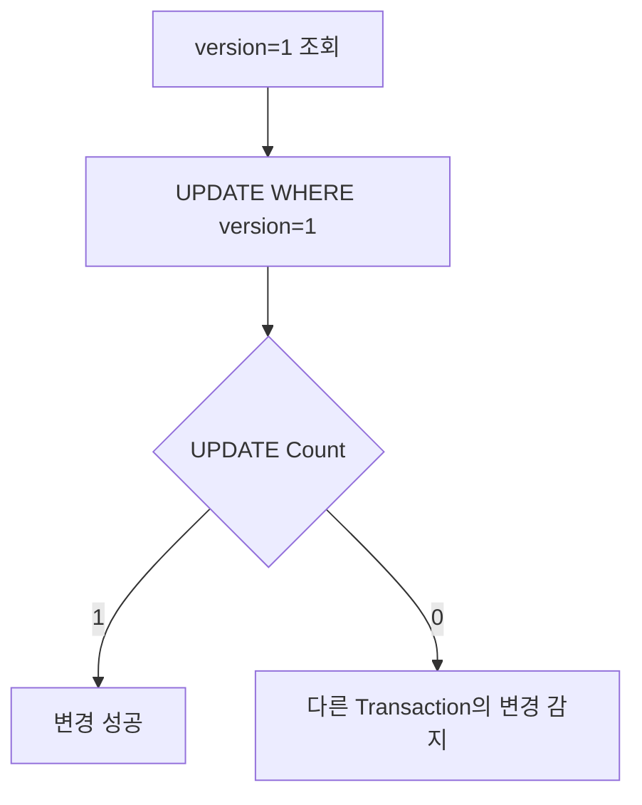
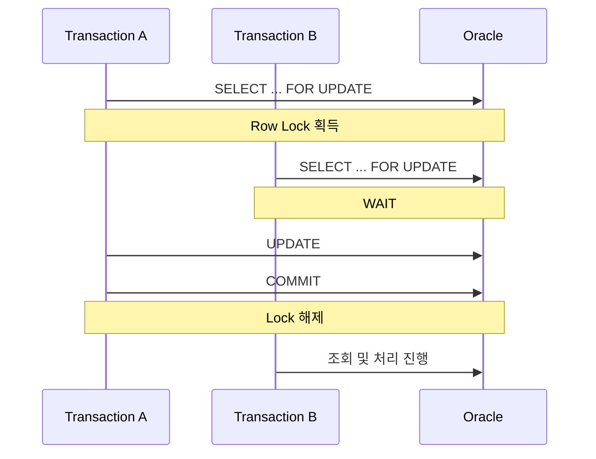

# UPDATE 동시성과 Lock

UPDATE API를 개발하면서 동시 요청을 어떻게 처리해야 할지 고민할 일이 있었다. 처음에는 Oracle이 같은 Row에 대한 UPDATE를 알아서 순차적으로 처리하니 큰 문제가 없을 거라 생각했다.

실제로 A가 먼저 UPDATE하고 아직 COMMIT하지 않은 상태에서 B가 같은 Row를 UPDATE하면 Oracle은 B를 대기시킨다.



여기서 의문이 생긴다. **DB가 이미 Row Lock으로 UPDATE를 순차 처리해주는데, 왜 애플리케이션에서 낙관적 락이나 비관적 락 같은 동시성 제어를 추가로 고민해야 할까?**

이 질문을 따라가다 보니 DB의 Lock이 보장하는 것과 애플리케이션이 원하는 데이터 정합성은 서로 다른 문제라는 걸 알게 되었다.

이 글에서는 **Oracle의 Row Lock이 무엇을 보장하는지부터, 그럼에도 Lost Update가 발생할 수 있는 이유, 그리고 애플리케이션에서 동시성 제어 전략을 선택하는 기준**을 정리해보고자 한다.

---

## Row Lock이 있어도 Lost Update는 발생할 수 있다

최초 데이터가 `amount = 10000`이라고 하자. 두 요청이 거의 동시에 이 값을 조회하고, 각자 새로운 값을 계산한다.

```text
Transaction A → 10000 조회 → 15000으로 변경
Transaction B → 10000 조회 → 20000으로 변경
```

A가 먼저 UPDATE하고 COMMIT하면 Oracle은 Row Lock을 정상적으로 관리한다. B는 A의 Transaction이 끝날 때까지 기다렸다가 자신의 UPDATE를 실행한다.

```text
A UPDATE → amount=15000 → COMMIT
B UPDATE → amount=20000 → COMMIT
```

DB 입장에서는 두 UPDATE 모두 순서대로 정상 수행됐다. 하지만 최종 값은 `20000`이고, A가 저장했던 `15000`이라는 변경 결과는 B의 UPDATE에 덮여 사라진다. 이를 **Lost Update**라고 한다.

여기서 중요한 것은 Row Lock이 실패한 게 아니라는 점이다. Row Lock은 "같은 Row의 변경을 동시에 실행하지 않는다"는 것만 보장한다. 반면 애플리케이션이 원하는 건 경우에 따라 "내가 조회한 이후 다른 요청이 데이터를 변경하지 않았어야 한다"는 것일 수 있다. 이 둘은 서로 다른 문제다.

```text
DB Row Lock                  → UPDATE 실행 충돌 방지
Application Concurrency Control → 조회 이후 발생한 변경까지 검증
```

---

## 같은 Row를 수정한다고 항상 문제가 되는 것은 아니다

최초 데이터가 `x=1, y=1, z=1`이고, Transaction A는 `x, y`만, Transaction B는 `z`만 변경한다고 하자.

```sql
-- A
UPDATE example SET x = 2, y = 2 WHERE id = 1;

-- B
UPDATE example SET z = 2 WHERE id = 1;
```

Oracle은 같은 Row이므로 UPDATE를 순서대로 실행하지만, 서로 다른 Column을 건드리므로 최종 상태는 `x=2, y=2, z=2`로 두 요청의 변경이 모두 유지된다. 반대로 같은 Column(`x`)을 수정했다면 나중에 실행된 값만 남는다.

즉 중요한 건 "같은 Row를 동시에 UPDATE했는가"가 아니라, **어떤 Column을 수정하는지, 두 요청의 변경이 실제로 충돌하는지, 마지막 값이 남아도 되는지**이다. 동시성 제어의 필요여부는 **DB Row 단위가 아니라 서비스가 요구하는 데이터 정합성 기준으로 판단**해야 한다.

---

## Last Write Wins를 허용할 수 있는지가 먼저다

동시 수정이 생겼다고 무조건 별도 Lock 전략이 필요한 것은 아니다. 프로필의 마지막 접속 시간처럼 마지막 요청의 값만 남아도 되는 데이터라면 **Last Write Wins**를 그대로 허용해도 괜찮다.

반면 재고, 상태 전이, 금액처럼 앞선 변경을 조용히 덮어쓰면 안 되는 데이터라면 이야기가 다르다. 예를 들어 두 사용자가 동시에 같은 주문(`READY` 상태)을 조회해 한쪽은 CANCEL, 다른 쪽은 COMPLETE로 처리했다면, 단순히 마지막 UPDATE만 남기는 것은 서비스 정책과 상이할 수 있다.

```text
Concurrent Update 발생
   ↓
변경 사항이 충돌하는가?
   ↓
Last Write Wins를 허용할 수 있는가?
   ↓
동시성 제어 필요 여부 결정
```

동시성 제어를 선택하기 전에 먼저 판단해야 하는 것은 기술이 아니라 **충돌이 발생했을 때 어떤 결과를 허용할 것인가**이다.

---

## Optimistic Lock: 충돌을 UPDATE 시점에 감지한다

앞선 변경을 덮어쓰는 것이 허용되지 않는다면, 한 가지 방법은 **내가 조회한 이후 데이터가 변경됐는지 확인하는 것**이다. 이것이 Optimistic Lock의 기본 아이디어이다. 조회 시점에는 Row를 잠그지 않고, UPDATE하는 순간에 기존 상태가 그대로 인지를 조건으로 검증한다.

대표적으로 `VERSION` Column을 사용한다. 최초 데이터가 `amount=10000, version=1`이고 A, B가 거의 동시에 해당 값을 조회했다고 하자.

```sql
-- A가 먼저 실행
UPDATE example
SET amount = 15000, version = version + 1
WHERE id = 1 AND version = 1;
-- 성공 → amount=15000, version=2
```

```sql
-- B가 이어서 실행 (여전히 version=1을 들고 있음)
UPDATE example
SET amount = 20000, version = version + 1
WHERE id = 1 AND version = 1;
-- 현재 DB version은 이미 2이므로 조건을 만족하는 Row가 없음 → updateCount = 0
```



`updateCount = 0`이라는 결과로 B는 "내가 조회한 이후 누군가 먼저 수정했다"는 것을 알 수 있다. `VERSION` Column이 없다면 최종 수정시간(`AUDIT_DTM`)을 같은 방식으로 조건에 사용할 수도 있다.

```sql
UPDATE example
SET amount = 15000, audit_dtm = SYSDATE
WHERE id = 1 AND audit_dtm = :previousAuditDtm;
```

다만 `AUDIT_DTM`은 원래 수정 이력을 남기기 위한 컬럼이므로, 동시성 제어가 중요한 요구사항이라면 별도의 `VERSION` Column을 두는 편이 의도가 더 명확하긴 하다. Optimistic Lock의 핵심은 Lock을 오래 유지하는 것이 아니라 **충돌 여부를 UPDATE 시점에 검증하는 것**이다.

---

## Pessimistic Lock: 처음부터 접근을 막는다

Optimistic Lock은 "일단 작업하고 UPDATE할 때 충돌을 확인"하는 접근이다. 반대로 충돌 가능성이 높거나 반드시 순차 처리해야 하는 작업이라면, 조회하는 순간부터 다른 Transaction의 접근을 막을 수도 있다. 이것이 Pessimistic Lock이고, Oracle에서는 `SELECT FOR UPDATE`가 대표적이다.

```sql
SELECT * FROM example WHERE id = 1 FOR UPDATE;
```



A가 조회부터 업무 처리를 끝낼 때까지 B는 대기한다. 즉 읽기와 쓰기 사이의 경쟁 구간 자체를 Lock으로 보호하는 방식이다.

```text
Optimistic Lock  : READ → Business Logic → UPDATE + Conflict Check
Pessimistic Lock : SELECT FOR UPDATE → LOCK → Business Logic → UPDATE → COMMIT → UNLOCK
```

대신 Lock을 오래 유지하거나 특정 Row에 요청이 몰리면 대기 시간이 늘고 처리량에도 영향을 줄 수 있다.

---

## 두 방식의 차이는 충돌을 다루는 시점이다

Optimistic = 좋은 Lock, Pessimistic = 강한 Lock 처럼 볼 필요는 없다. 차이는 **충돌을 언제, 어떤 방식으로 처리하는가**에 있다.

|       | Optimistic Lock         | Pessimistic Lock            |
| ----- | ------------------------ | ---------------------------- |
| 기본 가정 | 충돌이 자주 발생하지 않는다 | 충돌 가능성이 높다            |
| 처리 방식 | 일단 처리 후 충돌 감지     | 먼저 Lock 획득                |
| 대표 방식 | VERSION 조건 UPDATE      | SELECT FOR UPDATE            |
| 충돌 발생 | UPDATE 0건 등으로 감지    | 다른 Transaction 대기         |
| 장점    | Lock 대기를 줄일 수 있음   | 경쟁 구간을 직접 보호          |
| 고려사항 | 충돌 후 재시도/실패 처리   | Lock 대기와 Transaction 시간  |

어느 쪽이 항상 더 좋은 것이 아니라, 서비스의 충돌 빈도와 업무 특성에 따라 선택해야 한다.

---

## 정리

Oracle은 같은 Row를 수정하는 UPDATE가 충돌하면 Row Lock으로 실행 순서를 제어한다. 하지만 **UPDATE가 순서대로 실행된다는 것과 애플리케이션의 데이터 정합성이 보장된다는 것은 같은 의미가 아니다.** 두 요청이 같은 값을 조회한 뒤 각각 새 값을 계산하면, 나중에 실행된 UPDATE가 앞선 변경을 그대로 덮어쓸 수 있다.

그래서 동시성 문제를 볼 때 먼저 확인해야 하는 건 Lock의 종류가 아니다.

```text
동시에 어떤 요청이 들어올 수 있는가?
        ↓
두 요청의 변경이 충돌하는가?
        ↓
앞선 변경이 사라져도 되는가? (Last Write Wins 허용 가능한가?)
        ↓
허용할 수 없다면 어떤 방식으로 충돌을 제어할 것인가?
```

충돌이 드물거나 이를 감지해서 처리할 수 있다면 Optimistic Lock을, 충돌 가능성이 높고 특정 업무 구간을 반드시 순차 처리해야 한다면 Pessimistic Lock을 고려할 수 있다.

결국 이러한 동시성 문제를 정리하면서 가장 중요하게 느낀 것은 **DB Lock과 애플리케이션 동시성 제어를 같은 것으로 보면 안 된다는 점**이었다. DB의 Row Lock은 데이터베이스 내부에서 UPDATE 충돌을 제어할 뿐이고, Optimistic Lock이나 Pessimistic Lock 같은 전략은 그 위에서 **서비스가 어떤 동시 요청을 허용하고 어떤 충돌을 막을 것인지 정의하기 위한 수단**인 것이다. "같은 Row UPDATE → Lock 필요"라고 바로 결론 내리기보다, **"동시에 들어온 두 요청이 모두 성공했을 때 서비스의 데이터가 여전히 올바른가?"**를 먼저 고려하는 것이 동시성 제어를 설계하는 출발점이라고 생각한다.
