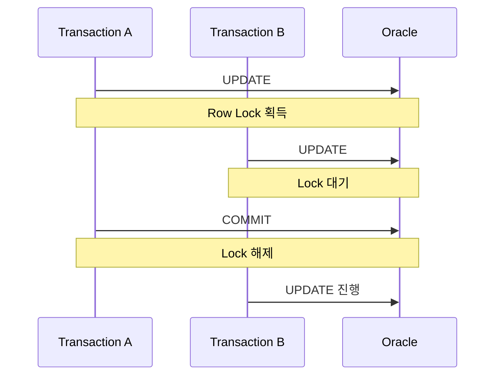
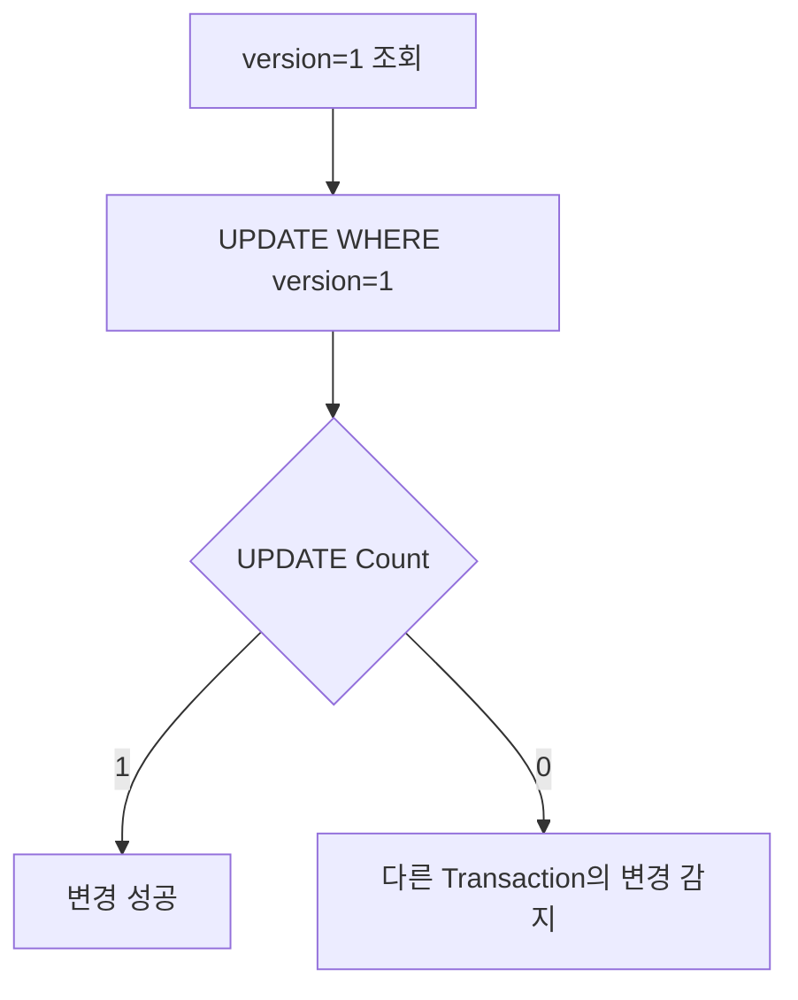
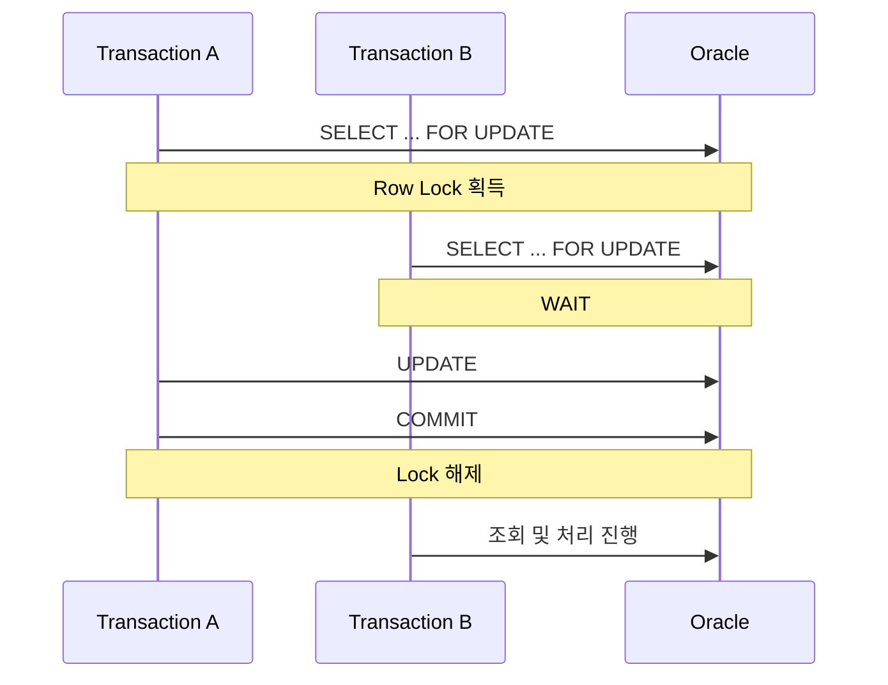

# UPDATE 동시성과 Lock

Spring과 MyBatis로 UPDATE API를 개발하면서 동시 요청을 어떻게 처리해야 할지 고민할 일이 있었다.

처음에는 Oracle이 같은 Row에 대한 UPDATE를 알아서 순차적으로 처리하기 때문에 큰 문제가 없을 것이라고 생각했다.

실제로 A가 먼저 UPDATE하고 아직 COMMIT하지 않은 상태에서 B가 같은 Row를 UPDATE하면 Oracle은 B를 대기시킨다.



그렇다면 한 가지 의문이 생긴다.

**DB가 이미 Row Lock으로 UPDATE를 순차 처리해주는데, 왜 애플리케이션에서 낙관적 락이나 비관적 락 같은 동시성 제어를 추가로 고민해야 할까?**

이 질문을 따라가다 보니 DB의 Lock이 보장하는 것과 애플리케이션이 원하는 데이터 정합성은 서로 다른 문제라는 것을 알게 되었다.

이 글에서는 **Oracle의 Row Lock이 무엇을 보장하는지부터 시작해, 그럼에도 Lost Update가 발생할 수 있는 이유와 애플리케이션에서 동시성 제어 전략을 선택하는 기준**을 정리해본다.

---

## Oracle은 같은 Row의 UPDATE를 동시에 실행하지 않는다

먼저 Oracle의 기본 동작부터 보면 같은 Row를 변경하는 두 UPDATE가 완전히 동시에 적용되는 것은 아니다.

예를 들어 Transaction A가 다음 UPDATE를 수행했다고 해보자.

```sql
UPDATE example
SET amount = 15000
WHERE id = 1;
```

아직 COMMIT하지 않은 상태에서 Transaction B가 같은 Row를 수정하려고 한다.

```sql
UPDATE example
SET amount = 20000
WHERE id = 1;
```

A가 먼저 Row Lock을 획득했기 때문에 B는 바로 UPDATE하지 못하고 기다린다.

```text
Transaction A
    ↓
UPDATE
    ↓
Row Lock 획득


Transaction B
    ↓
같은 Row UPDATE
    ↓
WAIT
```

A가 COMMIT 또는 ROLLBACK하면 Lock이 해제되고 이후 B의 UPDATE가 진행된다.

즉 Oracle은 같은 Row에 대한 변경이 동시에 충돌하지 않도록 **물리적인 UPDATE 실행 순서를 제어한다.**

여기까지만 보면 데이터가 안전하게 보호되는 것처럼 보인다.

하지만 문제는 그 이전에 애플리케이션이 데이터를 읽는 순간부터 시작될 수 있다.

---

## Row Lock이 있어도 Lost Update는 발생할 수 있다

최초 데이터가 다음과 같다고 해보자.

```text
amount = 10000
```

두 요청이 거의 동시에 데이터를 조회한다.

```text
Transaction A → amount = 10000 조회
Transaction B → amount = 10000 조회
```

두 요청은 같은 값을 기준으로 각각 새로운 결과를 만든다.

```text
A → 15000으로 변경

B → 20000으로 변경
```

이후 A가 먼저 UPDATE한다.

```text
amount = 15000
```

Oracle은 A의 Row에 Lock을 건다.

B가 UPDATE를 시도하면 A의 Transaction이 끝날 때까지 기다린다.

```text
A UPDATE
   ↓
amount = 15000
   ↓
COMMIT

B UPDATE
   ↓
amount = 20000
   ↓
COMMIT
```

DB 입장에서는 두 UPDATE 모두 정상적으로 순서대로 수행되었다.

하지만 최종 값은

```text
amount = 20000
```

이다.

A가 저장했던 `15000`이라는 변경 결과는 B의 UPDATE에 의해 사라졌다.

이를 **Lost Update**라고 한다.

여기서 중요한 부분은 Oracle의 Row Lock이 실패한 것이 아니라는 점이다.

Row Lock은

> 같은 Row의 변경을 동시에 실행하지 않는다.

는 것을 보장했다.

하지만 애플리케이션이 원하는 것은 경우에 따라

> 내가 조회한 이후 다른 요청이 데이터를 변경하지 않았어야 한다.

일 수 있다.

두 문제는 서로 다르다.

```text
DB Row Lock
→ UPDATE 실행 충돌 방지

Application Concurrency Control
→ 조회 이후 발생한 데이터 변경까지 검증
```

이 차이를 이해하는 것이 동시성 제어를 이해하는 출발점이었다.

---

## 같은 Row를 수정한다고 항상 문제가 되는 것은 아니다

그렇다면 두 요청이 같은 Row를 수정하면 항상 Lost Update 문제가 생길까?

그렇지는 않다.

예를 들어 최초 데이터가 다음과 같다고 해보자.

```text
x = 1
y = 1
z = 1
```

Transaction A는 `x`, `y`만 변경한다.

```sql
UPDATE example
SET x = 2,
    y = 2
WHERE id = 1;
```

Transaction B는 `z`만 변경한다.

```sql
UPDATE example
SET z = 2
WHERE id = 1;
```

Oracle은 여전히 같은 Row이기 때문에 UPDATE를 순서대로 실행한다.

하지만 두 SQL이 서로 다른 Column을 변경한다면 최종 상태는 다음과 같이 남을 수 있다.

```text
x = 2
y = 2
z = 2
```

두 요청의 변경 사항이 모두 유지된다.

반대로 같은 Column을 수정한다면 상황이 달라진다.

```text
A → x = 2
B → x = 3
```

최종적으로는 나중에 실행된 값이 남는다.

```text
x = 3
```

따라서 중요한 것은 단순히

```text
같은 Row를 동시에 UPDATE했는가?
```

가 아니다.

실제로는 다음을 봐야 한다.

```text
어떤 Column을 수정하는가?

두 요청의 변경이 충돌하는가?

마지막 요청의 값이 남아도 되는가?
```

즉 동시성 제어가 필요한지는 **DB Row 단위가 아니라 서비스가 요구하는 데이터 정합성 기준으로 판단해야 한다.**

---

## 먼저 Last Write Wins를 허용할 수 있는지 판단해야 한다

동시 수정이 발생했다고 해서 무조건 별도의 Lock 전략을 적용해야 하는 것은 아니다.

예를 들어 프로필의 마지막 접속 시간처럼 마지막 요청의 값만 남아도 되는 데이터라면 다음 동작이 문제가 아닐 수도 있다.

```text
A UPDATE
    ↓
B UPDATE
    ↓
B의 값이 최종 저장
```

이런 정책을 흔히 **Last Write Wins** 형태로 볼 수 있다.

반면 재고, 상태 전이, 금액, 사용자 입력처럼 앞선 변경을 조용히 덮어쓰면 안 되는 데이터라면 문제가 된다.

예를 들어 두 사용자가 동시에 같은 주문 상태를 조회했다고 해보자.

```text
현재 상태 = READY

A → CANCEL 처리

B → COMPLETE 처리
```

둘 다 `READY`를 기준으로 업무 판단을 수행했다면 단순히 마지막 UPDATE만 남기는 것이 서비스 정책과 맞지 않을 수 있다.

따라서 동시성 제어를 선택하기 전에 먼저 정해야 하는 것은 기술이 아니다.

**충돌이 발생했을 때 어떤 결과를 허용할 것인지가 먼저다.**

```text
Concurrent Update 발생
        ↓
변경 사항이 충돌하는가?
        ↓
Last Write Wins를 허용할 수 있는가?
        ↓
동시성 제어 필요 여부 결정
```

---

## 변경을 덮어쓰면 안 된다면 어떻게 감지할까?

앞선 변경을 조용히 덮어쓰면 안 된다면 한 가지 방법은 **내가 조회한 이후 데이터가 변경되었는지 확인하는 것**이다.

이 방식이 Optimistic Lock의 기본적인 아이디어다.

Optimistic Lock은 데이터를 조회할 때부터 DB Row를 잠그지 않는다.

대신 UPDATE하는 순간 기존 상태가 그대로 유지되고 있는지를 검증한다.

대표적으로 `VERSION` Column을 사용할 수 있다.

최초 데이터가 다음과 같다고 해보자.

```text
amount = 10000
version = 1
```

A와 B가 거의 동시에 조회한다.

```text
A → amount=10000, version=1

B → amount=10000, version=1
```

A가 먼저 UPDATE한다.

```sql
UPDATE example
SET amount = 15000,
    version = version + 1
WHERE id = 1
  AND version = 1;
```

성공하면 데이터는 다음 상태가 된다.

```text
amount = 15000
version = 2
```

이후 B는 자신이 조회했던 `version = 1`을 가지고 UPDATE한다.

```sql
UPDATE example
SET amount = 20000,
    version = version + 1
WHERE id = 1
  AND version = 1;
```

하지만 현재 DB의 Version은 이미 `2`다.

따라서 조건을 만족하는 Row가 없다.

```text
updateCount = 0
```

이 결과를 통해 B는

> 내가 데이터를 조회한 이후 누군가 먼저 수정했다.

는 사실을 알 수 있다.



즉 Optimistic Lock의 핵심은 실제 Lock을 오래 유지하는 것이 아니라 **충돌이 발생했는지를 UPDATE 시점에 검증하는 것**이다.

---

## 최종 수정시간을 이용할 수도 있다

별도의 `VERSION` Column이 없다면 최종 수정시간을 이용해 비슷한 방식으로 충돌을 감지할 수도 있다.

예를 들어 조회 당시 데이터가 다음과 같았다고 하자.

```text
AUDIT_DTM = T1
```

UPDATE할 때 조회 당시 값을 조건으로 사용한다.

```sql
UPDATE example
SET amount = 15000,
    audit_dtm = SYSDATE
WHERE id = 1
  AND audit_dtm = :previousAuditDtm;
```

다른 요청이 먼저 UPDATE했다면 `AUDIT_DTM`은 이미 변경되어 있다.

따라서 이전 값을 가지고 UPDATE한 요청의 결과는 0건이 된다.

```text
조회 시점
AUDIT_DTM = T1

A UPDATE
→ AUDIT_DTM = T2

B UPDATE
WHERE AUDIT_DTM = T1
→ 0 rows updated
```

동작 원리는 Version 방식과 비슷하다.

다만 `AUDIT_DTM`은 원래 수정 이력을 기록하기 위한 데이터다.

동시성 제어가 중요한 요구사항이라면 별도의 `VERSION` Column을 두는 편이 역할과 의도가 더 명확하다.

---

## 충돌을 감지하는 대신 처음부터 막을 수도 있다

Optimistic Lock은

```text
일단 작업한다.
↓
UPDATE할 때 충돌 여부를 확인한다.
```

는 접근이다.

반대로 충돌 가능성이 높거나 반드시 순차적으로 처리해야 하는 작업이라면 처음 조회하는 순간부터 다른 Transaction의 접근을 기다리게 만들 수도 있다.

이것이 Pessimistic Lock이다.

Oracle에서는 대표적으로 `SELECT FOR UPDATE`를 사용할 수 있다.

```sql
SELECT *
FROM example
WHERE id = 1
FOR UPDATE;
```

A가 먼저 실행하면 해당 Row에 Lock을 획득한다.



A가 해당 데이터를 조회하고 업무 처리를 완료할 때까지 B의 처리를 대기시킬 수 있다.

즉 읽기와 쓰기 사이의 경쟁 구간 자체를 Lock으로 보호한다.

```text
Optimistic Lock

READ
 ↓
Business Logic
 ↓
UPDATE + Conflict Check


Pessimistic Lock

SELECT FOR UPDATE
 ↓
LOCK
 ↓
Business Logic
 ↓
UPDATE
 ↓
COMMIT
 ↓
UNLOCK
```

대신 Lock을 오래 유지하거나 특정 Row에 요청이 집중되면 대기 시간이 증가하고 처리량에도 영향을 줄 수 있다.

---

## Optimistic과 Pessimistic의 차이는 충돌을 다루는 방식이다

둘을 단순히

```text
Optimistic = 좋은 Lock
Pessimistic = 강한 Lock
```

처럼 볼 필요는 없다.

차이는 **충돌을 언제, 어떤 방식으로 처리할 것인가**에 있다.

|       | Optimistic Lock   | Pessimistic Lock        |
| ----- | ----------------- | ----------------------- |
| 기본 가정 | 충돌이 자주 발생하지 않는다   | 충돌 가능성이 높다              |
| 처리 방식 | 일단 처리 후 충돌 감지     | 먼저 Lock 획득              |
| 대표 방식 | VERSION 조건 UPDATE | SELECT FOR UPDATE       |
| 충돌 발생 | UPDATE 0건 등으로 감지  | 다른 Transaction 대기       |
| 장점    | Lock 대기를 줄일 수 있음  | 경쟁 구간을 직접 보호            |
| 고려사항  | 충돌 후 재시도/실패 처리    | Lock 대기와 Transaction 시간 |

결국 둘 중 어느 것이 항상 더 좋은 것이 아니라 서비스의 충돌 빈도와 업무 특성에 따라 선택해야 한다.

---

## 처음 생각했던 Lock과 실제 동시성 제어

처음에는 Oracle이 UPDATE에 Row Lock을 걸어주기 때문에 같은 데이터를 동시에 수정해도 DB가 알아서 정합성을 지켜준다고 생각하기 쉬웠다.

실제 내부 흐름을 따라가 보면 조금 다르다.

```text
Oracle Row Lock
        ↓
같은 Row의 UPDATE 실행 순서 제어
```

이것은 DB가 보장한다.

하지만 다음 문제까지 해결해주는 것은 아니다.

```text
A와 B가 같은 상태 조회
        ↓
각자 Business Logic 수행
        ↓
A UPDATE
        ↓
B UPDATE
        ↓
A의 변경이 사라짐
```

이 문제는 **애플리케이션이 어떤 충돌을 허용할 것인가**의 문제다.

그래서 동시성을 고민할 때 중요한 질문도 바뀌었다.

처음에는

```text
"같은 Row를 수정하는데 Lock을 걸어야 하나?"
```

라고 생각했다면,

실제로는 먼저

```text
"두 요청이 동시에 처리되면
어떤 변경이 사라질 수 있는가?"

        ↓

"그 결과를 서비스 정책상 허용할 수 있는가?"
```

를 판단해야 한다.

그다음에야 Optimistic Lock이나 Pessimistic Lock 같은 기술적인 선택이 의미를 가진다.

---

## 정리

Oracle은 같은 Row를 수정하는 UPDATE가 충돌하면 Row Lock을 이용해 실행 순서를 제어한다.

```text
Transaction A
     ↓
UPDATE + LOCK
     ↓
COMMIT
     ↓
Transaction B UPDATE
```

하지만 **UPDATE가 순서대로 실행된다는 것과 애플리케이션의 데이터 정합성이 보장된다는 것은 같은 의미가 아니다.**

두 요청이 같은 데이터를 조회한 뒤 각각 새로운 값을 계산하면 나중에 실행된 UPDATE가 앞선 변경을 덮어쓸 수 있다.

```text
READ A ─┐
        ├── 같은 기존 값
READ B ─┘

A UPDATE
   ↓
B UPDATE
   ↓
A의 변경 손실
```

따라서 동시성 문제를 볼 때 먼저 확인해야 하는 것은 Lock의 종류가 아니다.

```text
동시에 어떤 요청이 들어올 수 있는가?

        ↓

두 요청의 변경이 충돌하는가?

        ↓

앞선 변경이 사라져도 되는가?

        ↓

Last Write Wins를 허용할 수 있는가?

        ↓

허용할 수 없다면 어떤 방식으로 충돌을 제어할 것인가?
```

충돌이 드물고 충돌 여부를 감지해서 처리할 수 있다면 Optimistic Lock을 사용할 수 있다.

반대로 충돌 가능성이 높고 특정 업무 구간을 반드시 순차적으로 처리해야 한다면 Pessimistic Lock을 고려할 수 있다.

결국 이 문제를 정리하면서 가장 중요하다고 느낀 부분은 **DB Lock과 애플리케이션 동시성 제어를 같은 것으로 보면 안 된다는 점**이었다.

DB의 Row Lock은 데이터베이스 내부에서 UPDATE 충돌을 제어한다.

Optimistic Lock이나 Pessimistic Lock 같은 전략은 그 위에서 **서비스가 어떤 동시 요청을 허용하고 어떤 충돌을 막을 것인지 정의하기 위한 수단**이다.

따라서

```text
같은 Row UPDATE
      ↓
Lock 필요
```

라고 바로 결론 내리기보다,

**"동시에 들어온 두 요청이 모두 성공했을 때 서비스의 데이터가 여전히 올바른가?"**

를 먼저 묻는 것이 동시성 제어를 설계하는 출발점이라고 생각한다.
