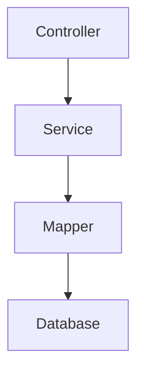
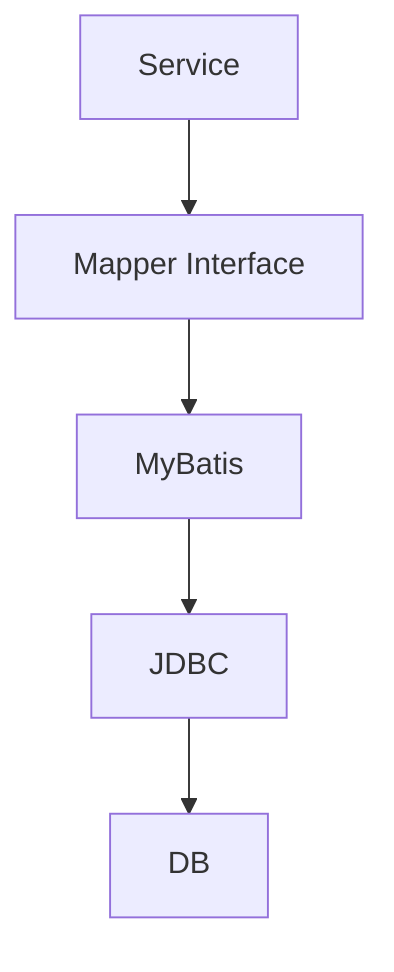
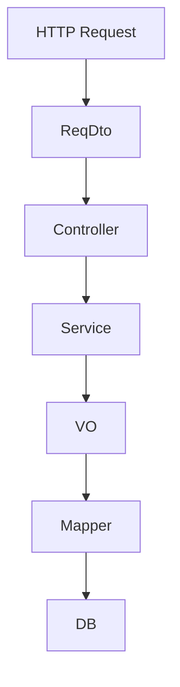
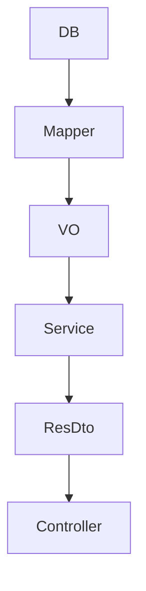
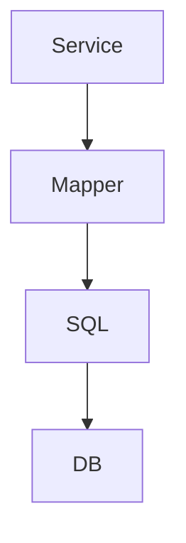
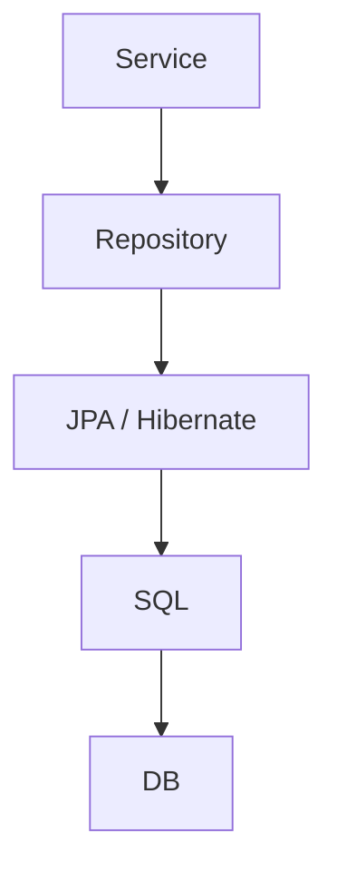

# Spring에서 MyBatis Mapper 패턴 이해하기

Spring 백엔드에서 흔히 사용하는 구조는 아래와 같다.



핵심은 각 계층의 책임을 분리하는 것이다.

## Controller

HTTP 요청과 응답을 담당한다.

```java
@RestController
@RequiredArgsConstructor
public class ItemController {

    private final ItemService itemService;

    @PostMapping("/items")
    public ItemResponseDto createItem(@RequestBody ItemRequestDto request) {
        return itemService.createItem(request);
    }
}
```

Controller는 요청값을 받고 Service를 호출한다.
DB 조회나 비즈니스 판단은 넣지 않는 것이 일반적이다.

## Service

비즈니스 로직과 트랜잭션의 중심이다.

```java
@Service
@RequiredArgsConstructor
public class ItemService {

    private final ItemMapper itemMapper;

    @Transactional
    public ItemResponseDto createItem(ItemRequestDto request) {

        ItemVo item = new ItemVo();
        item.setItemId(request.getItemId());

        itemMapper.insertItem(item);

        return new ItemResponseDto(item.getItemId());
    }
}
```

예를 들어 다음과 같은 처리는 Service에서 담당한다.

```text
- 중복 여부 판단
- 상태값 검증
- 여러 Mapper 호출 조합
- 트랜잭션 처리
- DB 조회 결과 가공
```

즉 Service는 **"SQL을 어떻게 실행할지"가 아니라 "업무를 어떻게 처리할지"**를 담당한다.

## Mapper

DB 접근을 담당한다.

```java
@Mapper
public interface ItemMapper {

    ItemVo selectItem(String itemId);

    int insertItem(ItemVo item);
}
```

실제 SQL은 MyBatis XML에서 작성한다.

```xml
<select id="selectItem" resultType="ItemVo">
    SELECT ITEM_ID,
           ITEM_STATUS
    FROM TB_ITEM
    WHERE ITEM_ID = #{itemId}
</select>
```

구조는 실제로 다음과 같다.



Mapper는 기존 DAO와 비슷한 **Persistence Layer** 역할이다.

## DTO / VO

DTO는 계층 간 데이터를 전달하기 위한 객체다.

```java
public class ItemRequestDto {
    private String itemId;
}
```

```java
public class ItemResponseDto {
    private String itemId;
    private String status;
}
```

보통 API 요청/응답 객체로 사용한다.

VO는 프로젝트마다 의미가 조금 다르다. MyBatis 기반 엔터프라이즈 프로젝트에서는 흔히 **DB 조회 결과나 Mapper Parameter를 담는 객체**로 사용한다.

```java
public class ItemVo {

    private String itemId;
    private String itemStatus;
    private LocalDateTime updatedAt;
}
```

따라서 일반적인 데이터 흐름은 다음과 같다.



조회 시에는 반대 방향으로 올라온다.



---

## JPA에서는 무엇이 달라질까

MyBatis에서는 Mapper가 있었다면 JPA에서는 주로 Repository를 사용한다.





MyBatis는 개발자가 SQL을 직접 작성한다.

```xml
SELECT *
FROM TB_ITEM
WHERE ITEM_ID = #{itemId}
```

JPA에서는 Entity를 정의한다.

```java
@Entity
@Table(name = "TB_ITEM")
public class Item {

    @Id
    @Column(name = "ITEM_ID")
    private String itemId;
}
```

그리고 Repository를 사용한다.

```java
public interface ItemRepository
        extends JpaRepository<Item, String> {
}
```

조회는 다음과 같다.

```java
Item item = itemRepository.findById(itemId)
        .orElseThrow();
```

SQL을 직접 작성하지 않아도 Hibernate가 SQL을 생성한다.

## MyBatis와 JPA의 차이

| 구분       | MyBatis     | JPA                        |
| -------- | ----------- | -------------------------- |
| 방식       | SQL Mapper  | ORM                        |
| 중심       | SQL / Table | Entity / Object            |
| SQL      | 직접 작성       | Hibernate가 생성              |
| DB 제어    | 높음          | 상대적으로 추상화됨                 |
| 복잡한 조회   | 편리함         | JPQL, QueryDSL 등이 필요할 수 있음 |
| 단순 CRUD  | 반복 코드 존재    | 매우 간단                      |
| 변경 감지    | 없음          | Dirty Checking             |
| 영속성 컨텍스트 | 없음          | 있음                         |

가장 중요한 차이는 이것이다.

```text
MyBatis
"어떤 SQL을 실행할 것인가?"

JPA
"어떤 Entity를 조회하고 변경할 것인가?"
```

JPA도 최종적으로는 SQL과 JDBC를 사용한다. 단지 SQL 생성을 ORM이 대신 처리한다.

---

## 정리

Spring 관점에서 계층의 책임을 정리하면 명확하다.

```text
Controller
→ HTTP 요청 / 응답

Service
→ 비즈니스 로직 / 트랜잭션

Mapper
→ SQL 기반 DB 접근

DTO
→ API 또는 계층 간 데이터 전달

VO
→ MyBatis 프로젝트에서는 주로 DB Mapping 객체

Repository
→ JPA의 데이터 접근 계층

Entity
→ JPA가 관리하는 DB Mapping 객체
```

MyBatis와 JPA는 Controller와 Service 구조 자체가 크게 달라지는 것이 아니다.

가장 큰 차이는 **Persistence Layer를 구현하는 방식**이다.

```text
MyBatis
Controller → Service → Mapper → SQL → DB

JPA
Controller → Service → Repository → Hibernate → SQL → DB
```

결국 좋은 Spring 백엔드 구조의 핵심은 기술 선택보다 **HTTP, 비즈니스 로직, DB 접근의 책임을 명확하게 분리하는 것**이다.
