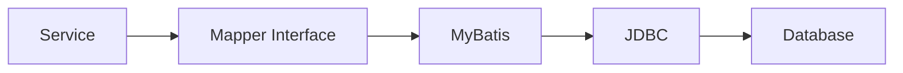
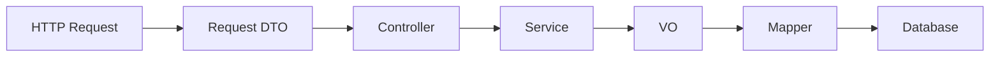
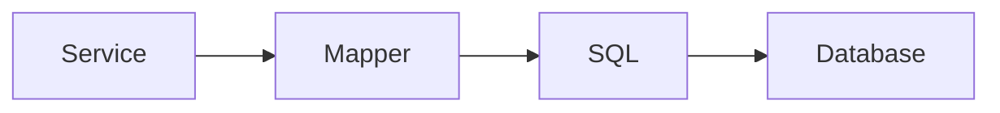
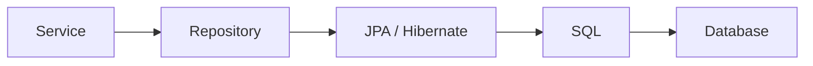

# MyBatis Mapper 패턴 이해하기

Spring Boot와 MyBatis 기반의 API를 개발하면서 자연스럽게 아래 구조를 사용하게 되었다.

```text
Controller → Service → Mapper → MyBatis XML → Database
```

처음에는 프로젝트 구조에 맞추어 Controller에서 Service를 호출하고, Service에서 Mapper를 호출했다. 그런데 API 로직이 조금씩 복잡해지면서 애매한 지점들이 생겼다.

- **조회 결과를 가지고 상태를 판단하는 로직은 Service와 Mapper 중 어디에 있어야 할까?**
- **DTO와 VO는 왜 굳이 나눠서 쓸까?**
- JPA 기반 프로젝트에서는 Mapper 대신 Repository를 쓰는데, 두 구조는 본질적으로 뭐가 다를까?

이러한 고민들을 따라가다 보니 `Controller → Service → Mapper` 구조에서 중요한 것은 결국 **각 코드가 어떤 이유로 변경되는지를 기준으로 책임을 분리하는 것**이었다.

이 글에서는 MyBatis 기반 Spring 애플리케이션의 요청이 DB까지 전달되는 흐름을 따라가면서 각 계층이 어떤 책임을 가지는지 정리해보고자 한다.

---

## Controller는 HTTP를 담당한다

```java
@RestController
@RequiredArgsConstructor
public class ItemController {

    private final ItemService itemService;

    @PostMapping("/items")
    public ItemResponseDto createItem(@RequestBody ItemRequestDto request) {
        return itemService.createItem(request);
    }
}
```

Controller의 관심사는 HTTP에 가깝다. 요청 값을 받고 필요한 검증을 거친 뒤 Service를 호출하고, 처리 결과를 Response로 반환한다. 반대로 다음처럼 업무적인 판단로직까지 Controller에 들어가기 시작하면 역할이 섞인다.

```text
Controller
├── HTTP Request 처리
├── 중복 데이터 조회
├── 상태값 판단
├── DB Update
└── Response 생성
```

Controller는 요청이 어떤 업무 과정을 거쳐야 하는지까지 알 필요가 없다. 그 책임은 Service로 넘긴다.

---

## Service는 업무 흐름을 만든다

Service는 실제 비즈니스 로직이 조합되는 계층이다. 단순히 Mapper 하나만 호출하기보다, 여러 작업이 이어지는 경우가 많다.

```text
요청 → 기존 데이터 조회 → 현재 상태 검증 → 저장할 데이터 생성 → INSERT → 이력 저장 → 응답 생성
```

```java
@Service
@RequiredArgsConstructor
public class ItemService {

    private final ItemMapper itemMapper;
    private final HistoryMapper historyMapper;

    @Transactional
    public ItemResponseDto updateItem(String itemId) {
        ItemVo item = itemMapper.selectItem(itemId);

        validateStatus(item);

        itemMapper.updateItem(item);
        historyMapper.insertHistory(item);

        return new ItemResponseDto(item.getItemId());
    }
}
```

Service가 알아야 하는 것은 "어떤 SQL을 실행해야 하는가"보다 **"이 요청을 처리하기 위해 어떤 업무가 어떤 순서로 실행되어야 하는가"**에 가깝다. 상태 검증, 여러 데이터 접근 작업의 조합, 비즈니스 예외 처리, 트랜잭션 경계는 일반적으로 Service의 책임이다.

```text
Service
├── Business Rule
├── Workflow
├── Transaction
└── Persistence 호출 조합
```

---

## Mapper는 DB 접근 방법을 담당한다

```java
@Mapper
public interface ItemMapper {
    ItemVo selectItem(String itemId);
    int insertItem(ItemVo item);
}
```

```xml
<select id="selectItem" resultType="ItemVo">
    SELECT ITEM_ID, ITEM_STATUS
    FROM TB_ITEM
    WHERE ITEM_ID = #{itemId}
</select>
```



Mapper는 기존 DAO와 비슷한 Persistence Layer 역할을 한다. 이 지점에서 Service와 Mapper의 책임 기준이 명확해진다.

```text
Service → 무엇을 처리해야 하는가?
Mapper  → 데이터를 어떻게 조회하고 저장할 것인가?
```

어떤 조건으로 `ITEM_STATUS`를 조회할지는 Persistence의 관심사지만, 조회된 값을 보고 "현재 상태에서 변경 가능한가", "이미 처리된 요청인가", "이력을 남겨야 하는가"를 판단하는 건 업무 규칙이므로 Service의 관심사다. 단순히 **SQL이면 Mapper, Java 코드면 Service**로 나누는 것이 아니라, 책임을 기준으로 고려해야 한다.

---

## Mapper Interface에는 왜 구현체가 없을까

```java
@Mapper
public interface ItemMapper {
    ItemVo selectItem(String itemId);
}
```

Mapper 코드에는 보통 인터페이스만 있고 우리가 작성한 구현 클래스는 없는데, Service에서는 이를 정상적으로 주입받아 호출할 수 있다.

```java
itemMapper.selectItem(itemId);
```

이러한 과정이 가능한 이유는 MyBatis가 Mapper Interface를 기반으로 **Proxy 객체를 생성하기 때문**이다.

```text
Service → ItemMapper → Mapper Proxy → Mapped Statement → SQL 실행
```

`selectItem()`을 호출하면 Proxy가 Mapper의 namespace와 Method 이름을 기준으로 연결된 XML Statement를 찾아 실행한다. 즉 Mapper Interface는 직접 SQL을 실행하는 구현체가 아니라 **Service 코드와 MyBatis의 SQL 실행을 연결하는 인터페이스**이다.

---

## DTO와 VO는 왜 나눌까

데이터도 계층의 책임에 따라 나누어 생각할 수 있다.

```java
public class ItemRequestDto {
    private String itemId;
}

public class ItemResponseDto {
    private String itemId;
    private String status;
}
```

DTO는 외부와 데이터를 주고받는 형태를 표현한다. 반면 MyBatis 기반 프로젝트에서는 DB 조회 결과나 Mapper Parameter를 담기 위해 VO를 쓰는 경우가 있다.

```java
public class ItemVo {
    private String itemId;
    private String itemStatus;
    private LocalDateTime updatedAt;
}
```

```text
DTO → API 요청 / 응답 형태
VO  → Persistence Layer와 데이터를 주고받는 형태
```



이렇게 분리하면 API Spec의 변경과 DB Schema의 변경이 서로 직접 전파되는 걸 줄일 수 있다. DB에 내부 관리용 Column이 하나 추가됐다고 API Response까지 바뀔 필요는 없고, 반대로 API Response 형식이 바뀐다고 DB 조회 객체를 바꿔야 하는 것도 아니다. DTO와 Persistence 객체를 나누는 것도 결국 **서로 다른 변경 이유를 분리하기 위한 선택**인 것이다.

---

## 계층을 나누는 이유는 결국 변경을 분리하기 위함이다

여기까지 보면 처음의 구조를 조금 다르게 볼 수 있다. 각 계층은 서로 다른 이유로 변경된다.

```text
Controller → API Spec이 변경될 때
Service    → Business Rule이 변경될 때
Mapper     → 조회 / 저장 방식이나 SQL이 변경될 때
DTO        → 외부 데이터 계약이 변경될 때
VO         → Persistence 데이터 구조가 변경될 때
```

예를 들어 조회 SQL을 튜닝해도 업무 규칙 자체가 같다면 Service가 바뀔 이유는 없다. 반대로 "특정 상태에서는 수정할 수 없다"는 정책이 추가되면 SQL보다는 Service의 로직이 바뀔 가능성이 높다. 계층을 잘 나누면 변경이 생겼을 때 수정해야 할 범위를 예측하기 쉬워진다. Controller에서 Service를, Service에서 Mapper를 호출한다고 자동으로 책임이 분리되는 것은 아니다. Service에 SQL Parameter 조립만 가득할 수도, Mapper SQL에 업무 판단이 과하게 들어갈 수도 있다. 중요한 것은 **각 계층이 서로 다른 책임과 변경 이유를 코드 구조에서도 분리하고 있는가**다.

---

## JPA에서는 무엇이 달라질까

이 구조를 이해하고 나면 MyBatis와 JPA의 차이도 단순히 `Mapper vs Repository`로만 볼 필요가 없다. Controller와 Service의 기본 책임은 크게 달라지지 않는다. 가장 큰 차이는 **Persistence Layer에서 데이터를 다루는 방식**에 있다.

MyBatis는 개발자가 SQL을 직접 정의한다.



JPA는 테이블과 매핑되는 Entity를 정의하고, 객체를 중심으로 데이터를 다룬다.

```java
@Entity
@Table(name = "TB_ITEM")
public class Item {
    @Id
    @Column(name = "ITEM_ID")
    private String itemId;
}

public interface ItemRepository extends JpaRepository<Item, String> {
}
```

```java
Item item = itemRepository.findById(itemId).orElseThrow();
```

기본 CRUD에서는 JPA 구현체인 Hibernate가 Entity Mapping 정보를 기반으로 SQL을 생성해 실행한다.



```text
MyBatis → SQL 중심,    "어떤 SQL을 실행할 것인가?"
JPA     → Entity 중심, "어떤 객체를 조회하고 변경할 것인가?"
```

JPA도 최종적으로는 SQL과 JDBC로 Database와 통신한다. 차이는 Persistence Layer에서 개발자가 직접 다루는 추상화 수준에 있다.

---

## 정리

MyBatis 기반 Spring 애플리케이션의 요청 흐름은 이렇게 이어진다.

```text
HTTP Request → Controller → Service → Mapper → MyBatis → JDBC → Database
```

처음엔 그냥 여러 Layer를 거쳐 DB에 접근하는 구조처럼 보이지만, 각 계층의 책임을 따라가면 구조를 나눈 이유가 보인다.

```text
Controller → HTTP 요청과 응답
Service    → 비즈니스 규칙, 업무 흐름, 트랜잭션 경계
Mapper     → SQL 기반 데이터 접근
DTO        → API의 데이터 계약
VO         → MyBatis에서 사용하는 Persistence 데이터 객체
```

JPA를 쓰더라도 Controller/Service의 책임이 완전히 달라지진 않는다. 바뀌는 것은 Persistence Layer의 접근 방식이다.

```text
MyBatis: Service → Mapper → SQL → Database
JPA    : Service → Repository → Entity/Hibernate → SQL → Database
```

이 글을 정리하면서 가장 중요하게 느낀 건, **계층을 나누는 것 자체가 좋은 설계를 만드는 게 아니라는 점**이다. 계층형 구조의 목적은 정해진 형태를 지키는 데 있는 것이 아니라 **변경되는 이유가 다른 코드들을 서로 분리하는 것**에 있었다.

```text
API가 바뀐다      → Controller / DTO
업무 규칙이 바뀐다 → Service
데이터 접근 방식이 바뀐다 → Mapper
```

이러한 기준이 명확해지면 새 로직을 짤 때도 "이 코드를 어느 파일에 넣어야 하지?"보다 **"이 로직은 어떤 책임이고, 어떤 이유로 변경될 수 있지?"**를 먼저 생각할 수 있다. MyBatis Mapper 패턴을 이해한다는 것도 결국 사용법을 아는 것보다, 이런 책임의 경계를 이해하는 데 더 가깝다고 생각한다.
