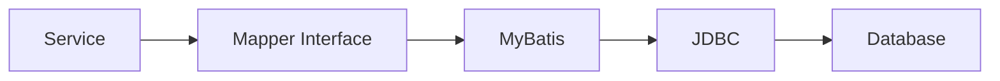
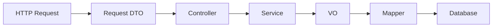
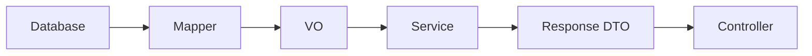
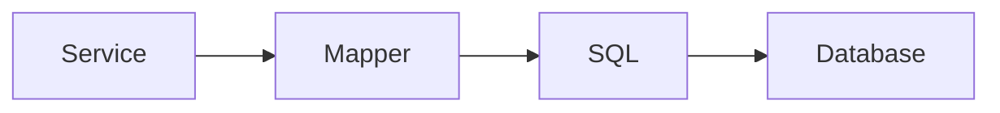
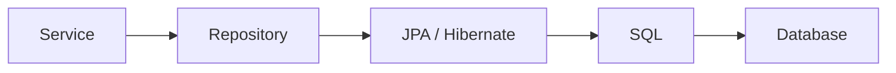

---

layout: post
title: "MyBatis Mapper 패턴 이해하기"
date: 2026-08-12
categories: [Spring & Java]
---

# MyBatis Mapper 패턴 이해하기

Spring Boot와 MyBatis 기반의 API를 개발하면서 자연스럽게 다음과 같은 구조를 사용하게 되었다.

```text id="7l0jvn"
Controller
    ↓
Service
    ↓
Mapper
    ↓
MyBatis XML
    ↓
Database
```

처음에는 프로젝트에서 사용하는 구조에 맞춰 Controller에서 Service를 호출하고, Service에서는 Mapper를 호출했다.

그런데 API 로직이 조금씩 복잡해지면서 단순히 구조를 따라가는 것만으로는 애매한 경우가 생겼다.

**조회 결과를 가지고 상태를 판단하는 로직은 Service와 Mapper 중 어디에 있어야 할까?**

**DTO와 VO는 왜 굳이 나눠서 사용할까?**

그리고 JPA 기반 프로젝트에서는 Mapper 대신 Repository를 사용하는데, 두 구조는 본질적으로 무엇이 다른지도 궁금했다.

이런 고민을 따라가다 보니 `Controller → Service → Mapper` 구조에서 중요한 것은 계층의 개수 자체가 아니었다.

**각 코드가 어떤 이유로 변경되는지를 기준으로 책임을 분리하는 것**이 핵심이었다.

이 글에서는 MyBatis 기반 Spring 애플리케이션의 요청이 DB까지 전달되는 흐름을 따라가면서 각 계층이 어떤 책임을 가지는지 정리해본다.

---

## 요청은 Controller에서 시작한다

클라이언트에서 다음과 같은 요청이 들어왔다고 해보자.

```text id="f7g4bw"
POST /items
```

Spring MVC에서는 Controller가 HTTP 요청을 받아 애플리케이션 내부 로직으로 전달한다.

```java id="v47k0w"
@RestController
@RequiredArgsConstructor
public class ItemController {

    private final ItemService itemService;

    @PostMapping("/items")
    public ItemResponseDto createItem(
            @RequestBody ItemRequestDto request) {

        return itemService.createItem(request);
    }
}
```

Controller의 관심사는 HTTP에 가깝다.

```text id="v90nmq"
HTTP Request
    ↓
Controller
    ↓
Request DTO
```

요청 값을 받고, 필요한 검증을 거친 뒤 Service를 호출하고, 처리 결과를 HTTP Response로 반환한다.

반대로 다음과 같은 업무 판단까지 Controller에 들어가기 시작하면 역할이 섞이게 된다.

```text id="zofb9r"
Controller

├── HTTP Request 처리
├── 중복 데이터 조회
├── 상태값 판단
├── DB Update
└── Response 생성
```

Controller는 요청이 어떤 업무 과정을 거쳐 처리되어야 하는지까지 알 필요가 없다.

그 책임은 Service로 넘긴다.

---

## Service는 업무 흐름을 만든다

Service는 실제 비즈니스 로직이 조합되는 계층이다.

```java id="19cfba"
@Service
@RequiredArgsConstructor
public class ItemService {

    private final ItemMapper itemMapper;

    @Transactional
    public ItemResponseDto createItem(
            ItemRequestDto request) {

        ItemVo item = new ItemVo();
        item.setItemId(request.getItemId());

        itemMapper.insertItem(item);

        return new ItemResponseDto(item.getItemId());
    }
}
```

실제 API에서는 단순히 하나의 Mapper만 호출하는 것보다 여러 작업이 연결되는 경우가 많다.

예를 들어 다음과 같은 흐름이다.

```text id="yt0f14"
요청
 ↓
기존 데이터 조회
 ↓
현재 상태 검증
 ↓
저장할 데이터 생성
 ↓
INSERT
 ↓
이력 저장
 ↓
응답 생성
```

이 과정에서는 여러 Mapper가 호출될 수도 있다.

```java id="g41apq"
ItemVo item = itemMapper.selectItem(itemId);

validateStatus(item);

itemMapper.updateItem(item);
historyMapper.insertHistory(item);
```

여기서 Service가 알아야 하는 것은

> 어떤 SQL을 실행해야 하는가?

보다

> 이 요청을 처리하기 위해 어떤 업무가 어떤 순서로 실행되어야 하는가?

에 가깝다.

따라서 상태 검증, 여러 데이터 접근 작업의 조합, 비즈니스 예외 처리, 트랜잭션 경계 등은 일반적으로 Service의 책임이 된다.

```text id="c4ndnk"
Service

├── Business Rule
├── Workflow
├── Transaction
└── Persistence 호출 조합
```

---

## Mapper는 DB 접근 방법을 담당한다

Service에서 실제 데이터가 필요해지면 Mapper를 호출한다.

```java id="0uqibq"
@Mapper
public interface ItemMapper {

    ItemVo selectItem(String itemId);

    int insertItem(ItemVo item);
}
```

그리고 실제 SQL은 MyBatis XML에 정의할 수 있다.

```xml id="pftkyq"
<select id="selectItem" resultType="ItemVo">
    SELECT ITEM_ID,
           ITEM_STATUS
    FROM TB_ITEM
    WHERE ITEM_ID = #{itemId}
</select>
```

실제 호출 흐름은 다음과 같다.



Mapper는 기존 DAO와 비슷한 Persistence Layer의 역할을 한다.

여기서 Service와 Mapper의 책임을 나누는 기준도 조금 더 명확해진다.

```text id="95hy9q"
Service
→ 무엇을 처리해야 하는가?

Mapper
→ 데이터를 어떻게 조회하고 저장할 것인가?
```

예를 들어

```sql id="q6vlsh"
SELECT ITEM_ID,
       ITEM_STATUS
FROM TB_ITEM
WHERE ITEM_ID = #{itemId}
```

처럼 어떤 조건으로 데이터를 조회할지는 Persistence의 관심사다.

반면 조회된 `ITEM_STATUS`를 보고

```text id="2gx9ig"
현재 상태에서 변경 가능한가?

이미 처리된 요청인가?

추가 이력을 남겨야 하는가?
```

를 판단하는 것은 업무 규칙이므로 Service의 관심사에 가깝다.

단순히 **SQL이 있으면 Mapper, Java 코드면 Service**로 나누는 것이 아니라 책임을 기준으로 보는 것이 중요하다.

---

## Mapper Interface에는 왜 구현체가 없을까?

MyBatis Mapper를 처음 보면 한 가지 특이한 점이 있다.

```java id="95vwud"
@Mapper
public interface ItemMapper {

    ItemVo selectItem(String itemId);
}
```

인터페이스만 존재하고 우리가 작성한 구현 클래스는 없다.

그런데 Service에서는 정상적으로 Mapper를 주입받아 사용할 수 있다.

```java id="q5smrr"
private final ItemMapper itemMapper;
```

그리고 다음 호출도 정상적으로 실행된다.

```java id="v0q31j"
itemMapper.selectItem(itemId);
```

이것이 가능한 이유는 MyBatis가 Mapper Interface를 기반으로 **Proxy 객체를 생성하기 때문**이다.

개념적으로 보면 다음과 같다.

```text id="y4r8kv"
Service
   ↓
ItemMapper
   ↓
Mapper Proxy
   ↓
Mapped Statement
   ↓
SQL 실행
```

`selectItem()`을 호출하면 Proxy가 해당 Mapper Method와 연결된 SQL을 찾아 실행한다.

예를 들어

```java id="8tz8jm"
itemMapper.selectItem("100");
```

을 호출하면 MyBatis는 Mapper의 namespace와 Method 이름 등을 기준으로 연결된 Statement를 찾아간다.

```xml id="48fbbj"
<select id="selectItem">
    ...
</select>
```

따라서 Mapper Interface는 직접 SQL을 실행하는 구현체라기보다 **Service 코드와 MyBatis의 SQL 실행을 연결하는 인터페이스**라고 이해할 수 있다.

---

## DTO와 VO는 왜 나눌까?

데이터도 각 계층의 책임에 따라 나누어 생각할 수 있다.

클라이언트가 다음 데이터를 전달한다고 해보자.

```json id="a49gnf"
{
  "itemId": "100"
}
```

API 요청은 Request DTO로 받을 수 있다.

```java id="7e3ej4"
public class ItemRequestDto {

    private String itemId;
}
```

응답 역시 API에서 필요한 형태로 정의한다.

```java id="f6dtsf"
public class ItemResponseDto {

    private String itemId;
    private String status;
}
```

DTO는 외부와 데이터를 주고받는 형태를 표현한다.

반면 MyBatis 기반 프로젝트에서는 DB 조회 결과나 Mapper Parameter를 담기 위해 VO라는 이름의 객체를 사용하는 경우가 있다.

```java id="kfjh3b"
public class ItemVo {

    private String itemId;
    private String itemStatus;
    private LocalDateTime updatedAt;
}
```

프로젝트마다 VO라는 용어를 사용하는 방식에는 차이가 있지만, 이런 구조에서는 다음과 같이 역할을 구분할 수 있다.

```text id="u1ixwb"
DTO
→ API 요청 / 응답 형태

VO
→ Persistence Layer와 데이터를 주고받는 형태
```

그러면 전체 데이터 흐름은 다음과 같이 볼 수 있다.



조회 결과는 반대 방향으로 올라온다.



이렇게 객체를 분리하면 API Spec의 변경과 DB Schema의 변경이 서로 직접적으로 전파되는 것을 줄일 수 있다.

예를 들어 DB에 내부 관리용 Column 하나가 추가되었다고 해서 반드시 API Response까지 변경되어야 하는 것은 아니다.

반대로 API Response 형식이 변경되었다고 해서 DB 조회 객체 자체를 변경해야 하는 것도 아니다.

즉 DTO와 Persistence 객체를 나누는 것도 결국 **서로 다른 변경 이유를 분리하기 위한 선택**이다.

---

## 결국 계층을 나누는 이유는 변경을 분리하기 위해서다

여기까지 보면 처음의 구조를 조금 다르게 볼 수 있다.

```text id="c81tll"
Controller
    ↓
Service
    ↓
Mapper
    ↓
Database
```

단순히 Spring 프로젝트는 원래 이렇게 구성해야 해서 나눈 것이 아니다.

각 계층은 서로 다른 이유로 변경된다.

```text id="exm0dl"
Controller
→ API Spec이 변경될 때

Service
→ Business Rule이 변경될 때

Mapper
→ 조회 / 저장 방식이나 SQL이 변경될 때

DTO
→ 외부 데이터 계약이 변경될 때

VO
→ Persistence 데이터 구조가 변경될 때
```

예를 들어 조회 SQL을 튜닝한다고 해보자.

```sql id="kl0mhb"
SELECT ...
FROM ...
WHERE ...
```

업무 규칙 자체가 동일하다면 Service가 변경될 이유는 없다.

반대로

```text id="lycm0v"
"특정 상태에서는 수정할 수 없다."
```

라는 비즈니스 정책이 추가되었다면 SQL 자체보다 Service의 로직이 변경될 가능성이 높다.

계층을 잘 나누면 변경이 발생했을 때 수정해야 할 범위를 예측하기 쉬워진다.

이것이 책임 분리가 실제 유지보수에서 의미를 가지는 지점이다.

---

## 그렇다면 JPA에서는 무엇이 달라질까?

이 구조를 이해하고 나면 MyBatis와 JPA의 차이도 단순히

```text id="brcfd5"
Mapper vs Repository
```

로만 볼 필요가 없다.

Controller와 Service의 기본적인 책임은 크게 달라지지 않는다.

가장 큰 차이는 **Persistence Layer에서 데이터를 다루는 방식**에 있다.

MyBatis는 개발자가 SQL을 직접 정의한다.



```xml id="f83jsd"
<select id="selectItem" resultType="ItemVo">
    SELECT ITEM_ID,
           ITEM_STATUS
    FROM TB_ITEM
    WHERE ITEM_ID = #{itemId}
</select>
```

즉 개발자가

> 어떤 SQL을 실행할 것인가?

를 직접 제어한다.

JPA에서는 테이블과 매핑되는 Entity를 정의하고 객체를 중심으로 데이터를 다룬다.

```java id="p3esoh"
@Entity
@Table(name = "TB_ITEM")
public class Item {

    @Id
    @Column(name = "ITEM_ID")
    private String itemId;
}
```

그리고 Repository를 통해 Entity를 조회한다.

```java id="qcsouq"
public interface ItemRepository
        extends JpaRepository<Item, String> {
}
```

```java id="6e35n5"
Item item = itemRepository.findById(itemId)
        .orElseThrow();
```

기본적인 CRUD에서는 JPA 구현체인 Hibernate가 Entity Mapping 정보를 기반으로 SQL을 생성해 실행한다.



따라서 두 기술의 관점을 단순화하면 다음과 같다.

```text id="jjvvvz"
MyBatis
→ SQL 중심
→ 어떤 SQL을 실행할 것인가?


JPA
→ Entity 중심
→ 어떤 객체를 조회하고 변경할 것인가?
```

물론 JPA 역시 최종적으로 Database와 통신할 때는 SQL과 JDBC를 사용한다.

차이는 Persistence Layer에서 개발자가 직접 다루는 추상화의 수준에 있다.

---

## MyBatis를 사용하면서 보이기 시작한 것

처음 `Controller → Service → Mapper` 구조를 접했을 때는 각 파일을 어디에 만들어야 하는지 정도의 문제라고 생각하기 쉽다.

하지만 실제 API를 개발하면서 조회, 상태 검증, 데이터 변경, 이력 저장처럼 하나의 요청 안에서 여러 작업이 연결되기 시작하면 계층을 나눈 이유가 조금 더 분명해진다.

예를 들어 다음 로직이 있다고 해보자.

```text id="5gjz1v"
요청 수신
   ↓
현재 데이터 조회
   ↓
상태 검증
   ↓
데이터 변경
   ↓
이력 저장
```

이것을 하나의 계층에서 모두 처리할 수도 있다.

하지만 그렇게 되면 HTTP 처리, 업무 규칙, SQL 실행이라는 서로 다른 관심사가 하나의 코드에 섞인다.

반대로 책임을 분리하면 같은 요청도 다음과 같이 볼 수 있다.

```text id="85r3bc"
Controller
→ 요청을 받는다

Service
→ 무엇을 처리할지 결정한다

Mapper
→ 필요한 데이터를 조회하고 저장한다
```

결국 중요한 것은 Controller, Service, Mapper라는 이름 자체가 아니다.

**서로 다른 책임과 서로 다른 변경 이유를 코드 구조에서도 분리하고 있는가**가 더 중요하다.

---

## 정리

MyBatis 기반 Spring 애플리케이션의 요청 흐름은 일반적으로 다음과 같이 이어진다.

```text id="sk1bb0"
HTTP Request
     ↓
Controller
     ↓
Service
     ↓
Mapper
     ↓
MyBatis
     ↓
JDBC
     ↓
Database
```

처음에는 단순히 여러 Layer를 거쳐 DB에 접근하는 구조처럼 보인다.

하지만 각 계층의 책임을 따라가 보면 구조를 나눈 이유가 보인다.

```text id="ypn5fa"
Controller
→ HTTP 요청과 응답

Service
→ 비즈니스 규칙과 업무 흐름
→ 트랜잭션 경계

Mapper
→ SQL 기반 데이터 접근

DTO
→ API의 데이터 계약

VO
→ MyBatis에서 사용하는 Persistence 데이터 객체
```

그리고 JPA를 사용하더라도 Controller와 Service라는 애플리케이션의 책임이 완전히 달라지는 것은 아니다.

주로 Persistence Layer의 접근 방식이 달라진다.

```text id="30hh6j"
MyBatis

Service
   ↓
Mapper
   ↓
SQL
   ↓
Database


JPA

Service
   ↓
Repository
   ↓
Entity / Hibernate
   ↓
SQL
   ↓
Database
```

MyBatis는 SQL을 직접 제어하는 방식이고, JPA는 Entity와 ORM이라는 추상화를 통해 데이터를 다룬다.

이 글을 정리하면서 가장 중요하다고 느낀 부분은 **계층을 나누는 것 자체가 좋은 설계를 만드는 것은 아니라는 점**이다.

Controller에서 Service를 호출하고 Service에서 Mapper를 호출한다고 해서 자동으로 책임이 분리되는 것은 아니다.

Service에 단순 SQL Parameter 조립만 가득할 수도 있고, Mapper SQL 안에 업무 판단이 과도하게 들어갈 수도 있다.

결국 계층형 구조의 목적은 정해진 형태를 지키는 것이 아니라 **변경되는 이유가 다른 코드들을 서로 분리하는 것**에 있다.

```text id="s1qhkn"
API가 바뀐다
→ Controller / DTO

업무 규칙이 바뀐다
→ Service

데이터 접근 방식이 바뀐다
→ Mapper
```

이 기준이 명확해지면 새로운 로직을 작성할 때도 **"이 코드를 어느 파일에 넣어야 하지?"보다 "이 로직은 어떤 책임이고, 어떤 이유로 변경될 수 있지?"**를 먼저 생각할 수 있다.

MyBatis Mapper 패턴을 이해한다는 것도 결국 Mapper 사용법을 아는 것보다, 이런 책임의 경계를 이해하는 데에 더 가깝다고 생각한다.
