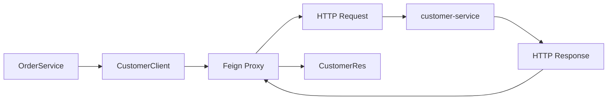

# Spring Cloud OpenFeign 동작 이해하기

MSA에서는 하나의 애플리케이션 안에서 모든 기능을 처리하지 않고 여러 서비스가 각자의 역할을 담당한다.

예를 들어 주문 서비스에서 고객 정보가 필요하다고 해보자.

```text
order-service
     ↓
customer-service
```

같은 Spring 애플리케이션 내부라면 다른 Service Bean을 주입받아서 호출할 수 있다.

```java
customerService.getCustomer(customerId);
```

하지만 MSA에서는 `order-service`와 `customer-service`가 서로 다른 애플리케이션이다.

각각 별도의 JVM과 Spring Container에서 실행되기 때문에 `customer-service`의 Bean을 `order-service`에서 직접 주입받을 수 없다.

따라서 서비스 간에는 HTTP와 같은 네트워크 통신이 필요하다.

Spring Cloud OpenFeign은 이러한 **서비스 간 HTTP 호출을 Java 인터페이스 형태로 작성할 수 있게 해주는 도구**다.

---

## @FeignClient

FeignClient는 다음과 같이 인터페이스로 정의할 수 있다.

```java
@FeignClient(
    name = "customer-api",
    url = "${feign.customer-api.url}"
)
public interface CustomerClient {

    @GetMapping("/customers/{customerId}")
    CustomerRes getCustomer(
        @PathVariable String customerId
    );
}
```

그런데 인터페이스만 있고 구현체는 보이지 않는다.

```java
CustomerRes getCustomer(String customerId);
```

메서드 선언만 있고 실제 구현 코드가 없다.

그런데 Service에서는 그냥 이 인터페이스를 주입받아 사용할 수 있다.

```java
@Service
@RequiredArgsConstructor
public class OrderService {

    private final CustomerClient customerClient;

    public void createOrder(String customerId) {

        CustomerRes customer =
            customerClient.getCustomer(customerId);

        // ...
    }
}
```

구현체가 없는데 어떻게 메서드가 실행되는 걸까?

---

## FeignClient의 실제 구현체는 Proxy이다

`@FeignClient`가 붙은 인터페이스를 발견하면 Spring Cloud OpenFeign이 해당 인터페이스를 기반으로 **Proxy 객체를 생성하고 Spring Bean으로 등록한다.**

따라서 실제로 주입되는 것은 인터페이스 자체가 아니라 런타임에 생성된 Proxy 객체다.

```text
OrderService
     ↓
CustomerClient
     ↓
Feign Proxy
```

Service에서

```java
customerClient.getCustomer(customerId);
```

를 호출하면 Proxy가 해당 호출을 가로챈다.

그리고 `@FeignClient`, `@GetMapping`, `@PathVariable` 등에 정의된 정보를 이용해 HTTP 요청을 만든다.

예를 들어 설정이

```yaml
feign:
  customer-api:
    url: http://customer-service
```

이고

```java
@GetMapping("/customers/{customerId}")
```

가 정의되어 있다면 실제로는 대략 다음과 같은 요청이 만들어진다.

```text
GET http://customer-service/customers/1234
```

즉 Java 코드에서는 일반 메서드를 호출한 것처럼 보이지만 실제로는 네트워크를 통해 다른 서비스의 API를 호출하고 있는 것이다.

---

## 전체 호출 흐름

전체적인 흐름을 보면 다음과 같다.



Feign Proxy는 HTTP 응답을 받아 JSON 등의 응답 데이터를 Java 객체로 변환하고, Service에는 `CustomerRes`를 반환한다.

그래서 호출하는 입장에서는

```java
CustomerRes customer =
    customerClient.getCustomer(customerId);
```

처럼 일반 Java 메서드를 호출하는 형태로 사용할 수 있다.

---

## @FeignClient의 name과 url

FeignClient를 보다 보면 보통 다음과 같은 설정을 볼 수 있다.

```java
@FeignClient(
    name = "customer-api",
    url = "${feign.customer-api.url}"
)
```

여기서 `name`은 FeignClient를 식별하기 위한 이름이고, `url`은 실제 요청을 보낼 대상 서비스의 주소다.

환경에 따라 호출 주소가 달라질 수 있기 때문에 URL은 코드에 직접 넣기보다 설정 파일로 분리하는 경우가 많다.

```yaml
feign:
  customer-api:
    url: http://customer-service
```

개발 환경과 운영 환경의 주소가 다르더라도 애플리케이션 코드는 그대로 유지하고 설정만 변경할 수 있다.

---

## RestTemplate과 무엇이 다른가?

FeignClient 없이도 다른 서비스를 HTTP로 호출할 수 있다.

예를 들어 직접 HTTP Client를 사용한다면 요청 URL을 만들고 HTTP Method, Header, 응답 타입 등을 직접 지정해야 한다.

FeignClient는 이 부분을 인터페이스 선언으로 추상화한다.

```java
@GetMapping("/customers/{customerId}")
CustomerRes getCustomer(@PathVariable String customerId);
```

호출하는 Service 입장에서는 HTTP 요청을 직접 만드는 코드가 사라지고 **어떤 API를 호출하는지 인터페이스 자체에 드러난다.**

---

## FeignClient도 결국 HTTP 통신이다

FeignClient를 사용하면 코드상으로는 일반 메서드 호출처럼 보인다.

```java
customerClient.getCustomer(customerId);
```

하지만 이것은 같은 JVM 안에서 실행되는 일반적인 메서드 호출과는 다르다.

중간에 실제 네트워크 통신이 존재한다.

```text
Service
  ↓
Feign Proxy
  ↓
HTTP
  ↓
다른 Microservice
```

따라서 상대 서비스의 응답이 느리면 현재 서비스도 영향을 받고, 상대 서비스가 장애 상태라면 호출 역시 실패할 수 있다.

FeignClient를 단순히

```text
다른 Service의 메서드를 호출하는 기능
```

으로 이해하기보다는

```text
다른 서비스의 HTTP API를
Java 인터페이스 형태로 호출할 수 있게 추상화한 Client
```

라고 이해하는 것이 더 정확하다.

MSA에서 FeignClient를 이해할 때 가장 중요한 부분도 결국 여기에 있다.
