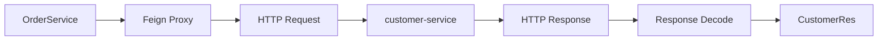
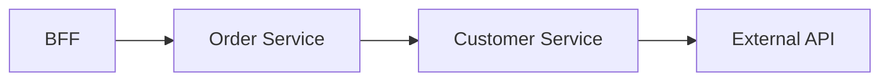
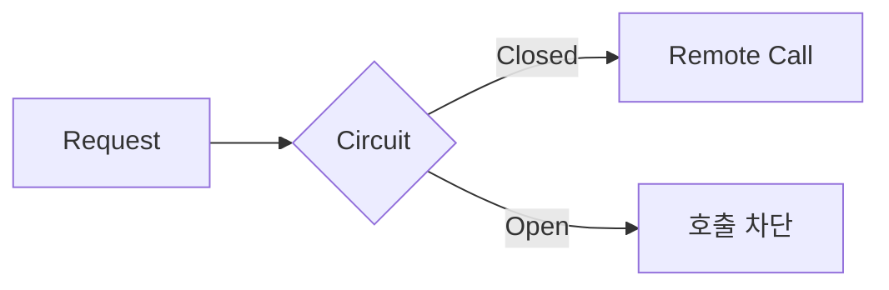

# Spring Cloud OpenFeign 동작 이해하기

MSA 기반의 Spring Boot 서비스를 개발하면서 다른 서비스의 API를 호출하기 위해 FeignClient를 사용할 일이 있었다. 사용법 자체는 단순했다.

```java
@FeignClient(
    name = "customer-api",
    url = "${feign.customer-api.url}"
)
public interface CustomerClient {

    @GetMapping("/customers/{customerId}")
    CustomerRes getCustomer(@PathVariable String customerId);
}
```

```java
CustomerRes customer = customerClient.getCustomer(customerId);
```

처음에는 정해진 사용법대로 썼지만, 소스코드를 보다 보니 의문이 생겼다. `CustomerClient`는 인터페이스라 메서드 선언만 있고 직접 작성한 구현체가 없다. 그런데 해당 메서드를 호출하면 다른 애플리케이션으로 HTTP 요청이 나가고, 응답은 다시 Java 객체로 돌아온다.

```text
OrderService → CustomerClient → ? → customer-service
```

**구현체도 없는 인터페이스의 메서드 호출이 어떻게 다른 서버로 가는 HTTP 요청이 되는 걸까?**

이 흐름을 따라가 보니 FeignClient의 핵심은 단순히 HTTP 호출 코드를 줄여주는 데 있지 않았다. 코드는 평범한 메서드 호출처럼 보이지만 그 뒤에서는 실제 네트워크 통신이 일어나고 있었고, 이를 이해하고 나니 Timeout·Retry·Circuit Breaker를 왜 함께 고려해야 하는지까지 자연스럽게 연결되었다.

이 글에서는 **FeignClient의 메서드 호출이 실제 HTTP 요청으로 변환되는 과정**과, **그 추상화 뒤에 있는 네트워크 통신의 특성**을 정리하고자 한다.

---

## 다른 서비스의 Bean은 직접 호출할 수 없다

같은 Spring 애플리케이션 내부라면 다른 Service Bean을 주입받아 바로 호출할 수 있다. 같은 JVM, 같은 Spring Container 안에서 이루어지는 Method Call이다.

```java
customerService.getCustomer(customerId);   // 같은 프로세스 내부
```

하지만 `order-service`와 `customer-service`는 서로 다른 애플리케이션이고, 각각 별도의 JVM과 Spring Container에서 실행된다. 둘 사이에는 네트워크 경계가 있고, `order-service`가 `customer-service`의 Bean을 직접 주입받을 방법은 없다.

```text
order-service ── HTTP ──> customer-service
```

결국 다른 서비스의 기능을 사용하려면 HTTP 같은 방식으로 원격 API를 호출해야 한다. Spring Cloud OpenFeign은 이러한 HTTP 호출을 **Java 인터페이스로 선언할 수 있도록 추상화한 Client**이다.

---

## FeignClient의 구현체는 어디에 있을까

`CustomerClient` 인터페이스 안에는 실제 HTTP 요청을 보내는 코드가 없다. 그럼에도 Service에서는 정상적으로 주입받아 사용할 수 있다.

```java
@Service
@RequiredArgsConstructor
public class OrderService {

    private final CustomerClient customerClient;

    public void createOrder(String customerId) {
        CustomerRes customer = customerClient.getCustomer(customerId);
    }
}
```

이러한 과정이 가능한 이유는 Spring Cloud OpenFeign이 `@FeignClient` 어노테이션이 선언된 인터페이스를 기반으로 **런타임에 Proxy 객체를 만들어 Spring Bean으로 등록하기 때문**이다. 즉 Service에 주입되는 것은 우리가 작성한 구현 클래스가 아니라 Feign이 만든 Proxy인 것이다.

```text
OrderService → CustomerClient → Feign Proxy
```

---

## 메서드 호출은 어떻게 HTTP 요청으로 바뀔까

```java
customerClient.getCustomer("1234");
```

코드만 보면 평범한 메서드 호출이지만, 실제 처리는 Feign Proxy가 담당한다. Proxy는 `@FeignClient`에 선언된 정보와 메서드의 `@GetMapping` 등을 이용하여 요청을 구성한다.

```yaml
feign:
  customer-api:
    url: http://customer-service
```

```text
customerClient.getCustomer("1234")
        ↓
GET http://customer-service/customers/1234
```

HTTP Client가 실제 요청을 보내고 응답을 받으면, 응답 데이터는 Decoder를 거쳐 `CustomerRes`와 같은 Java 객체로 변환되어 호출한 Service로 돌아온다.



즉 FeignClient는 HTTP 통신을 없앤 것이 아니라 **HTTP 통신을 Java 메서드 호출처럼 보이도록 추상화한 것**이다. 코드에서는 아래 한 줄이지만,

```java
CustomerRes customer = customerClient.getCustomer(customerId);
```

실제로는 `Method Call → Feign Proxy → Request 생성 → HTTP 통신 → Response → Java Object 변환`이라는 과정이 숨어 있다.

---

## 추상화 뒤에는 네트워크가 있다

코드만 본다면 두 호출은 비슷해 보인다.

```java
customerService.getCustomer(customerId);   // Local Call
customerClient.getCustomer(customerId);    // Remote Call
```

하지만 하나는 같은 JVM 안의 Method Call이고, 다른 하나는 `Feign Proxy → HTTP → customer-service`를 거치는 Remote Call이다. 이 차이가 중요한 이유는 **Remote Call에는 Local Call에는 없던 실패 가능성이 생기기 때문**이다. 대상 서비스가 정상이어도 네트워크가 느릴 수 있고, 연결에 실패할 수도 있고, 응답이 늦어질 수도 있다.

FeignClient가 호출 코드를 단순하게 만들어도 **네트워크의 특성까지 사라지는 것은 아니다.** 여기서부터 Timeout, Retry, Circuit Breaker가 부가 기능이 아니라 서비스 간 통신에 필요한 요소로 보이기 시작한다.

---

## 응답이 늦으면 현재 서비스도 함께 기다린다

`customer-service`의 응답이 평소보다 느려졌다고 해보자. Spring MVC 기반의 동기 처리 구조에서는 FeignClient의 응답을 기다리는 동안 현재 요청을 처리하던 Thread도 함께 대기한다.

```text
Downstream 응답 지연 → FeignClient 응답 대기 → Request Thread 점유
```

요청이 많지 않다면 괜찮겠지만, 이런 요청이 쌓이면 가용 Thread가 줄어들고 현재 서비스의 다른 요청까지 영향을 받게된다. 결국 Downstream Service의 문제가 현재 서비스로 전파될 수 있다. 그래서 Remote Call에는 **얼마나 기다릴지에 대한 경계**가 필요하다.

---

## Timeout은 기다림의 경계를 정한다

FeignClient의 HTTP 통신에서는 대표적으로 두 가지를 생각할 수 있다.

```text
Connect Timeout → 대상 서버와 연결을 맺기까지 기다리는 시간
Read Timeout    → 연결 이후 응답을 기다리는 시간
```

연결 자체가 안 되면 Connect Timeout이, 연결은 됐지만 응답이 늦으면 Read Timeout이 문제가 된다. Timeout을 너무 길게 잡으면 장애 상황에서 Thread·Connection 같은 리소스를 오래 점유하게되고, 너무 짧게 잡으면 정상 처리될 요청까지 실패시킨다. 그래서 Timeout은 **Downstream API의 특성과 평소 응답 시간, 현재 서비스가 허용할 수 있는 지연을 함께 고려하여 정해야 한다.**

---

## 실패했다고 해서 무조건 다시 호출할 수는 없다

일시적인 오류나 Timeout에는 Retry를 생각할 수 있지만, Timeout이 발생했다고 하여 **상대 서비스의 작업까지 실패했다고 단정할 수는 없다.**

```http
POST /orders
```

서버에서는 이미 INSERT가 끝났는데 응답을 돌려주는 과정에서 Timeout이 날 수도 있다.

```text
Client                Server
POST /orders  ──────>
                    INSERT 성공
    <────── Response
            X Timeout
```

이 상태에서 단순히 Retry 한다면 같은 요청이 다시 실행되어 INSERT가 중복될 수 있다. 그래서 Retry를 적용할 때는 "실패 → 재시도"로 단순하게 생각하면 안 되고, **같은 요청을 다시 실행해도 안전한가**를 함께 판단해야 한다. 여기서 멱등성(Idempotency)이 중요해진다. 동일한 요청을 여러 번 수행해도 최종 상태가 의도치 않게 중복 변경되지 않도록 설계되어 있어야 Retry를 안전하게 적용할 수 있다. Retry는 네트워크 실패에 대한 해결책이면서 동시에 **API의 멱등성 설계와 연결되는 문제**이다.

---

## 하나의 Remote Call 장애가 어디까지 전파될까

MSA에서는 하나의 요청이 여러 서비스를 거쳐 처리된다.



여기서 External API가 느려지면, 그 지연을 기다리는 Customer → Order → BFF까지 순서대로 함께 대기한다. 문제는 가장 아래 External API에서 생겼지만, 그걸 기다리는 Upstream Service들의 Thread와 Connection도 함께 소모된다. 즉 서비스가 여러 개로 분리되어 있다고 해서 장애까지 자동으로 격리되는 것은 아니다. **동기적인 Remote Call로 연결되어 있으면 지연과 장애도 호출 관계를 따라 전파된다.**

---

## Circuit Breaker는 장애 전파를 막는다

특정 Downstream Service에서 계속 실패가 발생하는 상태에서 모든 요청을 그대로 전달하면 매번 Timeout이나 실패를 기다려야 한다. Circuit Breaker는 일정 수준 이상의 실패를 감지하면 해당 서비스로의 호출을 일시적으로 차단한다.



```text
Closed → 실패 누적 → Open → 일정 시간 경과 → Half-Open → 복구 확인 → Closed
```

정상 상태(Closed)에서는 요청을 그대로 전달하고, 실패가 기준 이상 누적되면 Open으로 전환해 Remote Call 자체를 막는다. 일정 시간 뒤에는 Half-Open 상태로 일부 요청만 허용해 Downstream이 복구되었는지 확인한다. Spring 환경에서는 Resilience4j 같은 라이브러리로 해당 패턴을 적용할 수 있다. Circuit Breaker의 목적은 실패한 요청을 빠르게 반환하는 것보다, **장애가 발생한 Downstream과의 호출을 제한해 그 영향이 현재 서비스까지 계속 전파되는 것을 줄이는 것**에 가깝다.

---

## 정리

처음 FeignClient는 "다른 Service의 API를 Java Interface로 편하게 호출하는 기능" 정도로 생각했다. 사용하는 코드만 보면 실제로 그렇게 보인다.

```java
customerClient.getCustomer(customerId);
```

하지만 내부를 따라가 보면 이 한 줄은 다음 과정을 감추고 있다.

```text
Method Call → Feign Proxy → HTTP Request → Network → Downstream Service → HTTP Response → Java Object
```

그리고 `Network`라는 경계가 생기는 순간, Local Call에는 없던 문제들이 함께 따라온다.

```text
Connection 실패 가능
응답 지연 가능
요청 결과가 불확실할 수 있음
장애가 호출 관계를 따라 전파될 수 있음
```

FeignClient는 이 복잡성을 코드에서 상당 부분 감춰주지만, Feign은 Remote Call을 Local Method Call처럼 보이게 만들어줄 뿐, Remote Call 자체를 Local Call로 바꾸지는 않는다. 그 뒤에는 여전히 네트워크가 있고, 네트워크가 있기 때문에 Timeout이 필요하고, Retry에는 멱등성을 함께 생각해야 하며, 서비스가 연쇄적으로 연결돼 있다면 Circuit Breaker 같은 장애 격리도 필요해진다.

```text
FeignClient → Remote Call → Network
                              ├── Timeout
                              ├── Retry / Idempotency
                              └── Failure Propagation / Circuit Breaker
```

결국 FeignClient를 이해한다는 것은 인터페이스를 선언하는 방법을 아는 것보다, **그 인터페이스 뒤에 숨겨진 Remote Call을 인식하는 것**에 더 가깝다고 생각한다.
