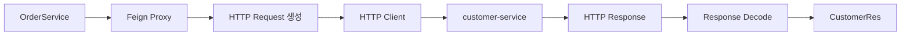
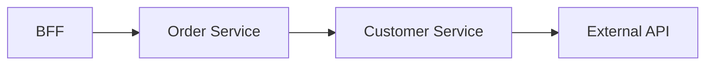
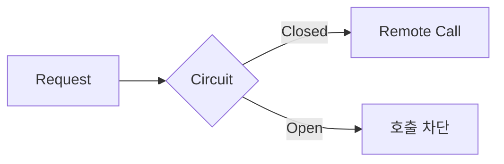

---

layout: post
title: "Spring Cloud OpenFeign 동작 이해하기"
date: 2026-08-13
categories: [Spring & Java]
---

# Spring Cloud OpenFeign 동작 이해하기

MSA 기반의 Spring Boot 서비스를 개발하면서 다른 서비스의 API를 호출하기 위해 FeignClient를 사용할 일이 있었다.

사용하는 방법 자체는 단순했다.

```java
@FeignClient(
    name = "customer-api",
    url = "${feign.customer-api.url}"
)
public interface CustomerClient {

    @GetMapping("/customers/{customerId}")
    CustomerRes getCustomer(
        @PathVariable String customerId
    );
}
```

Service에서는 이 인터페이스를 주입받아 일반적인 Java 메서드처럼 호출한다.

```java
CustomerRes customer =
    customerClient.getCustomer(customerId);
```

처음에는 정해진 사용법에 맞춰 사용했지만, 코드를 보다 보니 한 가지 의문이 생겼다.

`CustomerClient`는 인터페이스이기 때문에 메서드 선언만 있고 직접 작성한 구현체가 없다.

그런데 이 메서드를 호출하면 다른 애플리케이션으로 HTTP 요청이 전달되고, 응답은 다시 Java 객체로 반환된다.

```text
OrderService
     ↓
CustomerClient
     ↓
     ?
     ↓
customer-service
```

**구현체도 보이지 않는 인터페이스의 메서드 호출이 어떻게 다른 서버로 전달되는 HTTP 요청이 되는 것일까?**

이 구조를 따라가 보니 FeignClient의 핵심은 단순히 HTTP 호출 코드를 줄여주는 데 있지 않았다.

코드에서는 일반적인 메서드 호출처럼 보이지만 그 추상화 뒤에서는 실제 네트워크 통신이 일어나고 있었다.

그리고 이 사실을 이해하니 FeignClient를 사용할 때 Timeout, Retry, Circuit Breaker 같은 요소를 왜 함께 고려해야 하는지도 자연스럽게 연결됐다.

이 글에서는 **FeignClient의 메서드 호출이 실제 HTTP 요청으로 변환되는 과정을 살펴보고, 이 추상화 뒤에 존재하는 네트워크 통신의 특성**에 대해 정리하고자 한다.

---

## 다른 서비스의 Bean을 직접 호출할 수는 없다

같은 Spring 애플리케이션 안이라면 다른 Service Bean을 주입받아 호출할 수 있다.

```java
customerService.getCustomer(customerId);
```

개념적으로 보면 같은 JVM과 Spring Container 안에서 객체의 메서드를 호출하는 것이다.

```text
Spring Application

OrderService
     ↓
CustomerService
```

하지만 MSA에서는 상황이 다르다.

```text
order-service

      ↓

customer-service
```

`order-service`와 `customer-service`는 서로 다른 애플리케이션이고 각각 별도의 JVM과 Spring Container에서 실행된다.

따라서 `order-service`에서 `customer-service`의 Bean을 직접 주입받을 수 없다.

두 서비스 사이에는 네트워크 경계가 존재한다.

```text
order-service
     │
     │ HTTP
     ▼
customer-service
```

결국 다른 서비스의 기능을 사용하려면 HTTP와 같은 방식으로 원격 API를 호출해야 한다.

Spring Cloud OpenFeign은 이 HTTP 호출을 **Java 인터페이스 형태로 선언할 수 있도록 추상화한 Client**다.

---

## 그런데 FeignClient의 구현체는 어디에 있을까?

FeignClient는 다음과 같이 인터페이스로 정의한다.

```java
@FeignClient(
    name = "customer-api",
    url = "${feign.customer-api.url}"
)
public interface CustomerClient {

    @GetMapping("/customers/{customerId}")
    CustomerRes getCustomer(
        @PathVariable String customerId
    );
}
```

그런데 인터페이스 안에는 실제 HTTP 요청을 보내는 코드가 없다.

```java
CustomerRes getCustomer(String customerId);
```

그럼에도 Service에서는 정상적으로 주입받을 수 있다.

```java
@Service
@RequiredArgsConstructor
public class OrderService {

    private final CustomerClient customerClient;

    public void createOrder(String customerId) {

        CustomerRes customer =
            customerClient.getCustomer(customerId);

        // ...
    }
}
```

이것이 가능한 이유는 Spring Cloud OpenFeign이 `@FeignClient`가 선언된 인터페이스를 기반으로 **런타임에 Proxy 객체를 생성하고 Spring Bean으로 등록하기 때문**이다.

```text
OrderService
     ↓
CustomerClient
     ↓
Feign Proxy
```

즉 Service에 주입되는 객체는 우리가 직접 작성한 구현 클래스가 아니라 Feign이 생성한 Proxy다.

---

## 메서드 호출은 어떻게 HTTP 요청으로 바뀔까?

Service에서 다음 코드를 실행한다고 해보자.

```java
customerClient.getCustomer("1234");
```

코드만 보면 평범한 Java 메서드 호출이다.

하지만 실제 호출을 처리하는 것은 Feign Proxy다.

Proxy는 FeignClient에 선언된 정보를 이용해 HTTP 요청을 구성한다.

```java
@FeignClient(
    name = "customer-api",
    url = "${feign.customer-api.url}"
)
```

그리고 메서드에는 요청 방법과 Path가 선언되어 있다.

```java
@GetMapping("/customers/{customerId}")
CustomerRes getCustomer(
    @PathVariable String customerId
);
```

예를 들어 URL 설정이 다음과 같다면

```yaml
feign:
  customer-api:
    url: http://customer-service
```

메서드 호출은 개념적으로 다음 HTTP 요청으로 변환된다.

```text
customerClient.getCustomer("1234")

            ↓

GET http://customer-service/customers/1234
```

이후 실제 HTTP Client가 요청을 보내고 대상 서비스의 응답을 받는다.

응답 데이터는 Decoder 등을 거쳐 `CustomerRes`와 같은 Java 객체로 변환되어 호출한 Service로 반환된다.

전체 흐름을 단순화하면 다음과 같다.



결국 다음 한 줄 뒤에는

```java
CustomerRes customer =
    customerClient.getCustomer(customerId);
```

대략 다음과 같은 과정이 숨어 있다.

```text
Java Method Call
        ↓
Feign Proxy
        ↓
Request 생성
        ↓
HTTP 통신
        ↓
Response
        ↓
Java Object 변환
```

FeignClient가 HTTP 통신 자체를 없앤 것이 아니라 **HTTP 통신을 Java 메서드 호출처럼 보이도록 추상화한 것**이다.

---

## 추상화 뒤에는 네트워크가 존재한다

여기까지 이해하고 나니 FeignClient를 보는 관점이 조금 달라졌다.

코드만 보면 다음 두 호출은 비슷해 보인다.

```java
customerService.getCustomer(customerId);
```

```java
customerClient.getCustomer(customerId);
```

하지만 실제 동작은 전혀 다르다.

```text
Local Call

OrderService
    ↓
CustomerService

같은 JVM 내부의 Method Call
```

반면 FeignClient 호출은

```text
Remote Call

OrderService
    ↓
Feign Proxy
    ↓
HTTP
    ↓
customer-service
```

이다.

이 차이가 중요한 이유는 **Remote Call에는 Local Call에는 없던 실패 가능성이 생기기 때문**이다.

대상 서비스가 정상이어도 네트워크가 느릴 수 있고, 연결에 실패할 수도 있으며, 상대 서비스의 응답이 늦어질 수도 있다.

```text
FeignClient 호출
      ↓
Network
      ↓
Downstream Service
```

즉 FeignClient가 호출 코드를 단순하게 만들어도 **네트워크의 특성까지 사라지는 것은 아니다.**

이 지점부터 Timeout이나 Retry 같은 설정도 단순한 부가 기능이 아니라 서비스 간 통신을 위해 필요한 요소로 보이기 시작한다.

---

## 응답이 늦으면 현재 서비스도 기다린다

예를 들어 `customer-service`의 응답이 평소보다 크게 느려졌다고 해보자.

```text
order-service
     ↓
FeignClient
     ↓
customer-service 응답 지연
```

Spring MVC 기반의 동기 처리 구조에서는 FeignClient의 응답을 기다리는 동안 현재 요청을 처리하던 Thread도 함께 대기한다.

```text
Downstream Service 응답 지연
        ↓
FeignClient 응답 대기
        ↓
Request Thread 점유
```

한두 개의 요청이라면 큰 문제가 아닐 수 있다.

하지만 이런 요청이 계속 쌓이면 사용 가능한 Thread가 줄어들고 현재 서비스의 다른 요청에도 영향을 줄 수 있다.

```text
Downstream 지연
      ↓
대기 Thread 증가
      ↓
가용 Thread 감소
      ↓
현재 Service의 처리 지연
```

결국 Downstream Service의 문제가 현재 서비스로 전파될 수 있다.

그래서 Remote Call에서는 **얼마나 기다릴 것인지에 대한 경계**가 필요하다.

---

## Timeout은 기다림의 경계를 정한다

FeignClient를 이용한 HTTP 통신에서는 대표적으로 Connect Timeout과 Read Timeout을 생각할 수 있다.

```text
Connect Timeout
→ 대상 서버와 연결을 맺기까지 기다리는 시간

Read Timeout
→ 연결 이후 응답을 기다리는 시간
```

연결 자체를 맺지 못하고 있다면 Connect Timeout이 문제가 되고,

```text
Client
   ────── X ──────>
                Server
```

연결은 성공했지만 상대 서비스의 응답이 늦다면 Read Timeout을 고려하게 된다.

```text
Client
   ───────────────>
                Server

   <── 응답 대기 ──
```

Timeout을 너무 길게 설정하면 장애 상황에서도 Thread와 Connection 같은 리소스를 오랫동안 점유할 수 있다.

반대로 너무 짧게 설정하면 정상적으로 처리될 요청까지 실패시킬 수 있다.

따라서 Timeout은 단순히 크게 잡는 것이 아니라 **Downstream API의 특성과 평소 응답 시간, 현재 서비스가 허용할 수 있는 지연 시간을 함께 고려해서 정해야 한다.**

---

## 실패했다고 해서 무조건 다시 호출할 수는 없다

네트워크 통신에서는 일시적인 오류나 Timeout이 발생할 수 있기 때문에 Retry를 생각할 수 있다.

하지만 여기서 또 하나의 문제가 생긴다.

호출한 쪽에서 Timeout이 발생했다고 해서 **상대 서비스의 작업까지 실패했다고 단정할 수는 없다.**

예를 들어 다음 API를 호출했다고 해보자.

```http
POST /orders
```

서버에서는 이미 INSERT가 완료되었지만 응답을 반환하는 과정에서 Timeout이 발생할 수 있다.

```text
Client              Server

POST /orders  ────────>

                    INSERT 성공

     <────── Response
             X Timeout
```

Client 입장에서는 실패한 요청처럼 보인다.

이 상태에서 단순히 Retry하면 같은 요청이 다시 전달된다.

```text
1차 요청
→ INSERT 성공
→ Response Timeout

2차 요청
→ Retry
→ INSERT 재실행
```

그래서 Retry를 적용할 때는 단순히

```text
실패
 ↓
재시도
```

로 생각해서는 안 된다.

**같은 요청을 다시 실행해도 안전한가?**

를 함께 판단해야 한다.

여기서 멱등성(Idempotency)이 중요해진다.

동일한 요청을 여러 번 수행하더라도 시스템의 최종 상태가 의도치 않게 중복 변경되지 않도록 설계되어 있다면 Retry를 더 안전하게 적용할 수 있다.

즉 Retry는 네트워크 실패에 대한 해결책이면서 동시에 **API의 멱등성 설계와 연결되는 문제**다.

---

## 하나의 Remote Call 장애가 어디까지 전파될까?

MSA에서는 하나의 요청이 여러 서비스를 거쳐 처리될 수 있다.



여기서 External API가 느려진다고 해보자.

```text
External API 지연
       ↓
Customer Service 대기
       ↓
Order Service 대기
       ↓
BFF 대기
```

처음 문제는 가장 아래의 External API에서 발생했지만 그 영향을 기다리고 있는 상위 서비스들도 함께 받는다.

이런 요청이 계속 유입되면 여러 서비스의 Thread와 Connection 같은 리소스가 함께 소모될 수 있다.

```text
하나의 Downstream 장애

        ↓

여러 Upstream Service의
리소스까지 점유
```

즉 서비스가 여러 개로 분리되어 있다고 해서 장애까지 자동으로 격리되는 것은 아니다.

**동기적인 Remote Call로 연결되어 있다면 지연과 장애 역시 호출 관계를 따라 전파될 수 있다.**

---

## Circuit Breaker는 실패한 호출을 계속 보내지 않는다

이미 특정 Downstream Service에서 지속적으로 실패가 발생하고 있다고 해보자.

이 상태에서 모든 요청을 계속 전달하면 매번 Timeout이나 실패를 기다려야 한다.

```text
Request
   ↓
FeignClient
   ↓
장애 Service
   ↓
Timeout
```

Circuit Breaker는 일정 수준 이상의 실패를 감지하면 해당 서비스로의 호출을 일시적으로 차단할 수 있다.



정상 상태에서는 Circuit이 Closed 상태로 요청을 전달한다.

실패가 일정 기준 이상 누적되면 Open 상태로 전환해 실제 Remote Call을 막는다.

일정 시간이 지난 뒤에는 일부 요청을 다시 허용해 Downstream Service가 복구되었는지 확인할 수 있다.

```text
Closed
  ↓
실패 누적
  ↓
Open
  ↓
일정 시간 경과
  ↓
Half-Open
  ↓
복구 확인
  ↓
Closed
```

Spring 환경에서는 Resilience4j와 같은 라이브러리를 이용해 이러한 패턴을 적용할 수 있다.

Circuit Breaker의 목적은 단순히 실패한 요청을 빠르게 반환하는 데만 있는 것이 아니다.

**장애가 발생한 Downstream Service와의 호출을 제한해 그 영향이 현재 서비스까지 계속 전파되는 것을 줄이는 것**에 더 가깝다.

---

## 처음 생각했던 FeignClient와 실제 FeignClient

처음 FeignClient를 사용했을 때는 다음 정도로 이해했다.

```text
다른 Service의 API를
Java Interface로 편하게 호출하는 기능
```

사용하는 코드만 보면 실제로 그렇게 보인다.

```java
customerClient.getCustomer(customerId);
```

하지만 내부 구조를 따라가 보면 이 한 줄은 다음 과정을 감추고 있다.

```text
Method Call
    ↓
Feign Proxy
    ↓
HTTP Request
    ↓
Network
    ↓
Downstream Service
    ↓
HTTP Response
    ↓
Java Object
```

그리고 `Network`라는 경계가 생기는 순간 고려해야 할 문제도 달라진다.

```text
Local Method Call

→ 같은 Process 안에서 실행


Remote Call

→ Connection 실패 가능
→ 응답 지연 가능
→ Timeout 가능
→ 요청 결과가 불확실할 수 있음
→ 장애가 호출 관계를 따라 전파될 수 있음
```

FeignClient는 이런 복잡성을 코드에서 상당 부분 감춰준다.

하지만 **감춰져 있다는 것과 존재하지 않는다는 것은 다르다.**

이 차이를 이해하는 것이 FeignClient를 단순히 사용하는 것과 서비스 간 통신의 관점에서 이해하는 것의 차이라고 생각한다.

---

## 정리

FeignClient를 사용하면 다른 서비스의 API를 다음과 같이 호출할 수 있다.

```java
CustomerRes customer =
    customerClient.getCustomer(customerId);
```

겉으로 보면 일반적인 Java 메서드 호출과 크게 다르지 않다.

하지만 내부에서는 Feign이 생성한 Proxy가 메서드 호출을 HTTP 요청으로 변환하고 실제 네트워크를 통해 다른 서비스와 통신한다.

```text
Java Method Call
       ↓
Feign Proxy
       ↓
HTTP Request
       ↓
Network
       ↓
Downstream Service
```

처음에는 FeignClient를 **HTTP 호출 코드를 간단하게 만들어주는 도구** 정도로 생각했다.

하지만 내부 동작을 따라가 보니 더 중요하게 느껴진 것은 그 반대쪽이었다.

Feign은 Remote Call을 Local Method Call처럼 보이게 만들어주지만 **Remote Call 자체를 Local Call로 바꾸는 것은 아니다.**

그 뒤에는 여전히 네트워크가 존재한다.

그리고 네트워크가 존재하기 때문에 응답 지연과 연결 실패가 발생할 수 있고, Timeout이 필요하며, Retry를 적용할 때는 멱등성을 생각해야 한다.

서비스가 연쇄적으로 연결되어 있다면 하나의 Downstream 장애가 Upstream까지 전파될 수 있기 때문에 Circuit Breaker와 같은 장애 격리 방법도 필요해진다.

```text
FeignClient
    ↓
Remote Call
    ↓
Network
    ├── Timeout
    ├── Retry / Idempotency
    └── Failure Propagation / Circuit Breaker
```

결국 FeignClient를 이해하면서 가장 중요하다고 느낀 부분은 **추상화가 복잡성을 없애는 것이 아니라 사용하기 쉬운 형태로 감춰준다는 점**이었다.

코드에서는 한 줄의 메서드 호출처럼 보이더라도 그 경계가 JVM을 넘어가는 순간부터는 네트워크 통신의 특성을 함께 생각해야 한다.

**FeignClient를 이해한다는 것은 인터페이스를 선언하는 방법을 아는 것보다, 그 인터페이스 뒤에 숨겨진 Remote Call을 인식하는 것에 더 가깝다.**
