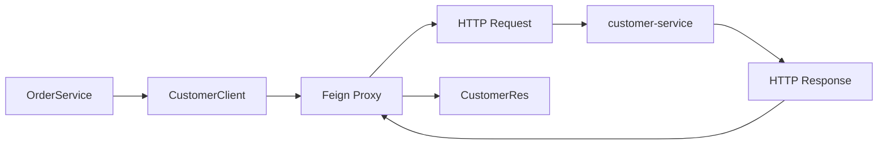
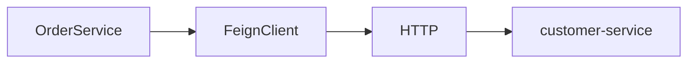
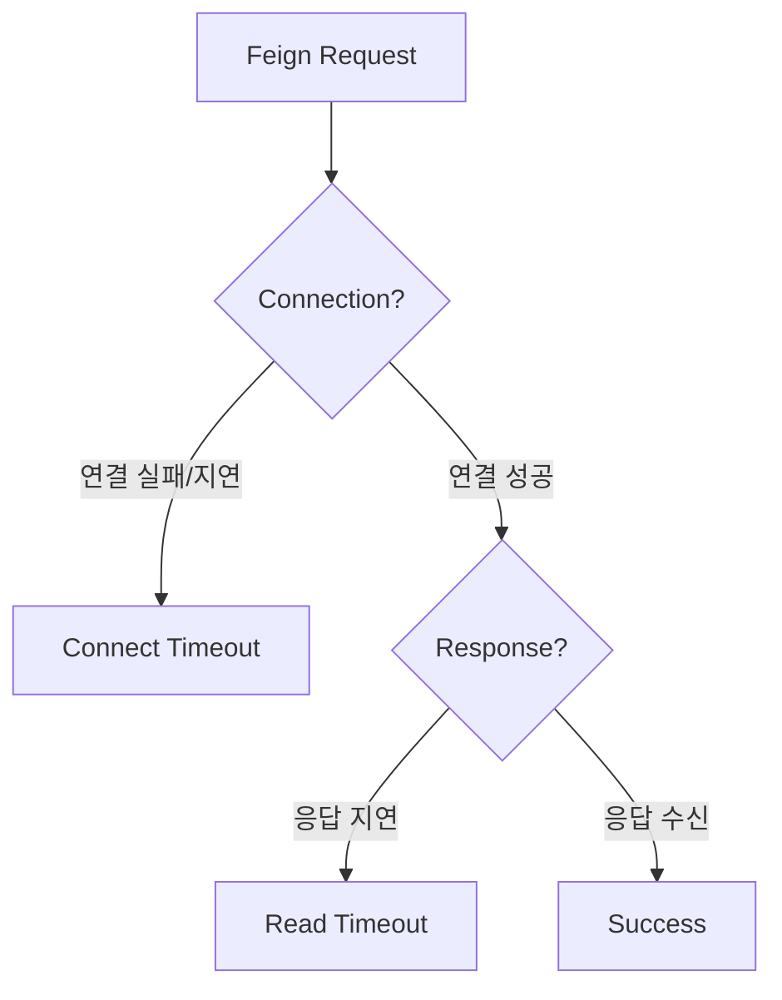
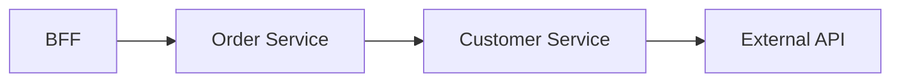
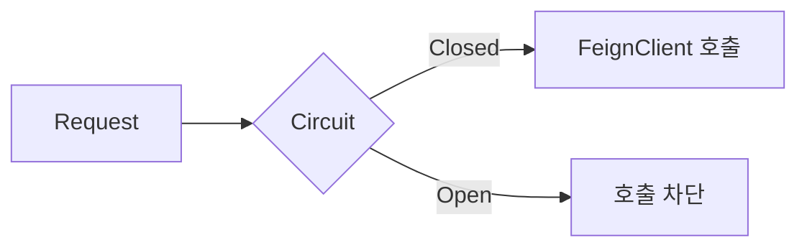

# Spring Cloud OpenFeign 동작 이해하기

MSA에서는 하나의 애플리케이션 안에서 모든 기능을 처리하지 않고 여러 서비스가 각자의 역할을 담당한다.

예를 들어 주문 서비스에서 고객 정보가 필요하다고 해보자.

```text
order-service
     ↓
customer-service
```

같은 Spring 애플리케이션 내부라면 다른 Service Bean을 주입받아서 호출할 수 있다.

```java
customerService.getCustomer(customerId);
```

하지만 MSA에서는 `order-service`와 `customer-service`가 서로 다른 애플리케이션이다.

각각 별도의 JVM과 Spring Container에서 실행되기 때문에 `customer-service`의 Bean을 `order-service`에서 직접 주입받을 수 없다.

따라서 서비스 간에는 HTTP와 같은 네트워크 통신이 필요하다.

Spring Cloud OpenFeign은 이러한 **서비스 간 HTTP 호출을 Java 인터페이스 형태로 작성할 수 있게 해주는 도구**다.

---

## @FeignClient

FeignClient는 다음과 같이 인터페이스로 정의할 수 있다.

```java
@FeignClient(
    name = "customer-api",
    url = "${feign.customer-api.url}"
)
public interface CustomerClient {

    @GetMapping("/customers/{customerId}")
    CustomerRes getCustomer(
        @PathVariable String customerId
    );
}
```

그러나 인터페이스만 있고 구현체는 보이지 않는다.

```java
CustomerRes getCustomer(String customerId);
```

메서드 선언만 있고 실제 구현 코드가 없으나, Service에서는 해당 인터페이스를 주입받아 사용할 수 있다.

```java
@Service
@RequiredArgsConstructor
public class OrderService {

    private final CustomerClient customerClient;

    public void createOrder(String customerId) {

        CustomerRes customer =
            customerClient.getCustomer(customerId);

        // ...
    }
}
```

구현체가 없는데 어떻게 메서드가 실행되는 걸까?

---

## FeignClient와 Proxy

`@FeignClient`가 붙은 인터페이스를 발견하면 Spring Cloud OpenFeign이 해당 인터페이스를 기반으로 **Proxy 객체를 생성하고 Spring Bean으로 등록한다.**

따라서 실제로 주입되는 것은 인터페이스 자체가 아니라 런타임에 생성된 Proxy 객체이다.

```text
OrderService
     ↓
CustomerClient
     ↓
Feign Proxy
```

Service에서

```java
customerClient.getCustomer(customerId);
```

를 호출하면 Proxy가 해당 호출을 가로챈다.

그리고 `@FeignClient`, `@GetMapping`, `@PathVariable` 등에 정의된 정보를 이용해 HTTP 요청을 만든다.

예를 들어 설정이

```yaml
feign:
  customer-api:
    url: http://customer-service
```

이고

```java
@GetMapping("/customers/{customerId}")
```

가 정의되어 있다면 실제로는 대략 다음과 같은 요청이 만들어진다.

```text
GET http://customer-service/customers/1234
```

즉 Java 코드에서는 일반 메서드를 호출한 것처럼 보이지만 실제로는 네트워크를 통해 다른 서비스의 API를 호출하고 있는 것이다.

---

## FeignClient 호출 흐름

전체적인 흐름을 보면 다음과 같다.



Feign Proxy는 HTTP 응답을 받아 JSON 등의 응답 데이터를 Java 객체로 변환하고, Service에는 `CustomerRes`를 반환한다.

그래서 호출하는 입장에서는

```java
CustomerRes customer =
    customerClient.getCustomer(customerId);
```

처럼 일반 Java 메서드를 호출하는 형태로 사용할 수 있다.

---

## @FeignClient의 name과 url

FeignClient를 보다 보면 보통 다음과 같은 설정을 볼 수 있다.

```java
@FeignClient(
    name = "customer-api",
    url = "${feign.customer-api.url}"
)
```

여기서 `name`은 FeignClient를 식별하기 위한 이름이고, `url`은 실제 요청을 보낼 대상 서비스의 주소다.

환경에 따라 호출 주소가 달라질 수 있기 때문에 URL은 코드에 직접 넣기보다 설정 파일로 분리하는 경우가 많다.

```yaml
feign:
  customer-api:
    url: http://customer-service
```

개발 환경과 운영 환경의 주소가 다르더라도 애플리케이션 코드는 그대로 유지하고 설정만 변경할 수 있다.

---

## RestTemplate과의 차이

FeignClient 없이도 다른 서비스를 HTTP로 호출할 수 있다.

예를 들어 직접 HTTP Client를 사용한다면 요청 URL을 만들고 HTTP Method, Header, 응답 타입 등을 직접 지정해야 한다.

FeignClient는 이 부분을 인터페이스 선언으로 추상화한다.

```java
@GetMapping("/customers/{customerId}")
CustomerRes getCustomer(@PathVariable String customerId);
```

호출하는 Service 입장에서는 HTTP 요청을 직접 만드는 코드가 사라지고 **어떤 API를 호출하는지 인터페이스 자체에 드러난다.**

---

## FeignClient와 HTTP 통신

FeignClient를 사용하면 코드상으로는 일반 메서드 호출처럼 보인다.

```java
customerClient.getCustomer(customerId);
```

하지만 같은 JVM 안에서 실행되는 일반적인 메서드 호출과 달리 중간에 실제 네트워크 통신이 존재한다.



따라서 호출 대상 서비스의 응답이 느려지거나 장애가 발생하면 현재 서비스도 영향을 받는다.

Spring MVC 기반 서버에서는 FeignClient의 응답을 기다리는 동안 요청을 처리하던 Thread도 함께 대기한다. 이런 요청이 계속 쌓이면 사용할 수 있는 Thread가 줄어들고, 다른 정상적인 요청의 처리까지 느려질 수 있다.

```text
Downstream Service 응답 지연
        ↓
FeignClient 응답 대기
        ↓
요청 처리 Thread 점유
        ↓
대기 요청 증가
        ↓
현재 Service까지 응답 지연
```

즉 FeignClient를 단순히 다른 Service의 메서드를 호출하는 기능으로 보기보다는, **다른 서비스의 HTTP API를 Java 인터페이스 형태로 호출할 수 있게 추상화한 Client**라고 이해하는 것이 더 정확하다.

---

## Timeout 설정

서비스 간 호출에서 한 서비스의 지연이 다른 서비스로 계속 전파되지 않도록 Timeout 설정이 필요하다.

FeignClient에서는 크게 Connect Timeout과 Read Timeout을 생각할 수 있다.

```text
Connect Timeout
→ 대상 서버와 연결을 맺기까지 기다리는 시간

Read Timeout
→ 연결 이후 응답을 기다리는 시간
```

대상 서버와 연결 자체가 지연된다면 Connect Timeout이 발생할 수 있고, 연결은 되었지만 서버의 처리가 오래 걸린다면 Read Timeout이 발생할 수 있다.



Timeout을 너무 길게 설정하면 장애 상황에서 Thread가 오랫동안 대기할 수 있고, 너무 짧게 설정하면 정상적으로 처리될 요청까지 실패할 수 있다.

따라서 호출하는 API의 특성과 평소 응답 시간을 기준으로 적절한 값을 설정해야 한다.

---

## Retry와 멱등성

Timeout이나 일시적인 네트워크 오류가 발생했을 때 Retry를 통해 요청을 다시 시도할 수 있다.

하지만 모든 요청을 무조건 Retry하는 것은 안전하지 않다.

예를 들어 데이터를 저장하는 API를 호출했다고 해보자.

```http
POST /orders
```

서버에서는 INSERT까지 정상적으로 완료했지만 응답을 전달하는 과정에서 Timeout이 발생할 수 있다.

```text
1차 요청 → INSERT 성공 → 응답 Timeout
2차 요청 → Retry → INSERT 재실행
```

호출한 쪽에서는 첫 번째 요청이 실패한 것처럼 보이기 때문에 동일한 요청을 다시 보내게 되고, 서버에서는 같은 작업이 중복으로 실행될 수 있다.

따라서 Retry를 적용할 때는 **해당 요청을 다시 실행해도 안전한지**를 함께 고려해야 한다.

이때 같이 등장하는 개념이 멱등성(Idempotency)이다. 같은 요청을 여러 번 수행해도 결과가 동일하도록 설계되어 있다면 Retry를 비교적 안전하게 적용할 수 있다.

---

## 장애 전파와 Circuit Breaker

MSA에서는 하나의 요청이 여러 서비스를 거쳐 처리되는 경우가 많다.



여기서 External API의 응답이 느려지면 Customer Service가 응답을 기다리고, 이를 호출한 Order Service와 BFF도 차례로 영향을 받을 수 있다.

```text
External API 장애
       ↓
Customer Service 지연
       ↓
Order Service 지연
       ↓
BFF 지연
       ↓
사용자 요청 지연
```

이처럼 Downstream Service의 문제가 상위 서비스로 연쇄적으로 전파될 수 있다.

이미 장애가 발생해 계속 실패하고 있는 서비스를 매 요청마다 호출하는 것도 비효율적이다. 매번 Timeout이 발생할 때까지 기다리면 Thread와 Connection 같은 리소스가 계속 사용되기 때문이다.

이때 사용할 수 있는 방법 중 하나가 Circuit Breaker다.

Circuit Breaker는 일정 수준 이상 실패가 발생하면 해당 서비스에 대한 호출을 일시적으로 차단한다.



정상 상태에서는 요청을 전달하지만 실패가 반복되면 Circuit을 Open하여 실제 HTTP 호출을 막는다. 이후 일정 시간이 지나면 일부 요청을 다시 보내 대상 서비스가 복구되었는지 확인하고, 정상 상태가 확인되면 다시 호출을 허용할 수 있다.

Spring 환경에서는 Resilience4j와 같은 라이브러리를 이용해 Circuit Breaker를 적용할 수 있다.

---

## FeignClient 사용 시 고려사항

FeignClient의 사용법 자체는 단순하다.

```java
customerClient.getCustomer(customerId);
```

하지만 이 한 줄 뒤에서는 실제 네트워크 통신이 발생한다.

따라서 FeignClient를 사용할 때는 인터페이스를 어떻게 정의할지만 보는 것이 아니라 **Timeout, Retry와 멱등성, 장애 전파와 같은 네트워크 통신의 특성까지 함께 고려해야 한다.**

FeignClient는 서비스 간 HTTP 통신을 편하게 만들어주는 Client이지, 네트워크 통신에서 발생할 수 있는 문제까지 없애주는 것은 아니다.
