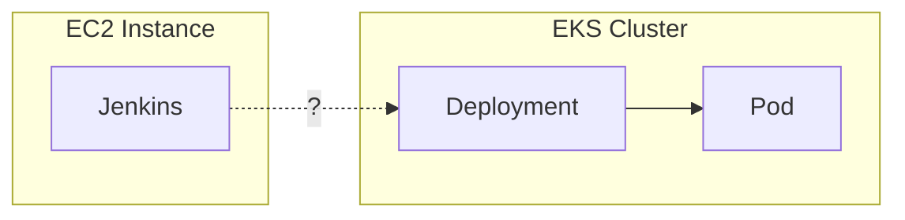
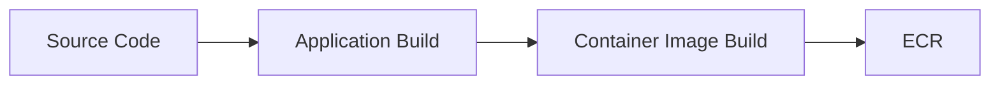
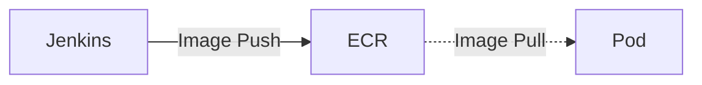
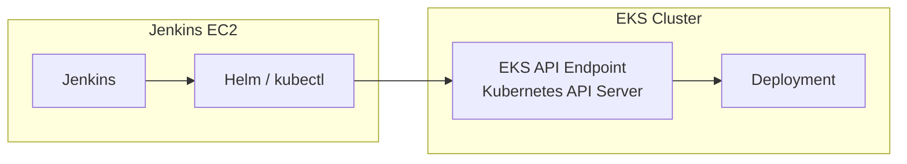
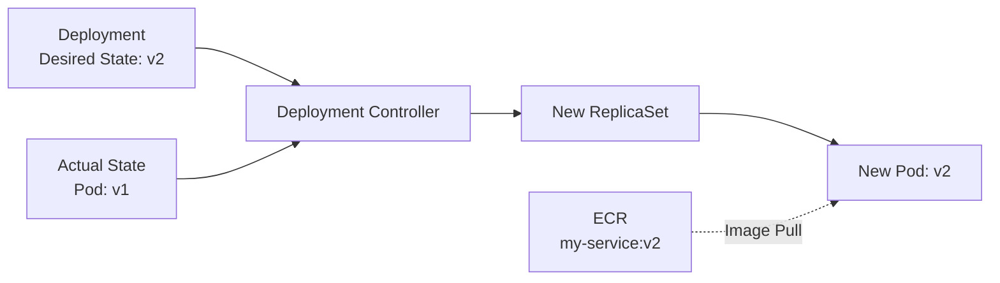
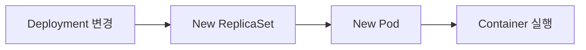
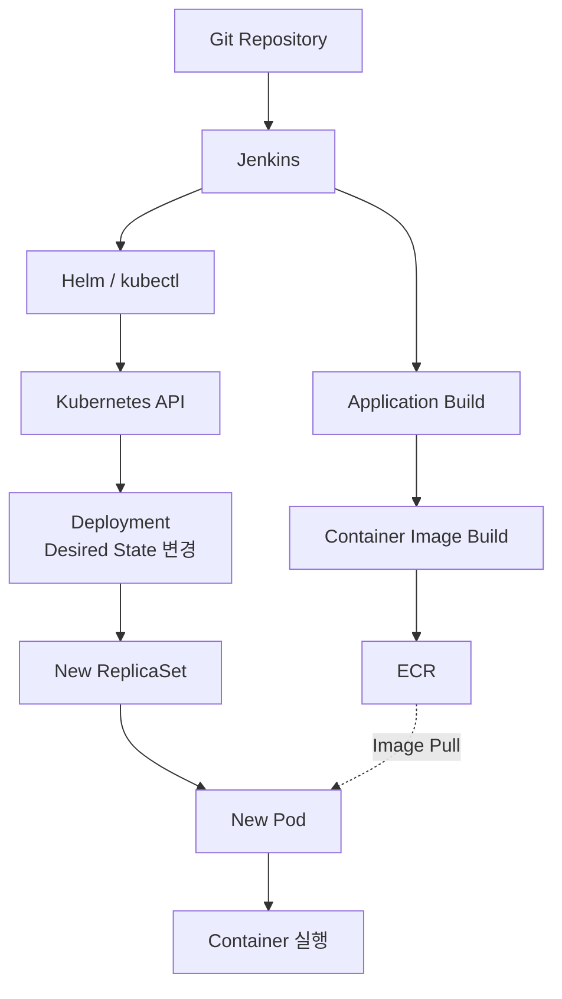

# Kubernetes 서비스 배포 흐름 이해하기

Kubernetes 기반의 서비스를 운영하면서 Jenkins를 통해 개발 환경에 애플리케이션을 배포할 일이 많았다.

개발한 코드를 Push하고 Jenkins Pipeline을 실행하면 빌드가 진행되고, 잠시 뒤 EKS의 Pod가 새로운 버전으로 교체된다.

처음에는 이를 단순히

```text
Jenkins
   ↓
EKS 배포
```

정도로 이해하고 있었다.

그런데 실제 인프라 구조를 보다 보니 한 가지가 잘 이해되지 않았다.

**Jenkins는 별도의 EC2 Instance에서 실행되고 있는데, 어떻게 EKS 안의 Pod를 변경할 수 있는 것일까?**



처음에는 Jenkins가 빌드한 애플리케이션을 EKS에 직접 전달하는 것처럼 생각했다.

하지만 실제 배포 흐름을 따라가 보니 조금 달랐다.

Jenkins가 하는 일과 Kubernetes가 하는 일은 분리되어 있었고, Container Image 역시 Jenkins에서 Pod로 직접 전달되는 구조가 아니었다.

이 글에서는 Jenkins에서 배포를 시작했을 때 **Application이 Container Image로 빌드되고, 해당 Image가 Kubernetes에서 실제 Pod로 실행되기까지의 과정**을 따라가 보고자 한다.

---

## Jenkins는 실제로 무엇을 하는 걸까?

먼저 Jenkins 자체를 보면 특별한 배포 장비가 있는 것은 아니다.

예를 들어 Jenkins Controller가 별도의 EC2 Instance에서 실행되는 구조를 생각해볼 수 있다.

Jenkins는 Pipeline에 정의된 작업을 순서대로 실행한다.

```bash
./gradlew build

docker build ...

docker push ...

helm upgrade ...
```

환경에 따라 실제 작업은 Jenkins Controller가 아니라 별도의 Jenkins Agent에서 수행될 수도 있다.

중요한 것은 Jenkins가 EKS 내부에 있기 때문에 배포할 수 있는 것이 아니라는 점이다.

Jenkins의 역할은 **빌드와 배포에 필요한 작업을 Pipeline에 정의된 순서대로 실행하는 것**이다.

그렇다면 Jenkins가 빌드한 애플리케이션은 실제로 어디로 전달되는 것일까?

---

## Container Image는 어떻게 전달될까?

Jenkins는 먼저 Source Code를 빌드하고 Container Image를 만든다.



생성된 Image를 EKS의 Pod에 직접 복사하는 것은 아니다.

Image는 ECR과 같은 Container Registry에 Push된다.

예를 들어 배포마다 다음과 같은 Image가 만들어질 수 있다.

```text
my-service:20260816-a1b2c3
my-service:20260816-d4e5f6
```

이 시점에는 아직 새로운 버전의 애플리케이션이 실행된 것이 아니다.

**Kubernetes가 가져가서 실행할 Container Image가 Registry에 준비된 상태**다.

이후 새로운 Pod가 생성되면 Pod는 자신의 Spec에 지정된 Image를 ECR에서 Pull하여 실행한다.



즉 Image의 흐름만 놓고 보면

```text
Jenkins → Pod
```

가 아니라

```text
Jenkins → ECR → Pod
```

의 구조다.

여기서 처음 생각했던 것과 하나의 차이가 생긴다.

**Jenkins가 빌드한 애플리케이션을 Pod에 직접 전달하는 것이 아니다.**

그렇다면 Jenkins는 EKS에 무엇을 전달하고 있는 것일까?

---

## EKS 밖의 Jenkins는 어떻게 Deployment를 변경할까?

Jenkins는 `Helm`이나 `kubectl`을 이용해 Kubernetes의 Deployment를 변경할 수 있다.

이것이 가능한 이유는 Kubernetes가 **API를 통해 클러스터의 상태를 관리하기 때문**이다.

`kubectl`과 `Helm` 역시 Kubernetes API를 사용하는 Client다.



따라서 Jenkins와 EKS가 같은 서버에 있을 필요는 없다.

Jenkins가 실행되는 환경에서 **EKS API Endpoint에 접근할 수 있고, Kubernetes 인증을 거쳐 필요한 Resource를 변경할 권한이 있다면** EKS 외부에서도 Deployment를 변경할 수 있다.

AWS 환경에서는 IAM을 이용한 인증과 Kubernetes 측의 권한 설정 등이 함께 관여할 수 있다.

결국 처음 가졌던

> EC2에서 실행되는 Jenkins가 어떻게 EKS를 변경하지?

라는 의문의 핵심은 Jenkins와 EKS의 물리적인 위치가 아니었다.

**Jenkins가 Kubernetes API에 접근할 수 있는가**의 문제였다.

그렇다면 Kubernetes API를 통해 Jenkins가 실제로 변경하는 것은 무엇일까?

---

## Jenkins가 변경하는 것은 Pod가 아니라 Desired State다

현재 Deployment가 다음 Image를 사용하고 있다고 해보자.

```text
Deployment
└── image: my-service:v1
```

새로운 Image가 ECR에 준비되면 Jenkins는 `Helm`이나 `kubectl`을 이용해 Deployment가 새로운 Image를 사용하도록 변경한다.

```text
Before
image: my-service:v1

After
image: my-service:v2
```

여기서 중요한 점은 Jenkins가 새로운 Pod를 직접 생성하는 것이 아니라는 것이다.

Jenkins가 변경하는 것은 **Kubernetes가 유지해야 하는 Desired State**다.

```text
기존 Desired State
→ my-service:v1

새로운 Desired State
→ my-service:v2
```

즉 Jenkins는

```text
"새로운 Pod를 만들어라."
```

라고 직접 명령하는 것이 아니라,

```text
"이 Deployment는 이제 v2를 실행해야 한다."
```

라는 새로운 상태를 Kubernetes에 전달한다.

여기까지 보면 Jenkins의 역할은 명확해진다.

```text
Container Image
→ ECR에 Push

Deployment 상태
→ Kubernetes API를 통해 변경
```

그렇다면 Jenkins가 Pod를 직접 만드는 것이 아니라면 **실제 새로운 Pod는 누가 만드는 것일까?**

---

## Kubernetes는 어떻게 새로운 Pod를 만들어낼까?

Deployment는 이미 `v2`를 실행하도록 변경되었지만, 현재 실행 중인 Pod는 아직 `v1`일 수 있다.

```text
Desired State
→ my-service:v2

Actual State
→ my-service:v1
```

Kubernetes의 Controller는 선언된 상태와 현재 상태를 지속적으로 비교한다.

그리고 두 상태에 차이가 있다면 실제 상태가 선언된 상태에 맞도록 필요한 작업을 수행한다.

이러한 제어 과정을 **Reconciliation**이라고 한다.

Deployment의 Pod Template이 변경된 경우에는 새로운 ReplicaSet이 만들어지고, 해당 ReplicaSet을 통해 새로운 Pod가 생성된다.



새로운 Pod는 자신의 Spec에 지정된 Image를 ECR에서 Pull하고 Container를 실행한다.

여기까지 따라오면 Jenkins와 Kubernetes의 역할을 구분할 수 있다.

```text
Jenkins
→ 새로운 Desired State를 전달

Kubernetes
→ Actual State를 Desired State에 맞춤
```

처음에는 Jenkins가 애플리케이션을 EKS에 직접 배포한다고 생각했지만, 실제로는 **Jenkins가 상태 변경의 시작점을 만들고 Kubernetes가 그 상태를 실제 실행 환경에 반영하는 구조**였다.

그렇다면 여기서 한 가지 질문이 더 생긴다.

Jenkins가 상태 변경 요청까지 정상적으로 수행했다면 배포가 완료됐다고 볼 수 있을까?

---

## 배포 명령의 성공이 배포 완료를 의미할까?

예를 들어 Jenkins Pipeline에서 다음 명령이 정상적으로 실행되었다고 해보자.

```bash
helm upgrade ...
```

이는 Kubernetes에 Deployment 변경 요청이 정상적으로 반영되었다는 의미일 수 있다.

하지만 실제 Pod가 새로운 버전으로 변경되는 과정은 그 이후에도 이어진다.



따라서 **Deployment의 변경이 반영된 시점과 새로운 버전의 Rollout이 완료된 시점은 서로 다를 수 있다.**

예를 들어 Deployment는 정상적으로 변경되었지만 새로운 Pod가 정상적으로 실행되지 못할 수도 있다.

필요하다면 Pipeline에서 다음과 같이 Rollout 상태까지 확인할 수 있다.

```bash
kubectl rollout status deployment/my-service
```

결국 Jenkins가 Kubernetes에 새로운 Desired State를 전달하는 것과 Kubernetes가 실제로 그 상태에 도달하는 것은 서로 다른 단계다.

따라서 CI/CD Pipeline에서는 **어디까지 확인했을 때 배포가 성공했다고 판단할 것인가**도 하나의 설계 요소가 된다.

---

## 정리

처음에는 Jenkins에서 Pipeline을 실행하면 다음과 같이 애플리케이션이 EKS로 전달되는 구조라고 막연하게 생각했다.

```text
Jenkins
   ↓
Application
   ↓
EKS
   ↓
Pod
```

하지만 내부 흐름을 하나씩 따라가 보니 실제 구조는 달랐다.



하나의 Jenkins Pipeline 안에서 실행되기 때문에 하나의 배포 과정처럼 보이지만, 내부에서는 역할이 분리되어 있다.

**Container Image는 Jenkins에서 ECR로 Push되고, Kubernetes에는 API를 통해 새로운 Desired State가 전달된다.**

그 이후 Kubernetes가 새로운 ReplicaSet과 Pod를 만들고, Pod가 ECR에서 Image를 Pull하면서 두 흐름이 다시 연결된다.

결국 Kubernetes 환경에서의 배포는 **애플리케이션 파일을 특정 서버로 직접 전달하는 작업이라기보다, 실행할 Artifact를 준비하고 클러스터가 유지해야 할 상태를 새로운 버전으로 변경하는 과정**에 가깝다.

이 구조를 이해하고 나니 처음 가졌던

> Jenkins는 별도의 EC2 Instance에서 실행되고 있는데, 어떻게 EKS 안의 Pod를 변경할 수 있는 것일까?

라는 질문도 조금 다르게 보였다.

중요한 것은 Jenkins와 EKS가 어디에 위치하는지가 아니라 **Jenkins가 Kubernetes API를 통해 어떤 상태를 변경하고, 그 이후 실제 실행 상태를 누가 만들어내는가**였다.

처음에는 하나의 **"Jenkins 배포"**로 보였지만 추상화를 한 단계 벗겨보면 역할은 명확하게 나뉜다.

**Jenkins는 배포 과정을 실행하고, ECR은 실행할 Container Image를 보관하며, Kubernetes는 선언된 상태를 실제 실행 상태로 만든다.**

이 역할을 구분해서 보는 것이 Kubernetes 기반 CI/CD의 배포 흐름을 이해하는 데 가장 중요한 관점이었다.
