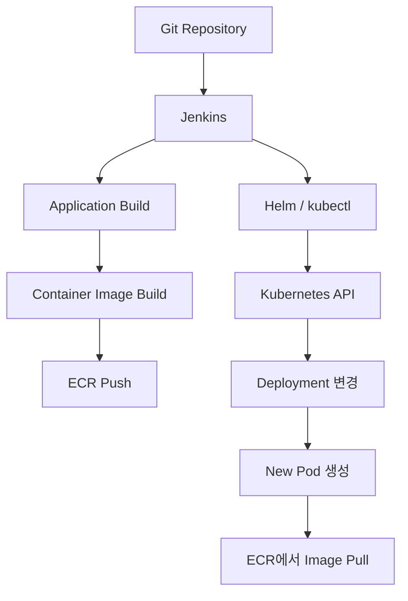
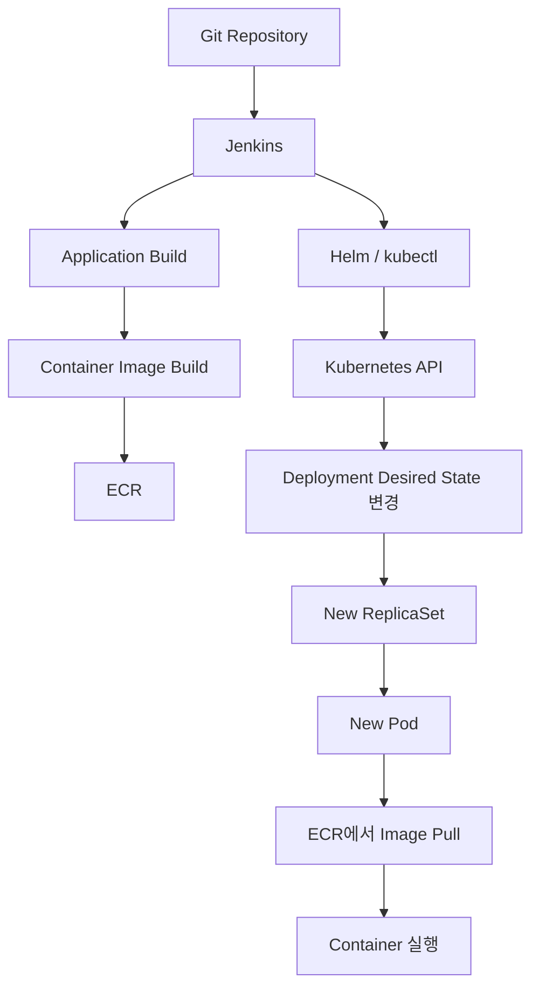

---

layout: post
title: "Kubernetes 애플리케이션 배포 흐름 이해하기"
date: 2026-08-16
categories: [CI/CD]
---

# Kubernetes 애플리케이션 배포 흐름 이해하기

Kubernetes 환경에서 Jenkins를 이용해 배포하면 하나의 Pipeline 안에서 빌드부터 배포까지 모두 처리된다.

하지만 실제 구성요소를 보면 Jenkins와 애플리케이션이 실행되는 위치는 분리되어 있을 수 있다.

```text
EC2
└── Jenkins

EKS Cluster
└── Deployment
    └── Pod
```

Jenkins는 EC2에서 실행되고 있지만 실제 애플리케이션은 EKS의 Pod에서 실행된다.

그렇다면 EC2에서 실행되는 Jenkins는 어떻게 EKS에 새로운 버전의 애플리케이션을 배포하는 것일까?

이 흐름을 이해하려면 Jenkins가 애플리케이션을 Kubernetes에 직접 전달한다고 보기보다, **실행할 Artifact를 준비하는 과정과 Kubernetes의 실행 상태를 변경하는 과정**을 분리해서 볼 필요가 있다.

---

## Jenkins는 배포 과정을 실행한다

Jenkins도 결국 특정 서버에서 실행되는 애플리케이션이다.

예를 들어 EC2에 Jenkins Controller가 구성되어 있다면 다음과 같은 형태가 된다.

```text
EC2 Instance
└── Jenkins
```

Jenkins Pipeline에서는 빌드와 배포에 필요한 작업을 순서대로 실행한다.

```bash
./gradlew build

docker build ...

docker push ...

helm upgrade ...
```

환경에 따라 실제 작업은 Jenkins Controller가 아니라 별도의 Jenkins Agent에서 수행될 수도 있다.

중요한 것은 Jenkins가 Kubernetes의 일부이기 때문에 배포할 수 있는 것이 아니라는 점이다.

Jenkins는 **Container Image를 Registry에 저장하고 Kubernetes API에 새로운 배포 상태를 전달하는 CI/CD 실행 주체**이다.

---

## 배포를 두 개의 흐름으로 나눠보기

Jenkins 기반 Kubernetes 배포는 크게 두 가지 흐름으로 나눌 수 있다.

첫 번째는 **실행할 Artifact를 준비하는 과정**이다.

```text
Source Code
    ↓
Application Build
    ↓
Container Image Build
    ↓
ECR Push
```

두 번째는 **Kubernetes가 어떤 버전의 애플리케이션을 실행해야 하는지 변경하는 과정**이다.

```text
Jenkins
    ↓
Helm / kubectl
    ↓
Kubernetes API
    ↓
Deployment 변경
```

Jenkins Pipeline에서는 보통 Image를 생성해 ECR에 Push한 뒤, Deployment가 해당 Image를 사용하도록 변경한다.

전체 흐름을 연결하면 다음과 같다.



여기서 중요한 점은 **Container Image와 배포 명령이 서로 다른 경로로 전달된다는 것**이다.

Image는 ECR에 저장되고, Kubernetes에는 어떤 Image를 실행할 것인지에 대한 상태 변경이 전달된다.

---

## Container Image는 ECR에 저장된다

먼저 Jenkins는 Source Code를 빌드한 뒤 애플리케이션을 Container Image로 만든다.

```text
Source Code
    ↓
Application Build
    ↓
Container Image
```

생성된 Image를 EKS의 Pod에 직접 전달하는 것은 아니다.

Image는 ECR과 같은 Container Registry에 Push된다.

```text
Jenkins
   │
   │ docker push
   ▼
ECR
```

예를 들어 배포마다 다음과 같이 새로운 Image를 생성할 수 있다.

```text
my-service:20260816-a1b2c3
my-service:20260816-d4e5f6
```

이 시점에는 아직 새로운 버전이 EKS에서 실행되고 있는 것이 아니다.

Kubernetes가 실행할 수 있는 **배포 Artifact가 Registry에 준비된 상태**다.

여기서 Image Tag에 Commit SHA나 Build Number처럼 배포 버전을 식별할 수 있는 값을 사용하면 Source Code와 실제 배포 Artifact를 연결할 수 있다.

```text
Git Commit
    ↓
Container Image
    ↓
Image Tag
    ↓
Deployment
```

CI/CD에서 Image는 단순히 애플리케이션을 Container로 만든 결과물이 아니라 **어떤 코드를 실제 환경에 배포했는지 추적할 수 있는 배포 단위**가 된다.

---

## Jenkins는 어떻게 EKS를 변경할까?

Image가 준비되었다면 다음 단계는 Kubernetes가 새로운 Image를 사용하도록 변경하는 것이다.

Jenkins와 EKS는 서로 다른 환경에 존재할 수 있다.

```text
EC2
└── Jenkins

       ↓

EKS Cluster
└── Deployment
```

Jenkins가 EKS 내부에서 실행되지 않더라도 Deployment를 변경할 수 있는 이유는 Kubernetes가 **API를 통해 클러스터의 상태를 관리하기 때문**이다.

`kubectl`과 `Helm` 역시 Kubernetes API를 사용하는 Client다.

```text
Jenkins
   │
   │ Helm / kubectl
   ▼
EKS API Endpoint
   │
   ▼
Kubernetes API Server
   │
   ▼
Deployment
```

따라서 Jenkins가 EKS에 배포하기 위해 중요한 것은 같은 서버나 같은 클러스터에 존재하는지가 아니다.

```text
Jenkins
 ├── EKS API Endpoint에 대한 Network 접근
 ├── Kubernetes 인증
 └── 필요한 Resource를 변경할 수 있는 권한
```

AWS 환경에서는 IAM을 이용한 인증과 Kubernetes 권한 설정 등이 함께 관여할 수 있다.

결국 Jenkins가 어디에서 실행되는가보다 **Kubernetes API에 접근할 수 있고 필요한 상태를 변경할 권한이 있는가**가 중요하다.

---

## Jenkins가 변경하는 것은 Pod가 아니라 Desired State다

현재 운영 중인 Deployment가 다음 Image를 사용한다고 해보자.

```text
Deployment
└── image: my-service:v1
```

새로운 Image가 ECR에 Push되면 Jenkins는 `Helm`이나 `kubectl`을 이용해 Deployment가 새로운 Image를 사용하도록 변경한다.

```text
Before

image: my-service:v1


After

image: my-service:v2
```

이 변경은 Kubernetes API를 통해 전달된다.

```text
Jenkins
   ↓
Helm / kubectl
   ↓
Kubernetes API
   ↓
Deployment Spec 변경
```

여기서 Jenkins가 새로운 Pod를 직접 생성하는 것은 아니다.

Jenkins가 변경하는 것은 **Kubernetes가 유지해야 할 원하는 상태(Desired State)**다.

```text
기존 Desired State

my-service:v1


새로운 Desired State

my-service:v2
```

이 지점부터 실제 실행 상태를 변경하는 것은 Kubernetes의 역할이다.

---

## Kubernetes는 실제 상태를 Desired State에 맞춘다

Deployment에는 `v2`를 실행하도록 선언되어 있지만 현재 실행 중인 Pod는 아직 `v1`일 수 있다.

```text
Desired State
→ my-service:v2

Actual State
→ my-service:v1
```

Kubernetes Controller는 선언된 상태와 현재 상태를 지속적으로 비교하고, 차이가 있다면 실제 상태를 선언된 상태에 맞춘다.

이 과정을 **Reconciliation**이라고 한다.

Deployment의 Pod Template이 변경되면 새로운 ReplicaSet이 생성되고, 새로운 ReplicaSet을 통해 새로운 Pod가 만들어진다.

```text
Deployment
    ↓
New ReplicaSet
    ↓
New Pod
```

새로운 Pod는 자신의 Spec에 정의된 Image를 Registry에서 가져와 실행한다.

```text
New Pod
   ↓
ECR
   ↓
my-service:v2 Pull
   ↓
Container 실행
```

따라서 배포 과정에서 Jenkins와 Kubernetes의 책임은 명확하게 나뉜다.

```text
Jenkins
→ 새로운 Desired State를 전달

Kubernetes
→ Actual State를 Desired State에 맞춤
```

이 구분이 Kubernetes 배포를 이해하는 핵심이다.

---

## Kubernetes의 배포는 기존 Pod를 수정하지 않는다

여기서 기존 서버 방식의 배포와 Kubernetes 배포의 차이가 드러난다.

전통적인 서버 배포에서는 서버에 새로운 JAR이나 실행 파일을 복사하고 기존 프로세스를 재시작하는 방식을 사용할 수 있다.

```text
Server
   ↓
새로운 JAR 복사
   ↓
기존 Process 재시작
```

Kubernetes의 Deployment는 기존 Pod 내부의 애플리케이션을 새로운 버전으로 덮어쓰지 않는다.

새로운 Pod Template을 기준으로 **새로운 Pod를 만들고 기존 Pod를 교체한다.**

Replica가 3개인 Deployment를 예로 들면 기존 상태는 다음과 같다.

```text
v1
v1
v1
```

새로운 버전을 배포하면 RollingUpdate를 통해 점진적으로 Pod가 교체될 수 있다.

```text
v1
v1
v2
```

```text
v1
v2
v2
```

최종적으로 새로운 상태에 도달한다.

```text
v2
v2
v2
```

즉 Kubernetes에서 배포는 **기존 실행 환경을 수정하는 작업보다 새로운 실행 인스턴스를 만들고 전체 상태를 새로운 버전으로 수렴시키는 과정**에 가깝다.

앞에서 살펴본 Desired State와 Reconciliation이 실제 배포 방식으로 이어지는 지점이다.

---

## 배포 요청과 실제 배포 완료는 구분할 필요가 있다

Jenkins에서 다음 명령이 성공했다고 해보자.

```bash
helm upgrade ...
```

이는 Kubernetes에 Deployment 변경 요청이 정상적으로 반영되었다는 의미일 수 있다.

하지만 Kubernetes에서는 그 이후에 새로운 ReplicaSet과 Pod를 생성하고 실제 실행 상태를 변경하는 과정이 이어진다.

```text
Jenkins
   ↓
Deployment 변경 성공
   ↓
New ReplicaSet
   ↓
New Pod
   ↓
Container 실행
```

따라서 **배포 명령의 성공과 새로운 버전의 Rollout 완료는 서로 다른 시점**이다.

CI/CD Pipeline에서는 필요에 따라 다음과 같이 Deployment의 Rollout이 실제로 완료되는지 확인할 수 있다.

```bash
kubectl rollout status deployment/my-service
```

이는 앞에서 Jenkins와 Kubernetes의 책임을 나누어 본 것과도 연결된다.

Jenkins는 상태 변경을 요청하고, Kubernetes는 실제 상태를 변경한다.

따라서 Pipeline에서 어디까지를 **배포 성공**으로 판단할 것인지도 CI/CD를 구성할 때 생각해야 할 부분이다.

---

## 전체 흐름 다시 보기

지금까지의 과정을 하나로 연결하면 다음과 같다.



각 구성요소의 책임을 나누어 보면 전체 배포 과정이 더 명확해진다.

```text
Jenkins
→ CI/CD Pipeline 실행
→ Container Image 생성 및 Push
→ Deployment 상태 변경 요청

ECR
→ 배포할 Container Image 저장

Kubernetes API
→ 클러스터 상태 변경의 진입점

Deployment / Controller
→ Desired State 관리
→ Actual State와의 차이 조정

ReplicaSet
→ 필요한 수의 Pod 유지

Pod
→ 지정된 Image를 기반으로 애플리케이션 실행
```

Jenkins에서 하나의 Pipeline을 실행하지만 실제로는 **Artifact를 전달하는 흐름과 실행 상태를 변경하는 흐름이 분리되어 있고**, Kubernetes 내부에서는 선언된 상태를 기준으로 실제 실행 환경이 변경된다.

---

## 정리

처음에는 Jenkins에서 배포를 실행하면 Jenkins가 애플리케이션을 EKS의 Pod로 직접 전달한다고 생각하기 쉽다.

하지만 전체 흐름을 따라가 보면 실제 구조는 다르다.

첫 번째로 Jenkins는 Source Code를 Container Image로 만들고 ECR에 저장한다.

```text
Source Code
    ↓
Jenkins
    ↓
Container Image
    ↓
ECR
```

두 번째로 Kubernetes에는 새로운 Image를 사용하도록 Desired State를 변경한다.

```text
Jenkins
    ↓
Kubernetes API
    ↓
Deployment
    ↓
Desired State 변경
```

그 이후 실제 실행 상태를 변경하는 것은 Kubernetes다.

```text
Desired State 변경
        ↓
Reconciliation
        ↓
New ReplicaSet
        ↓
New Pod
        ↓
Image Pull
        ↓
새로운 버전 실행
```

따라서 Kubernetes 환경의 배포를 이해할 때는 **"애플리케이션을 어느 서버에 전달하는가"보다 "어떤 Artifact를 실행하도록 클러스터의 상태를 변경하는가"라는 관점이 더 중요하다.**

이 관점으로 보면 몇 가지가 자연스럽게 연결된다.

Jenkins가 EKS 외부의 EC2에서 실행되어도 Kubernetes API에 접근할 수 있다면 배포할 수 있다.

Container Image는 Jenkins에서 Pod로 직접 전달되는 것이 아니라 Registry를 통해 전달된다.

새로운 버전의 배포는 기존 Pod를 수정하는 것이 아니라 새로운 Pod를 만들고 기존 Pod를 교체하는 방식으로 이루어진다.

그리고 Jenkins에서 배포 명령이 성공한 시점과 Kubernetes가 실제로 새로운 상태에 도달한 시점도 구분할 수 있다.

결국 Jenkins, ECR, EKS는 하나의 배포 시스템처럼 보이지만 각각의 책임은 다르다.

**Jenkins는 배포 과정을 자동화하고, ECR은 실행할 Artifact를 보관하며, Kubernetes는 선언된 상태를 실제 실행 상태로 만든다.**

이 역할을 분리해서 이해하는 것이 Kubernetes 기반 CI/CD의 전체 흐름을 이해하는 출발점이다.
