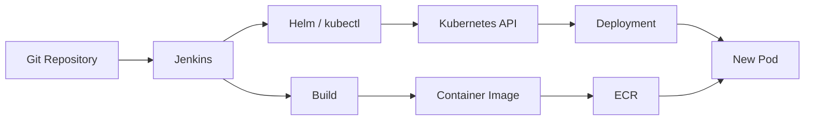
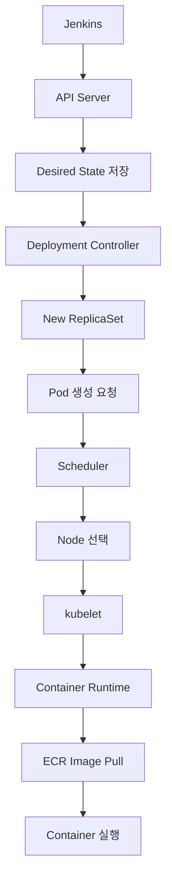
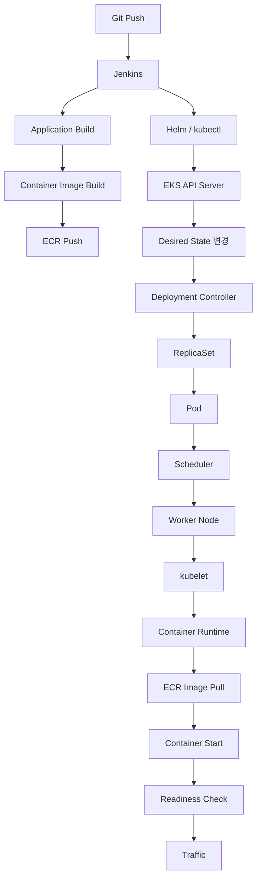

---

layout: post
title: "Kubernetes 애플리케이션 배포 흐름 이해하기"
date: 2026-08-16
categories: [CI/CD]
---

# Kubernetes 애플리케이션 배포 흐름 이해하기

Kubernetes 환경에서 Jenkins를 이용해 배포하면 하나의 Pipeline 안에서 빌드부터 배포까지 모두 처리된다.

하지만 실제 구성요소를 보면 Jenkins와 애플리케이션이 실행되는 위치는 분리되어 있을 수 있다.

```text
EC2
└── Jenkins

EKS Cluster
└── Deployment
    └── Pod
```

Jenkins는 EC2에서 실행되고 있지만 애플리케이션은 EKS의 Pod에서 실행된다.

그렇다면 EC2에서 실행되는 Jenkins는 어떻게 EKS의 애플리케이션을 배포하고, Kubernetes 내부에서는 실제로 어떤 일이 일어날까?

---

## Jenkins는 배포를 실행하는 주체다

Jenkins도 결국 특정 서버에서 실행되는 애플리케이션이다.

예를 들어 EC2에 Jenkins Controller를 구성했다면 다음과 같은 형태가 된다.

```text
EC2 Instance
└── Jenkins
```

Pipeline은 Jenkins에 정의된 빌드와 배포 작업을 자동으로 실행한다.

```bash
./gradlew build

docker build ...

docker push ...

helm upgrade ...
```

실제 환경에서는 Jenkins Controller가 직접 모든 작업을 수행하기보다 별도의 Jenkins Agent에서 Pipeline을 실행하도록 구성할 수도 있다.

중요한 것은 Jenkins가 Kubernetes의 일부이기 때문에 배포할 수 있는 것이 아니라는 점이다.

Jenkins는 **Container Registry와 Kubernetes API에 접근할 수 있는 외부 배포 주체**에 가깝다.

---

## 배포는 두 개의 흐름으로 나뉜다

전체 배포 과정은 크게 두 개의 흐름으로 나눌 수 있다.

첫 번째는 **실행할 Container Image를 만드는 과정**이다.

```text
Source Code
    ↓
Build
    ↓
Docker Image
    ↓
ECR
```

두 번째는 **Kubernetes가 어떤 Image를 실행해야 하는지 변경하는 과정**이다.

```text
Jenkins
    ↓
Helm / kubectl
    ↓
Kubernetes API
    ↓
Deployment 변경
```

즉 Jenkins가 빌드된 애플리케이션 파일을 Pod에 직접 복사하는 것이 아니다.

Jenkins는 Image를 Registry에 Push하고 Kubernetes에는 새로운 Image를 사용하도록 선언한다.



이 두 흐름이 Pipeline 안에서 연속적으로 실행되기 때문에 하나의 배포 과정처럼 보이는 것이다.

---

## Jenkins에서 EKS까지

Jenkins가 EKS 외부의 EC2에서 실행되고 있어도 Kubernetes 리소스를 변경할 수 있다.

`kubectl`이나 Helm 역시 결국 Kubernetes API를 호출하는 Client이기 때문이다.

```text
Jenkins
   │
   │ Helm / kubectl
   ▼
EKS API Endpoint
   │
   ▼
Kubernetes API Server
```

따라서 Jenkins가 EKS에 배포하기 위해 중요한 것은 물리적으로 같은 서버에 존재하는지가 아니다.

다음과 같은 조건이 필요하다.

```text
Jenkins
 ├── EKS API Endpoint에 대한 Network 접근
 ├── AWS IAM 기반 인증
 └── Kubernetes Resource에 대한 권한
```

즉 배포 권한은 단순히 `kubectl`이 설치되어 있다고 생기는 것이 아니다.

**누가 Kubernetes API에 요청하고 있는지 인증하고, 해당 주체가 Deployment를 변경할 권한이 있는지를 확인하는 과정**이 존재한다.

이 관점에서 보면 Jenkins 역시 개발자가 로컬에서 `kubectl`을 실행하는 것과 본질적으로 크게 다르지 않다.

차이는 사람이 명령을 실행하는 대신 Pipeline이 동일한 과정을 자동화한다는 것이다.

---

## Deployment를 변경한다는 것

예를 들어 현재 Deployment가 다음 Image를 사용하고 있다고 해보자.

```text
my-service:v1
```

새로운 버전을 빌드한 뒤 Jenkins에서 Deployment를 변경한다.

```text
my-service:v1
      ↓
my-service:v2
```

여기서 중요한 것은 Jenkins가 Pod를 직접 생성하지 않는다는 점이다.

Jenkins가 하는 일은 Kubernetes API를 통해 **Deployment의 Desired State를 변경하는 것**이다.

```text
Jenkins
   ↓
Kubernetes API
   ↓
Deployment Spec 변경

image: v1
   ↓
image: v2
```

그 이후부터는 Kubernetes Control Plane이 실제 상태를 원하는 상태에 맞추는 작업을 수행한다.

---

## API Server 이후에는 어떤 일이 일어날까?

배포 요청이 Kubernetes API Server에 전달되면 Kubernetes 내부에서는 여러 컴포넌트가 각자의 역할을 수행한다.

단순화하면 다음과 같다.



API Server는 Kubernetes의 모든 요청이 들어오는 진입점이다.

Deployment 변경 요청 역시 API Server를 통해 처리되고 Desired State는 etcd에 저장된다.

이후 Controller는 현재 상태와 원하는 상태의 차이를 지속적으로 확인한다.

```text
Desired State
my-service:v2

Actual State
my-service:v1
```

두 상태가 다르기 때문에 새로운 상태를 만들기 위한 작업이 시작된다.

이러한 과정을 Kubernetes에서는 **Reconciliation**이라고 볼 수 있다.

---

## Controller는 상태의 차이를 맞춘다

Kubernetes의 핵심은 특정 명령을 한 번 실행하는 것이 아니라 **원하는 상태를 선언하고 실제 상태가 그 상태를 유지하도록 지속적으로 조정한다는 것**이다.

Deployment Controller는 Deployment의 변경을 감지하고 새로운 ReplicaSet을 생성한다.

```text
Deployment
    │
    ├── ReplicaSet v1
    │      └── Pod v1
    │
    └── ReplicaSet v2
           └── Pod v2
```

Deployment가 직접 Container를 실행하는 것은 아니다.

각 리소스가 단계적으로 다음 상태를 만들어 간다.

```text
Deployment
    ↓
ReplicaSet
    ↓
Pod
```

그래서 Kubernetes 배포를 단순히

```text
Jenkins → Pod
```

라고 이해하면 실제 구조의 중요한 부분이 빠진다.

보다 정확하게는

```text
Jenkins
   ↓
Desired State 변경
   ↓
Controller Reconciliation
   ↓
ReplicaSet / Pod 생성
```

에 가깝다.

---

## Pod가 생성되었다고 바로 실행되는 것은 아니다

Pod 객체가 생성되면 아직 어느 Node에서 실행될지 결정되지 않은 상태일 수 있다.

Scheduler가 새롭게 생성된 Pod를 확인하고 적절한 Node를 선택한다.

```text
Pod
 ↓
Scheduler
 ↓
Node 선택
```

Node를 선택할 때는 단순히 아무 Node에 배치하는 것이 아니라 CPU/Memory Resource Request, Node Selector, Affinity, Taint/Toleration 등의 조건이 영향을 줄 수 있다.

Node가 결정되면 해당 Node의 `kubelet`이 Pod의 실행을 담당한다.

```text
Control Plane

      │
      ▼

Worker Node
└── kubelet
      │
      ▼
  Container Runtime
      │
      ▼
  Container
```

kubelet은 Pod Spec에 정의된 Image를 확인하고 Container Runtime을 통해 필요한 Image를 Pull하여 Container를 실행한다.

여기에서 비로소 앞에서 ECR에 Push했던 Image가 사용된다.

```text
ECR
 │
 │ Image Pull
 ▼
Worker Node
 │
 ▼
Container Runtime
 │
 ▼
Application Container
```

즉 Jenkins가 ECR에 Image를 Push하는 시점과 EKS에서 해당 Image가 실제로 Pull되는 시점도 분리되어 있다.

---

## 배포는 Pod 교체로 이루어진다

애플리케이션의 Image가 변경되었다고 해서 기존 Container 내부의 실행 파일을 덮어쓰는 것은 아니다.

Deployment의 Pod Template이 변경되면 새로운 ReplicaSet이 생성되고 새로운 Pod가 만들어진다.

기본적인 RollingUpdate라면 대략 다음과 같이 진행된다.

```text
Before

Pod v1
Pod v1
Pod v1
```

새로운 버전 배포가 시작된다.

```text
Pod v1
Pod v1
Pod v1
Pod v2
```

새로운 Pod가 정상적으로 준비되면 기존 Pod를 점차 제거한다.

```text
Pod v1
Pod v1
Pod v2
Pod v2
```

최종적으로 새로운 버전으로 교체된다.

```text
Pod v2
Pod v2
Pod v2
```

따라서 Kubernetes에서 애플리케이션 배포는 기존 서버의 바이너리를 교체하는 방식보다 **새로운 실행 인스턴스를 만들고 기존 실행 인스턴스를 제거하는 방식**에 가깝다.

---

## Container가 실행됐다고 배포가 끝난 것은 아니다

새로운 Container 프로세스가 실행되었다고 해서 해당 Pod가 바로 트래픽을 받을 수 있는 것은 아니다.

애플리케이션이 실제 요청을 처리할 준비가 되었는지는 별개의 문제다.

이때 `readinessProbe`가 중요해진다.

```text
Container Started
       ↓
Application Starting
       ↓
Readiness Probe
       ↓
Ready
       ↓
Service Endpoint 포함
       ↓
Traffic
```

예를 들어 Spring Boot 프로세스 자체는 실행되었지만 DB Connection Pool 초기화나 외부 시스템 연결이 끝나지 않았다면 아직 요청을 처리할 준비가 되지 않았을 수 있다.

RollingUpdate 과정에서도 새로운 Pod가 Ready 상태가 되어야 기존 Pod를 안전하게 줄여나갈 수 있다.

따라서 무중단 배포는 단순히 Pod를 여러 개 띄워 놓는 것만으로 완성되지 않는다.

**새로운 Pod가 실제로 트래픽을 처리할 준비가 되었는지 Kubernetes가 판단할 수 있어야 한다.**

---

## Image Tag만으로 배포 버전을 관리할 때의 문제

Container Image를 사용할 때 다음처럼 동일한 Tag를 계속 사용하는 경우가 있다.

```text
my-service:latest
```

하지만 `latest`와 같은 mutable tag는 같은 이름이 서로 다른 Image를 가리킬 수 있다.

```text
10:00

latest → Image A


11:00

latest → Image B
```

이 경우 Deployment 설정만 보면 실제 어떤 Image가 실행되고 있는지 명확하지 않을 수 있다.

운영 환경에서는 배포마다 고유한 Image Tag를 사용하거나 Image Digest를 기준으로 특정 Image를 식별하는 방식이 더 명확하다.

```text
my-service:20260816-abc123
```

또는

```text
my-service@sha256:...
```

이렇게 하면 **어떤 소스와 어떤 Image가 실제 운영 환경에 배포되었는지 추적하기 쉬워지고 Rollback 역시 명확해진다.**

CI/CD에서 중요한 것은 단순히 자동으로 배포하는 것뿐만 아니라 동일한 Artifact를 식별하고 다시 배포할 수 있는 재현성이다.

---

## 배포 실패는 Jenkins 성공 여부만으로 판단할 수 없다

Pipeline에서 다음 명령이 성공했다고 해보자.

```bash
helm upgrade ...
```

명령 자체는 정상적으로 실행될 수 있다.

하지만 이후 생성된 Pod가 반드시 정상적으로 서비스된다는 의미는 아니다.

```text
Jenkins
   ↓
helm upgrade
   ↓
Kubernetes API 요청 성공
   ↓
Pipeline Success

          하지만

New Pod
   ↓
ImagePullBackOff

또는

New Pod
   ↓
CrashLoopBackOff

또는

New Pod
   ↓
Readiness Probe Failed
```

즉 **배포 명령의 성공과 애플리케이션 배포의 성공은 같은 의미가 아니다.**

CI/CD Pipeline에서 실제 배포 성공 여부를 판단하려면 Deployment의 Rollout 상태나 새로운 Pod의 Ready 상태까지 확인할 필요가 있다.

예를 들어 다음과 같은 확인 과정이 추가될 수 있다.

```bash
kubectl rollout status deployment/my-service
```

이 차이는 운영 환경에서 꽤 중요하다.

Pipeline이 성공했다고 표시되더라도 실제 서비스가 정상적으로 트래픽을 처리하고 있는지는 별도로 확인해야 하기 때문이다.

---

## 전체 흐름 다시 보기

지금까지의 과정을 하나로 연결하면 다음과 같다.



Jenkins에서 하나의 배포 Pipeline을 실행했지만 실제로는 여러 시스템이 각자의 역할을 수행한다.

```text
Jenkins
→ CI/CD Workflow 실행

ECR
→ Immutable Artifact 저장

API Server
→ Kubernetes 상태 변경의 진입점

Controller
→ Desired State와 Actual State 조정

Scheduler
→ Pod를 실행할 Node 결정

kubelet
→ Node에서 Pod 실행 관리

Container Runtime
→ Image Pull 및 Container 실행

Service
→ Ready 상태의 Pod로 Traffic 전달
```

---

## 정리

처음 Kubernetes 배포를 접하면 Jenkins가 애플리케이션을 EKS에 직접 배포한다고 생각하기 쉽다.

하지만 내부 흐름을 따라가 보면 실제 구조는 다르다.

Jenkins는 Image를 만들어 Registry에 저장하고 Kubernetes의 Desired State를 변경한다.

그 이후 실제 Pod를 생성하고 실행하는 과정은 Kubernetes의 Control Plane과 Worker Node가 담당한다.

```text
Jenkins
    ↓
Desired State 변경
    ↓
Kubernetes Reconciliation
    ↓
새로운 Pod 생성
    ↓
Image Pull
    ↓
Application Start
    ↓
Ready
    ↓
Traffic
```

결국 Kubernetes 환경에서의 배포는 **서버에 새로운 애플리케이션 파일을 전달하는 작업이라기보다 클러스터의 Desired State를 새로운 버전으로 변경하는 작업**에 가깝다.

그리고 CI/CD Pipeline의 역할은 이 상태 변경을 자동화하는 데서 끝나지 않는다.

어떤 Artifact를 배포했는지 식별할 수 있어야 하고, 새로운 Pod가 실제로 Ready 상태가 되었는지 확인할 수 있어야 하며, 문제가 발생했을 때 이전 상태로 되돌릴 수 있어야 한다.

이 관점으로 보면 Jenkins, ECR, EKS가 각각 별개의 도구라기보다 하나의 배포 과정에서 서로 다른 책임을 담당하고 있다는 구조가 더 명확해진다.
