# Kubernetes 서비스 배포 흐름 이해하기

Kubernetes 기반의 서비스를 운영하면서 Jenkins를 통해 개발 환경에 애플리케이션을 배포할 일이 많았다.

개발한 코드를 Push하고 Jenkins Pipeline을 실행하면 빌드가 진행되고, 잠시 뒤 EKS의 Pod가 새로운 버전으로 교체된다.

처음에는 이를 단순히

```text
Jenkins
   ↓
EKS 배포
```

정도로 이해하고 있었다.

그런데 실제 인프라 구조를 보다 보니 한 가지가 잘 이해되지 않았다.

**Jenkins는 별도의 EC2 Instance에서 실행되고 있는데, 어떻게 EKS 안의 Pod를 변경할 수 있는 것일까?**

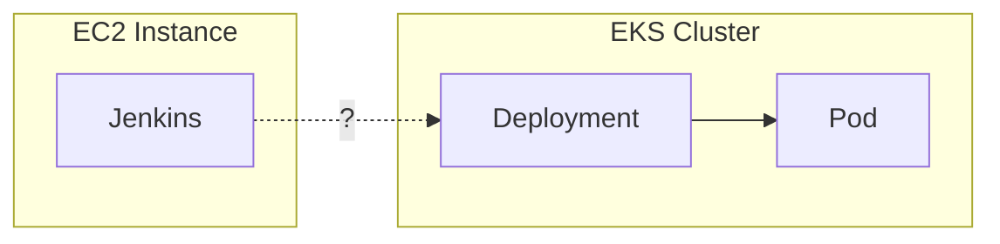

처음에는 Jenkins가 빌드한 애플리케이션을 EKS에 직접 전달하는 것처럼 생각했다.

하지만 실제 배포 흐름을 따라가 보니 조금 달랐다.

Jenkins는 **실행할 Container Image를 Registry에 준비하고, Kubernetes에는 어떤 버전을 실행해야 하는지 상태 변경을 요청한다.**

그리고 실제로 새로운 Pod를 만들고 실행 상태를 변경하는 것은 Kubernetes다.

이 글에서는 Jenkins에서 배포를 시작했을 때 **Application이 Container Image로 빌드되고, 해당 Image가 Kubernetes에서 실제 Pod로 실행되기까지의 과정**을 살펴보고자 한다.

---

## Jenkins는 실제로 무엇을 하는 걸까?

Jenkins 자체를 보면 특별한 배포 장비가 있는 것은 아니다.

예를 들어 Jenkins Controller가 별도의 EC2 Instance에서 실행되는 구조를 생각해볼 수 있다.

Jenkins는 이 서버에서 Pipeline에 정의된 작업을 실행한다.

```bash
./gradlew build

docker build ...

docker push ...

helm upgrade ...
```

환경에 따라 실제 작업은 Jenkins Controller가 아니라 별도의 Jenkins Agent에서 수행될 수도 있다.

여기서 중요한 점은 Jenkins가 EKS 내부에서 실행되고 있기 때문에 배포할 수 있는 것이 아니라는 것이다.

Jenkins의 역할은 **배포에 필요한 작업을 Pipeline에 정의된 순서대로 실행하는 것**이다.

그렇다면 Pipeline을 실행했을 때 실제로 EKS까지 무엇이 어떻게 전달되는 것일까?

---

## Kubernetes 배포는 두 가지 흐름으로 나뉜다

Jenkins Pipeline의 배포 과정을 따라가 보면 크게 두 가지 흐름으로 나눌 수 있다.

첫 번째는 **실행할 Artifact를 준비하는 과정**이고, 두 번째는 **Kubernetes가 새로운 Artifact를 실행하도록 상태를 변경하는 과정**이다.

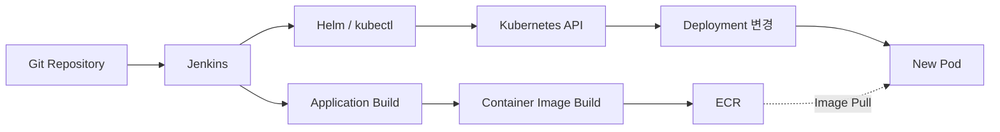

여기서 처음 생각했던 구조와 실제 구조의 차이가 드러난다.

[처음 생각]

```text
Jenkins
   ↓
Application 전달
   ↓
Pod
```

[실제 흐름]

```text
Jenkins
   ├── Container Image → ECR
   │
   └── Deployment 변경 → Kubernetes API
```

즉 **Application Artifact와 배포를 위한 상태 변경은 서로 다른 경로로 전달된다.**

이 구분이 Jenkins 기반 Kubernetes 배포를 이해하는 첫 번째 핵심이었다.

---

## Container Image는 어떻게 전달될까?

먼저 Artifact가 전달되는 흐름을 보자.

Jenkins는 Source Code를 빌드하고 Container Image를 만든다.

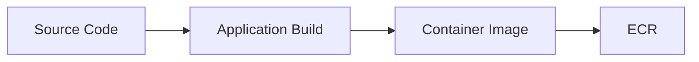

생성된 Image를 EKS의 Pod에 직접 복사하지는 않는다.

Image는 ECR과 같은 Container Registry에 Push된다.

예를 들어 배포마다 다음과 같은 Image가 만들어질 수 있다.

```text
my-service:20260816-a1b2c3
my-service:20260816-d4e5f6
```

이 시점에는 아직 새로운 Application이 실행된 것이 아니다.

Jenkins가 만든 Container Image가 ECR에 저장되어 **Kubernetes가 실행할 수 있는 Artifact가 준비된 상태**다.

이후 Deployment가 사용할 Image가 새로운 버전으로 변경되면 Kubernetes는 해당 Image를 ECR에서 Pull하여 새로운 Pod를 실행한다.

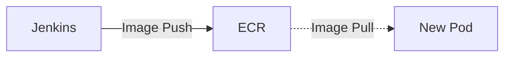

즉 Image의 전달 흐름만 놓고 보면 Jenkins가 Pod에 직접 전달하는 것이 아니라 **Registry를 사이에 두고 Push와 Pull이 분리되어 있다.**

---

## EKS 밖의 Jenkins는 어떻게 Deployment를 변경할까?

Image가 ECR에 준비되었다면 이제 Kubernetes가 새로운 Image를 사용하도록 만들어야 한다.

여기서 처음 가졌던 의문으로 돌아온다.

Jenkins가 EKS 외부에 있는데도 Deployment를 변경할 수 있는 이유는 Kubernetes가 **API를 통해 클러스터의 상태를 관리하기 때문**이다.

`kubectl`과 `Helm` 역시 Kubernetes API를 사용하는 Client다.

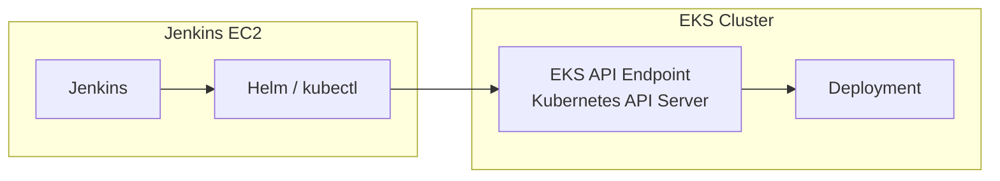

따라서 Jenkins와 EKS가 같은 서버에 있을 필요는 없다.

중요한 것은 Jenkins가 실행되는 환경에서 **EKS API Endpoint에 접근할 수 있고, Kubernetes 인증을 거쳐 Deployment를 변경할 권한이 있는지**다.

AWS 환경에서는 IAM을 이용한 인증과 Kubernetes 측의 권한 설정 등이 함께 관여할 수 있다.

결국 **Jenkins가 어디에서 실행되고 있는가보다 Kubernetes API에 어떤 권한으로 접근할 수 있는가가 더 중요하다.**

처음 의문이었던 "EC2에 있는 Jenkins가 어떻게 EKS를 변경하지?"에 대한 답도 여기서 나온다.

---

## Jenkins가 변경하는 것은 Pod가 아니라 Desired State다

현재 Deployment가 다음 Image를 사용하고 있다고 해보자.

```text
Deployment
└── image: my-service:v1
```

새로운 Image를 ECR에 Push한 뒤 Jenkins는 `Helm`이나 `kubectl`을 이용해 Deployment가 새로운 Image를 사용하도록 변경한다.

```text
Before

image: my-service:v1


After

image: my-service:v2
```

여기서 중요한 점은 Jenkins가 새로운 Pod를 직접 생성하는 것이 아니라는 것이다.

Jenkins가 변경하는 것은 **Kubernetes가 유지해야 하는 Desired State**다.

```text
기존 Desired State
→ my-service:v1

새로운 Desired State
→ my-service:v2
```

즉 Jenkins는 "새로운 Pod를 만들어라"라고 직접 명령하는 것이 아니라,

**"이 Deployment는 이제 v2를 실행해야 한다"**

라는 새로운 상태를 Kubernetes에 전달한다.

실제 Pod를 생성하고 현재 상태를 새로운 Desired State에 맞추는 것은 그다음부터 Kubernetes가 담당한다.

---

## Kubernetes는 어떻게 새로운 Pod를 만들어낼까?

Deployment는 이미 `v2`를 실행하도록 변경되었지만 현재 Pod들은 아직 `v1`을 실행하고 있을 수 있다.

```text
Desired State
→ my-service:v2

Actual State
→ my-service:v1
```

Kubernetes의 Controller는 선언된 상태와 현재 상태를 지속적으로 비교한다.

두 상태가 다르면 실제 상태가 선언된 상태에 맞도록 필요한 작업을 수행한다.

이러한 제어 과정을 **Reconciliation**이라고 한다.

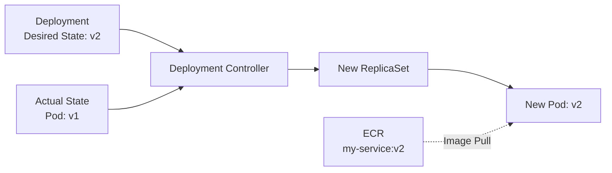

Deployment의 Pod Template이 변경되면 새로운 ReplicaSet이 만들어지고, 그 ReplicaSet을 통해 새로운 Pod가 생성된다.

새로운 Pod는 자신의 Spec에 정의된 Image를 ECR에서 Pull하여 Container를 실행한다.

이 지점에서 Jenkins와 Kubernetes의 책임이 명확하게 나뉜다.

```text
Jenkins
→ 새로운 Desired State를 전달

Kubernetes
→ Actual State를 Desired State에 맞춤
```

처음에는 Jenkins가 Pod를 직접 배포한다고 생각했지만 실제로는 **Jenkins가 상태 변경의 시작점을 만들고, Kubernetes가 그 상태를 실제 실행 환경에 반영한다.**

---

## 새로운 버전은 새로운 Pod로 반영된다

앞에서 Kubernetes는 Desired State와 Actual State의 차이를 새로운 Pod를 생성하면서 맞춘다는 것을 살펴봤다.

이 구조를 이해하면 Kubernetes의 배포 방식도 자연스럽게 연결된다.

전통적인 서버 배포에서는 기존 서버에 새로운 JAR이나 실행 파일을 올리고 프로세스를 재시작하는 방식을 사용할 수 있다.

```text
Server
   ↓
새로운 JAR 배포
   ↓
Process 재시작
```

반면 Kubernetes의 Deployment는 기존 Pod 안에 새로운 Application을 덮어쓰는 방식이 아니다.

Pod Template이 변경되면 **새로운 버전의 Pod를 만들고 기존 Pod를 교체한다.**

Replica가 3개인 상황을 생각해보자.

기존에는 모든 Pod가 `v1`을 실행하고 있다.

```text
v1
v1
v1
```

RollingUpdate가 진행되면 점진적으로 새로운 버전의 Pod로 교체된다.

```text
v1
v1
v2
```

```text
v1
v2
v2
```

최종적으로 새로운 Desired State에 도달한다.

```text
v2
v2
v2
```

즉 Kubernetes에서 새로운 버전을 배포하는 과정은 기존 실행 환경을 직접 수정하는 것보다 **새로운 실행 인스턴스를 만들면서 전체 상태를 새로운 버전으로 수렴시키는 과정**에 가깝다.

앞에서 살펴본 Desired State와 Reconciliation이 실제 배포 방식으로 이어지는 지점이다.

---

## 배포 명령의 성공이 배포 완료를 의미할까?

이 구조를 이해하면 Jenkins Pipeline의 성공도 조금 다르게 볼 수 있다.

예를 들어 다음 명령이 정상적으로 실행되었다고 해보자.

```bash
helm upgrade ...
```

이는 Kubernetes에 Deployment 변경 요청이 정상적으로 반영되었다는 의미일 수 있다.

하지만 Kubernetes에서는 그 이후에도 새로운 상태를 실제 실행 환경에 반영하는 과정이 이어진다.

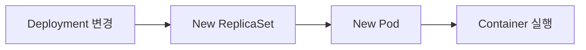

따라서 **Deployment의 변경이 반영된 시점과 새로운 버전의 Rollout이 완료된 시점은 구분할 필요가 있다.**

필요하다면 Pipeline에서 다음과 같이 Rollout 완료까지 확인할 수 있다.

```bash
kubectl rollout status deployment/my-service
```

이것 역시 앞에서 나눈 Jenkins와 Kubernetes의 책임과 연결된다.

Jenkins는 Desired State의 변경을 요청하고, Kubernetes는 실제 상태를 변경한다.

따라서 CI/CD Pipeline을 구성할 때는 **어디까지 확인했을 때 배포가 성공했다고 판단할 것인가**도 하나의 설계 요소가 된다.

---

## 전체 배포 흐름 다시 보기

처음에는 배포 과정을 다음처럼 바라봤다.

```text
Jenkins
   ↓
EKS
   ↓
Pod
```

하지만 내부 흐름을 따라가 보면 실제로는 다음과 같이 역할이 나뉜다.

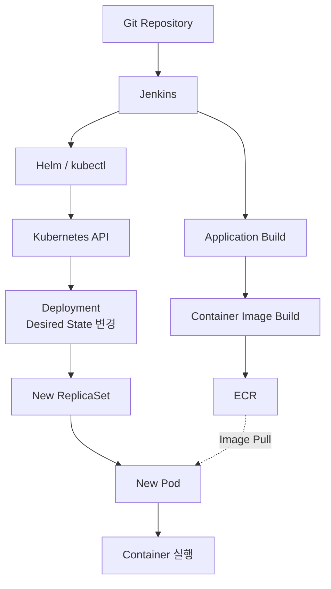

각 구성요소의 책임을 나누어 보면 전체 배포 과정이 더 명확해진다.

```text
Jenkins
→ CI/CD Pipeline 실행
→ Container Image 생성 및 Push
→ Deployment 상태 변경 요청

ECR
→ 실행할 Container Image 저장

Kubernetes API
→ 클러스터 상태 변경의 진입점

Deployment / Controller
→ Desired State 관리
→ Actual State를 Desired State에 맞춤

ReplicaSet
→ 필요한 수의 Pod 유지

Pod
→ 지정된 Image로 Application 실행
```

Jenkins 화면에서는 하나의 Pipeline으로 보이지만 내부에서는 **Artifact를 준비하는 흐름과 Kubernetes의 실행 상태를 변경하는 흐름이 분리되어 있다.**

그리고 두 흐름은 새로운 Pod가 ECR에서 Image를 Pull하는 지점에서 연결된다.

---

## 정리

이 글을 정리하기 전에는 Jenkins에서 Pipeline을 실행하면 Jenkins가 애플리케이션을 EKS에 직접 배포한다고 막연하게 생각했다.

하지만 내부 흐름을 따라가 보니 하나의 배포처럼 보였던 과정은 서로 다른 역할로 나뉘어 있었다.

먼저 Jenkins는 실행할 Container Image를 만들고 Registry에 저장한다.

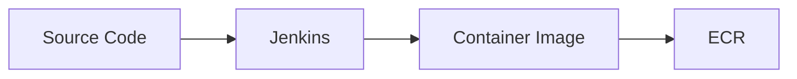

그리고 Kubernetes에는 새로운 Image를 실행하도록 Desired State의 변경을 요청한다.

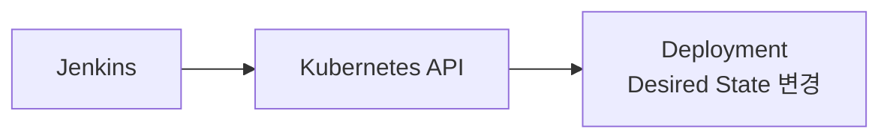

그 이후 새로운 상태를 실제 실행 환경에 반영하는 것은 Kubernetes다.

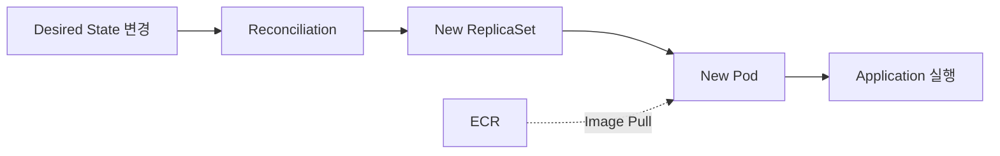

결국 Kubernetes 환경에서의 배포는 **애플리케이션 파일을 특정 서버로 전달하는 작업이라기보다, 실행할 Artifact를 준비하고 클러스터가 유지해야 할 상태를 새로운 버전으로 변경하는 과정**에 가깝다.

이 관점으로 바꾸고 나니 처음 가졌던 의문들도 자연스럽게 연결됐다.

Jenkins가 EKS 외부의 EC2에서 실행되더라도 Kubernetes API에 접근할 수 있다면 Deployment를 변경할 수 있다.

Container Image는 Jenkins에서 Pod로 직접 전달되는 것이 아니라 Registry에 저장되고, 새로운 Pod가 이를 Pull한다.

새로운 버전은 기존 Pod 내부에 덮어쓰는 것이 아니라 새로운 Pod가 생성되면서 반영된다.

그리고 Deployment 변경 요청이 성공한 시점과 Kubernetes가 실제로 새로운 버전의 Rollout을 완료한 시점도 구분해서 볼 수 있다.

결국 처음에는 하나의 **"Jenkins 배포"**로 보였던 과정이 실제로는 서로 다른 시스템의 책임으로 나뉘어 있었다.

**Jenkins는 배포 과정을 자동화하고, ECR은 실행할 Artifact를 보관하며, Kubernetes는 선언된 상태를 실제 실행 상태로 만든다.**

Kubernetes 기반 CI/CD를 이해하면서 가장 크게 바뀐 관점은 **"Jenkins가 어떻게 EKS에 애플리케이션을 전달하는가?"가 아니라 "Jenkins와 Kubernetes 사이에서 무엇이 전달되고, 실제 실행 상태는 누가 변경하는가?"를 보는 것**이었다.
