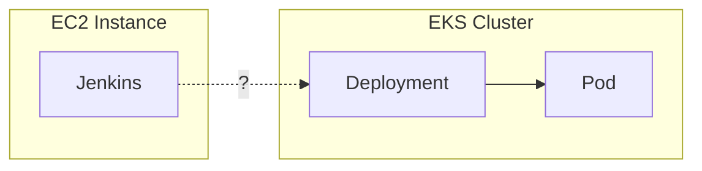
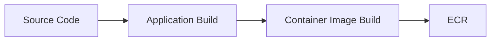
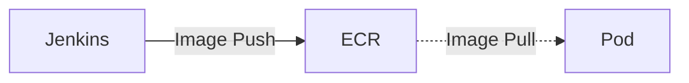
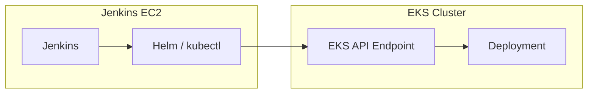
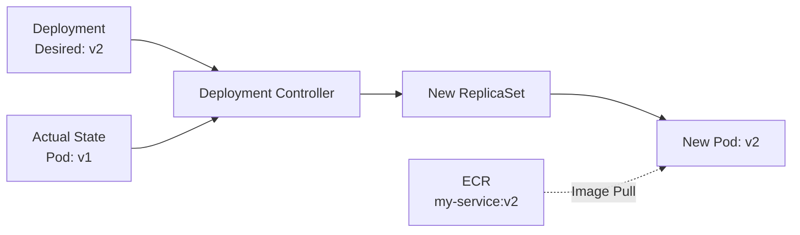
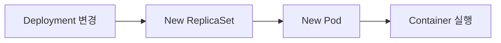
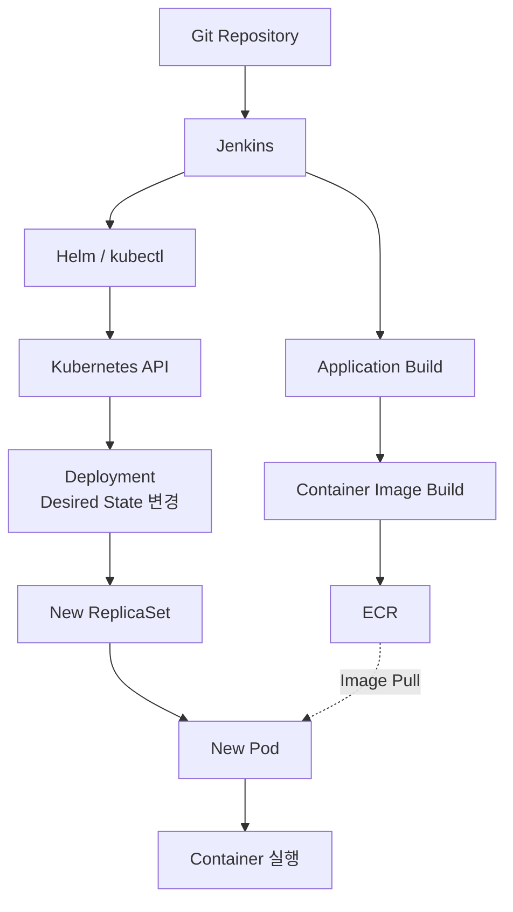

# Kubernetes 서비스 배포 흐름 이해하기

Kubernetes 기반의 서비스를 운영하면서 Jenkins를 통해 개발 환경에 애플리케이션을 배포할 일이 많았다.

코드를 Push하고 Jenkins Pipeline을 실행 (Validate Version > Check Out Source > Build Maven > Build Docker Image > Deploy On Kuberenetes) 하면, 잠시 뒤 EKS의 Pod가 새로운 버전으로 교체된다.

이러한 과정에 대해 실제 인프라 구조를 고려해보았을 때 한 가지 의문점이 들었다. **Jenkins는 별도의 EC2 Instance에서 실행되는데, 어떻게 EKS 안의 Pod를 변경할 수 있는 걸까?**



처음에는 단순히 Jenkins가 빌드한 애플리케이션을 EKS에 직접 전달하는 구조라고 생각했다. 하지만 실제 흐름을 따라가 보니, Jenkins가 하는 일과 Kubernetes가 하는 일은 분리되어 있었고 Container Image 역시 Jenkins에서 Pod로 직접 전달되지 않았다.

이 글에서는 Jenkins의 배포 명령이 실행된 뒤, **Application이 Container Image로 빌드되고 그 Image가 실제 Pod로 실행되기까지의 과정**을 살펴보고자 한다.

---

## Jenkins는 실제로 무엇을 하는 걸까

Jenkins 자체는 특별한 배포 장비가 아니다. 예를 들어 Jenkins Controller가 별도 EC2에서 실행되고, Pipeline에 정의된 작업을 순서대로 수행하는 구조를 생각해볼 수 있다.

```bash
./gradlew build
docker build ...
docker push ...
helm upgrade ...
```

환경에 따라 실제 작업은 Controller가 아니라 별도의 Jenkins Agent에서 수행될 수도 있다. 중요한 건 **Jenkins가 EKS 내부에 있어서 배포할 수 있는 게 아니라는 점**이다. Jenkins의 역할은 빌드와 배포에 필요한 작업을 Pipeline 순서대로 실행하는 것일 뿐이다.

---

## Container Image는 어떻게 전달될까

Jenkins는 Source Code를 빌드해 Container Image를 만든다.



이 Image가 EKS의 Pod에 직접 복사되는 게 아니라, ECR (Elastic Container Registry) 같은 Container Registry에 Push된다.

```text
my-service:20260816-a1b2c3
my-service:20260816-d4e5f6
```

이 시점에 아직 새 버전의 애플리케이션이 실행된 것은 아니다. **Kubernetes가 가져가서 실행할 Image가 Registry에 준비된 상태**일 뿐이다. 이후 새로운 Pod가 생성되면 그 Pod가 자신의 Spec에 지정된 Image를 ECR에서 Pull하여 실행한다.



즉 Image의 흐름은 `Jenkins → Pod`가 아니라 `Jenkins → ECR → Pod`이다. **Jenkins가 빌드한 애플리케이션을 Pod에 직접 전달하는 게 아니라는 것**, 이것이 처음 생각과 다른 첫 번째 지점이다.

그렇다면 Jenkins는 EKS에 무엇을 전달하고 있는 걸까?

---

## EKS 밖의 Jenkins는 어떻게 Deployment를 변경할까

Jenkins는 `Helm`이나 `kubectl`로 Kubernetes의 Deployment를 변경한다. 이게 가능한 이유는 Kubernetes가 **API를 통해 클러스터의 상태를 관리**하기 때문이다. `kubectl`과 `Helm`도 결국 Kubernetes API를 쓰는 Client일 뿐이다.



그래서 Jenkins와 EKS가 같은 서버에 있을 필요가 없다. Jenkins가 실행되는 환경에서 **EKS API Endpoint에 접근할 수 있고, 인증을 거쳐 필요한 Resource를 변경할 권한이 있으면** EKS 외부에서도 Deployment를 변경할 수 있게 되는 것이다.

처음 가졌던 "EC2의 Jenkins가 어떻게 EKS를 변경하지?"라는 질문의 핵심은 결국 물리적 위치가 아니라 **Jenkins가 Kubernetes API에 접근할 수 있는가**였다.

---

## Jenkins가 바꾸는 건 Pod가 아니라 Desired State이다

현재 Deployment가 `my-service:v1`을 쓰고 있다고 하자. 새 Image가 ECR에 준비되면 Jenkins는 Helm/kubectl로 Deployment가 새 Image를 사용하도록 변경한다.

```text
Before: image: my-service:v1
After : image: my-service:v2
```

여기서 중요한 것은 Jenkins가 새 Pod를 직접 만드는 것이 아니라는 점이다. Jenkins가 바꾸는 건 **Kubernetes가 유지해야 하는 Desired State**이다.

```text
"새로운 Pod를 만들어라"          (X)
"이 Deployment는 이제 v2를 실행해야 한다"  (O)
```

정리하면 Jenkins의 역할은 아래 두 가지로 압축된다.

```text
Container Image  → ECR에 Push
Deployment 상태  → Kubernetes API를 통해 변경
```

그렇다면 Jenkins가 Pod를 직접 만들지 않는다면, 실제 새로운 Pod는 누가 만드는 걸까?

---

## Kubernetes는 어떻게 새로운 Pod를 만들어낼까

Deployment는 이미 `v2`를 실행하도록 바뀌었지만, 현재 실행 중인 Pod는 아직 `v1`일 수 있다.

```text
Desired State → my-service:v2
Actual State  → my-service:v1
```

Kubernetes의 Controller는 선언된 상태(Desired State)와 현재 상태(Actual State)를 지속적으로 비교하고, 차이가 있으면 실제 상태를 선언된 상태에 맞춘다. 이 제어 과정을 **Reconciliation**이라 부른다. Deployment의 Pod Template이 바뀐 경우에는 새 ReplicaSet이 만들어지고, 그 ReplicaSet을 통해 새 Pod가 생성된다.



새 Pod는 자신의 Spec에 지정된 Image를 ECR에서 Pull하여 Container로 실행한다.

```text
Jenkins    → 새로운 Desired State를 전달
Kubernetes → Actual State를 Desired State에 맞춤
```

처음엔 Jenkins가 애플리케이션을 EKS에 직접 배포한다고 생각했지만, 실제로는 **Jenkins가 상태 변경의 시작점을 만들고 Kubernetes가 그 상태를 실제 실행 환경에 반영하는 구조**였다.

---

## 배포 명령의 성공이 배포 완료를 의미할까

Pipeline에서 `helm upgrade`가 정상적으로 실행됐다는 건 Deployment 변경 요청이 Kubernetes에 정상 반영됐다는 의미일 뿐이다. 실제 Pod가 새 버전으로 바뀌는 과정은 그 이후에도 이어진다.



즉 **Deployment 변경이 반영된 시점과 새 버전의 Rollout이 완료된 시점은 다를 수 있다.** Deployment는 정상적으로 바뀌었어도 새 Pod가 제대로 뜨지 못할 수 있기 때문에, 필요한 경우 Pipeline에서 Rollout 상태까지 확인해야 한다.

```bash
kubectl rollout status deployment/my-service
```

Jenkins가 새로운 Desired State를 전달하는 것과 Kubernetes가 실제로 그 상태에 도달하는 것은 서로 다른 단계이며, CI/CD Pipeline에서는 **어디까지 확인해야 배포 성공으로 볼지**도 하나의 설계 요소가 된다.

---

## 정리

처음에는 막연히 Jenkins Pipeline을 실행하면 애플리케이션이 EKS로 전달되는 구조라고 생각했다.

```text
Jenkins → Application → EKS → Pod
```

하지만 흐름을 따라가 보니 실제 구조는 역할이 분리되어 있었다.



하나의 Jenkins Pipeline 안에서 실행되니 하나의 배포 과정처럼 보일 수 있지만, 내부적으로는 **Container Image는 Jenkins에서 ECR로 Push되고, Kubernetes에는 API를 통해 새로운 Desired State가 전달**된다. 그 뒤 Kubernetes가 새 ReplicaSet과 Pod를 만들고, Pod가 ECR에서 Image를 Pull하면서 두 흐름이 다시 연결된다.

결국 Kubernetes 환경에서의 배포는 애플리케이션 파일을 특정 서버로 직접 전달하는 작업이라기보다, **실행할 Artifact를 준비하고 클러스터가 유지해야 할 상태를 새로운 버전으로 변경하는 과정**에 가깝다.

중요한 건 Jenkins와 EKS의 물리적 위치가 아니라 **Jenkins가 Kubernetes API를 통해 어떤 상태를 변경하고, 그 이후 실제 실행 상태를 누가 만들어내는가**였다.

**Jenkins는 배포 과정을 실행하고, ECR은 실행할 Container Image를 보관하며, Kubernetes는 선언된 상태를 실제 실행 상태로 만든다.** 이 세 역할을 구분해서 보는 것이 Kubernetes 기반 CI/CD의 배포 흐름을 이해하는 가장 중요한 관점이었다.
