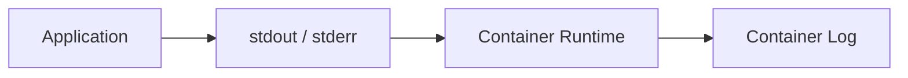
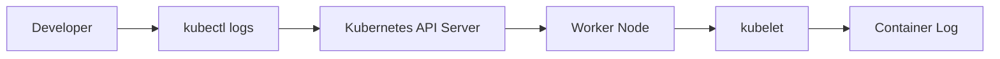
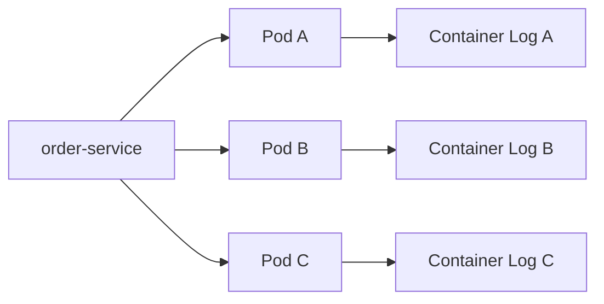
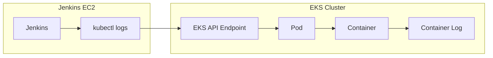
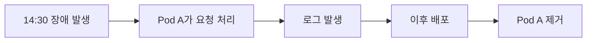
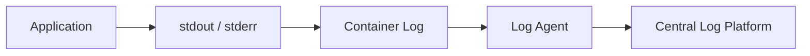
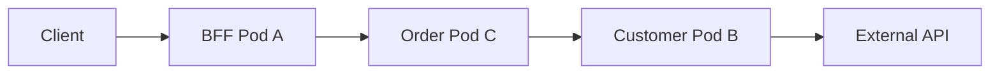
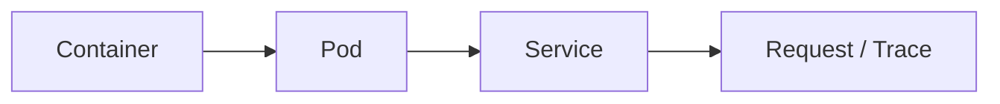
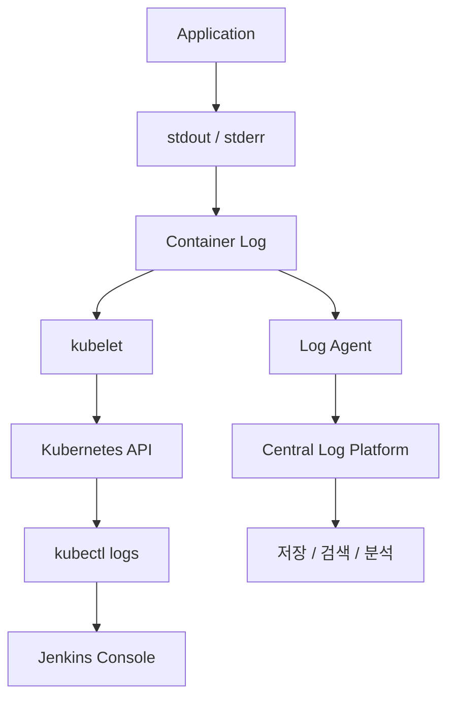

# Kubernetes 로그 이해하기

Kubernetes 기반 서비스를 운영하면서 애플리케이션 로그를 여러 방식으로 확인할 일이 있었다.

개발 환경에서는 `kubectl logs`로 특정 Pod의 로그를 직접 확인했고,

```bash
kubectl logs <pod-name> -n <namespace>
```

Jenkins에서도 각 MSA 서비스의 로그를 확인할 수 있었으며, 운영 모니터링에서는 Datadog으로 로그를 검색할 수도 있었다.

처음에는 이 모든 걸 그냥 "애플리케이션 로그를 보는 방법" 정도로 생각했다. 그런데 곰곰이 생각해보니 이상한 점이 있었다.

애플리케이션은 EKS의 Pod에서 실행되는데, Jenkins는 별도의 EC2 Instance에서 실행된다.

```text
EC2
└── Jenkins

EKS Cluster
└── Pod
    └── Application
```

**EKS 밖에 있는 Jenkins는 어떻게 Pod의 애플리케이션 로그를 볼 수 있는 걸까? 그리고 Jenkins와 Datadog이 둘 다 로그를 보여준다면, 둘은 같은 방식으로 로그를 가져오는 걸까?**

이 두 질문을 따라가다 보니 중요한 건 "로그를 볼 수 있다"는 결과가 아니라, **로그가 어디에서 발생하고 각 도구가 그 로그에 어떤 경로로 접근하는지**였다. 이 글은 그 경로를 따라가 본 기록이다.

---

## 로그는 어디에서 발생할까

Kubernetes에서 애플리케이션은 Pod 내부의 Container에서 실행된다. Spring Boot 애플리케이션이라면 보통 이렇게 로그를 남긴다.

```java
log.info("Order created. orderId={}", orderId);
log.error("Order creation failed.", e);
```

Container 환경에서는 애플리케이션 로그를 `stdout`, `stderr`와 같은 표준 스트림으로 출력하고, Container Runtime이 이 출력을 받아 Container의 로그로 관리한다.



즉 처음부터 `order-service.log`처럼 서비스 하나를 대표하는 로그 파일이 Kubernetes 어딘가에 존재하는 게 아니다. **로그는 실제 애플리케이션이 실행되는 각각의 Container에서 발생한다.**

---

## kubectl logs는 로그를 어떻게 가져올까

```bash
kubectl logs order-service-7d8f9c6b5-x2k9p -n order-dev
```

`kubectl`이 Worker Node에 직접 접속해 로그 파일을 읽어오는 것처럼 보일 수 있지만, 실제로는 Kubernetes API를 사용하는 Client일 뿐이다. 로그 조회도 이 API를 통해 이루어진다.



즉 Node에 SSH로 접속하는 게 아니라 "이 Pod의 Container 로그를 보여달라"고 Kubernetes에 요청하는 것이다. 그래서 `kubectl logs`의 조회 단위는 Service가 아니라 **Pod와 Container**다.

```bash
kubectl logs <pod-name>
kubectl logs <pod-name> -c <container-name>   # Pod에 Container가 여러 개일 때
```

`kubectl logs`는 로그를 별도로 저장하는 시스템이 아니라, **Kubernetes API를 통해 특정 Pod의 Container 로그를 그때그때 조회하는 명령**이다.

---

## 하나의 서비스, 여러 개의 Pod 로그

Deployment가 `order-service`를 세 개의 Replica로 실행하고 있다면, 각 Pod에는 동일한 애플리케이션이 떠 있지만 Container는 각각 별개다. 로그도 각 Container에서 따로 발생한다.



사용자 요청이 Service를 거쳐 Pod B로 전달됐다면 그 요청의 로그는 Pod B에만 존재한다. `kubectl logs Pod-A`만 보고 있으면 Pod B가 처리한 요청의 로그는 찾을 수 없다. 논리적으로는 하나의 서비스처럼 보이지만, 실행 관점에서는 **로그가 여러 Pod에 분산되어 있는 것**이다.

---

## EKS 밖의 Jenkins는 어떻게 Pod 로그를 볼까

`kubectl logs`의 구조를 이해하고 나면 원리는 자연스럽게 연결된다. Jenkins도 Kubernetes API에 접근할 수 있다면 동일한 방식으로 Pod의 로그를 조회할 수 있다.



중요한 건 Jenkins와 EKS가 같은 환경에 있는지가 아니라, Jenkins가 실행되는 환경에서 **EKS API Endpoint에 접근할 수 있고, 인증을 거쳐 해당 Namespace와 Pod의 로그를 조회할 권한이 있는지**다. 이 조건만 갖춰지면 Jenkins가 별도 EC2에서 돌고 있어도 문제없다. Jenkins가 EKS에 배포를 할 수 있었던 것도 같은 이유다.

```text
배포     : Jenkins → Kubernetes API → Deployment 변경
로그 조회 : Jenkins → Kubernetes API → Container Log 조회
```

실제 Jenkins Job에서는 사용자가 Pod 이름을 직접 몰라도, 서비스 라벨로 Pod를 먼저 찾고 그 Pod의 로그를 조회해 Console Output에 보여주는 식으로 구성할 수 있다.

```bash
kubectl get pods -n order-dev -l app=order-service
kubectl logs <pod-name> -n order-dev
```

즉 Jenkins가 로그를 가지고 있어서 보여주는 게 아니다. **Kubernetes API를 쓸 수 있기 때문에 EKS 밖에서도 Pod의 로그를 조회할 수 있는 것**이고, 이런 구조라면 Jenkins는 로그 저장소가 아니라 로그를 대신 조회해 보여주는 실행 창구에 가깝다.

---

## Pod에서 직접 로그를 보는 방식의 한계

Pod는 영구적인 서버가 아니다. 배포나 장애로 기존 Pod가 사라지고 새 Pod가 만들어질 수 있다.



나중에 장애를 분석하려 할 때 그 요청을 처리했던 Pod가 이미 없을 수도 있다. 즉 `kubectl logs`는 **현재 떠 있는 특정 인스턴스를 확인하는 데는 유용하지만, 장기간 로그를 보관하고 분석하기 위한 구조는 아니다.** 여기서 중앙 로그 수집이 필요해진다.

---

## 로그를 중앙으로 수집하는 이유

각 Worker Node에 Log Agent를 하나씩 띄워, 거기서 발생하는 로그를 별도의 중앙 로그 플랫폼으로 지속적으로 전달하는 구조를 생각할 수 있다. Kubernetes에서는 보통 이 Agent를 Node마다 배치하기 위해 DaemonSet을 쓴다.

<div align="center">

</div>



Datadog Agent, Fluent Bit, Filebeat 같은 도구가 이 수집 역할을 맡는다. 로그가 발생하는 즉시 다른 시스템으로 계속 전달되기 때문에, Pod가 사라진 뒤에도 이미 수집된 로그는 중앙 시스템에서 조회할 수 있다.

---

## 조회(Pull)와 수집(Push)의 차이

여기서 처음 가졌던 두 번째 질문, "Jenkins와 Datadog은 같은 방식으로 로그를 가져오는가"에 대한 답이 나온다.

```text
Jenkins / kubectl logs
→ 필요한 순간 Kubernetes API를 통해 현재 실행 중인 Container의 로그를 조회 (Pull)

Central Log Platform (Datadog 등)
→ 각 Container에서 발생하는 로그를 Log Agent가 지속적으로 수집·저장 (Push)
```

둘 다 화면에는 애플리케이션 로그를 보여주지만, "로그를 볼 수 있다"는 결과만 같을 뿐 접근 방식은 다르다. Jenkins/kubectl은 현재 시점의 스냅샷을 요청해서 받아오는 쪽이고, 중앙 로그 플랫폼은 로그가 발생하는 대로 계속 쌓아두는 쪽이다.

---

## 분산된 로그를 다시 하나로 묶기

로그를 중앙에 모은다고 바로 `order-service`라는 하나의 서비스 로그가 만들어지는 건 아니다. 원본 로그는 여전히 서로 다른 Pod에서 발생했기 때문에, 수집할 때 Kubernetes Metadata나 애플리케이션 정보를 함께 태그로 붙인다.

```text
service=order-service
namespace=production
pod=order-service-7d8f9c6b5-x2k9p
version=v2
level=ERROR
```

중앙 로그 플랫폼은 이 메타데이터를 기준으로 로그를 다시 묶어 검색한다. 물리적으로는 서로 다른 Pod에서 발생한 로그지만, `service=order-service`라는 공통 Context로 하나의 서비스 관점에서 볼 수 있는 것이다. 즉 우리가 흔히 보는 "서비스 로그"는 원래 하나였던 로그가 아니라, **분산된 로그를 메타데이터로 다시 묶어본 결과**에 가깝다.

MSA에서는 여기서 한 단계 더 나아가야 한다. 하나의 사용자 요청이 여러 서비스를 거쳐 처리되기 때문이다.



이때 각 서비스의 로그에 동일한 Request ID / Trace ID를 함께 남기면, 서로 다른 서비스·Pod에서 발생한 로그를 하나의 요청 흐름으로 연결할 수 있다.

```text
BFF Pod A      traceId=abc123
Order Pod C    traceId=abc123
Customer Pod B traceId=abc123
```

결국 로그를 바라보는 단위는 이렇게 한 단계씩 올라간다.



중앙 로그 수집의 진짜 의미는 로그를 한곳에 모아두는 데서 끝나지 않는다. **분산되어 발생한 로그에 Context를 부여하고, 필요한 관점으로 다시 연결할 수 있게 만드는 것**까지가 핵심이다.

---

## 정리

처음 가졌던 두 질문으로 돌아가 보면,

> EKS Pod에서 실행되는 애플리케이션의 로그를, 별도 EC2에서 실행되는 Jenkins는 어떻게 볼 수 있을까?
> → Jenkins가 Kubernetes API에 접근·인증할 수 있기 때문이다. 로그를 갖고 있어서가 아니라, API를 통해 그때그때 조회하는 것이다.

> Jenkins와 Datadog은 같은 방식으로 로그를 가져오는가?
> → 아니다. Jenkins/kubectl은 필요할 때 API로 조회하는 Pull 방식이고, Datadog 같은 중앙 로그 플랫폼은 Log Agent가 지속적으로 로그를 모으는 Push 방식이다.



출발점은 같은 Container Log지만, 이후 경로는 완전히 다르다. 그리고 중앙에 모인 로그도 결국 Pod → Service → Request/Trace라는 Context를 거쳐야 다시 하나의 관점으로 연결된다.

결국 Kubernetes 환경에서 로그를 이해한다는 건 `kubectl logs` 명령어 하나를 아는 것보다, **분산되어 발생한 로그가 어떤 경로로 조회·수집되고, 어떻게 다시 하나의 관점으로 묶이는지를 이해하는 것**에 더 가깝다고 생각한다.
