# Kubernetes 로그 이해하기

Kubernetes 기반 서비스를 운영하면서 애플리케이션 로그를 여러 방식으로 확인할 일이 있었다.

개발 환경에서는 `kubectl logs`를 이용해 특정 Pod의 로그를 직접 확인할 수 있다.

```bash
kubectl logs <pod-name> -n <namespace>
```

한편 Jenkins에서도 각 MSA 서비스의 로그를 확인할 수 있었고, 운영 모니터링에서는 Datadog을 통해 로그를 검색할 수도 있었다.

처음에는 모두 단순히 **"애플리케이션 로그를 보는 방법"** 정도로 생각했다.

그런데 실제 구조를 생각해보니 한 가지가 잘 이해되지 않았다.

애플리케이션은 EKS의 Pod에서 실행되고 있는데 Jenkins는 별도의 EC2 Instance에서 실행된다.

```text
EC2
└── Jenkins


EKS Cluster
└── Pod
    └── Application
```

**그렇다면 EKS 밖에 있는 Jenkins에서는 어떻게 Pod의 애플리케이션 로그를 볼 수 있는 것일까?**

그리고 Jenkins와 Datadog 모두 로그를 볼 수 있다면 둘은 같은 방식으로 로그를 가져오는 것일까?

이 질문을 따라가 보니 중요한 것은 단순히 로그를 **"볼 수 있다"**는 결과가 아니었다.

**로그가 어디에서 발생하고, 각 도구가 그 로그에 어떤 방식으로 접근하는지를 구분해서 볼 필요가 있었다.**

이 글에서는 애플리케이션에서 발생한 로그가 Kubernetes에서 어떻게 관리되고, `kubectl logs`, Jenkins, 중앙 로그 플랫폼이 각각 어떤 방식으로 그 로그에 접근하는지 따라가 보고자 한다.

---

## 애플리케이션 로그는 어디에서 시작될까?

Kubernetes에서 애플리케이션은 Pod 내부의 Container에서 실행된다.

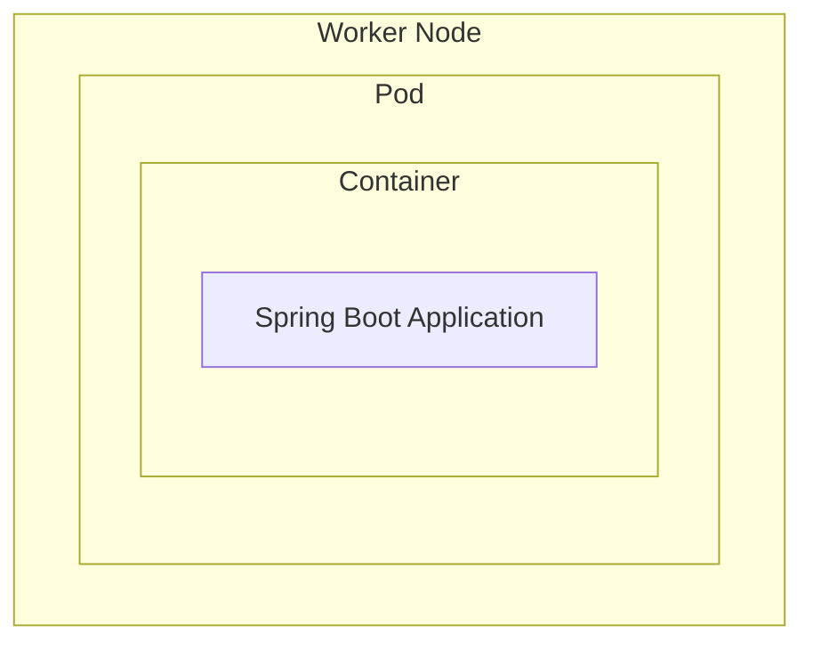

Spring Boot 애플리케이션에서 다음과 같이 로그를 남긴다고 해보자.

```java
log.info("Order created. orderId={}", orderId);
log.error("Order creation failed.", e);
```

Container 환경에서는 일반적으로 애플리케이션 로그를 `stdout`, `stderr`와 같은 표준 스트림으로 출력한다.

Container Runtime은 이 출력을 받아 Container의 로그로 관리한다.

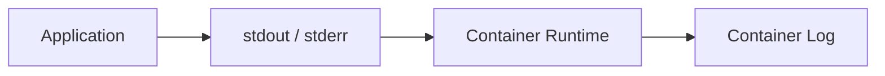

즉 처음부터 `order-service.log`와 같은 하나의 서비스 로그가 Kubernetes 어딘가에 존재하는 것은 아니다.

**로그는 실제 애플리케이션이 실행되는 각각의 Container에서 발생한다.**

그렇다면 우리가 사용하는 `kubectl logs`는 이 로그를 어떻게 가져오는 것일까?

---

## kubectl logs는 어디서 로그를 가져올까?

다음과 같이 특정 Pod의 로그를 확인할 수 있다.

```bash
kubectl logs order-service-7d8f9c6b5-x2k9p -n order-dev
```

처음에는 `kubectl`이 Worker Node에 직접 접속해서 로그 파일을 읽어오는 것처럼 생각할 수도 있다.

하지만 `kubectl`은 Kubernetes API를 사용하는 Client다.

로그 조회 역시 Kubernetes API를 통해 이루어진다.

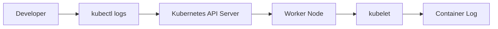

즉 개발자가 Worker Node에 직접 SSH로 접속하는 것이 아니라 Kubernetes에

> 이 Pod의 Container 로그를 보여달라.

고 요청하는 것이다.

그래서 `kubectl logs`의 조회 단위도 Service가 아니라 **Pod와 Container**다.

```bash
kubectl logs <pod-name>
```

하나의 Pod 안에 여러 Container가 있다면 Container까지 지정할 수 있다.

```bash
kubectl logs <pod-name> -c <container-name>
```

`kubectl logs`는 로그를 별도로 저장하는 시스템이 아니라 **Kubernetes API를 통해 특정 Pod의 Container 로그를 조회하는 명령**이다.

여기서 또 하나의 의문이 생긴다.

우리는 흔히 "order-service의 로그"라고 말하는데, 실제 조회 단위는 왜 Pod일까?

---

## 하나의 서비스인데 로그는 왜 여러 곳에 있을까?

Deployment가 애플리케이션을 세 개의 Replica로 실행하고 있다고 해보자.

```text
order-service

├── Pod A
├── Pod B
└── Pod C
```

각 Pod에는 동일한 애플리케이션이 실행되지만 각각 별도의 Container다.

따라서 로그 역시 각 Container에서 따로 발생한다.

사용자의 요청이 Service를 통해 Pod B로 전달되었다면 해당 요청의 로그도 Pod B에서 발생한다.

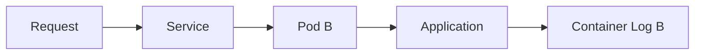

따라서 `kubectl logs Pod-A`만 보고 있다면 Pod B에서 처리된 요청의 로그를 찾을 수 없다.

논리적으로는 하나의 서비스처럼 보이지만,

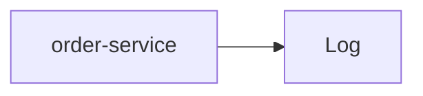

실제 실행 관점에서는 로그가 여러 Pod에 나뉘어 있다.

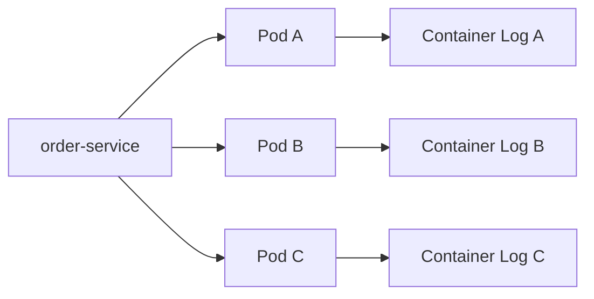

즉 **하나의 서비스 로그가 실제로는 여러 실행 인스턴스에 분산되어 있는 셈이다.**

그렇다면 EKS 밖에 있는 Jenkins에서는 이 Pod들의 로그를 어떻게 조회할 수 있을까?

---

## EKS 밖의 Jenkins는 어떻게 Pod 로그를 볼까?

Jenkins는 별도의 EC2 Instance에서 실행되고 있다.

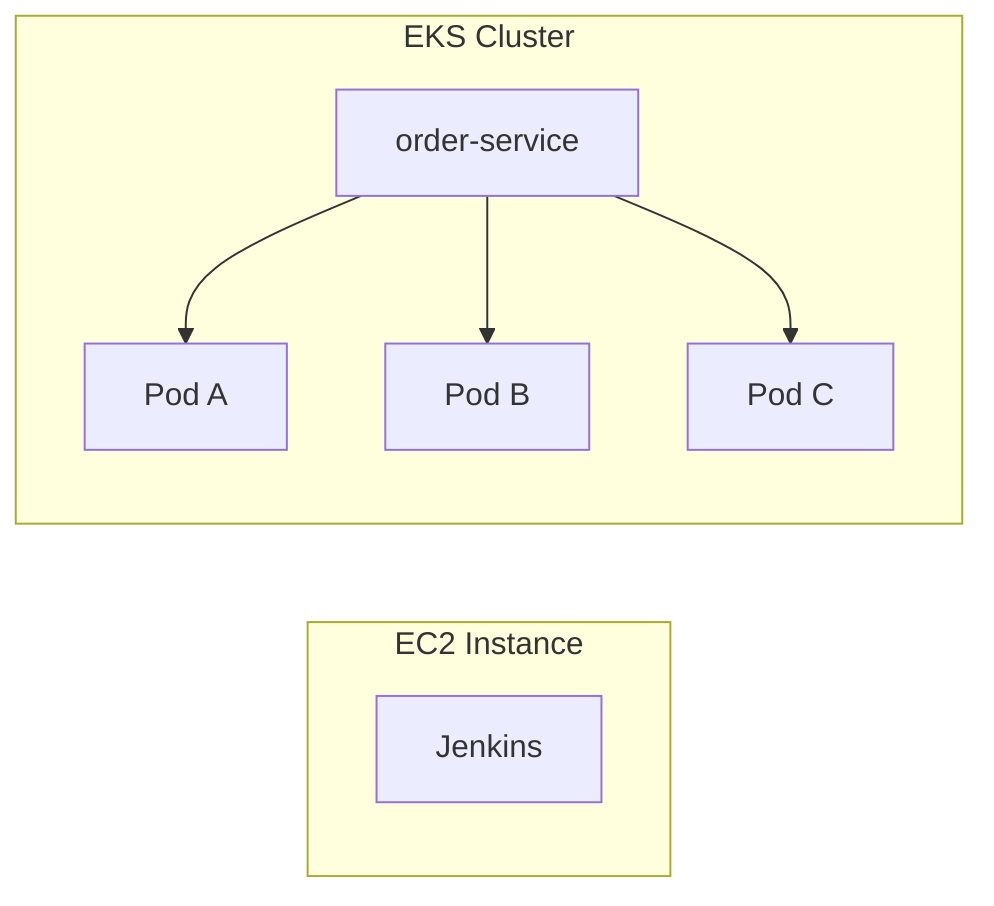

그런데 Jenkins에서도 각 MSA 서비스의 로그를 확인할 수 있다.

앞에서 `kubectl logs`의 구조를 보면 원리는 자연스럽게 연결된다.

Jenkins 역시 Kubernetes API에 접근할 수 있다면 동일한 방식으로 Pod의 로그를 조회할 수 있다.

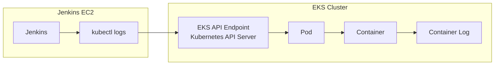

중요한 것은 Jenkins와 EKS가 같은 환경에 있는지가 아니다.

Jenkins가 실행되는 환경에서 **EKS API Endpoint에 접근할 수 있고, Kubernetes 인증을 거쳐 해당 Namespace와 Pod의 로그를 조회할 권한이 있는지**가 중요하다.

이 조건이 갖춰져 있다면 Jenkins가 별도의 EC2 Instance에서 실행되고 있더라도 Kubernetes API를 통해 Pod의 로그를 조회할 수 있다.

Jenkins에서 EKS를 배포할 수 있었던 이유와도 비슷하다.

```text
배포
Jenkins → Kubernetes API → Deployment 변경

로그 조회
Jenkins → Kubernetes API → Container Log 조회
```

즉 Jenkins가 로그를 가지고 있어서 볼 수 있는 것이 아니다.

**Jenkins가 Kubernetes API를 사용할 수 있기 때문에 EKS 밖에서도 Pod의 로그를 조회할 수 있는 것이다.**

---

## Jenkins에서 서비스 단위로 로그를 보는 방법

실제 Jenkins에서는 사용자가 Pod 이름을 직접 입력하지 않고 서비스 단위로 로그를 조회하도록 Job을 구성할 수도 있다.

예를 들어 내부적으로 먼저 해당 서비스의 Pod를 조회한다.

```bash
kubectl get pods \
    -n order-dev \
    -l app=order-service
```

찾은 Pod를 대상으로 로그를 조회한다.

```bash
kubectl logs \
    <pod-name> \
    -n order-dev
```

그리고 그 결과를 Jenkins Console Output에 출력할 수 있다.

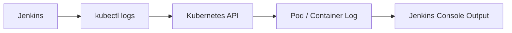

겉으로는 Jenkins가 애플리케이션 로그를 보관하고 있는 것처럼 보일 수 있다.

하지만 이런 구조라면 Jenkins는 로그 저장소가 아니다.

**Kubernetes에 있는 로그를 대신 조회하고 결과를 보여주는 실행 창구에 가깝다.**

그렇다면 Jenkins나 `kubectl logs`만으로 운영 환경의 로그를 모두 다룰 수 있을까?

---

## Pod에서 직접 로그를 조회하는 방식의 한계

Pod는 영구적인 서버가 아니다.

새로운 버전을 배포하거나 장애가 발생하면 기존 Pod가 사라지고 새로운 Pod가 만들어질 수 있다.

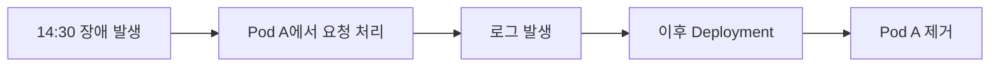

나중에 장애를 분석하려고 할 때 당시 요청을 처리했던 Pod가 이미 존재하지 않을 수 있다.

Replica가 여러 개라면 장애 당시 어떤 Pod가 요청을 처리했는지도 찾아야 한다.

즉 `kubectl logs`는 **현재 특정 실행 인스턴스를 확인하는 데는 유용하지만, 서비스의 로그를 장기간 보관하고 분석하기 위한 구조는 아니다.**

여기서 중앙 로그 수집이 필요한 이유가 생긴다.

---

## 로그를 중앙으로 수집하는 이유

운영 환경에서는 각 Container에서 발생하는 로그를 별도의 중앙 로그 플랫폼으로 지속적으로 전달할 수 있다.

예를 들어 각 Worker Node에 Log Agent가 실행되는 구조를 생각할 수 있다.

<div align="center">

</div>

Kubernetes에서는 Node마다 Agent를 배치하기 위해 DaemonSet을 사용하는 경우가 많다.

로그의 흐름을 단순화하면 다음과 같다.

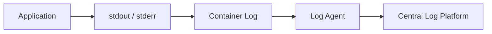

Datadog Agent, Fluent Bit, Filebeat 등의 도구가 이런 로그 수집 역할을 수행할 수 있다.

이 구조에서는 로그가 발생하면 별도의 시스템으로 지속적으로 전달된다.

따라서 이후 Pod가 제거되더라도 이미 수집된 로그는 중앙 시스템에서 조회할 수 있다.

여기서 처음 가졌던 두 번째 질문에 대한 답도 나온다.

**Jenkins와 Datadog에서 모두 로그를 볼 수 있지만, 실제로 로그를 가져오는 방식은 다르다.**

---

## 로그 조회와 로그 수집은 무엇이 다를까?

Jenkins가 `kubectl logs`를 사용하는 구조라면 필요한 순간에 Kubernetes API를 통해 현재 Pod의 로그를 조회한다.

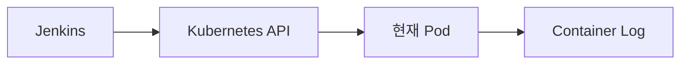

반면 중앙 로그 플랫폼은 각 실행 인스턴스에서 발생하는 로그를 지속적으로 별도의 시스템으로 수집한다.

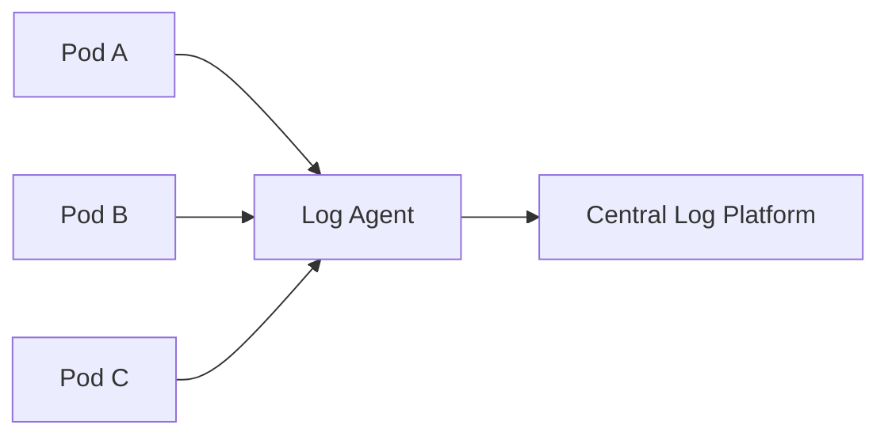

즉 둘 다 화면에서는 애플리케이션 로그를 보여주지만 구조적으로는 다르다.

```text
Jenkins / kubectl logs
→ 현재 실행 중인 Container의 로그를 필요할 때 조회

Central Log Platform
→ 여러 Container의 로그를 지속적으로 수집하고 저장
```

**"로그를 볼 수 있다"는 결과만 같을 뿐, 로그에 접근하는 방식은 서로 다르다.**

그런데 로그를 중앙에 모으는 것만으로 바로 `order-service`라는 하나의 서비스 로그가 만들어지는 것은 아니다.

---

## 분산된 Pod 로그를 서비스 단위로 묶는 방법

중앙 시스템에 로그를 수집해도 원본 로그는 여전히 서로 다른 Pod에서 발생했다.

```text
Pod A → Log
Pod B → Log
Pod C → Log
```

그래서 로그를 수집할 때 Kubernetes Metadata나 애플리케이션 정보를 함께 사용할 수 있다.

```text
service=order-service
namespace=production
pod=order-service-7d8f9c6b5-x2k9p
version=v2
level=ERROR
```

중앙 로그 플랫폼에서는 이 정보를 기준으로 로그를 다시 묶어 검색할 수 있다.

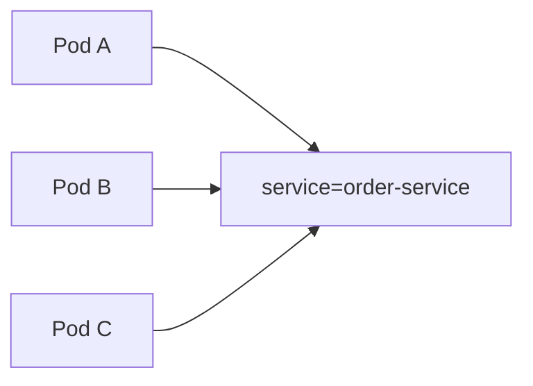

물리적으로는 서로 다른 Pod에서 발생한 로그지만 `service=order-service`라는 공통된 Context를 이용해 하나의 서비스 관점으로 볼 수 있는 것이다.

즉 우리가 중앙 로그 플랫폼에서 보는 **"서비스 로그"는 원래 하나였던 로그가 아니라, 분산된 로그를 Metadata를 이용해 다시 묶어 본 결과**에 가깝다.

하지만 MSA에서는 서비스 단위로 묶는 것만으로도 부족할 수 있다.

---

## MSA에서는 하나의 요청을 어떻게 따라갈까?

하나의 사용자 요청이 여러 서비스를 거쳐 처리될 수 있기 때문이다.

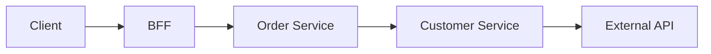

실제로는 각 Service의 특정 Pod가 요청을 처리한다.

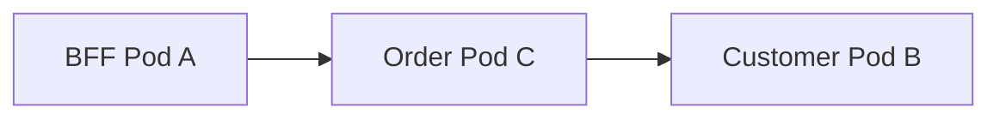

따라서 하나의 요청에서 발생한 로그 역시 여러 서비스와 Pod에 나뉘어 발생한다.

이때 Request ID나 Trace ID와 같은 Correlation 정보가 있으면 서로 다른 서비스에서 발생한 로그를 하나의 요청 기준으로 연결할 수 있다.

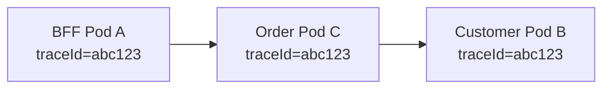

로그를 바라보는 단위가 한 단계씩 올라가는 것이다.

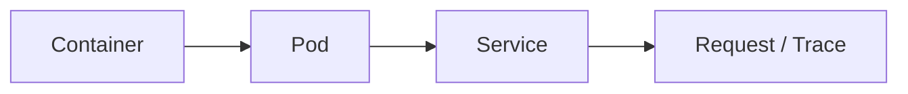

Container에서 실제 로그가 발생하고, 여러 Pod의 로그를 Service 단위로 묶는다.

그리고 MSA에서는 여러 Service에 분산된 로그를 다시 Request나 Trace 단위로 연결해야 하나의 요청 흐름을 따라갈 수 있다.

즉 중앙 로그 수집의 의미는 단순히 로그를 한곳에 저장하는 데 그치지 않는다.

**분산되어 발생한 로그에 Context를 부여하고 필요한 관점으로 다시 연결할 수 있게 만드는 것**까지 이어진다.

---

## 정리

처음 가졌던 의문은 두 가지였다.

> EKS의 Pod에서 애플리케이션이 실행되고 있는데, 별도의 EC2에서 실행되는 Jenkins에서는 어떻게 그 로그를 볼 수 있을까?

그리고

> Jenkins와 Datadog에서 모두 로그가 보이는데 둘은 같은 방식으로 로그를 가져오는 것일까?

로그가 발생하는 지점부터 따라가 보니 두 질문의 차이가 보였다.

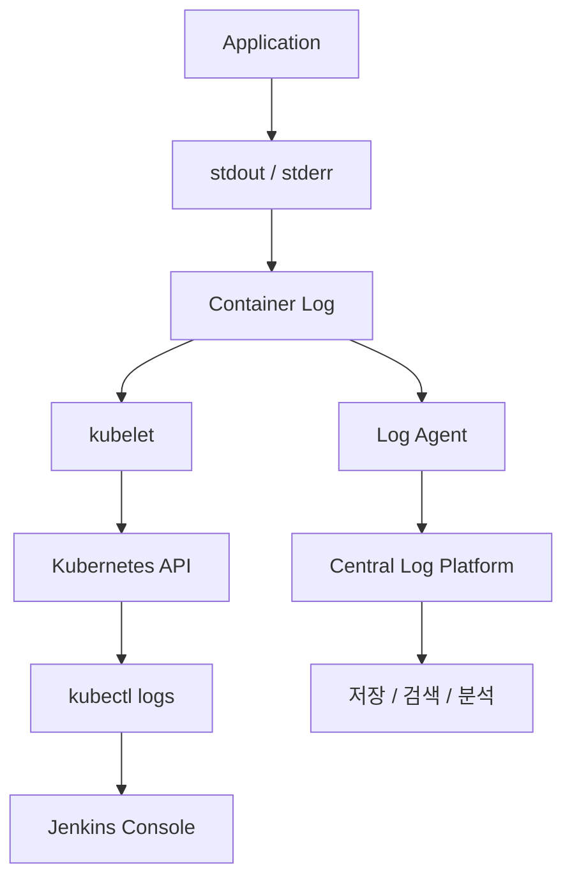

출발점은 같은 Container Log지만 이후 경로는 다르다.

Jenkins가 `kubectl logs`를 사용하는 구조라면 **Kubernetes API를 통해 현재 실행 중인 Container의 로그를 필요한 순간에 조회한다.**

반면 Datadog과 같은 중앙 로그 플랫폼은 **각 Container에서 발생하는 로그를 지속적으로 별도의 시스템에 수집하고 저장한다.**

그래서 Pod가 사라진 이후에도 과거 로그를 조회할 수 있고, 여러 Pod의 로그를 Service나 Trace와 같은 기준으로 다시 연결할 수 있다.

처음에는 `kubectl logs`, Jenkins, Datadog 모두 단순히 **"로그를 보는 곳"**이라고 생각했다.

하지만 내부 구조를 따라가 보니 중요한 차이는 어느 화면에서 로그를 보는지가 아니었다.

**로그가 어디에서 발생하고, 그 로그가 어떤 경로를 거쳐 지금 보고 있는 화면까지 도달했는지가 더 중요했다.**

```text
kubectl / Jenkins
→ 실행 중인 Container Log를 필요할 때 조회

Central Log Platform
→ 분산된 Container Log를 지속적으로 수집하고 저장
```

그리고 중앙으로 수집된 로그도 결국 Pod → Service → Request / Trace라는 Context를 통해 다시 연결해서 보게 된다.

결국 Kubernetes 환경에서 로그를 이해한다는 것은 단순히 `kubectl logs` 명령을 아는 것보다, **분산되어 발생한 로그가 어떤 경로로 조회되고 수집되며 다시 하나의 관점으로 연결되는지를 이해하는 것**에 더 가깝다고 생각한다.
