# Kubernetes 로그 이해하기

Kubernetes 기반 서비스를 운영하면서 애플리케이션 로그를 여러 방식으로 확인할 일이 있었다.

개발 환경에서는 `kubectl logs`를 이용해 특정 Pod의 로그를 직접 확인할 수 있다.

```bash
kubectl logs <pod-name> -n <namespace>
```

한편 Jenkins에서도 각 MSA 서비스의 로그를 확인할 수 있었고, 운영 모니터링에서는 Datadog을 통해 로그를 검색할 수도 있었다.

처음에는 모두 단순히 **"애플리케이션 로그를 보는 방법"** 정도로 생각했다.

그런데 구조를 생각해보니 한 가지 의문이 생겼다.

애플리케이션은 EKS의 Pod에서 실행되고 있는데 Jenkins는 별도의 EC2 Instance에서 실행된다.

```text
EC2
└── Jenkins


EKS Cluster
└── Pod
    └── Application
```

**그렇다면 EKS 밖에 있는 Jenkins에서는 어떻게 각 Pod의 애플리케이션 로그를 볼 수 있는 것일까?**

그리고 Jenkins와 Datadog 모두 로그를 볼 수 있다면 둘은 같은 방식으로 로그를 가져오는 것일까?

이 질문을 따라가 보니 중요한 것은 단순히 로그를 **"볼 수 있다"**는 결과가 아니었다.

**애플리케이션에서 로그가 어디에 발생하고, 각 도구가 그 로그에 어떤 방식으로 접근하는지를 구분해서 볼 필요가 있었다.**

이 글에서는 Kubernetes 애플리케이션의 로그가 어디에서 시작되는지부터 따라가면서 `kubectl logs`, Jenkins를 통한 로그 조회, 중앙 로그 수집이 각각 어떤 구조로 동작하는지 살펴보고자 한다.

---

## 애플리케이션 로그는 어디에서 시작될까?

Kubernetes에서 애플리케이션은 Pod 내부의 Container에서 실행된다.

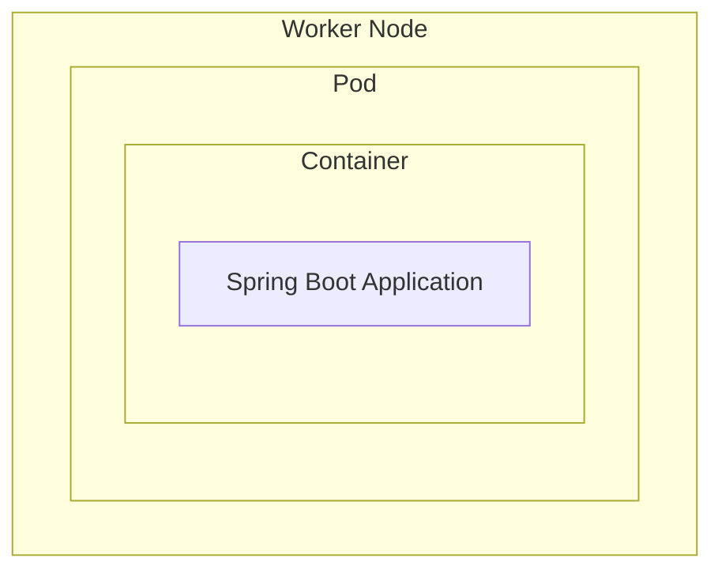

Spring Boot 애플리케이션에서 다음과 같이 로그를 남긴다고 해보자.

```java
log.info("Order created. orderId={}", orderId);
log.error("Order creation failed.", e);
```

Container 환경에서는 일반적으로 애플리케이션 로그를 `stdout`, `stderr`와 같은 표준 스트림으로 출력한다.

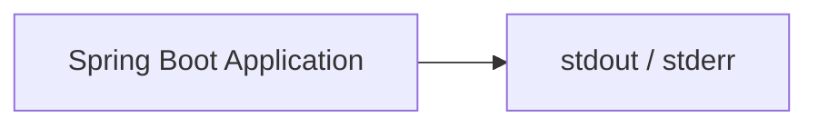

Container Runtime은 이 출력을 받아 Container의 로그로 관리한다.

전체 흐름을 단순화하면 다음과 같다.

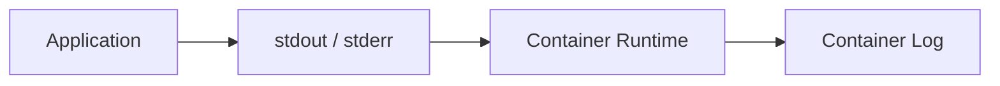

즉 처음부터 `order-service.log`와 같은 하나의 서비스 로그가 Kubernetes 어딘가에 존재하는 것은 아니다.

**로그는 실제 애플리케이션이 실행되는 각각의 Container에서 발생한다.**

---

## kubectl logs는 어떤 로그를 보는 것일까?

개발 중에는 다음과 같이 로그를 확인할 수 있다.

```bash
kubectl logs order-service-7d8f9c6b5-x2k9p -n order-dev
```

처음에는 `kubectl`이 해당 서버에 접속해서 로그 파일을 직접 읽어오는 것처럼 생각할 수도 있다.

하지만 `kubectl`은 Kubernetes API를 사용하는 Client다.

로그 조회 역시 Kubernetes API를 통해 이루어진다.

개념적인 흐름은 다음과 같다.

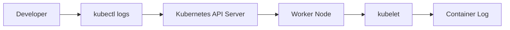

즉 개발자가 Worker Node에 직접 SSH로 접속해서 로그 파일을 찾는 구조가 아니다.

Kubernetes에 **"이 Pod의 Container 로그를 보여달라."** 고 요청하고 있는 것이다.

그래서 `kubectl logs`의 기본적인 조회 단위도 Service가 아니라 **Pod와 Container**다.

```bash
kubectl logs <pod-name>
```

하나의 Pod 안에 여러 Container가 있다면 Container까지 지정할 수 있다.

```bash
kubectl logs <pod-name> -c <container-name>
```

여기서 로그를 보는 방식에 대한 첫 번째 구조가 드러난다.

> `kubectl logs`는 로그를 별도로 저장하는 시스템이 아니라, **Kubernetes API를 통해 특정 Pod의 Container 로그를 조회하는 명령**이다.

---

## 하나의 서비스 로그는 실제로 여러 곳에 존재한다

Deployment가 애플리케이션을 세 개의 Replica로 실행하고 있다고 해보자.

```text
order-service

├── Pod A
├── Pod B
└── Pod C
```

각 Pod에는 동일한 애플리케이션이 실행되지만 각각 별도의 Container다.

따라서 로그 역시 각각 발생한다.

```text
Pod A → Container Log A

Pod B → Container Log B

Pod C → Container Log C
```

사용자의 요청이 Service를 통해 Pod B로 전달되었다면 해당 요청의 애플리케이션 로그 역시 Pod B에서 발생한다.

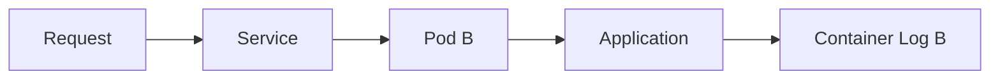

따라서 `kubectl logs Pod-A`만 보고 있다면 해당 요청의 로그를 찾을 수 없다.

우리가 흔히

```text
"order-service 로그를 확인한다."
```

라고 표현하지만 Kubernetes의 실제 실행 구조에서는 하나의 로그가 존재하는 것이 아니다.

[논리적인 관점]
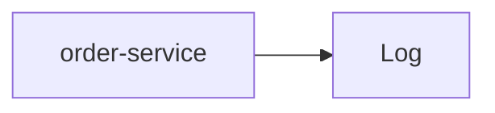

[실제 실행 관점]
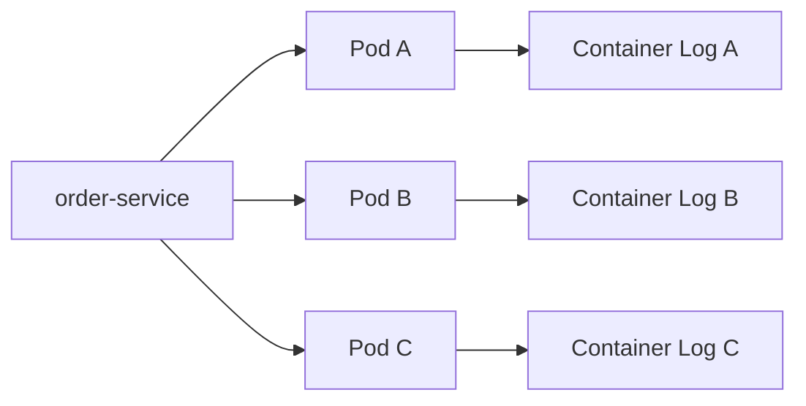

**하나의 서비스 로그가 여러 실행 인스턴스에 분산되어 있는 셈이다.**

---

## 그렇다면 EKS 밖의 Jenkins는 어떻게 Pod 로그를 볼까?

여기서 처음 가졌던 의문으로 돌아가 보자.

Jenkins는 별도의 EC2 Instance에서 실행되고 있다.

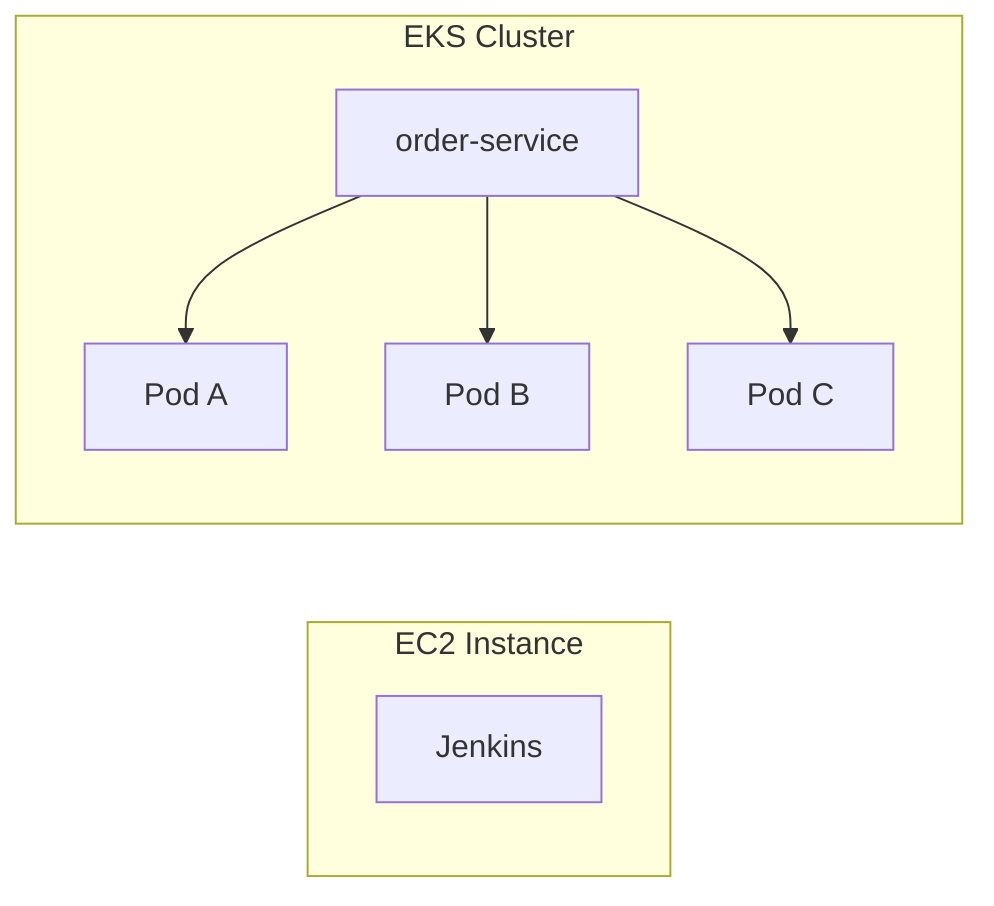

그런데 Jenkins에서 각 MSA 서비스의 로그를 확인할 수 있다.

처음에는 Jenkins가 각 Worker Node의 로그를 따로 수집하고 있는 것인가 생각할 수 있다.

하지만 반드시 그럴 필요는 없다.

앞에서 `kubectl logs`의 구조를 보면 Jenkins 역시 Kubernetes API에 접근할 수 있다면 동일한 방식으로 Pod의 로그를 조회할 수 있다.

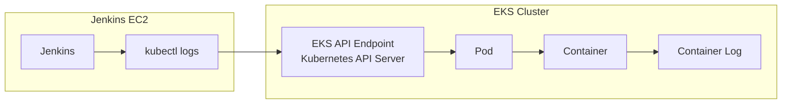

즉 Jenkins가 Worker Node와 다른 EC2 Instance에서 실행되고 있다는 것은 문제가 되지 않는다.

중요한 것은 Jenkins와 EKS가 같은 환경에 있는지가 아니다.

Jenkins가 실행되는 환경에서 **EKS API Endpoint에 접근할 수 있고, Kubernetes 인증을 거쳐 해당 Namespace와 Pod의 로그를 조회할 권한이 있는지**가 중요하다.

이러한 조건이 갖춰져 있다면 Jenkins가 별도의 EC2 Instance에서 실행되고 있더라도 Kubernetes API를 통해 Pod의 로그를 조회할 수 있다.

이는 Jenkins에서 EKS에 애플리케이션을 배포할 수 있었던 구조와도 연결된다.

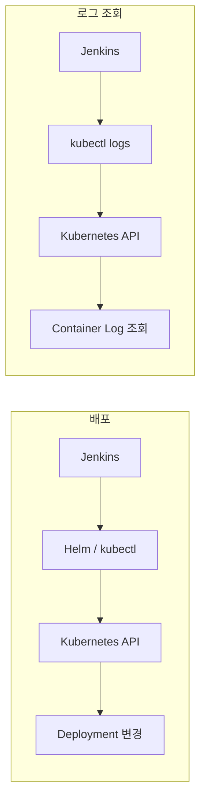

결국 Jenkins가 EKS 내부에 있어서 가능한 것이 아니다.

**Jenkins가 Kubernetes API를 사용할 수 있는 Client 역할을 할 수 있기 때문에 가능한 것이다.**

---

## Jenkins에서 "서비스 로그 조회"는 어떻게 만들 수 있을까?

실제 Jenkins 화면에서는 사용자가 Pod 이름을 직접 입력하지 않고 서비스만 선택해 로그를 볼 수도 있다.

예를 들어 다음과 같은 형태다.

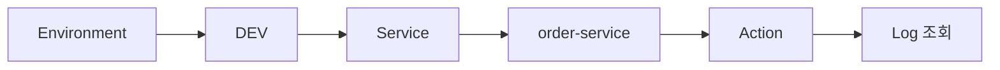

내부적으로는 먼저 해당 서비스의 Pod를 조회하고

```bash
kubectl get pods -n order-dev -l app=order-service
```

찾은 Pod를 대상으로 로그를 조회하는 스크립트를 실행할 수 있다.

```bash
kubectl logs <pod-name> -n order-dev
```

그 결과를 Jenkins Console Output에 출력하면 사용자는 Jenkins 화면에서 로그를 볼 수 있다.

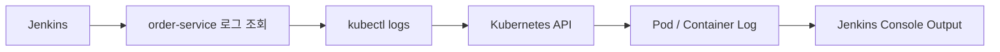

겉으로는 Jenkins가 애플리케이션 로그를 가지고 있는 것처럼 보인다.

하지만 이 구조라면 Jenkins는 로그 저장소가 아니다.

**Kubernetes에 있는 Container 로그를 조회하고 그 결과를 사용자에게 보여주는 실행 창구에 가깝다.**

---

## Pod 로그만으로는 충분하지 않은 이유

여기까지 보면 Jenkins나 `kubectl logs`만 있어도 충분해 보일 수 있다.

하지만 Kubernetes에서는 한 가지 중요한 특성이 있다.

Pod는 영구적인 서버가 아니다.

새로운 버전을 배포하면 기존 Pod가 사라지고 새로운 Pod가 만들어진다.


[Before]
```text
Pod v1
Pod v1
Pod v1
```

↓ Deployment

[After]
```text
Pod v2
Pod v2
Pod v2
```

장애나 Node 상태에 따라서도 Pod는 다시 생성될 수 있다.

즉 특정 Pod는 서비스가 실행되는 **일시적인 실행 인스턴스**에 가깝다.

로그 관점에서는 이것이 중요한 문제가 된다.

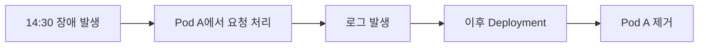

나중에 장애 원인을 분석하려고 할 때 당시 Pod가 이미 존재하지 않을 수 있다.

또 Replica가 여러 개라면 장애 당시 어떤 Pod에서 문제가 발생했는지 일일이 찾아야 한다.

따라서 특정 Pod의 로그를 필요할 때 조회하는 방식만으로는 운영 환경의 로그 분석에 한계가 있다.

---

## 로그를 중앙으로 수집하는 이유

운영 환경에서는 각 Container에서 발생하는 로그를 별도의 중앙 로그 플랫폼으로 지속적으로 전달할 수 있다.

예를 들어 각 Worker Node에 Log Agent가 실행되는 구조를 생각할 수 있다.

<div align="center">

</div>

Kubernetes에서는 Node마다 Agent를 배치하기 위해 DaemonSet을 사용하는 경우가 많다.

로그의 흐름은 다음과 같이 볼 수 있다.

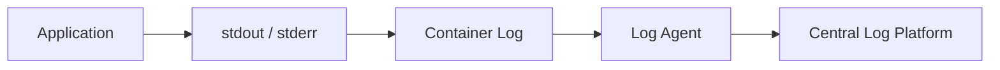

Datadog Agent, Fluent Bit, Filebeat 등의 도구가 이런 로그 수집 역할을 수행할 수 있다.

이 구조에서는 Pod가 사라지기 전에 로그가 외부 시스템으로 전달된다.

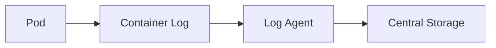

따라서 이후 Pod가 제거되더라도 이미 수집된 로그는 중앙 시스템에서 조회할 수 있다.

---

## Jenkins의 로그 조회와 중앙 로그 수집은 무엇이 다를까?

처음에는 Jenkins에서도 로그를 볼 수 있고 Datadog에서도 로그를 볼 수 있기 때문에 비슷한 역할처럼 느껴질 수 있었다.

하지만 내부 흐름을 따라가 보면 전혀 다른 방식이다.

Jenkins에서 `kubectl logs`를 실행하는 구조라면

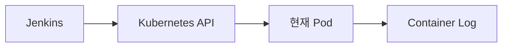

이다.

**필요한 순간에 원본 실행 인스턴스의 로그를 조회한다.**

반면 중앙 로그 플랫폼은

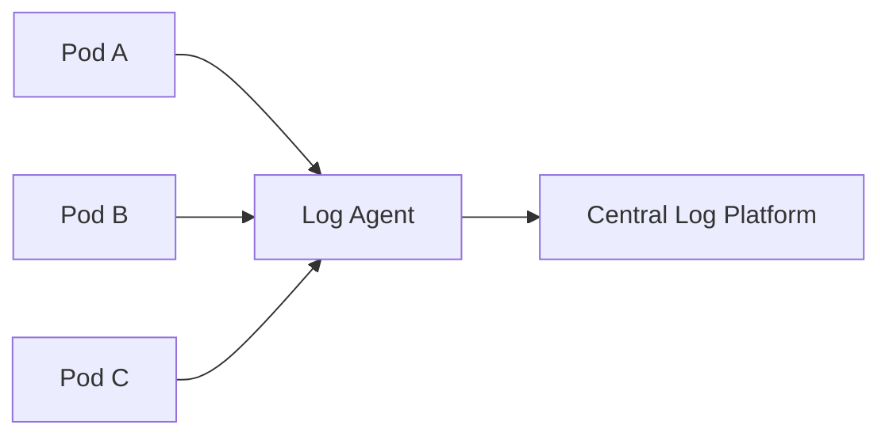

처럼 동작한다.

**각 실행 인스턴스에서 발생하는 로그를 지속적으로 별도의 시스템에 수집한다.**

따라서 둘의 차이는 단순히 UI가 다른 것이 아니다.

[Jenkins / kubectl logs — 필요할 때 조회]
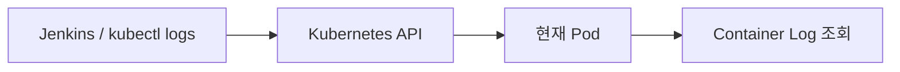

[Central Log Platform — 지속적으로 수집]
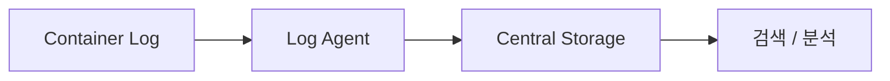

결과적으로 둘 다 화면에서 애플리케이션 로그를 보여주지만 **로그에 접근하는 방식 자체가 다르다.**

---

## 분산된 Pod 로그를 서비스 단위로 묶는 방법

로그를 중앙으로 수집했다고 해서 자동으로 하나의 서비스 로그가 되는 것은 아니다.

실제 로그는 여전히 서로 다른 Pod에서 발생했다.

```text
Pod A → Log
Pod B → Log
Pod C → Log
```

그래서 로그를 수집할 때 Kubernetes Metadata나 애플리케이션 정보를 함께 사용한다.

예를 들면 다음과 같다.

```text
service=order-service
namespace=production
pod=order-service-7d8f9c6b5-x2k9p
version=v2
level=ERROR
```

중앙 로그 플랫폼에서는 이 정보를 이용해 로그를 다시 묶을 수 있다.

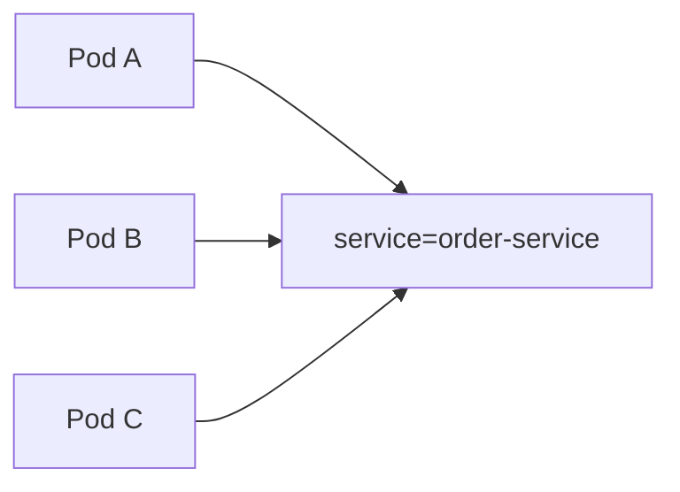

사용자 입장에서는

```text
service:order-service
level:ERROR
```

같은 조건으로 검색하면서 하나의 서비스 로그를 보고 있다고 느끼게 된다.

하지만 실제 구조에서는 **여러 실행 인스턴스에서 발생한 로그를 Metadata를 기준으로 논리적으로 묶어서 보고 있는 것**이다.

---

## MSA에서는 서비스 단위만으로도 부족할 수 있다

중앙 로그 플랫폼을 사용하면 여러 Pod에서 발생한 로그를 `service=order-service`와 같은 기준으로 묶어서 볼 수 있다.

하지만 MSA에서는 서비스 단위로 로그를 모으는 것만으로 충분하지 않은 경우가 있다.

하나의 사용자 요청이 여러 서비스를 거쳐 처리될 수 있기 때문이다.

```mermaid
flowchart LR
    C["Client"] --> B["BFF"]
    B --> O["Order Service"]
    O --> U["Customer Service"]
    U --> E["External API"]
```

실제 Kubernetes 환경에서는 각 Service의 특정 Pod가 요청을 처리한다.

```mermaid
flowchart LR
    B["BFF Pod A"] --> O["Order Pod C"]
    O --> C["Customer Pod B"]
```

따라서 하나의 요청에서 발생한 로그 역시 여러 서비스와 Pod에 나뉘어 발생한다.

예를 들어 `Order Service`의 로그만 보고 있다면 해당 요청이 `Customer Service`를 호출한 이후 어떤 문제가 발생했는지 전체 흐름을 파악하기 어렵다.

이때 Request ID나 Trace ID와 같은 Correlation 정보를 이용하면 서로 다른 서비스에서 발생한 로그를 하나의 요청 기준으로 연결할 수 있다.

```mermaid
flowchart LR
    B["BFF Pod A<br/>traceId=abc123"]
    O["Order Pod C<br/>traceId=abc123"]
    C["Customer Pod B<br/>traceId=abc123"]

    B --> O
    O --> C
```

결국 로그를 바라보는 단위도 실행 구조에 따라 달라진다.

```mermaid
flowchart LR
    C["Container"] --> P["Pod"]
    P --> S["Service"]
    S --> R["Request / Trace"]
```

Container에서는 실제 로그가 발생하고, 여러 Pod의 로그를 Service 단위로 묶어 볼 수 있다.

그리고 MSA에서는 여러 Service에 분산된 로그를 다시 Request나 Trace 단위로 연결해야 하나의 요청 흐름을 따라갈 수 있다.

즉 중앙 로그 수집의 의미는 단순히 로그를 한곳에 저장하는 데 그치지 않는다.

**분산되어 발생한 로그에 Context를 부여하고, 필요한 관점으로 다시 연결할 수 있게 만드는 것**도 중요한 역할이다.

---

## 처음 생각했던 "로그를 본다"와 실제 구조

처음에는 `kubectl logs`, Jenkins, Datadog 모두 애플리케이션 로그를 확인하는 서로 다른 방법 정도로 생각했다.

사용자 입장에서는 실제로 모두 로그를 보여준다.

하지만 지금까지 내부 구조를 따라가 보면 같은 **"로그 조회"** 뒤에서도 로그가 이동하는 방식은 다르다.

`kubectl logs`는 Kubernetes API를 통해 현재 Pod의 Container Log를 조회한다.

```mermaid
flowchart LR
    K["kubectl logs"] --> API["Kubernetes API"]
    API --> P["현재 Pod"]
    P --> L["Container Log"]
```

Jenkins가 내부적으로 `kubectl logs`를 사용하는 구조라면 Jenkins 역시 같은 경로를 이용한다.

```mermaid
flowchart LR
    J["Jenkins"] --> K["kubectl logs"]
    K --> API["Kubernetes API"]
    API --> P["현재 Pod"]
    P --> L["Container Log"]
```

반면 Datadog과 같은 중앙 로그 플랫폼은 필요한 순간에 원본 Pod를 조회하는 구조가 아니다.

각 실행 인스턴스에서 발생한 로그를 지속적으로 별도의 시스템으로 수집한다.

```mermaid
flowchart LR
    P1["Pod A"] --> A["Log Agent"]
    P2["Pod B"] --> A
    P3["Pod C"] --> A

    A --> S["Central Log Platform"]
    S --> Q["저장 / 검색 / 분석"]
```

결과적으로 세 방식 모두 화면에서는 애플리케이션 로그를 보여줄 수 있지만 역할은 다르다.

- `kubectl logs`는 **현재 실행 중인 Container의 로그를 조회한다.**
- Jenkins가 `kubectl logs`를 이용한다면 **Kubernetes 로그 조회를 실행하고 그 결과를 보여주는 창구가 된다.**
- 중앙 로그 플랫폼은 **분산된 Container 로그를 지속적으로 수집하고 저장한 뒤 검색할 수 있게 한다.**

즉 **"로그를 볼 수 있다"는 결과만 같을 뿐, 로그에 접근하고 관리하는 방식은 서로 다르다.**

---

## 정리

처음 가졌던 의문은 단순했다.

> EKS의 Pod에서 애플리케이션이 실행되고 있는데, 별도의 EC2에서 실행되는 Jenkins에서는 어떻게 그 로그를 볼 수 있을까?

이 질문을 따라가면서 로그가 실제로 발생하는 지점부터 다시 살펴봤다.

전체 구조를 연결하면 다음과 같다.

```mermaid
flowchart TB
    APP["Application"]
    STD["stdout / stderr"]
    LOG["Container Log"]

    APP --> STD
    STD --> LOG

    LOG --> K8S["Kubernetes API"]
    K8S --> KUBECTL["kubectl logs"]
    KUBECTL --> J["Jenkins Console"]

    LOG --> AGENT["Log Agent"]
    AGENT --> CENTRAL["Central Log Platform"]
    CENTRAL --> SEARCH["저장 / 검색 / 분석"]
```

출발점은 같다.

애플리케이션이 `stdout`, `stderr`로 출력한 로그가 Container Log로 관리된다.

하지만 그 이후에는 로그를 사용하는 방식이 나뉜다.

`kubectl logs`는 Kubernetes API를 통해 현재 Container의 로그를 **필요한 시점에 조회**한다. Jenkins 역시 Kubernetes API에 접근할 수 있는 환경이라면 이 방식을 이용해 EKS 외부에서도 Pod의 로그를 확인할 수 있다.

반면 중앙 로그 플랫폼은 각 Container에서 발생하는 로그를 **지속적으로 수집하고 별도의 시스템에 저장**한다. 그래서 Pod가 교체되더라도 과거 로그를 조회할 수 있고, 여러 Pod의 로그를 Service나 Trace와 같은 기준으로 다시 연결할 수 있다.

처음에는 Jenkins나 Datadog에서 로그가 보인다는 결과만 보고 모두 비슷한 역할이라고 생각하기 쉬웠다.

하지만 내부 구조를 따라가 보니 중요한 차이는 **어디에서 로그를 보는지가 아니라, 그 로그가 어디에서 발생했고 어떤 경로를 거쳐 현재 화면까지 도달했는지**에 있었다.

```text
kubectl / Jenkins
→ 실행 중인 Container의 로그를 필요할 때 조회

Central Log Platform
→ 분산된 Container 로그를 지속적으로 수집하고 저장
```

이 차이를 이해하고 나니 Kubernetes 환경에서 로그를 확인할 때도 단순히 "어느 화면에서 검색할까?"보다 먼저 **지금 보고 있는 로그의 원본은 어디에 있고, 이 도구는 그 로그를 직접 조회하는지 아니면 별도로 수집한 데이터를 보여주는지**를 생각하게 됐다.

결국 Kubernetes의 로그 역시 하나의 기능으로만 볼 때보다, **Application → Container → Kubernetes → Log Consumer**로 이어지는 흐름을 따라가 보면 각 도구의 역할이 훨씬 명확해지는 것 같다.
