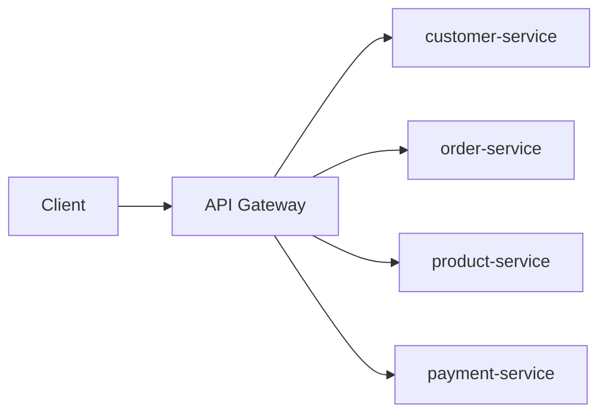
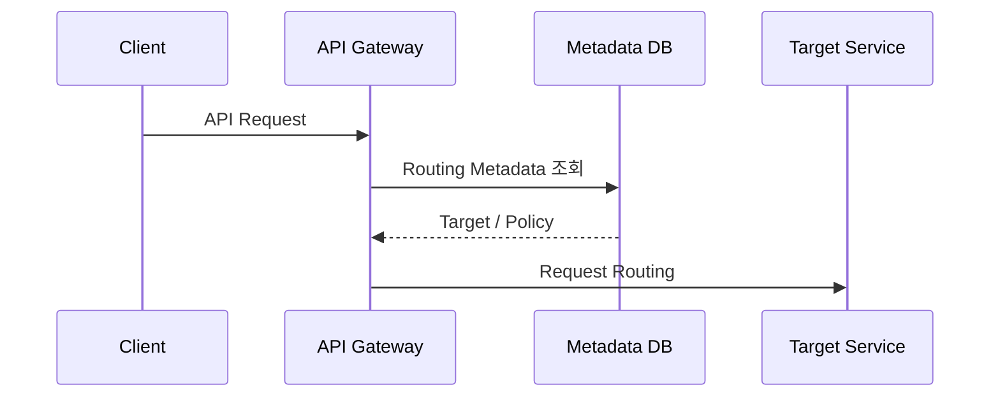
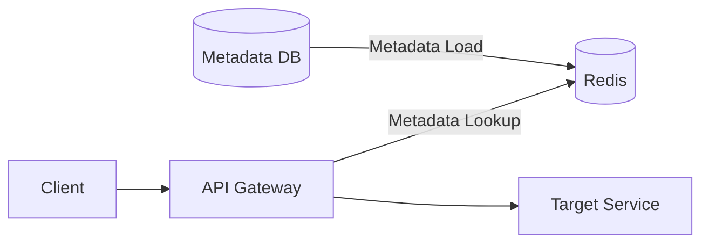
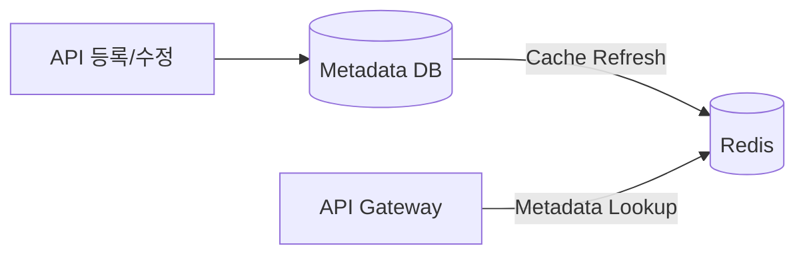
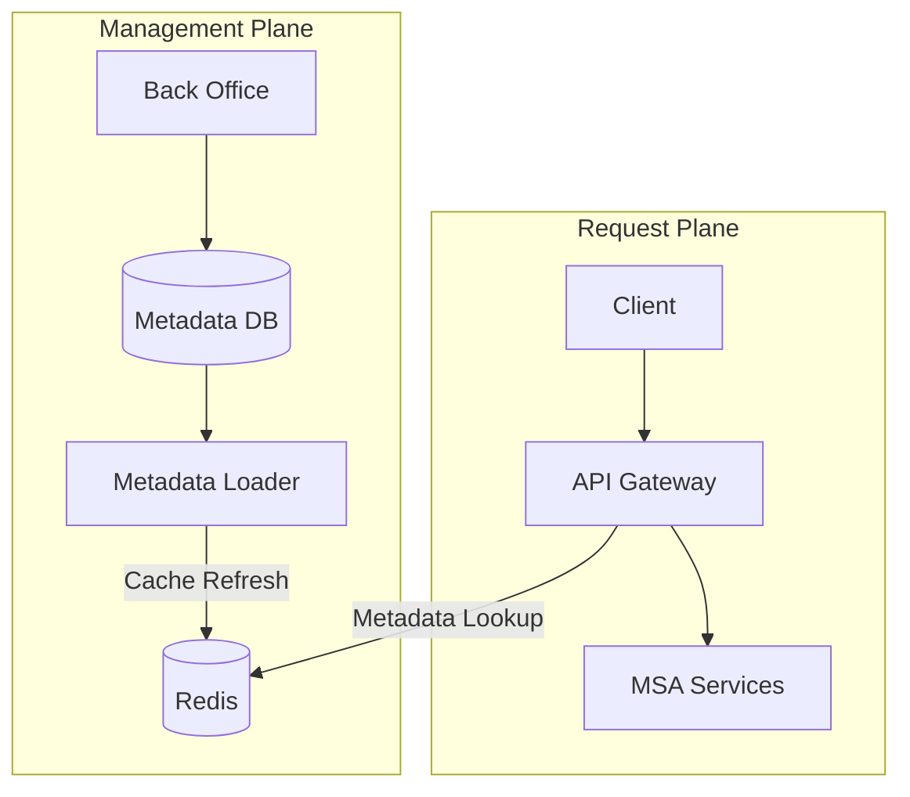
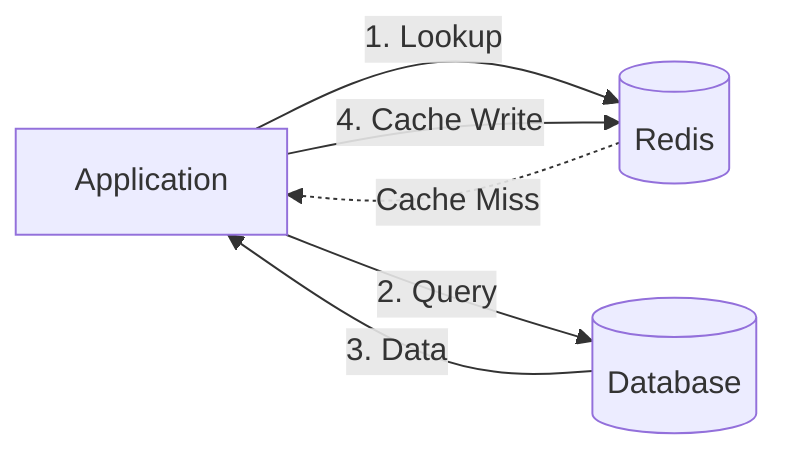
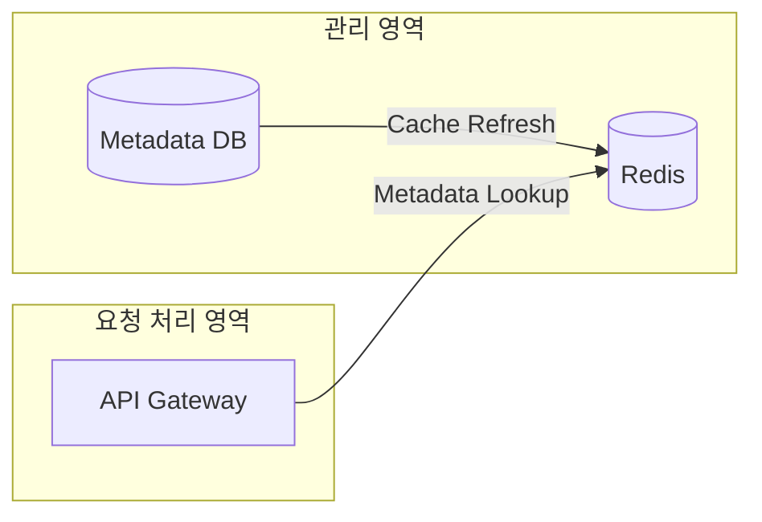
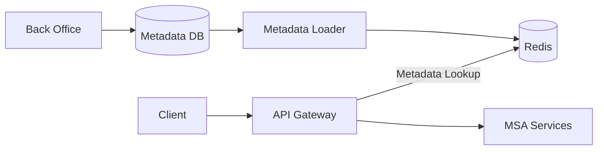

# API Gateway는 왜 Redis를 사용할까?

MSA 기반 서비스를 운영하다 보면 새로운 API를 개발하는 것만으로 작업이 끝나지 않는 경우가 있다. API의 URL이나 이름 같은 정보를 관리 시스템에 등록하고, 별도의 **캐시 반영 과정**을 거쳐야 실제 요청에서 사용할 수 있는 구조가 그 예시이다.

이에 대해 API를 호출하는 것과 Redis가 어떤 관계가 있을까에 대한 의문이 들었다. Redis라고 하면 보통 DB 조회 결과를 캐싱하는 모습을 떠올린다.

```text
Application → Redis (Cache Hit → 바로 반환) / Cache Miss → DB
```

하지만 대규모 MSA 환경에서는 Redis가 반드시 비즈니스 데이터만 캐싱하는 게 아니다. API Gateway가 요청을 처리하기 위해 사용하는 **API 메타데이터** 역시 캐싱 대상이 될 수 있다.

이 글에서는 특정 시스템의 구현이 아닌, 일반적인 대규모 MSA 구조를 기준으로 **API Gateway와 Redis가 어떻게 연결될 수 있는지** 정리해보고자 한다.

---

## MSA에서는 요청을 어디로 보내야 할까

하나의 애플리케이션으로 구성된 서비스라라면 요청을 처리할 서버를 정하는 과정이 단순하겠지만, 서비스가 여러 애플리케이션으로 분리된 MSA에서는 이야기가 달라진다.



`GET /api/v1/products/123`와 같은 요청이 들어오면 Gateway는 해당 요청을 `product-service`로 전달해야 한다. 그러려면 최소한 아래와 같은 정보가 필요하다.

```text
Path    : /api/v1/products/**
Method  : GET
Target  : product-service
Timeout : 3s
Auth    : Required
```

Gateway가 요청을 처리하기 위해 쓰는 이런 정보를 **API 메타데이터**라고 볼 수 있다.

---

## API 메타데이터를 DB에서 바로 조회하면 안 될까?

가장 단순하게는 API 정보를 DB에 저장하고 Gateway가 필요할 때 조회하면 된다.



기능적으로는 문제가 없다. 하지만 Gateway는 일반적인 서비스들과는 달리, 대부분의 요청이 통과하는 위치에 있다. 요청을 처리할 때마다 DB에서 메타데이터를 조회한다면 트래픽이 증가할 수록 메타데이터 DB 조회도 함께 증가한다.

```text
1 Request        → 1 Metadata Query
10,000 Requests  → 10,000 Metadata Queries
```

더 중요한 문제는 **Gateway의 요청 처리 경로에 DB가 끼어든다는 것**이다. Metadata DB가 느려지거나 장애가 발생하면 실제 비즈니스 서비스가 정상이어도 Gateway가 요청을 전달하지 못할 수 있다. Gateway처럼 요청이 집중되는 컴포넌트는 처리 경로를 가능한 가볍게 유지할 필요가 있다.

---

## 여기서 Redis를 사용할 수 있다

API 메타데이터는 **조회는 매우 많지만 변경은 상대적으로 적다.** 상품 가격이나 주문 상태처럼 지속적으로 변경되는 데이터와 달리, API의 URL·HTTP Method·Routing 정보 같은 설정은 매 요청마다 바뀌지 않는다. 이러한 데이터는 캐싱하기 좋은 대상이다.



관리 영역에서는 API 메타데이터를 DB에 저장하고, 변경된 메타데이터를 Redis에 반영한다. 실제 사용자 요청을 처리하는 Gateway는 DB 대신 Redis에 올라온 정보를 빠르게 조회한다.

```text
Metadata DB  → API 설정의 원본 저장
Redis        → 요청 처리에 쓸 메타데이터 캐시
API Gateway  → Redis의 메타데이터로 요청 처리
```

Redis가 DB를 대체하는 것이 아니라 **DB에 있는 정보를 요청 처리에 적합한 형태로 제공하는 계층**이 되는 것이다.

---

## 그래서 별도의 캐시 반영 과정이 필요하다

이 구조를 보면 처음 가졌던 의문도 풀린다. API 정보를 DB에 등록했더라도, Gateway가 실제로 바라보는 데이터가 Redis라면 **DB의 변경만으로는 Gateway에 변경사항이 반영되지 않는다.** DB에 새 설정이 저장돼도 Redis가 갱신되지 않았다면 Gateway는 여전히 이전 메타데이터를 사용하게 된다.



이 관점에서 **캐시 배포(캐시 갱신)**는 단순히 Redis에 데이터를 넣는 작업이 아니라, 관리 영역에서 변경된 설정을 실제 트래픽을 처리하는 영역에 반영하는 과정이라고 볼 수 있다.

---

## Metadata Loader를 분리할 수도 있다

시스템 규모가 커지면 DB의 데이터를 읽어 Redis에 적재하는 책임을 Gateway가 직접 수행하지 않고 별도 컴포넌트로 분리할 수 있다.

예를 들어 `Metadata Loader`라는 컴포넌트를 둔다고 해보자.



`Metadata Loader`는 **설정을 Redis에 반영하는 역할**을 담당하고, `API Gateway`는 **현재 반영된 설정을 이용해 요청을 처리하는 역할**에 집중한다. 설정 변경과 실제 사용자 트래픽 처리가 분리되면서, Gateway가 직접 DB를 읽고 캐시를 관리하는 책임까지 가지는 것보다 각 컴포넌트의 역할이 명확해진다.

---

## 일반적인 Cache-Aside와는 조금 다르다

처음 Redis를 공부했을 때 익숙했던 구조는 Cache-Aside였다.



Cache-Aside에서는 애플리케이션이 Redis를 먼저 조회하고, 원하는 데이터가 없다면 DB에서 가져와 다시 Redis에 채운다. 즉 **실제 요청을 처리하는 과정에서 Cache Miss가 발생하면 그때 DB 조회가 이루어진다.**

반면 API 메타데이터처럼 조회는 많고 변경은 적은 데이터는 다른 방식으로 관리할 수 있다.



요청이 들어왔을 때 Cache Miss를 계기로 DB를 조회하는 게 아니라, **설정이 변경되는 시점에 미리 Redis를 갱신**해두는 것이다. Gateway 입장에서는 요청 처리 중 DB까지 내려갈 필요가 없다. 결국 같은 Redis 캐싱이라도 **어떤 데이터를 캐싱하고 언제 갱신하는지에 따라 아키텍처가 달라진다.**

---

## Redis가 장애 나면 어떻게 될까

Gateway가 Redis에 의존한다면 Redis 장애는 곧 Gateway 장애로 이어질 수 있다. DB 조회를 없애면서 요청 경로는 빨라졌지만, 대신 새로운 의존성이 생긴 것이다.

```text
Client → Gateway → Redis(장애) → X → Target Service
```

그래서 실제 대규모 서비스에서는 Redis를 하나 두는 것으로 끝나지 않는다. Redis 자체의 고가용성(HA, High Availability)을 구성하거나, Gateway 내부에 로컬 캐시를 한 단계 더 두거나, Redis 장애 시 기존 설정을 그대로 유지하는 등의 전략을 함께 고려할 수 있다.

뿐만 아니라 메타데이터가 변경되는 순간에는 **DB와 Redis의 데이터가 일시적으로 달라질 수 있는 문제**도 생길 수 있다.

결국 캐시를 도입하면 성능 문제 하나가 사라지는 대신 아래와 같은 새롭게 고려해야할 문제들이 추가된다.

```text
Cache Invalidation
Consistency
High Availability
Failure Handling
```

Redis를 사용하는 것 자체보다 **Redis에 장애가 발생하거나 최신 메타데이터가 최신이 아닌 상태(stale data)에서 시스템이 어떻게 동작할 것인지 결정하는 것**이 더욱 중요해진다.

---

## 정리

처음에는 Redis를 단순히 DB 조회 결과를 빠르게 가져오기 위한 캐시 정도로 생각했다. 하지만 대규모 MSA 환경에서는 Redis를 조금 다르게 활용할 수도 있다.



API Gateway가 요청을 처리하는 데 필요한 메타데이터는 **조회 빈도가 높고 변경 빈도가 낮기 때문에 캐싱하기 좋은 데이터**이다. 그리고 관리 영역에서 설정을 바꾼 뒤 Redis에 별도로 반영하는 구조라면, 왜 API를 등록한 뒤에도 별도의 캐시 갱신 과정이 필요한지 이해할 수 있다.

결국 중요한 건 Redis 자체가 아니라 **어떤 데이터를 요청 경로에서 분리하고, 그 데이터를 언제 어떻게 갱신할 것인가에 대한 아키텍처 선택**이었다. Redis를 공부하면서 오히려 API Gateway가 요청 하나를 전달하기 위해 어떤 정보를 필요로 하는지, 대규모 서비스에서 관리 영역과 실제 트래픽 처리 영역을 왜 분리하는지까지 함께 이해할 수 있었다.

다만 여기서 또 다른 질문이 남는다. **Redis가 API Gateway의 메타데이터를 관리하는 최선의 방법일까?** 로컬 캐시를 사용할 수도 있고, DB를 직접 조회할 수도 있고, Redis와 로컬 캐시를 함께 사용할 수도 있다. 또한 Redis를 사용한다면 장애 상황과 DB-Cache 간 정합성 문제도 고려해야 한다. 이러한 선택지와 trade-off는 다음에 더 깊게 다뤄보고자 한다.
