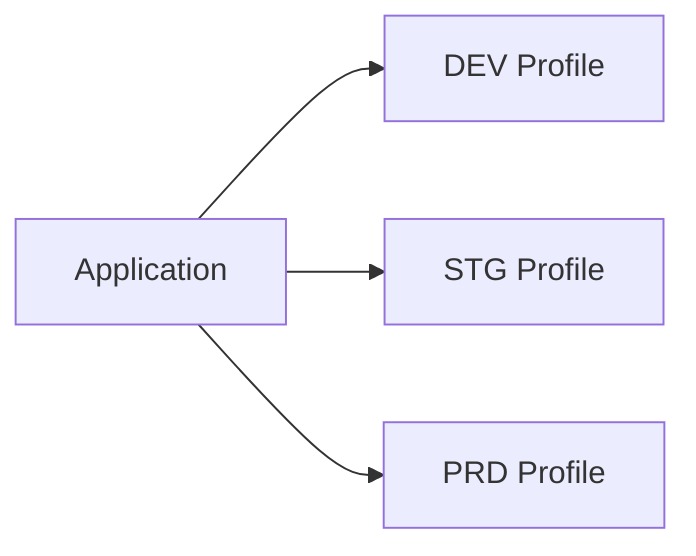
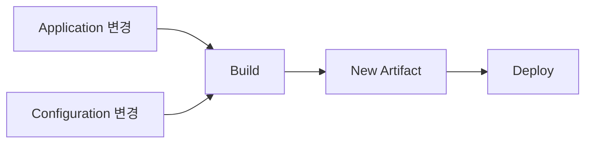
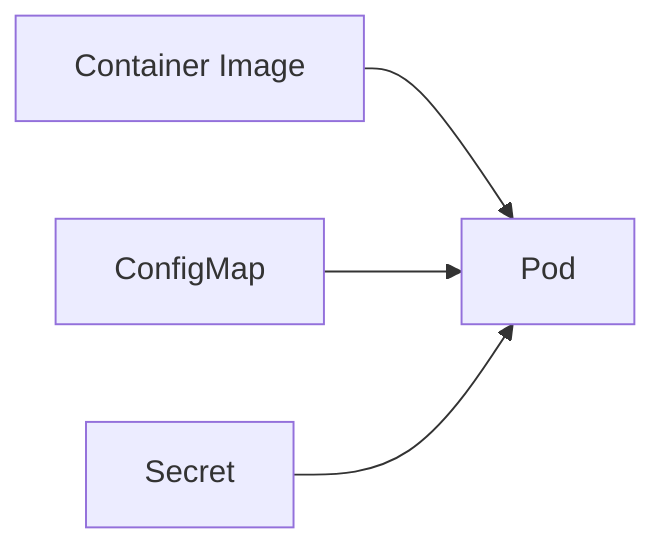
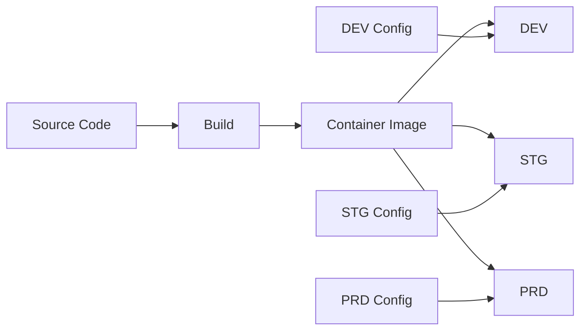
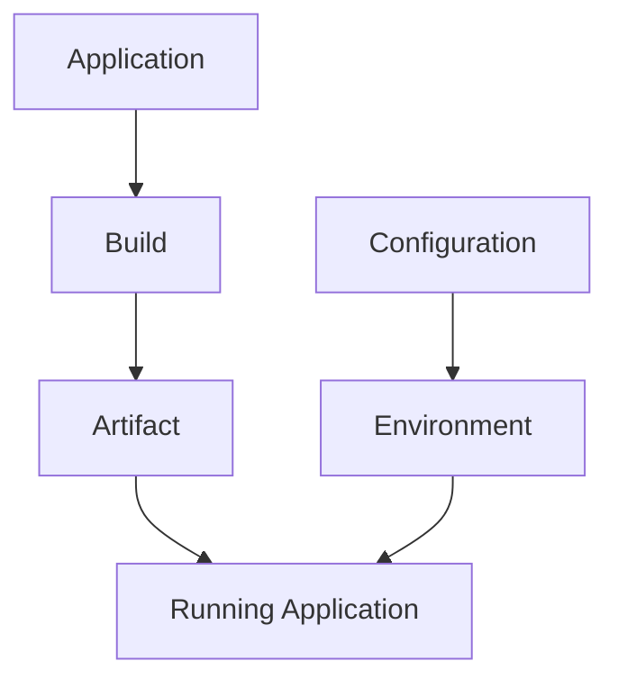

# Application과 Configuration 분리 이해하기

같은 Application이라도 실행되는 환경에 따라 필요한 설정은 달라진다.

DEV에서는 개발용 DB를 사용하고, STG와 PRD에서는 각각 다른 DB 또는 외부 API Endpoint를 바라볼 수 있다. Spring에서는 일반적으로 이러한 차이를 Profile별 설정으로 나누어 관리한다.

```text
application-dev.yml
application-stg.yml
application-prod.yml
````

Spring Profile을 이용하면 환경별 설정을 구분해서 사용할 수 있다. 다만 **Profile별 설정을 구분하는 것과 Configuration 자체를 Application으로부터 분리하는 것은 다른 문제**이다.

예를 들어 동일한 Container Image를 DEV, STG, PRD에 배포한다고 했을 때, 환경별 설정 파일을 Image 안에 모두 포함하고 Profile만 선택할 수도 있고, Configuration을 Artifact 밖에서 별도로 관리할 수도 있다.

두 방식의 차이는 결국 **Configuration의 변경과 배포를 Application과 함께 관리할 것인지, 별도의 Lifecycle로 관리할 것인지**에 있다. 이 글에서는 이러한 차이를 배포 구조 관점에서 조금 더 상세히 정리해보고자 한다.

---

## Spring Profile은 무엇을 분리할까?

Spring Profile을 사용하면 실행 환경에 따라 사용할 설정을 선택할 수 있다.

```text
SPRING_PROFILES_ACTIVE=dev
SPRING_PROFILES_ACTIVE=stg
SPRING_PROFILES_ACTIVE=prod
```

이를 통해 코드 내부에서 직접 환경을 판단하는 방식은 피할 수 있다.

```java
if (env.equals("prod")) {
    // production 설정
}
```

Application Code는 동일하게 유지하고, 실행 시점에 필요한 Configuration만 선택하는 것이다.



이 관점에서 Profile은 **실행 환경에 따라 어떤 설정을 적용할지 결정**하는 역할을 한다. 하지만 어떤 설정을 적용할지 구분하는 것과 Configuration의 Lifecycle을 Application으로부터 분리하는 것은 의미가 다르다.

---

## 환경별 설정을 나누는 것과 Lifecycle을 분리하는 것은 다르다

Profile별 설정 파일이 Application Artifact 안에 함께 포함되어 있다고 해보자.

```text
Application Artifact
├── application-dev.yml
├── application-stg.yml
└── application-prod.yml
```

어떤 Profile을 사용할지는 실행 시점에 지정할 수 있지만, **Configuration 자체는 여전히 Application과 함께 빌드되고 배포된다.**

예를 들어 DEV에서 사용하는 외부 API Endpoint 하나가 변경될 경우, 설정 파일이 Artifact 안에 포함되어 있다면 Application Code에는 변화가 없더라도 새로운 Artifact나 Container Image를 생성해야한다.

즉 Spring Profile은 **실행 환경에 따라 적용할 설정을 구분**하는 역할은 하지만, 그 Configuration의 변경과 배포까지 Application과 분리해주지는 않는다.

> Profile 분리 -> Configuration 선택 분리

> Configuration Externalization → Configuration Lifecycle 분리

결국 **환경별로 적용할 설정을 구분하는 것**과 **Configuration의 Lifecycle을 분리하는 것**은 서로 다른 문제인 것이다.

---

## Application과 Configuration은 왜 같은 Lifecycle일 필요가 없을까?

Application과 Configuration은 변경되는 이유가 다르다.

Application은 주로 다음과 같은 이유로 변경된다.

```text
Business Logic 변경
API 추가
Data Access Logic 변경
Bug Fix
```

반면 Configuration은 다음과 같은 이유로 변경될 수 있다.

```text
DB Endpoint 변경
External API URL 변경
Timeout 조정
Log Level 변경
Feature Flag 변경
```

비즈니스 로직 변경은 새로운 Application Version을 만드는 이유가 될 수 있지만, DB Endpoint나 Timeout 변경까지 반드시 새로운 Application Version을 만들어야 하는 변경점이라고 보기는 어렵다.

그러나 두 대상이 하나의 Artifact에 묶여 있다면 서로 다른 성격의 변경이 동일한 Build와 Deployment Lifecycle을 타게 된다.



Application과 Configuration은 변경 이유와 주기가 다르지만, 하나의 Artifact에 함께 포함하면 두 변경이 같은 Build와 Deployment Lifecycle을 타게 되는 것이다.

---

## Configuration을 Artifact 밖으로 꺼내면 무엇이 달라질까?

Kubernetes에서는 ConfigMap, Secret, Environment Variable 등을 통해 환경별 값을 Pod 실행 시점에 전달할 수 있다.



해당 구조에서는 Container Image와 환경별 Configuration을 별도의 대상으로 관리할 수가 있다.

```text
image:v1.4.2 + DEV Config → DEV
image:v1.4.2 + STG Config → STG
image:v1.4.2 + PRD Config → PRD
```

Container Image는 동일하게 유지하면서 어떤 Configuration을 주입하는지에 따라 서로 다른 환경에서 동작하게 된다.

> Artifact → "어떤 Version을 실행할 것인가"

> Configuration → "해당 Version을 현재 환경에서 어떻게 실행할 것인가"

이렇게 Configuration을 외부화하면 설정이 변경될 때마다 Application을 다시 Build해야 하는 상황을 줄일 수 있다.


물론 Configuration을 변경한다고 항상 실행 중인 Application에 즉시 반영되는 것은 아니다.

설정을 어떤 방식으로 주입하는지에 따라 Pod 재시작이나 재배포가 필요할 수 있다. 중요한 것은 재시작 여부가 아니라 **Application Artifact를 새로 Build하지 않고도 Configuration의 변경을 별도로 관리할 수 있다는 점**이다.

결국 Configuration Externalization의 핵심은 단순히 설정 파일을 Application Artifact (e.g., Container Image) 밖으로 옮기는 것이 아니라, **Application과 Configuration이 서로 다른 이유와 주기로 변경될 수 있도록 Lifecycle을 분리하는 것**이라고 볼 수 있다.

---

## 모든 Configuration을 같은 방식으로 관리할 수 있을까?

Configuration을 Application 밖으로 분리하더라도 모든 값을 같은 방식으로 관리할 수 있는 것은 아니다.

예를 들어 아래와 같은 값들은 일반적인 설정과 성격이 다르다.

```text
DB Password
API Key
Access Token
Credential
```

이런 값을 `application-prod.yml`에 직접 작성하고 Repository에서 관리한다면 **Source Code에 접근할 수 있는 범위**와 **Credential에 접근할 수 있는 범위**가 같아진다.

Kubernetes에서는 일반적인 Configuration과 민감한 값을 별도의 리소스로 구분할 수 있다.

> ConfigMap → 일반적인 Configuration (애플리케이션이 사용할 일반 설정값을 Key-Value 형태로 관리하고 Pod에 주입한다.)

> Secret → 민감한 Configuration (Password, API Key, Token처럼 민감한 값을 일반 설정과 분리해 관리하고 Pod에 주입한다.)

(다만 Kubernetes Secret을 사용한다고 값 자체가 자동으로 안전하게 암호화되는 것은 아니다. Secret의 값은 기본적으로 base64 형태로 표현되며, 실제 보안 수준은 저장 시 암호화나 RBAC과 같은 접근 제어를 어떻게 구성하는지에 따라 달라진다.)

중요한 것은 Secret이라는 리소스를 사용하는 것 자체보다 **민감한 값을 Source Code에서 분리하고, 일반 Configuration과 다른 접근 정책으로 관리하는 것**이다.

---

## 동일한 Artifact를 여러 환경에서 사용할 수 있는 이유

Application과 Configuration을 분리하면 동일한 Container Image를 여러 환경에서 사용할 수 있다.



따라서 각 요소의 역할은 다음과 같이 나누어 볼 수 있다.

```text
Application → 무엇을 실행할 것인가
Artifact → 어떤 Version을 실행할 것인가
Configuration → 현재 환경에서 어떻게 실행할 것인가
Environment → 어디에서 실행할 것인가
```

이렇게 각 역할을 분리해서 보면, 동일한 Artifact를 여러 환경에서 사용할 수 있는 이유도 명확해진다. **Application Version과 환경별 Configuration을 별도로 관리하기 때문에, 하나의 Artifact를 각 환경에서 재사용할 수 있는 것**이다.

---

## 정리

Spring Profile을 이용하면 실행 환경에 따라 어떤 Configuration을 사용할지 구분할 수 있다. 하지만 이것만으로 Application과 Configuration의 Lifecycle이 분리되는 것은 아니다.

Profile별 설정 파일이 Artifact 안에 포함되어 있다면 Configuration의 변경 역시 Application의 Build와 Deployment 과정에 영향을 받는다. 반대로 Configuration을 Artifact 외부에서 관리하면 Application Version과 환경별 설정을 서로 다른 대상으로 관리할 수 있다.



결국 핵심은 환경별 Configuration을 구분하는 것 자체가 아니라, **Application과 Configuration의 변경 및 배포 Lifecycle을 어디까지 분리할 것인가**에 있다.

Application은 서비스의 기능과 Version을 담고, Configuration은 해당 Application이 특정 환경에서 어떻게 동작할지를 결정한다. 두 대상을 분리해서 관리하면 동일한 Artifact를 여러 환경에서 재사용하면서도 환경별 설정을 독립적으로 변경하고 관리할 수 있게 된다.
