# Kubernetes는 증가하는 트래픽에 어떻게 대응할까?

서비스를 운영하다 보면 하나의 애플리케이션 인스턴스가 처리할 수 있는 요청량에는 한계가 생긴다. 트래픽이 증가했을 때 가장 먼저 떠올릴 수 있는 방법은 서버의 CPU나 Memory를 늘리는 것이다.

```text
4 CPU / 8 GB
      ↓
8 CPU / 16 GB
```

이처럼 하나의 인스턴스 성능을 높이는 방식을 **Scale Up**이라고 한다. 반대로 동일한 애플리케이션 인스턴스를 여러 개 실행하는 방식도 있다.

```text
Application
    ↓
Application × 3
```

이를 **Scale Out**이라고 한다. Kubernetes 환경에서는 Deployment의 Replica를 늘리면 동일한 애플리케이션을 여러 Pod로 실행할 수 있기 때문에 Scale Out이 비교적 직관적이다.

하지만 실제 백엔드 시스템에서 단순히 Pod를 늘리는 것만으로 시스템 전체의 처리량이 증가하지는 않는다. Pod는 Worker Node의 CPU와 Memory를 사용하고, 애플리케이션은 다시 Database, Redis, 외부 API와 같은 다른 시스템에 의존한다.

따라서 Kubernetes의 Scalability를 이해하려면 **Pod를 얼마나 쉽게 늘릴 수 있는가보다, 확장된 애플리케이션이 전체 시스템에 어떤 영향을 주는가**를 함께 보아야 한다.

---

## Kubernetes에서 애플리케이션은 어떻게 실행되고 확장될까?

Kubernetes에서 하나의 MSA 서비스는 여러 Pod로 실행될 수 있으며, 각 Pod는 Scheduler에 의해 여러 Worker Node에 배치될 수 있다.

반대로 하나의 Worker Node에서도 서로 다른 서비스의 Pod가 함께 실행될 수 있다.

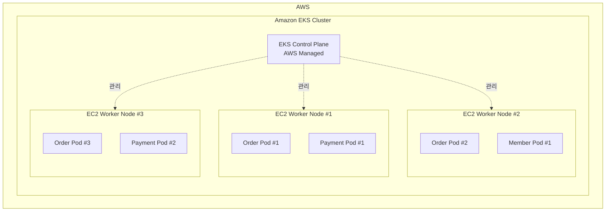

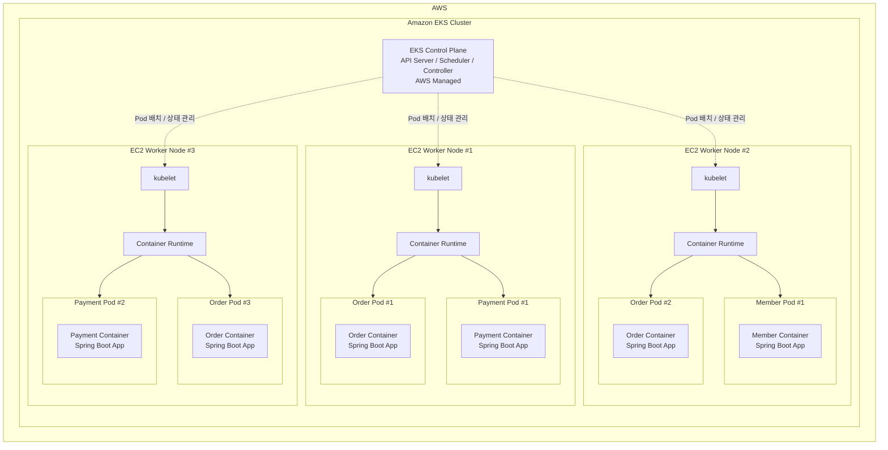

예를 들어 `order-service`가 세 개의 Replica를 가진다면 `Order Pod #1`, `Order Pod #2`, `Order Pod #3`처럼 여러 Pod로 실행될 수 있다. 이 Pod들은 모두 같은 Worker Node에 배치될 필요가 없으며, Scheduler에 의해 서로 다른 Worker Node에 분산될 수 있다.

반대로 하나의 Worker Node에서도 서로 다른 서비스의 Pod가 함께 실행될 수 있다. 즉 MSA의 Service와 Worker Node가 1:1로 연결되는 구조는 아니다.

Deployment는 이러한 Pod의 원하는 개수를 관리한다.

```text
Order Service
     ↓
Deployment
     ↓
Pod #1 / Pod #2 / Pod #3
     ↓
여러 Worker Node에 배치
```

(AWS EKS에서 EC2 기반 Data Plane을 사용한다면 이러한 Worker Node는 EC2 Instance에 해당한다.)

---

## 트래픽 증가에 대응하는 두 가지 확장 방식

두 방식 모두 처리 용량을 늘리기 위한 방법이지만 고려해야 하는 문제는 다르다.

### Scale Up: 하나의 인스턴스를 더 크게

Scale Up은 하나의 Pod 또는 서버가 사용할 수 있는 CPU와 Memory를 늘리는 방식이다.

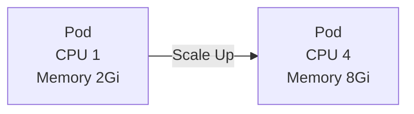

구조가 단순하고 기존 애플리케이션을 크게 변경하지 않고도 성능을 높일 수 있다는 장점이 있다.

다만 Resource에는 상한이 있다. 예를 들어 Pod가 16 CPU를 요청한다면 이를 수용할 수 있는 Worker Node가 존재해야 한다.

```text
Pod Request
CPU 16 / Memory 32Gi
        ↓
이를 수용할 Worker Node 필요
```

Pod가 지나치게 커질수록 배치 가능한 Node가 제한되고, 하나의 인스턴스에 장애 영향이 집중될 수도 있다. 따라서 Scale Up은 구현이 단순한 대신 **Resource 상한과 장애 집중**을 함께 고려해야 한다.

---

### Scale Out: 애플리케이션 인스턴스를 더 많이

Scale Out은 동일한 애플리케이션 Instance 수를 늘리는 방식이다. Kubernetes에서는 Replica 증가로 표현할 수 있다.

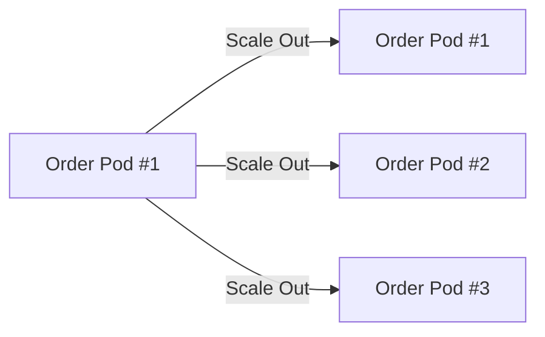

여러 Pod가 동시에 요청을 처리할 수 있기 때문에 단일 인스턴스의 한계를 넘어서기 쉽다.

Kubernetes에서는 HPA(Horizontal Pod Autoscaler)를 사용해 CPU, Memory 또는 Custom Metric을 기준으로 Replica 수를 자동으로 조절할 수 있다.

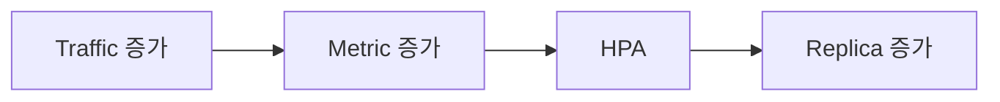

하지만 HPA가 Pod 개수를 늘렸다고 해서 새로운 처리 용량이 즉시 확보되는 것은 아니다.

---

## Pod는 결국 Worker Node의 Resource를 사용한다

Pod는 독립적인 서버가 아니기 때문에 새로운 Pod가 생성되면 이를 실행할 Worker Node가 필요하다.

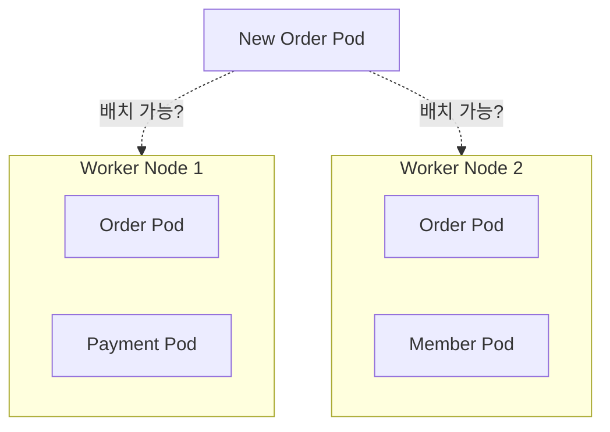

Scheduler는 Pod의 Resource Request 등을 기준으로 적절한 Node를 선택한다. 모든 Worker Node에 충분한 CPU나 Memory가 없다면 Pod는 생성되더라도 `Pending` 상태에 머물 수 있다.

```text
HPA
 ↓
Replica 증가
 ↓
새 Pod 생성
 ↓
Node Capacity 부족
 ↓
Pending
```

따라서 Kubernetes의 Scale Out은 두 계층에서 봐야 한다.

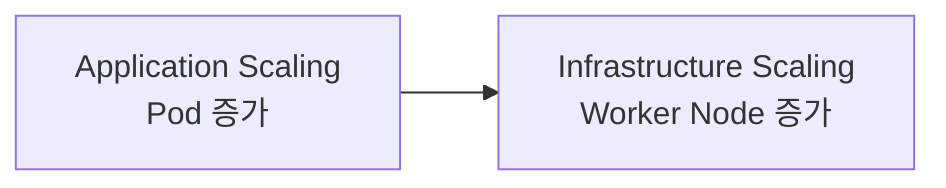

Pod 수를 늘리는 것은 애플리케이션 계층의 확장이고, 이를 실행할 Node를 늘리는 것은 인프라 계층의 확장이다.

Karpenter나 Cluster Autoscaler 같은 Node Autoscaler는 Pod를 배치할 Capacity가 부족할 때 새로운 Worker Node를 추가할 수 있다. AWS EKS에서 EC2 기반으로 구성했다면 결과적으로 새로운 EC2 Instance가 Cluster에 추가되는 형태가 된다.

---

## Pod를 늘려도 시스템 전체가 확장되는 것은 아니다

여기까지는 Kubernetes가 담당하는 영역이다. 하지만 백엔드 엔지니어 입장에서 더 중요한 부분은 **Pod가 늘어난 이후**이다.

예를 들어 Spring Boot 애플리케이션의 Pod마다 DB Connection Pool을 20개씩 가지고 있다고 가정해보자.

```text
Pod 3개 × Connection Pool 20 = 최대 60 Connections
```

트래픽 증가로 Pod가 30개까지 늘어나면 같은 설정에서도 최대 Connection 수는 크게 증가한다.

```text
Pod 30개 × Connection Pool 20 = 최대 600 Connections
```

애플리케이션은 Scale Out됐지만 Database는 그대로라면 Bottle-Neck이 애플리케이션에서 DB로 이동할 수 있다.

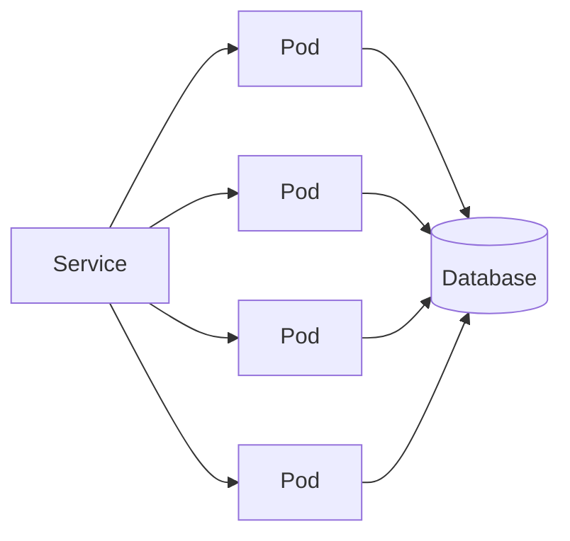

같은 문제는 Redis나 외부 API에서도 발생할 수 있다.

Pod가 증가하면 Redis Connection, 외부 API 호출량, Message Broker 부하 역시 함께 증가할 가능성이 있다. 따라서 Scale Out은 **애플리케이션 인스턴스를 늘리는 것에서 끝나는 것이 아니라 공유 자원의 Capacity까지 함께 확인해야 하는 문제**가 된다.

---

## 애플리케이션 자체도 Scale Out을 고려해야 한다

Pod를 여러 개 실행한다고 해서 모든 애플리케이션이 자연스럽게 Scale Out되는 것은 아니다.

Scale Out 환경에서는 하나의 사용자가 보낸 요청이 항상 동일한 Pod로 전달된다고 보장하기 어렵다. 예를 들어 로그인 정보를 `Pod #1`의 Memory에만 저장했다고 가정해보자.

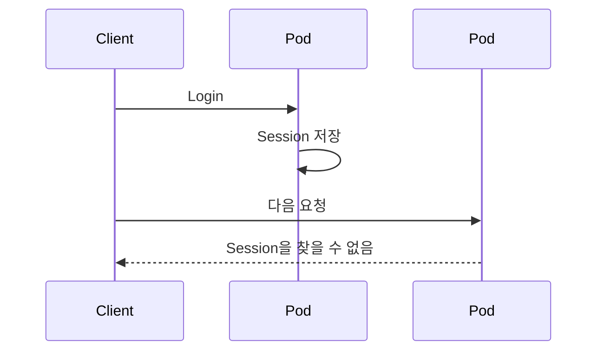

`Pod #1`에 저장한 Session은 `Pod #2`에서 확인할 수 없다.

따라서 여러 Pod가 동일한 상태를 사용해야 한다면 상태를 특정 Pod 내부에 저장하기보다 Redis나 Database와 같은 외부 저장소에서 공유하는 방식을 고려할 수 있다.

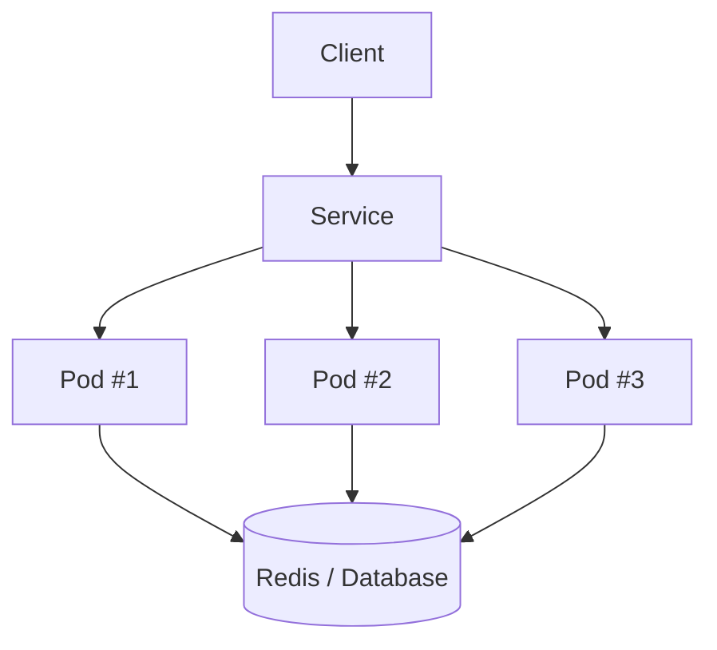

이처럼 Scale Out 가능한 애플리케이션을 만들기 위해서는 Pod 수를 늘리는 것뿐만 아니라 여러 Instance가 동시에 실행되어도 동일하게 동작할 수 있도록 상태 관리 방식도 함께 고려해야 한다.

---

## 늘어난 Pod로 트래픽은 어떻게 분산될까?

Pod는 생성되고 삭제되며 IP도 변경될 수 있다. Client가 특정 Pod를 직접 호출한다면 Replica가 바뀔 때마다 대상 주소를 추적해야 한다.

Kubernetes Service는 여러 Pod 앞에서 안정적인 접근 지점을 제공한다.

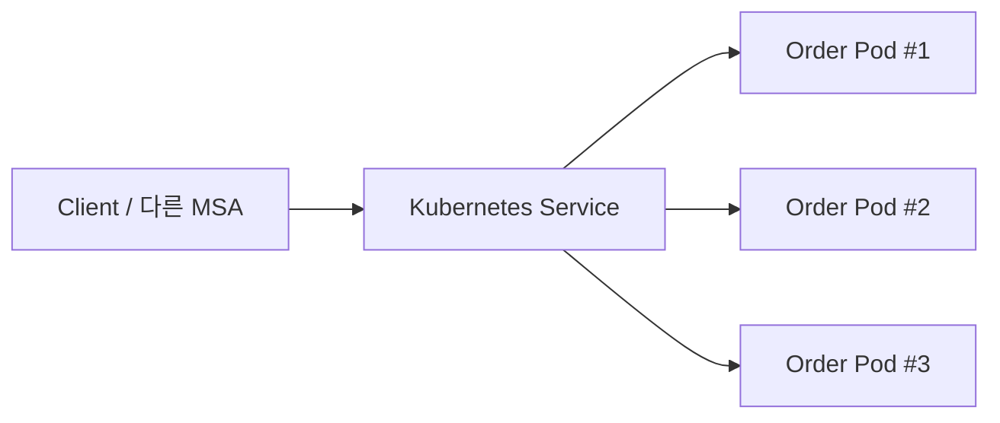

따라서 Scale Out된 Pod들이 실제 요청을 처리하려면 Replica 증가와 함께 트래픽을 여러 Instance로 전달할 수 있는 구조가 필요하다.

---

## Scale Out에도 준비 시간이 필요하다

또 하나 고려해야 할 점은 새로운 Pod가 생성되는 데 시간이 필요하다는 것이다. 특히 Spring 기반 애플리케이션이라면 다음과 같은 과정이 존재한다.

```text
Pod 생성
   ↓
Container 시작
   ↓
JVM 시작
   ↓
Spring Context 초기화
   ↓
DB Connection 생성
   ↓
Ready
```

따라서 Traffic Spike가 발생한 시점에 HPA가 Replica를 증가시키더라도 실제 처리 Capacity가 증가하기까지는 시간 차이가 생길 수 있다. 이 때문에 `readinessProbe`, 적절한 최소 Replica 수, Pod 시작 시간 등을 함께 고려해야 한다.

Autoscaling은 단순히 **얼마나 많이 늘릴 것인가**뿐만 아니라 **얼마나 빠르게 준비할 수 있는가**의 문제이기도 하다.

---

## 트래픽 증가부터 처리 용량 확장까지

지금까지의 구조를 하나로 연결하면 아래와 같다.

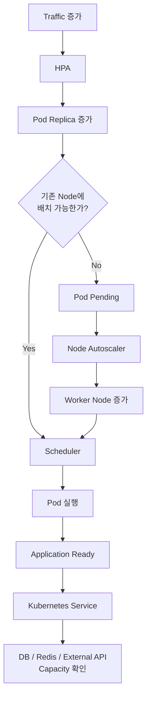

이 구조에서 Kubernetes는 필요한 Pod 수를 유지하고, 적절한 Worker Node에 배치하며, 필요하다면 Node Capacity를 확장할 수 있다. 하지만 그 이후의 시스템 처리량까지 Kubernetes가 보장하지는 못한다.

---

## Kubernetes를 넘어 시스템 전체의 Scalability로

Kubernetes는 트래픽 증가에 따라 Pod를 늘리고, 필요한 경우 Worker Node의 Capacity까지 확장할 수 있는 기반을 제공한다. 하지만 Pod가 늘어났다는 사실만으로 시스템 전체의 처리량이 같은 비율로 증가하진 않는다.

```text
Traffic 증가
    ↓
Pod 증가
    ↓
Worker Node Capacity
    ↓
Database / Redis / External API
```

애플리케이션 계층의 병목을 해결하면 병목 지점이 Database나 Cache, 외부 시스템으로 이동할 수 있다. 또한 여러 Pod가 동시에 실행되는 환경에서는 Instance 내부의 상태, Connection Pool, Downstream 호출량처럼 단일 Instance에서는 크게 드러나지 않았던 문제도 함께 고려해야 한다.

Scale Up은 하나의 인스턴스가 사용할 수 있는 Resource를 늘리는 방식이지만 물리적인 상한이 존재한다. 반면 Scale Out은 여러 인스턴스로 부하를 분산할 수 있지만, 그만큼 애플리케이션과 Downstream System 역시 분산 환경을 감당할 수 있도록 설계되어야 한다.

결국 Scalability는 특정 서버나 Pod의 개수를 늘리는 문제에 그치지 않는다. **트래픽 증가가 애플리케이션, 인프라, Database, Cache, 외부 시스템으로 어떻게 전달되는지 살펴보고 각 계층의 Capacity가 함께 확장될 수 있는지를 확인하는 문제**에 가깝다고 볼 수 있다.

이번 내용을 정리하면서 Kubernetes의 Autoscaling 역시 시스템 전체의 확장성을 완성하는 기능이라기보다, 그중 애플리케이션과 인프라 계층의 확장을 담당하는 하나의 메커니즘이라는 점을 이해할 수 있었다.

백엔드 시스템의 Scalability를 설계할 때는 **“얼마나 많이 확장할 수 있는가”보다 “확장했을 때 새로운 병목은 어디에서 발생하는가”까지 함께 바라보는 것이 중요하다.**

