# Terraform을 Pipeline으로 실행하는 이유

대규모 이벤트를 앞두고 트래픽 증가에 대비해 인프라 구성을 조정하는 과정을 살펴볼 기회가 있었다.

애플리케이션을 Jenkins에서 빌드하고 배포하는 흐름은 익숙했지만, 인프라 변경도 별도의 Pipeline을 거치고 있었다.

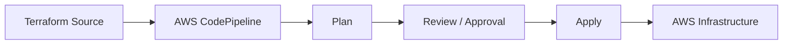

처음에는 Terraform 명령을 자동으로 실행하기 위한 구조라고 생각했다. 하지만 흐름을 따라갈수록 Pipeline이 필요한 이유는 단순한 자동화보다 **변경 통제**에 가까웠다.

이 글에서는 다음 질문을 중심으로 IaC 배포 흐름을 정리해보고자 한다.

> 운영 인프라를 Terraform으로 관리하면서도 왜 `plan → approval → apply`라는 절차를 거쳐야 할까?

---

## 인프라를 코드로 관리한다는 것

IaC(Infrastructure as Code)는 서버, 네트워크, Load Balancer 같은 인프라를 Console에서 직접 구성하는 대신 코드로 선언하고 관리하는 방식이다.

예를 들어 EC2 인스턴스를 생성할 때 Console에서는 AMI, Instance Type, Subnet, Security Group 등을 사람이 직접 선택한다. Terraform에서는 원하는 구성을 아래와 같이 코드로 표현한다.

```hcl
resource "aws_instance" "app" {
  ami           = "ami-xxxxxxxx"
  instance_type = "t3.medium"

  tags = {
    Name = "app-server"
  }
}
```

이렇게 작성된 코드는 Git에서 애플리케이션 소스와 비슷한 방식으로 관리할 수 있다.


덕분에 인프라 변경도 이력을 남기고, 리뷰하고, 동일한 구성을 반복해서 적용할 수 있다.

Terraform의 기본 실행 흐름은 단순하다.

- `terraform init`: Provider (Terraform이 AWS API를 호출해 실제 리소스를 조회·생성·수정할 수 있도록 연결하는 플러그인)와 Backend 등 실행에 필요한 환경을 초기화한다.
- `terraform plan`: 현재 상태와 선언한 상태를 비교해 변경 계획을 만든다.
- `terraform apply`: 계획된 변경을 실제 인프라에 반영한다.

여기까지만 보면 개발자가 로컬에서 명령을 순서대로 실행해도 충분해 보인다. 실제로도 가능은 하지만, 운영 환경에서는 변경 내용뿐 아니라 누가 어떤 환경에서 어떤 과정을 거쳐 반영했는지까지 관리할 필요가 있다.

이러한 변경 과정을 하나의 일관된 경로로 만들기 위해 Terraform도 Pipeline을 통해 실행한다.

---

## 바로 Apply하지 않는 이유

운영 인프라는 작은 설정 변경도 여러 리소스에 영향을 줄 수 있다. 따라서 Terraform 코드에서 의도한 부분만 수정했더라도, 실제로 어떤 변경이 발생하는지는 Plan을 통해 확인해야 한다.

예를 들어 Worker Node 수를 `3개`에서 `5개`로 늘리기 위해 설정을 수정했다고 가정해보자. 기대한 변경은 다음과 같다.

```text
~ Worker Node Group
  desired_size: 3 → 5
```

그런데 실제 Plan에는 예상하지 못한 변경이 함께 나타날 수 있다.

```text
~ Worker Node Group 크기 변경
-/+ Launch Template 교체
```

Terraform Plan은 방금 수정한 값만 확인하는 것이 아니라 Configuration, State, 실제 인프라 상태를 비교해 전체 변경 사항을 계산한다. 따라서 기존에 발생한 Drift나 의도하지 않게 수정된 설정이 있다면 이번 변경과 함께 Plan에 나타날 수 있다.

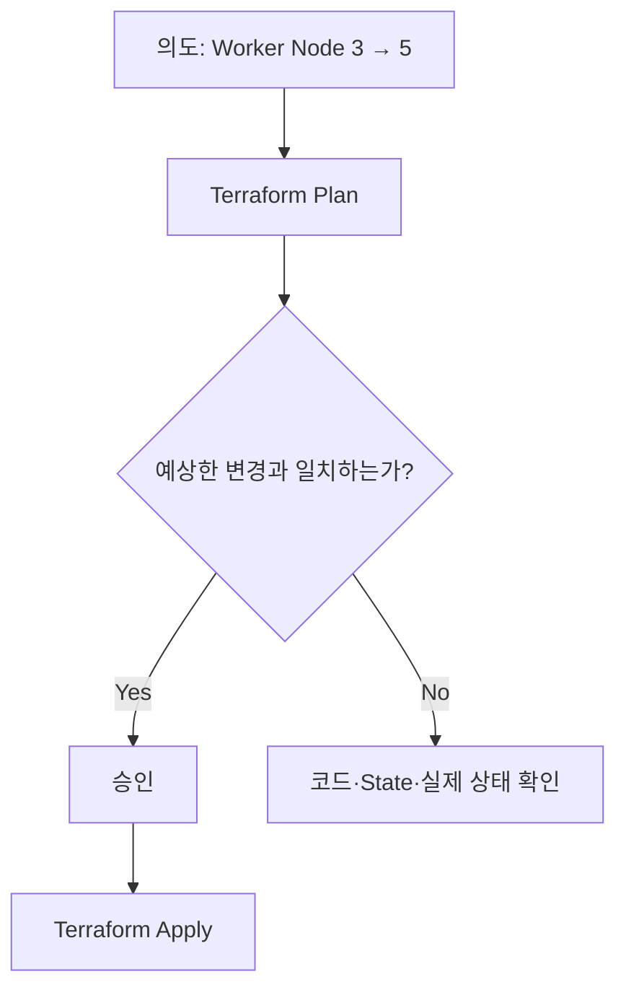

명령이 정상적으로 실행된다는 것과 변경 내용이 안전하다는 것은 별개의 문제이다. `plan`이 성공했더라도 의도하지 않은 리소스 교체나 삭제가 포함되어 있다면 그대로 운영 환경에 반영해서는 안되기 때문에, Apply 전에는 아래와 같은 항목들을 확인할 필요가 있다.

* 의도하지 않은 리소스 삭제나 교체가 포함되었는가?
* 네트워크나 보안 설정이 함께 변경되는가?
* 예상보다 많은 리소스가 영향을 받는가?
* 서비스 중단 가능성이 있는 변경인가?

AWS CodePipeline의 Manual Approval Action을 사용하면 지정한 단계에서 Pipeline을 멈추고, 권한을 가진 사용자가 변경 내용을 확인한 뒤 승인하거나 거절하도록 구성할 수 있다.

이때 Approval은 단순히 배포 버튼을 한 번 더 누르는 절차가 아니라, **사람이 의도한 변경과 Terraform이 계산한 변경이 일치하는지 확인하는 Change Control 단계**에 가깝다.

뿐만 아니라 Pipeline을 이용하면 변경을 실행하는 환경도 일정하게 유지할 수 있다. 개인 PC마다 Terraform 버전이나 권한, 환경 변수가 달라지는 문제를 줄이고, 운영 인프라를 변경할 수 있는 실행 주체도 제한할 수 있다.

결국 Pipeline은 Terraform 명령을 대신 실행하는 데에서 끝나는 것이 아니라 인프라 변경을 기록하고, 영향을 확인하고, 검토한 뒤 실행하는 하나의 경로를 만드는 역할을 한다.


### 검토한 Plan과 실제 Apply는 같은가

Plan을 확인하고 승인했더라도, Apply 단계에서 변경 계획을 다시 계산한다면 실제로 실행되는 내용이 달라질 수 있다. (Plan과 Apply 사이에 Terraform 코드나 인프라 상태가 변경될 수 있기 때문이다.)

자동화된 Workflow에서는 Plan 결과를 파일로 저장해 이러한 차이를 줄일 수 있다.

```bash
terraform plan -out=tfplan
```

승인 이후에는 변경 계획을 새로 계산하는 대신, 검토한 Plan 파일을 그대로 실행한다.

```bash
terraform apply tfplan
```

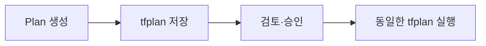

이 방식은 사람이 검토한 변경과 실제로 실행되는 변경을 연결해준다. (다만 모든 Pipeline이 saved plan을 사용하는 것은 아니므로, 실제 환경에서는 Plan과 Apply 사이의 동일성을 어떤 방식으로 보장하는지 확인할 필요가 있다.)

---

## Terraform은 기존 AWS 리소스를 어떻게 기억할까

Terraform 코드에 다음과 같은 EC2 리소스가 선언되어 있다고 해보자.

```hcl
resource "aws_instance" "app" {
  ami           = "ami-xxxxxxxx"
  instance_type = "t3.medium"
}
```

Terraform 코드에서는 이 리소스를 `aws_instance.app`이라는 Resource Address로 식별한다. 반면 AWS에 생성된 실제 EC2는 다음과 같은 고유 ID를 가진다.

```text
i-0123456789abcdef
```

Terraform이 이후 이 EC2를 수정하거나 삭제하려면 `aws_instance.app`이 `i-0123456789abcdef`을 가리킨다는 사실을 알고 있어야 한다. 이 연결 관계를 기록하는 것이 **Terraform State**이다.

### 코드의 Resource Address와 실제 AWS ID를 연결하는 State

Terraform을 통해 EC2를 생성하면 AWS에서 반환된 실제 Resource ID가 State에 기록된다.

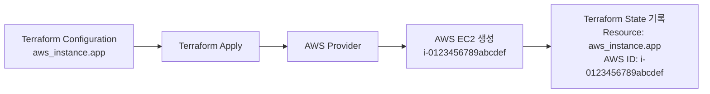

이후 Terraform은 State를 통해 `aws_instance.app`이 어떤 실제 EC2를 의미하는지 찾을 수 있다.

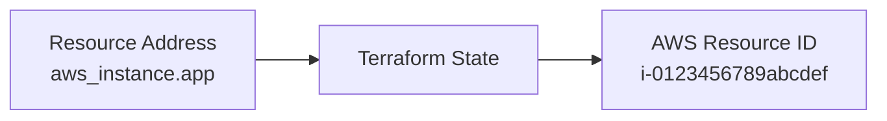

반대로 AWS Console에서 미리 생성한 EC2는 Terraform State에 연결 정보가 없다. 따라서 Terraform이 이름이나 Tag를 보고 기존 EC2를 자동으로 자신의 관리 대상으로 판단하지는 않는다.

이미 존재하는 리소스를 Terraform으로 관리하려면 `terraform import` 등을 통해 Terraform Resource Address와 실제 Resource ID를 State에 연결해야 한다.

```text
terraform import aws_instance.app i-0123456789abcdef
```

결국 Terraform이 관리할 수 있는 대상은 **Terraform이 직접 생성했거나 State에 명시적으로 연결된 리소스**라고 볼 수 있다.

### Plan은 Configuration, State, 실제 AWS 상태를 함께 확인한다

State에는 Resource ID뿐 아니라 Terraform이 마지막으로 확인한 리소스의 속성 정보도 저장된다. 다만 Terraform 실행 이후 누군가 Console에서 Instance Type을 변경했을 수도 있고, 다른 자동화 도구가 리소스 설정을 수정했을 수도 있기 때문에, State에 기록된 값이 항상 현재 AWS 상태와 같다고 볼 수는 없다.

따라서 Terraform은 일반적으로 Plan 과정에서 다음 세 가지 정보를 사용한다.

| 구분                    | 역할                                     |
| --------------------- | -------------------------------------- |
| Configuration         | 코드에 선언한 원하는 상태                         |
| State                 | Terraform Resource와 실제 Resource의 연결 정보 |
| Actual Infrastructure | AWS에 현재 존재하는 리소스 상태                    |

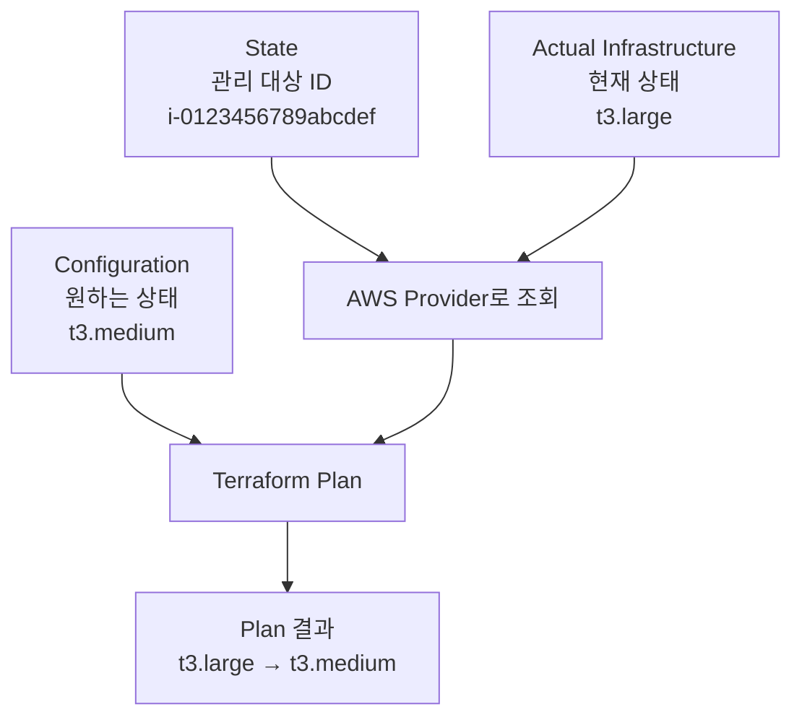

예를 들어 Configuration에는 Instance Type이 `t3.medium`으로 선언되어 있지만, 실제 AWS에서는 `t3.large`로 변경되어 있다고 가정해보자.

State에 저장된 EC2 ID를 이용해 실제 리소스를 조회하면 두 상태의 차이를 확인할 수 있다.

```text
Configuration          t3.medium
State                  aws_instance.app ↔ i-0123456789abcdef
Actual Infrastructure  t3.large
```

Terraform은 이 차이를 바탕으로 다음과 같은 Plan을 만든다.

```text
~ instance_type: "t3.large" → "t3.medium"
```

즉 Terraform은 `.tf` 파일만 보고 리소스를 매번 새로 만드는 것이 아니라, **State로 관리 대상을 찾고, Provider로 실제 상태를 조회한 뒤, Configuration에 선언된 원하는 상태와 비교해 변경 계획을 계산한다.**

### 여러 실행 주체가 같은 State를 사용하려면

Terraform은 기본적으로 State를 실행한 로컬 환경의 `terraform.tfstate` 파일에 저장할 수 있다.

개인 프로젝트에서는 로컬 State만으로도 충분할 수 있다. 하지만 여러 개발자와 Pipeline이 같은 인프라를 관리한다면 문제가 달라진다.

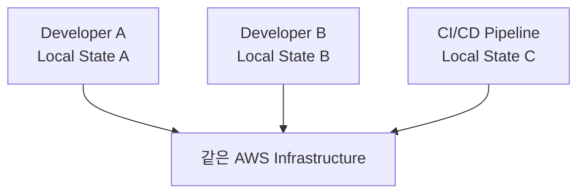

각 실행 주체가 서로 다른 State를 사용하면 동일한 리소스에 대한 연결 정보와 마지막 상태가 서로 달라질 수 있다. 누구의 State를 기준으로 Plan을 실행하느냐에 따라 결과가 달라질 위험도 생긴다.

그래서 운영 환경에서는 State를 개인 PC에 두기보다 여러 실행 주체가 접근할 수 있는 **Remote Backend**에 저장한다. AWS 환경에서는 보통 S3를 Terraform Backend로 사용한다.

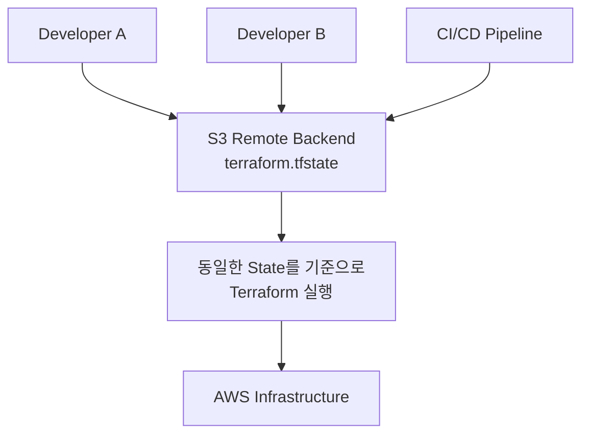

S3를 Terraform Backend로 사용함으로서, 여러 개발자들과 Pipeline은 S3에 저장된 하나의 State를 기준으로 같은 인프라를 관리할 수 있게 된다.

여기까지 따라오면 Terraform Pipeline에서 S3가 등장하는 이유도 이해할 수 있다. 그런데 실제 Pipeline을 살펴보면 State 파일뿐 아니라 Terraform 코드가 들어 있는 ZIP 파일도 S3에서 발견할 수 있다.

같은 S3에 저장되어 있지만, 이 ZIP 파일과 Terraform State는 전혀 다른 목적으로 사용된다.

---

## Console 변경이 문제가 되는 순간

Terraform Configuration에 Auto Scaling Group의 Desired Capacity가 `10`으로 선언되어 있다고 가정해보자.

```text
Desired Capacity = 10
```

운영자가 급하게 AWS Console에서 값을 `15`로 바꾸면 실제 인프라와 코드에 선언된 상태가 달라진다.

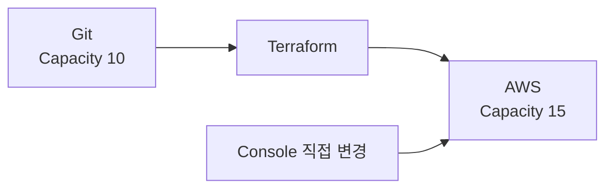

이처럼 Terraform Workflow 밖에서 리소스가 변경되어 Configuration이나 State가 실제 인프라와 달라진 상태를 Drift라고 한다.

다음 Plan에서 Terraform은 실제 리소스 상태를 확인하고 차이를 계산한다. 따라서 Console에서 수정했다고 해서 Terraform이 항상 실패하는 것은 아니다. 경우에 따라서는 코드에 선언된 값으로 되돌리는 변경 계획이 나타날 수 있다.

문제는 변경 경로가 두 개가 되었다는 점이다.

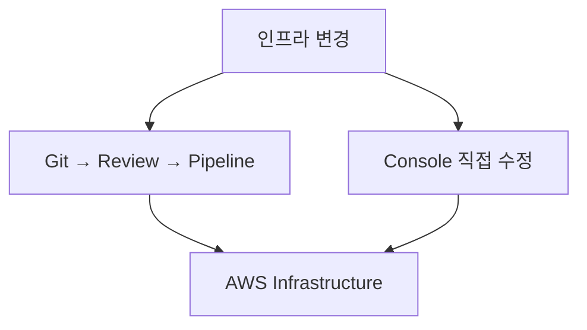

이 구조에서는 다음 질문에 답하기 어려워진다.

- 현재 값은 의도된 변경인가, 임시 조치인가?
- 코드와 실제 인프라 중 어느 쪽이 기준인가?
- 다음 Apply에서 Console 변경을 유지해야 하는가, 되돌려야 하는가?
- 누가 어떤 이유로 값을 변경했는가?

중요한 것은 Console 사용 자체가 나쁘다는 것이 아니다. 장애 대응처럼 즉시 수정이 필요한 상황도 있다. 다만 변경이 불가피했다면 그 결과를 코드에 반영하고, 다시 하나의 관리 경로로 수렴시키는 후속 작업이 필요하다.

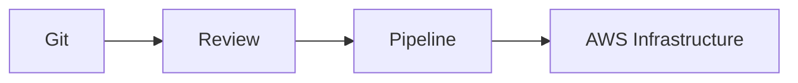

인프라의 Source of Truth를 Git의 Terraform Configuration으로 정했다면, 정상적인 변경도 가능한 한 이 경로를 통해 발생해야 한다. 그래야 Configuration, State, Actual Infrastructure 사이의 관계를 예측할 수 있다.

---

## IaC에서 중요했던 것은 변경 경로였다

처음에는 IaC를 단순히 “인프라를 코드로 만드는 것”이라고 이해했다. 실제 Pipeline과 State를 함께 살펴보니 각 요소는 하나의 흐름으로 이어져 있었다.

| 요소 | 역할 |
| --- | --- |
| Git | 무엇을 왜 바꾸었는지 기록한다. |
| Plan | 실제 발생할 변경을 미리 계산한다. |
| Approval | 의도와 실행 계획이 일치하는지 확인한다. |
| Apply | 통제된 실행 주체가 인프라를 변경한다. |
| State | Terraform 리소스와 실제 리소스의 관계를 추적한다. |
| Drift 관리 | Pipeline 밖에서 발생한 변경을 발견하고 다시 기준 상태로 수렴시킨다. |

결국 `plan → approval → apply`는 명령을 여러 단계로 나눈 형식적인 절차가 아니었다. 변경 전에는 영향을 예측하고, 실행 전에는 사람이 의도를 검증하며, 실행 후에는 State를 통해 관리 대상을 계속 추적하기 위한 구조였다.

> IaC의 핵심은 인프라를 코드로 표현하는 데서 끝나지 않는다. 인프라가 변경되는 경로와 그 결과를 일관되게 관리하는 데 있다.

이 관점에서 Terraform은 AWS 리소스를 생성하는 CLI보다, 선언한 상태와 실제 상태의 차이를 계산하고 원하는 상태로 수렴시키는 도구에 가까웠다. Pipeline은 그 변경이 운영 환경에 반영되는 과정을 리뷰 가능하고 재현 가능한 소프트웨어 변경 과정으로 만든다.

이번 구조를 살펴보며 Terraform 문법보다 더 중요했던 것은, **인프라 변경도 코드 변경처럼 기록하고 검토하며 통제해야 한다는 점**이었다.
