# Java 예외는 어떻게 전파되는가

예전에 RTOS 기반 Embedded Application을 개발할 때에는 Null Pointer 계열 문제를 굉장히 민감하게 고려했었다. C/C++에서 잘못된 Pointer를 참조하면 잘못된 Memory Address에 접근하게 되고, 환경에 따라 CPU Fault나 Fault Handler 진입으로 이어질 수 있었다. 문제가 정상적으로 복구되지 않으면 Watchdog에 의해 System Reset이 발생하면서 제품이 Reboot되는 경우도 있었다.

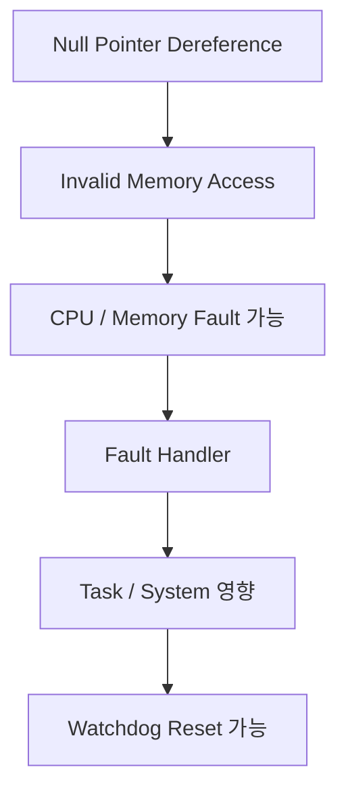

물론 Null Pointer Dereference가 항상 Reboot로 이어지는 것은 아니다. Memory Map이나 MPU/MMU 구성, 실행 환경에 따라 Fault가 발생할 수도 있고, 잘못된 Memory를 읽거나 쓰면서 다른 형태의 문제로 이어질 수도 있다. C/C++ 관점에서는 Null Pointer를 Dereference하는 행위 자체가 Undefined Behavior다.

어쨌든 당시에는 잘못된 Pointer 하나가 제품 전체의 안정성에 영향을 줄 수 있었기 때문에 Null Pointer를 상당히 조심했었다. 그러다 최근에 Java/Spring Backend를 개발하면서 다시 비슷한 이름을 만났다.

```java
String value = null;
value.length();
```

`NullPointerException`이다.

이름만 보면 예전에 다루던 Null Pointer 문제와 비슷해 보이지만, 실제 동작은 꽤 달랐다. Java에서는 `NullPointerException`이 발생했다고 해서 JVM 전체가 바로 종료되는 것이 아니라 현재 실행 흐름에서 Exception이 발생하고, 적절한 Handler가 없다면 호출 스택을 따라 위로 전파된다.

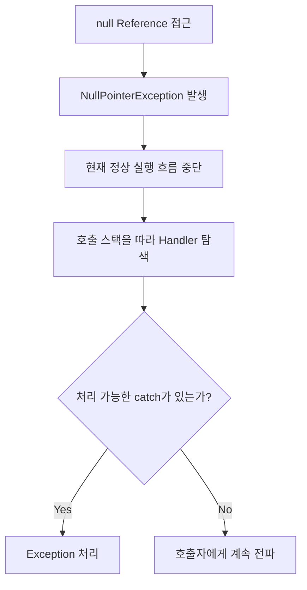

같은 Null 문제처럼 보이는데 왜 결과가 이렇게 다를까?

이 질문을 따라가면서 Java의 Exception을 단순한 `try-catch` 문법이 아니라, 실패가 호출 스택을 통해 전달되는 실행 구조로 다시 보게 되었다.

---

## RTOS의 Null Pointer와 Java의 NullPointerException

먼저 두 현상은 이름이 비슷할 뿐 동일한 메커니즘은 아니다.

Native 환경에서 Pointer는 실제 Memory Address와 연결된다. 잘못된 Pointer를 Dereference하면 결국 잘못된 Memory Access가 발생하고, 그 결과는 Hardware와 Runtime 환경에 따라 달라질 수 있다.

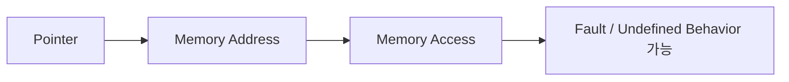

반면 Java의 Reference는 JVM의 실행 모델 안에서 관리된다. Null Reference를 이용해 Instance Method나 Field 등에 접근하려 하면 JVM은 해당 상황을 Java Exception으로 표현한다.

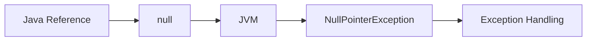

따라서 둘의 차이를 단순히 "C/C++은 위험하고 Java는 안전하다" 정도로 보는 것은 정확하지 않다. 더 중요한 차이는 실패가 어떤 계층에서, 어떤 방식으로 표현되느냐에 있다.

RTOS나 Native 환경에서는 잘못된 Pointer 접근이 Memory Access와 직접 연결되면서 Hardware 또는 Runtime 수준의 Fault로 이어질 수 있다. Java에서는 JVM이 그 상황을 `NullPointerException`이라는 객체와 예외 처리 흐름으로 표현한다.

Java 역시 처리되지 않은 Exception 때문에 현재 작업이 실패하거나 Thread가 종료될 수 있다. 다만 Memory Access 문제를 애플리케이션에 그대로 노출하는 대신 JVM이 이를 Java의 Exception Model 안에서 다룰 수 있도록 추상화한다는 점이 다르다.

그렇다면 이 Exception은 실제로 어떻게 움직이는 것일까?

---

## Throwable에서 시작하는 Java 예외 구조

Java에서 던질 수 있는 객체의 최상위 타입은 `Throwable`이다. 구조를 단순화하면 다음과 같다.

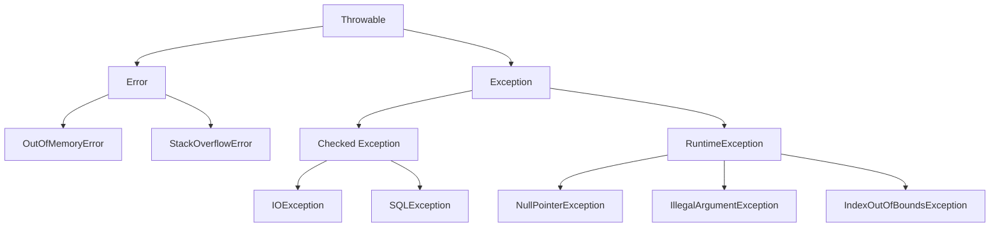

크게 보면 `Error`와 `Exception`으로 나뉜다.

### Error

`Error`는 JVM이나 실행 환경에서 발생하는 심각한 문제를 나타낸다. 대표적으로 `OutOfMemoryError`, `StackOverflowError` 등이 있다.

`Error`도 `Throwable`이기 때문에 문법적으로는 `catch`할 수 있다.

```java
try {
    ...
} catch (OutOfMemoryError e) {
    ...
}
```

하지만 일반적인 Application Logic에서 복구를 전제로 처리하는 대상은 아니다. 또한 `catch (Exception e)`는 `Error`를 잡지 않는다. `Error`와 `Exception`은 `Throwable` 아래의 서로 다른 계층이기 때문이다.

---

## Checked Exception과 RuntimeException

`Exception` 아래에서는 다시 Checked Exception과 RuntimeException 계열을 구분할 수 있다.

### Checked Exception

Checked Exception은 Compiler가 처리 여부를 확인한다. 예를 들어 다음 메서드가 있다고 해보자.

```java
public void readFile() throws IOException {
    ...
}
```

호출자는 해당 Exception을 직접 처리하거나 다시 호출자에게 전달해야 한다.

```java
try {
    readFile();
} catch (IOException e) {
    ...
}
```

또는 자신도 `throws`를 선언할 수 있다.

```java
public void execute() throws IOException {
    readFile();
}
```

### RuntimeException

`RuntimeException` 계열은 Unchecked Exception이다. `NullPointerException`, `IllegalArgumentException`, `IndexOutOfBoundsException` 등이 여기에 해당한다.

```java
public void validate(int amount) {
    if (amount < 0) {
        throw new IllegalArgumentException();
    }
}
```

이 코드는 별도의 `throws` 선언 없이도 컴파일된다.

여기서 중요한 점은 Unchecked라는 말이 "예외가 전파되지 않는다"는 의미가 아니라는 것이다. Checked Exception과 RuntimeException 모두 실제로 발생하면 호출 스택을 통해 전파될 수 있다. 차이는 Compiler가 처리 여부를 강제하느냐에 있다.

---

## Exception이 발생하면 실행 흐름은 어떻게 바뀔까

Exception을 이해할 때 가장 먼저 봐야 하는 것은 예외가 발생한 이후의 코드가 어떻게 되는지다.

```java
try {
    doA();
    doB();
    doC();
} catch (Exception e) {
    handle(e);
}
```

`doB()` 안에서 Exception이 발생하면 `doC()`까지 실행한 뒤 Error를 처리하는 것이 아니다. 정상 실행 흐름은 `doB()`에서 바로 끊기고, JVM은 해당 Exception을 처리할 수 있는 Handler를 찾기 시작한다.

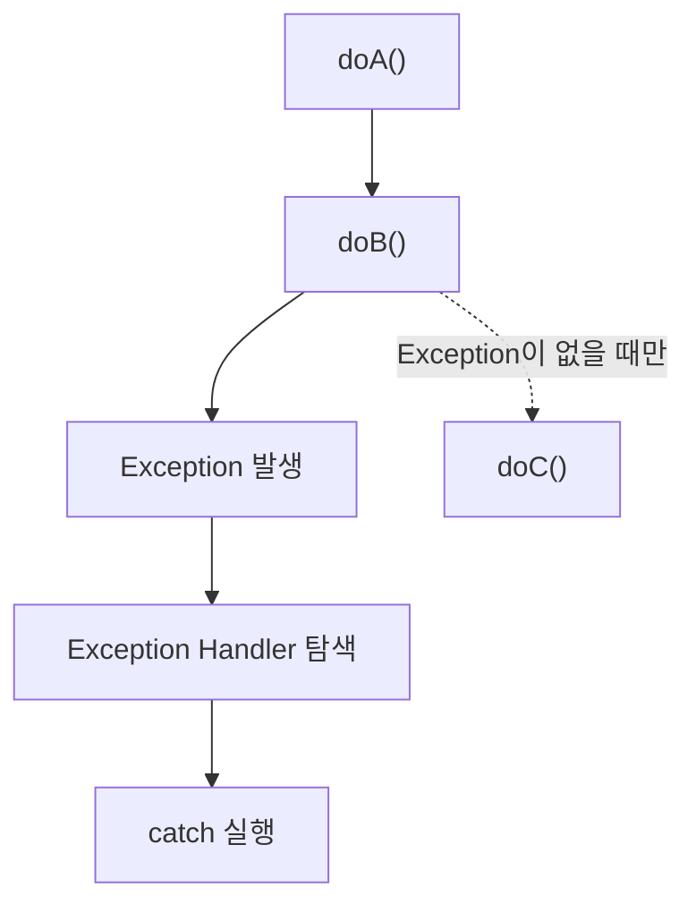

즉 Exception은 단순히 오류 상태를 기록하는 값이 아니다. 정상적인 Control Flow를 중단하고 예외 처리 경로로 실행을 이동시키는 메커니즘이기도 하다.

이 지점을 이해하고 나면 이후의 `catch`, `throw`, 예외 전파도 훨씬 자연스럽게 연결된다.

---

## catch가 없다면 Exception은 어디로 갈까

Backend에서 흔히 볼 수 있는 호출 구조를 생각해보자.

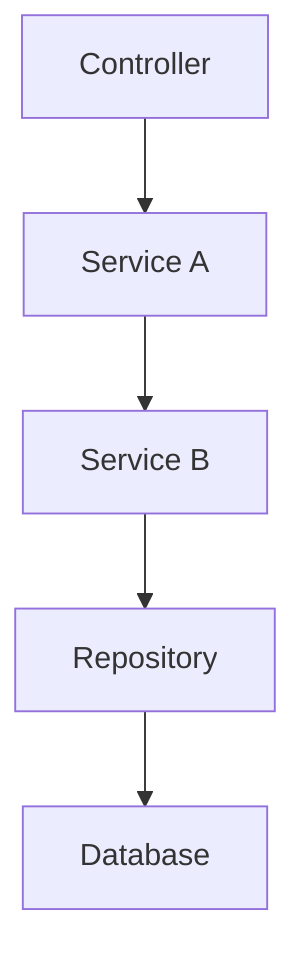

메서드 호출도 다음과 같이 이어져 있다고 하자.

```java
public void serviceA() {
    serviceB();
}
```

```java
public void serviceB() {
    repository.save();
}
```

그리고 `repository.save()`에서 `RuntimeException`이 발생했다.

Repository 안에서 Exception을 처리하지 않는다면 호출자인 `serviceB()`로 전달된다. `serviceB()`에도 적절한 Handler가 없다면 다시 `serviceA()`로 올라간다.

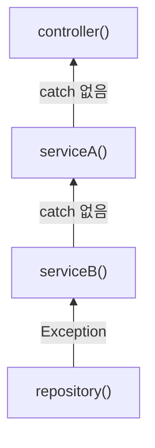

이 과정을 Exception Propagation이라고 한다.

조금 더 내부적으로 보면 JVM은 현재 Stack Frame에서 해당 Exception을 처리할 수 있는 Handler를 찾는다. Handler가 없다면 현재 Frame을 빠져나오고 이전 호출자의 Frame으로 이동한다.

```text
controller()
 └─ serviceA()
     └─ serviceB()
         └─ repository()
             ↑ Exception 발생
```

Exception이 발생하면 호출 방향과 반대로 Stack을 올라가며 Handler를 탐색한다. 따라서 예외가 항상 Controller까지 올라가는 것은 아니다. 중간에 해당 타입을 처리할 수 있는 `catch`를 만나면 그곳에서 전파가 멈출 수 있다.

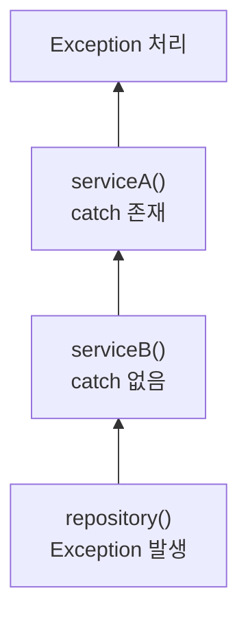

`catch`가 어떤 Exception을 처리할 수 있는지는 타입 관계에 따라 결정된다. 예를 들어 `catch (RuntimeException e)`는 `RuntimeException`뿐 아니라 그 하위 타입인 `NullPointerException`, `IllegalArgumentException` 등도 처리할 수 있다.

---

## 예외를 잡고 끝낼 것인가, 다시 던질 것인가

다음 코드를 보자.

```java
public void serviceB() {
    try {
        repository.save();
    } catch (RuntimeException e) {
        log.error("save failed", e);
    }
}
```

Repository에서 Exception이 발생하면 `serviceB()`의 `catch`가 이를 처리한다. 이후 다시 Exception을 던지는 코드가 없기 때문에 해당 예외의 전파는 여기서 끝난다.

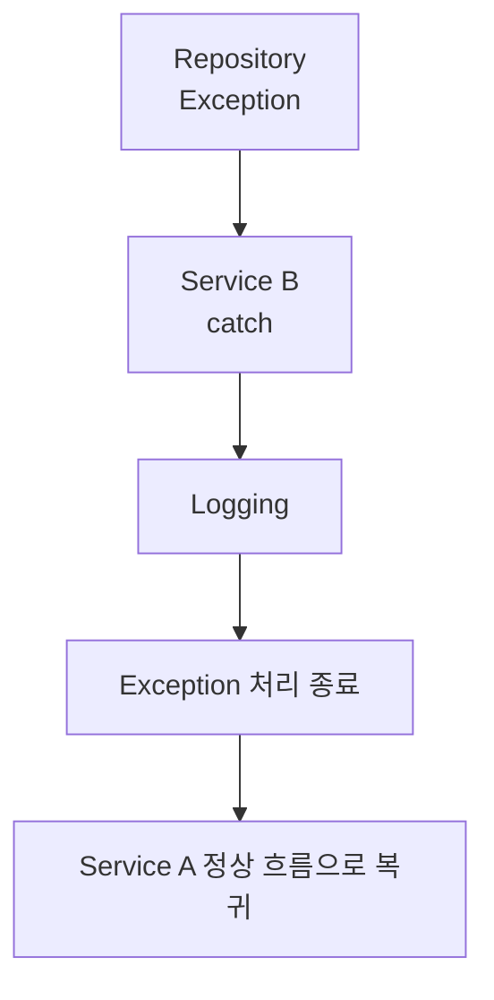

반대로 다시 던지면 흐름이 달라진다.

```java
public void serviceB() {
    try {
        repository.save();
    } catch (RuntimeException e) {
        log.error("save failed", e);
        throw e;
    }
}
```

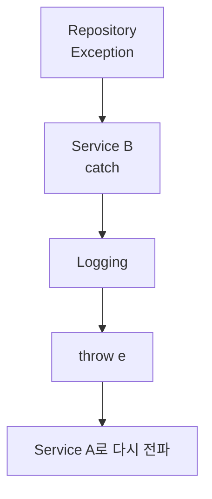

정리하면 `catch`는 전달된 Exception을 현재 위치에서 처리하는 역할이고, `throw`는 현재 위치에서 Exception을 다시 던지는 역할이다. `catch`했다고 해서 예외가 자동으로 바깥까지 전달되는 것은 아니다.

---

## throw와 throws는 무엇이 다를까

`throw`와 `throws`는 동작하는 시점과 역할이 다르다.

단순하게 구분하면 아래와 같다.

* `throw`: 현재 코드에서 실제로 Exception을 발생시킨다.
* `throws`: 이 메서드에서 처리하지 않은 Exception이 호출자에게 전달될 수 있음을 선언한다.

### throw: 실제로 예외를 발생시킨다

`throw`는 실행 코드 안에서 사용한다.

```java
public void validate(int amount) {
    if (amount < 0) {
        throw new IllegalArgumentException(
            "amount must be positive"
        );
    }
}
```

`amount < 0` 조건이 만족되면 `throw`가 실행되고, 그 순간 정상 실행 흐름은 중단된다. 이후 JVM은 현재 위치부터 해당 Exception을 처리할 수 있는 Handler를 찾기 시작한다.

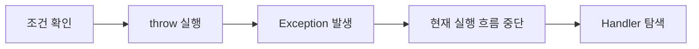

즉 `throw`는 실제로 Exception을 발생시키는 동작이다.

### throws: 현재 메서드에서 처리하지 않겠다고 선언한다

반면 `throws`는 메서드 선언부에 작성한다.

```java
public void readFile() throws IOException {
    ...
}
```

여기서 `throws IOException` 자체가 `IOException`을 발생시키는 것은 아니다.

메서드 내부에서 `IOException`이 발생했는데 현재 메서드에서 이를 처리하지 않는다면, 해당 Exception이 호출자에게 전달될 수 있음을 메서드 선언에 나타낸다.

```java
public void readFile() throws IOException {
    fileInputStream.read();
}
```

호출하는 쪽에서는 다음과 같이 처리할 수 있다.

```java
public void execute() {
    try {
        readFile();
    } catch (IOException e) {
        log.error("file read failed", e);
    }
}
```

`IOException`은 `readFile()` 내부의 코드에서 발생한다. `readFile()`은 해당 예외를 직접 `catch`하지 않고 `throws IOException`으로 선언했기 때문에 호출자인 `execute()`까지 예외가 전달되고, `execute()`의 `catch`에서 최종적으로 처리된다.

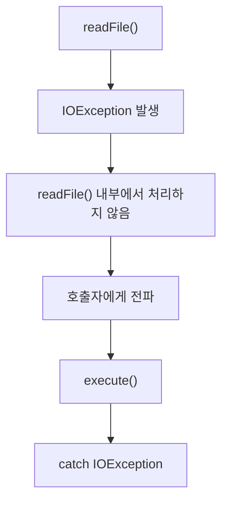

여기까지 보면 한 가지 의문이 생긴다.

`IOException`은 어차피 처리하지 않으면 호출자에게 전파되는데, 굳이 `throws IOException`을 선언해야 하는 이유는 무엇일까?

그 이유는 `IOException`이 Checked Exception이기 때문이다.

Java Compiler는 Checked Exception이 발생할 수 있는 코드를 만나면 현재 메서드가 그 Exception을 어떻게 처리할 것인지 확인한다. 따라서 현재 메서드는 둘 중 하나를 선택해야 한다.

직접 처리하거나,

```java
public void readFile() {
    try {
        fileInputStream.read();
    } catch (IOException e) {
        log.error("file read failed", e);
    }
}
```

현재 메서드에서는 처리하지 않고 호출자에게 넘기겠다고 선언해야 한다.

```java
public void readFile() throws IOException {
    fileInputStream.read();
}
```

이를 흐름으로 보면 다음과 같다.

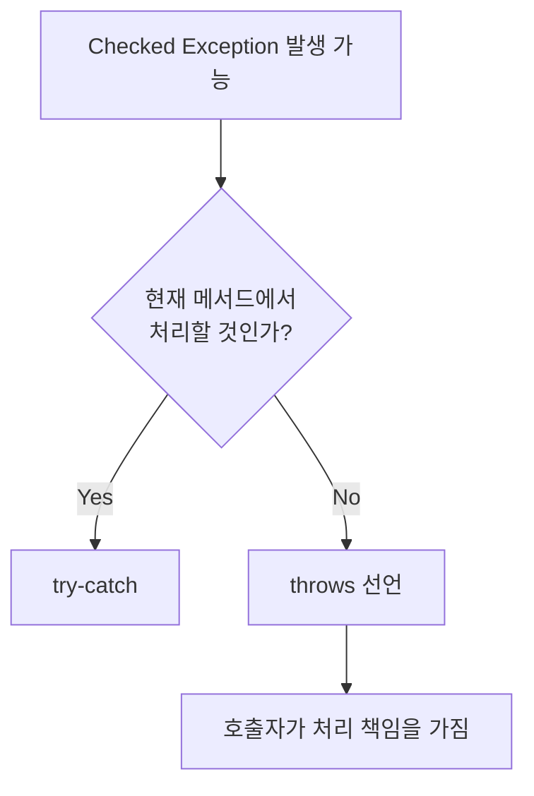

즉 `throws`는 Exception을 전파시키기 위해 존재하는 문법이라기보다, **Checked Exception을 현재 메서드에서 처리하지 않고 호출자에게 넘기겠다는 사실을 Compiler와 호출자에게 명시하는 역할**을 한다.

호출자가 다시 처리하지 않는다면 그 호출자 역시 `throws`를 선언할 수 있다.

```java
public void execute() throws IOException {
    readFile();
}
```

이렇게 되면 처리 책임은 다시 상위 호출자로 넘어간다.

반면 RuntimeException 계열은 다르다.

```java
public void validate(int amount) {
    if (amount < 0) {
        throw new IllegalArgumentException();
    }
}
```

`IllegalArgumentException`은 RuntimeException이므로 `throws IllegalArgumentException`을 선언하지 않아도 컴파일된다. 실제로 Exception이 발생하면 동일하게 호출 스택을 따라 전파되지만, Compiler가 호출자에게 처리 여부를 강제하지 않는다.

물론 다음처럼 선언하는 것 자체는 가능하다.

```java
public void validate(int amount) throws IllegalArgumentException {
    ...
}
```

하지만 RuntimeException은 `throws` 선언이 없어도 전파되기 때문에 일반적으로 필수는 아니다.

결국 `throw`와 `throws`의 차이는 다음 코드에서 가장 명확하게 드러난다.

```java
public void process() throws IOException {
    throw new IOException("read failed");
}
```

`throw new IOException(...)`은 실제 Exception을 발생시키고, `throws IOException`은 그 Exception을 현재 메서드에서 처리하지 않을 경우 호출자에게 전달될 수 있음을 선언한다.

특히 Checked Exception에서는 `throws`를 통해 "이 실패를 현재 메서드가 처리할 것인지, 호출자가 처리할 것인지"를 컴파일 단계에서 결정하게 된다.

반면 RuntimeException은 `throws`를 선언하지 않아도 호출 스택을 따라 전파될 수 있다. 따라서 `throws`가 예외 전파 자체를 만들어내는 것은 아니다. 예외 전파는 Java의 Exception 처리 구조에서 원래 일어나는 동작이고, `throws`는 그중 특히 Checked Exception의 처리 책임을 메서드 경계에 드러내는 역할을 한다.

---

## 예외를 굳이 catch해야 하는 경우

다음 코드를 생각해보자.

```java
try {
    repository.save();
} catch (RuntimeException e) {
    throw e;
}
```

이 코드는 Exception을 잡은 뒤 아무 처리 없이 그대로 다시 던진다. 하지만 `catch`가 없더라도 `repository.save()`에서 발생한 Exception은 원래 호출자에게 전파된다.

따라서 단순히 예외를 위로 전달하는 것이 목적이라면 굳이 `catch`할 필요가 없다. `catch`를 사용하는 이유는 현재 계층에서 해당 실패에 대해 실제로 해야 할 일이 있을 때 생긴다.

### 실패를 복구할 수 있을 때

예를 들어 외부 API 호출이 일시적으로 실패했다고 해보자. 현재 계층에서 다시 호출해도 안전하다면 Exception을 잡은 뒤 Retry를 시도할 수 있다.

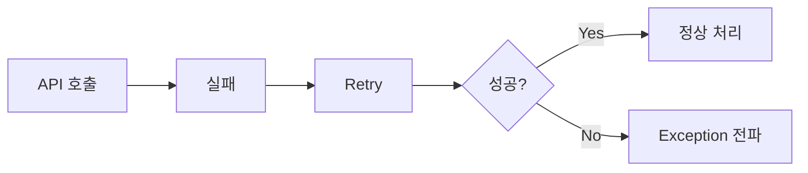

이 경우 `catch`의 목적은 단순히 Exception을 받아내는 것이 아니라, 실패를 복구해보는 데 있다. Retry에 성공하면 정상 흐름으로 돌아갈 수 있고, 최종적으로 복구하지 못했을 때만 Exception을 다시 상위 계층으로 전달할 수 있다.

### 하위 계층의 Exception을 다른 의미로 바꿀 때

Repository에서는 DB 접근 과정에서 `DataAccessException`이 발생할 수 있다.

하지만 Service 입장에서는 단순히 "DB에서 오류가 발생했다"는 사실보다 "주문 저장에 실패했다"는 의미가 더 중요할 수 있다.

```java
try {
    repository.save(order);
} catch (DataAccessException e) {
    throw new OrderSaveException(
        order.getId(),
        e
    );
}
```

여기서는 하위 계층의 기술적인 Exception을 잡은 뒤, 상위 계층에서 이해하기 쉬운 Exception으로 바꾸어 다시 던진다.

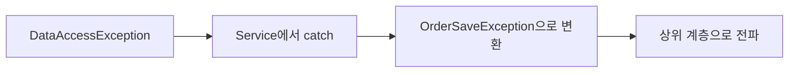

`OrderSaveException`에 기존 Exception을 Cause로 넘겨두면 상위 계층에서는 Business 의미를 기준으로 처리하면서도 실제 DB 오류의 원인은 그대로 추적할 수 있다.

### 현재 계층에서만 알 수 있는 정보가 있을 때

Exception이 발생한 위치와 그 실패의 Business Context를 알고 있는 위치가 항상 같지는 않다.

예를 들어 Repository는 다음 정도만 알 수 있다.

> INSERT 수행 중 DB 오류가 발생했다.

반면 Service에서는 같은 실패를 다음과 같이 이해할 수 있다.

> 주문 생성 과정에서 주문 정보를 저장하지 못했다.

Service는 현재 어떤 Business 작업을 수행하고 있었는지 알고 있기 때문이다.

따라서 현재 계층에서만 알 수 있는 정보가 실제 장애 분석이나 예외 의미를 표현하는 데 필요하다면, 그 위치에서 Exception을 잡아 Context를 추가하거나 다른 Exception으로 변환할 수 있다.

다만 단순히 모든 계층에서 같은 Exception을 `log.error`로 남긴 뒤 다시 던지면 중복 Logging 문제가 생길 수 있다. Context를 추가하기 위해 `catch`한다면 해당 정보가 정말 이 위치에서 필요한지 함께 판단해야 한다.

결국 `catch`를 둘 위치는 "여기서 예외를 잡을 수 있는가?"보다 다음 질문으로 결정하는 것이 자연스럽다.

> 이 계층에서 이 실패에 대해 실제로 할 수 있는 일이 있는가?

복구할 수 있다면 복구하고, 더 적절한 의미로 바꿀 필요가 있다면 변환한다. 현재 계층에서 특별히 할 일이 없다면 굳이 `catch`하지 않고 그대로 상위 계층으로 전파하는 것이 자연스럽다.

---

## Spring에서는 Exception이 어디까지 올라갈까

일반적인 Spring MVC Application을 단순화하면 다음과 같은 구조를 생각할 수 있다.

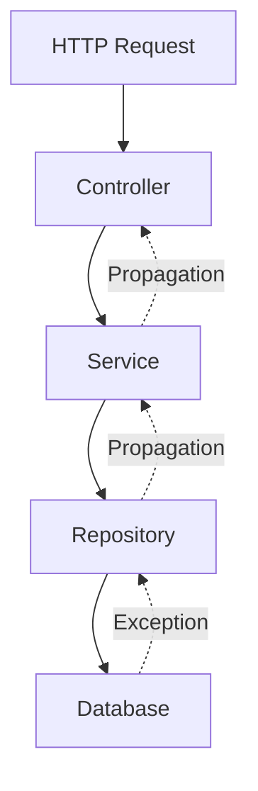

Repository나 Service에서 RuntimeException이 발생하고 중간에서 처리하지 않는다면 호출 스택을 따라 Controller 방향으로 전파된다. 그렇다고 Controller마다 직접 `try-catch`를 작성해야 하는 것은 아니다.

```java
@PostMapping("/orders")
public ResponseEntity<Void> createOrder(
        @RequestBody OrderRequest request) {

    orderService.createOrder(request);
    return ResponseEntity.ok().build();
}
```

Service에서 `OrderNotFoundException`이 발생한다고 해서 모든 Controller가 아래처럼 예외 처리 코드를 반복할 필요는 없다.

```java
try {
    orderService.createOrder(request);
} catch (OrderNotFoundException e) {
    ...
}
```

Spring MVC는 Controller에서 처리되지 않은 Exception을 다루기 위한 별도의 예외 처리 구조를 제공한다. 그중 대표적인 방식이 `@ControllerAdvice` 또는 `@RestControllerAdvice`다.

---

## Global Exception Handler는 무엇을 하는가

예를 들어 다음과 같이 전역 예외 처리기를 만들 수 있다.

```java
@RestControllerAdvice
public class GlobalExceptionHandler {

    @ExceptionHandler(OrderNotFoundException.class)
    public ResponseEntity<ErrorResponse> handle(
            OrderNotFoundException e) {

        return ResponseEntity
                .status(HttpStatus.NOT_FOUND)
                .body(
                    new ErrorResponse(
                        "ORDER_NOT_FOUND",
                        e.getMessage()
                    )
                );
    }
}
```

전체 흐름을 단순화하면 다음과 같다.

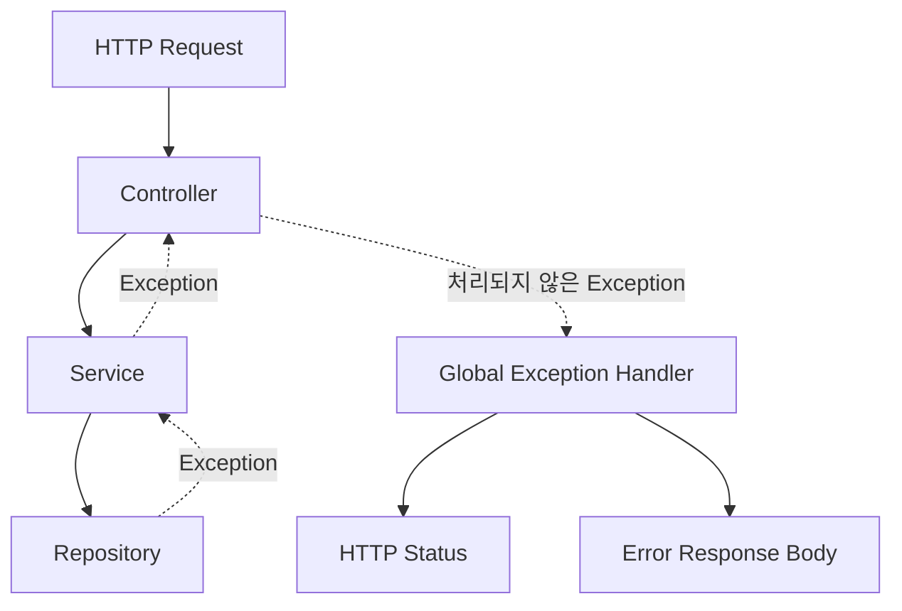

Exception은 이미 하위 계층에서 발생했고 호출 스택을 통해 여기까지 전달된 것이다. Global Exception Handler는 Exception 자체를 없애는 곳이 아니라, Application 내부의 Exception을 HTTP라는 외부 Protocol의 Error Response로 변환하는 Boundary에 가깝다.

예를 들어 `OrderNotFoundException`은 `404 Not Found`, `DuplicateOrderException`은 `409 Conflict`, `InvalidOrderException`은 `400 Bad Request`로 매핑할 수 있다. 이렇게 하면 여러 Controller에서 같은 예외 처리 코드를 반복하지 않아도 되고, Error Response 규칙도 한 곳에서 관리할 수 있다.

다만 애플리케이션의 모든 Exception이 무조건 `@ControllerAdvice`까지 전달되는 것은 아니다. Servlet Filter나 Security Filter Chain처럼 Controller 실행 이전에 동작하는 계층에서 발생한 Exception은 별도의 처리 경로를 가질 수 있다.

---

## 모든 계층에서 log.error를 찍으면 어떻게 될까

Exception Propagation을 이해하고 나면 실무에서 자주 보이는 중복 Logging도 조금 다르게 보인다.

Repository에서 Exception을 잡아 `log.error`를 남기고 다시 던지고, Service에서도 같은 방식으로 처리하고, Controller와 Global Handler에서도 다시 로그를 남긴다고 해보자. 실제 실패는 한 번인데 동일한 Stack Trace가 여러 번 기록될 수 있다.

```text
ERROR Repository - save failed
    at ...

ERROR Service - order creation failed
    at ...

ERROR Controller - request failed
    at ...

ERROR GlobalExceptionHandler - request failed
    at ...
```

이 경우 Exception이 네 번 발생한 것이 아니라 같은 실패가 호출 스택을 따라 이동하면서 네 번 Logging된 것이다.

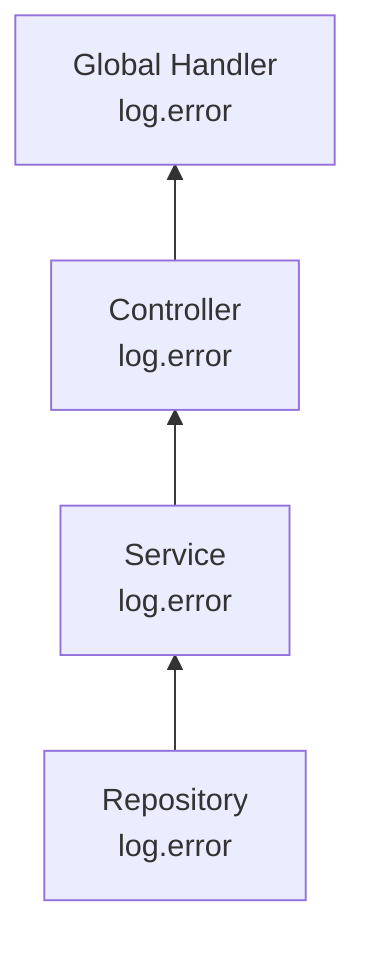

Logging이 많다고 장애 분석에 필요한 정보가 반드시 많아지는 것은 아니다. 동일한 Stack Trace가 반복되면 오히려 한 요청에서 실제로 몇 번의 장애가 발생한 것인지 구분하기 어려워질 수 있다.

따라서 Exception Handling과 함께 누가 실패 로그를 남길 것인지도 정할 필요가 있다.

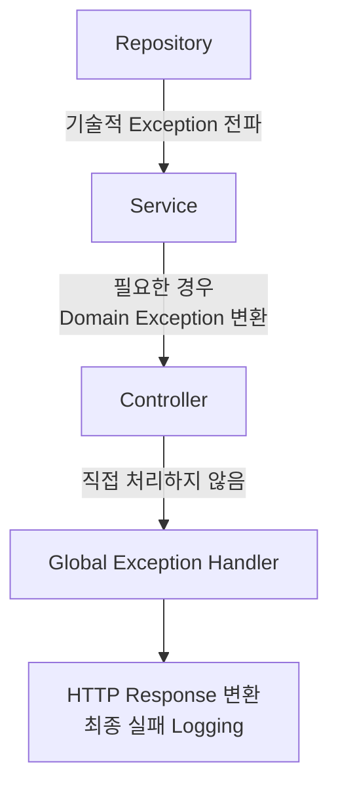

이 구조가 항상 정답이라는 의미는 아니다. 특정 계층에서만 알 수 있는 중요한 Context가 있다면 해당 위치에서 로그를 남길 수도 있다.

다만 같은 Stack Trace를 습관적으로 반복해서 남기기보다는, **이 로그를 이 계층에서 남겨야 하는 이유가 있는지**를 먼저 생각해보는 것이 중요하다.

---

## Exception을 잡는 것은 Transaction에도 영향을 준다

Service 계층에서 Exception을 처리할 때는 Transaction과의 관계도 생각해보아야 한다.

```java
@Transactional
public void createOrder() {
    repository.saveOrder();
    repository.saveHistory();
}
```

Spring의 기본 Transaction Rollback 규칙에서는 `RuntimeException`이나 `Error`가 Transaction Boundary 밖으로 전파되면 Rollback 대상이 된다.

```mermaid
flowchart TD
    S["saveOrder()"] --> H["saveHistory()"]
    H --> E["RuntimeException"]
    E --> T["Transactional Method 밖으로 전파"]
    T --> R["Rollback"]
```

그런데 Exception을 중간에서 잡고 정상적으로 메서드를 끝낸다면 상황이 달라질 수 있다.

```java
@Transactional
public void createOrder() {
    repository.saveOrder();

    try {
        repository.saveHistory();
    } catch (RuntimeException e) {
        log.error("history save failed", e);
    }
}
```

이 경우 RuntimeException이 Transactional Method 바깥까지 전달되지 않는다. 따라서 Spring이 실패를 인식하고 Rollback을 결정하는 방식도 달라질 수 있다.

다만 사용하는 Persistence 기술이나 하위 계층의 동작에 따라 이미 Transaction이 `rollback-only` 상태로 표시되는 경우도 있으므로, 단순히 "catch하면 항상 Commit된다"고 이해해서는 안 된다.

핵심은 `catch`가 단순히 Error Log를 하나 남기는 문법이 아니라는 점이다. Exception의 전파를 중단하면 Transaction Boundary가 실패를 인식하는 방식에도 영향을 줄 수 있다.

그래서 Transaction 안에서 Exception을 잡을 때는 "이 Exception을 여기서 정말 끝내도 되는가?"를 함께 봐야 한다.

---

## 그렇다면 Exception은 어디에서 잡아야 할까

처음에는 Exception이 발생할 가능성이 있는 코드마다 `try-catch`를 두는 것이 안전한 코드처럼 보일 수 있다. 하지만 모든 계층에서 Exception을 잡으면 오히려 흐름을 이해하기 어려워지고, 상위 계층이 알아야 할 실패까지 중간에서 사라질 수 있다.

반대로 모든 Exception을 무조건 가장 위까지 보내는 것 역시 항상 정답은 아니다. 현재 계층에서 실패에 대해 의미 있는 행동을 할 수 있는지를 기준으로 보는 편이 이해하기 쉽다.

```mermaid
flowchart TD
    E["Exception 발생"] --> Q1{"현재 계층에서<br/>복구할 수 있는가?"}

    Q1 -->|Yes| R["복구 / Retry"]
    Q1 -->|No| Q2{"의미를 변환할<br/>필요가 있는가?"}

    Q2 -->|Yes| D["Domain Exception 등으로 변환"]
    Q2 -->|No| Q3{"현재 Boundary에서<br/>응답으로 변환해야 하는가?"}

    Q3 -->|Yes| H["HTTP Error Response 등으로 변환"]
    Q3 -->|No| P["그대로 전파"]
```

일반적인 Spring Application에 적용하면 다음 정도의 기준을 생각해볼 수 있다.

| 계층 | 예외 처리 관점 |
| --- | --- |
| Repository | 기술적 실패를 상위 계층에 전달 |
| Service | 필요한 경우 Business / Domain 의미로 변환 |
| Controller | Application 호출에 집중 |
| Global Exception Handler | Exception을 HTTP Response로 변환 |
| Logging | 동일 실패를 반복 기록하지 않도록 책임 결정 |

물론 프로젝트의 Architecture나 요구사항에 따라 실제 정책은 달라질 수 있다. 중요한 것은 모든 Layer에 `try-catch`를 넣는 것이 아니라 각 Layer의 책임과 Boundary를 기준으로 Exception 처리 위치를 결정하는 것이다.

---

## 전체 흐름 다시 보기

처음에는 Java의 Exception을 "문제가 발생하면 `try-catch`로 처리하는 것" 정도로 이해했다. 하지만 실제 실행 흐름을 따라가 보면 그보다 조금 더 구조적인 문제다.

```mermaid
flowchart TD
    F["실패 발생"] --> E["Exception 생성 / throw"]
    E --> S["현재 정상 실행 흐름 중단"]
    S --> P["호출 스택을 따라 전파"]
    P --> H{"처리 가능한 Handler?"}

    H -->|No| P
    H -->|Yes| C["catch / Exception Handler"]

    C --> A{"현재 계층의 책임"}
    A --> R["복구"]
    A --> T["다른 Exception으로 변환"]
    A --> B["HTTP Response로 변환"]
    A --> L["Logging"]
```

`try-catch`, `throw`, `throws`, `@ControllerAdvice`는 각각 따로 존재하는 문법이나 기능처럼 보인다. 하지만 하나의 실행 흐름 안에서 보면 결국 같은 질문으로 연결된다.

실패는 어디에서 발생했는가. 현재 계층이 그 실패를 처리할 수 있는가. 처리하지 않는다면 어디까지 전달되는가. 그리고 어느 Boundary에서 그 실패의 의미를 바꿔야 하는가.

---

## 정리

Embedded Application을 개발할 때 Null Pointer를 보면 가장 먼저 생각했던 것은 Memory였다.

```mermaid
flowchart LR
    N["Null Pointer"] --> M["Invalid Memory Access"]
    M --> F["Fault 가능"]
    F --> S["System 영향 가능"]
```

Java/Spring Backend에서 `NullPointerException`을 다시 만난 뒤에는 같은 Null 문제를 다른 흐름으로 보게 됐다.

```mermaid
flowchart LR
    N["null Reference"] --> E["Exception"]
    E --> P["Propagation"]
    P --> H["Handler"]
    H --> R["Application Response"]
```

둘 다 실패라는 점은 같지만 실패를 다루는 실행 모델은 다르다. Native 환경에서는 잘못된 Pointer 접근이 Memory와 Hardware 수준의 문제로 연결될 수 있고, Java에서는 JVM이 실패를 Exception이라는 객체와 실행 흐름으로 표현한다. Exception은 호출 스택을 따라 상위 계층으로 전달되고, Spring은 그 위에서 Application 내부의 Exception을 HTTP Response와 같은 외부 표현으로 변환할 수 있는 구조를 제공한다.

```mermaid
flowchart TD
    H["Hardware / Memory"] --> N["Native Failure"]
    J["JVM Runtime"] --> E["Java Exception"]
    E --> A["Application Exception"]
    A --> S["Spring Exception Handling"]
    S --> HTTP["HTTP Error Response"]
```

처음에는 `try-catch`가 Exception을 막기 위한 코드라고 생각했다. 하지만 실제 호출 흐름을 따라가 보니 중요한 것은 Exception을 무조건 잡는 것이 아니었다. 실패가 발생한 위치와 그 실패를 책임질 위치를 분리하는 것이 더 중요했다.

Repository에서 발생한 기술적인 실패를 Service가 Business 의미로 바꿀 수도 있고, 처리할 이유가 없다면 그대로 전달할 수도 있다. Application Boundary에서는 그 Exception을 HTTP Status와 Error Response로 변환할 수 있고, Logging 역시 어느 계층이 실패를 가장 의미 있게 설명할 수 있는지에 따라 책임을 정할 수 있다.

결국 Java의 예외 처리를 이해한다는 것은 `try`, `catch`, `throw`, `throws` 문법을 외우는 데서 끝나지 않았다.

> 실패를 어디에서 발생시키고, 어디까지 전달하며, 어느 경계에서 책임지고 처리할 것인가.

이 흐름을 이해하고 나니 `Exception Propagation`, `@ControllerAdvice`, Transaction Rollback, Logging 정책도 서로 다른 주제가 아니라 하나의 Exception Handling 구조로 연결해서 볼 수 있었다.
