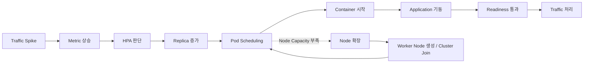
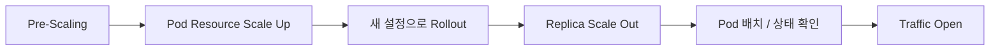

# Reactive Autoscaling의 한계와 Pre-Scaling

Kubernetes 환경에서는 트래픽 증가에 대응하기 위해 HPA(Horizontal Pod Autoscaler)를 사용할 수 있다. CPU, Memory 또는 Custom Metric이 일정 기준을 넘으면 Replica 수를 자동으로 늘리고, 부하가 줄어들면 다시 줄이는 방식이다.

여기에서 한 가지 의문이 생긴다.

> Kubernetes에 Autoscaling이 있는데, 왜 대형 이벤트 전에는 Pod를 미리 Scale Up / Scale Out할까?

핵심은 Autoscaling이 **예측 기반이 아니라 반응 기반으로 동작한다는 점**이다.

일반적인 HPA는 미래 트래픽을 예측해서 미리 Pod를 생성하지 않는다. 현재 Metric이 올라간 뒤 필요한 Replica 수를 계산하고, 그 결과에 따라 새로운 Pod를 생성한다. 따라서 트래픽이 점진적으로 증가하는 상황에서는 효과적으로 대응할 수 있지만, 특정 시점에 요청이 급격하게 몰리는 환경에서는 확장 자체에 필요한 시간이 문제가 될 수 있다.

---

## Autoscaling에는 반응 시간이 필요하다

HPA가 Replica 수를 늘렸다고 해서 새로운 처리 용량이 즉시 확보되는 것은 아니다.

실제 처리 Capacity가 늘어나기까지는 다음과 같은 단계가 필요하다.

새 Pod가 생성되면 Scheduler가 이를 실행할 Worker Node를 선택해야 한다. 이후 Container가 시작되고, Spring Boot 같은 애플리케이션이 기동된 뒤 Readiness Probe를 통과해야 실제 요청을 받을 수 있게 된다.

여기에 Worker Node의 CPU·Memory가 부족하다면 과정은 더 길어진다. Node Autoscaling이 구성된 환경이라면 새로운 Worker Node를 확보한 뒤 Cluster에 합류시키고, 이후에야 Pending 상태의 Pod를 배치할 수 있게 된다.

결국 Autoscaling이 정상적으로 동작하더라도 `부하 증가`와 `실제 처리 Capacity 증가` 사이에는 시간 차이가 생긴다.

이 차이는 트래픽이 서서히 증가할 때는 큰 문제가 되지 않을 수 있다. 하지만 특정 시각에 트래픽이 급격하게 증가하는 이벤트에서는 기존 Capacity가 새로운 Pod가 준비될 때까지의 요청을 버텨야 한다.

---

## 예측 가능한 트래픽은 미리 확장한다

대형 이벤트처럼 트래픽이 몰릴 시점과 규모를 어느 정도 예상할 수 있다면, 부하가 발생한 뒤 Autoscaling을 기다리는 것보다 필요한 Capacity를 사전에 확보하는 방식이 더 안정적일 수 있다.

이처럼 필요한 Capacity를 미리 확보하는 방식을 Pre-Scaling이라고 한다.

Kubernetes 환경에서는 보통 다음과 같은 방식으로 Capacity를 미리 조정할 수 있다.

- Pod의 CPU·Memory `requests`와 `limits`를 늘리는 Scale Up
- Deployment의 Replica 수를 늘리는 Scale Out
- 증가한 Pod를 수용할 수 있도록 충분한 Worker Node Capacity 확보

Pod의 Resource 설정을 변경하면 Deployment의 Pod Template이 변경되기 때문에 새로운 설정을 가진 Pod로 Rollout이 발생한다. 반대로 Replica 수만 증가시키는 경우에는 동일한 설정의 Pod가 추가로 생성된다.

여기서 중요한 것은 단순히 Pod 수를 많이 만들어 두는 것이 아니다.

이벤트가 시작된 이후 발생할 수 있는 `Pod 생성 → Scheduling → Application 기동 → Readiness` 과정을 미리 끝내 두고, 실제 트래픽이 들어오는 시점에는 이미 처리 가능한 Pod가 준비되어 있도록 만드는 것이 핵심이다.

결국 Pre-Scaling은 Autoscaling을 대신하는 방식이 아니라, **Autoscaling이 반응하기까지 필요한 시간을 사전에 제거하는 Capacity Planning 전략**인 것이다.

---

## Pod 확장만으로는 충분하지 않다

Pod를 Scale Out하려면 이를 실행할 Worker Node의 Capacity도 함께 확보되어 있어야 한다.

예를 들어 Replica 수를 10개에서 50개로 늘렸더라도 Cluster에 이를 수용할 CPU·Memory가 없다면 일부 Pod는 `Pending` 상태에 머물 수 있다.

따라서 대형 이벤트를 준비할 때는 Pod 수뿐 아니라 아래 항목을 함께 확인할 필요가 있다.

- 예상 Replica 수를 수용할 수 있는 Worker Node Capacity
- Pod의 `requests` 기준으로 실제 Scheduling이 가능한지
- Pod가 특정 Node에 과도하게 몰리지 않는지
- Database, Redis, 외부 API와 같은 하위 시스템도 증가한 트래픽을 감당할 수 있는지

특히 애플리케이션 Pod만 늘리고 Database Connection Pool이나 외부 API의 처리 한계를 고려하지 않으면 병목이 단순히 다른 계층으로 이동할 수 있다.

따라서 Kubernetes의 Scale Out은 Pod 수를 늘리는 작업에서 끝나지 않고, **전체 시스템의 병목이 어디로 이동할지를 함께 보는 문제**가 된다.

---

## Scale In 후 다시 Scale Out하는 이유

대규모 트래픽을 앞두고 Replica를 늘린 뒤 일부를 줄였다가 다시 늘리는 작업을 수행하기도 한다. 이런 작업의 한 가지 목적은 새 Pod의 Scheduling을 다시 발생시켜 Worker Node 간 Pod 분산 상태를 조정하는 데 있다.

Kubernetes Scheduler는 새로 생성된 Pod의 배치 위치를 결정한다. 이미 실행 중인 Pod를 단순히 현재 분포가 고르지 않다는 이유로 다른 Worker Node로 계속 옮기는 구조는 아니다.

따라서 일부 Pod를 Scale In으로 제거한 뒤 다시 Scale Out하면 새로운 Pod가 생성되고, Scheduler는 그 시점의 Node Resource와 Scheduling 정책을 기준으로 배치를 다시 수행하게 된다. 여러 Worker Node의 Capacity가 미리 확보되어 있다면 새 Pod가 상대적으로 여유 있는 Node에 배치되면서 분산 상태가 나아질 수 있다.

(다만 `Scale In → Scale Out` 자체가 Pod의 균등 분배를 보장하는 것은 아니다. 실제 배치는 Node의 여유 Resource와 Scheduling 정책에 따라 달라지며, 명시적인 분산이 필요하다면 `topologySpreadConstraints`, `podAntiAffinity` 등의 설정을 함께 확인해야 한다.)

---

## Autoscaling과 Pre-Scaling의 역할

Autoscaling과 Pre-Scaling은 역할이 다르다.

| 구분 | Autoscaling | Pre-Scaling |
| --- | --- | --- |
| 동작 기준 | 실제 Metric 변화 | 예상된 트래픽 |
| 동작 시점 | 부하 발생 후 | 부하 발생 전 |
| 목적 | 변화하는 부하에 자동 대응 | 시작 시점의 Capacity 확보 |
| 장점 | 운영 자동화, 비용 효율 | 순간적인 트래픽 폭증 대응 |
| 한계 | 실제 확장까지 지연 존재 | 과도한 Capacity 확보 가능 |

예를 들어 평소 10개의 Pod를 사용하고 있고, 이벤트 시점에 약 5배의 트래픽이 예상된다고 해보자.

이 경우 50개의 Pod를 미리 확보해 예상된 트래픽을 처리하고, 실제 트래픽이 예상보다 더 증가했을 때 Autoscaling이 추가 확장을 담당하도록 구성할 수 있다.

반대로 평상시에도 항상 50개의 Pod를 유지한다면 불필요한 비용이 발생한다. 이 때문에 Autoscaling은 평상시의 가변적인 트래픽을 처리하는 데 여전히 중요한 역할을 한다.

결국 Pre-Scaling과 Autoscaling의 역할은 아래와 같이 정리가 가능하다.

`예측 가능한 부하 → Pre-Scaling`

`예측하지 못한 부하 변화 → Autoscaling`

---

## 정리

Autoscaling의 목적은 모든 트래픽 폭증을 사전에 막는 것이 아니다. 부하 변화에 맞춰 필요한 Capacity를 자동으로 조정하는 것이 핵심이다.

다만 일반적인 HPA는 부하가 발생한 뒤 Metric을 보고 동작하는 Reactive한 방식이기 때문에, 새로운 Pod와 Worker Node가 실제 요청을 처리할 수 있게 되기까지 시간이 필요하다.

따라서 트래픽 발생 시점이 명확한 대형 이벤트에서는 Autoscaling만 기다리기보다 필요한 Capacity를 사전에 확보하는 것이 더 안정적일 수 있다.

> **Autoscaling이 있어도 Capacity Planning은 필요하다.**

Pre-Scaling은 Autoscaling의 한계를 보완하기 위한 방식이다. **Autoscaling이 Reactive하다는 특성을 알고 있기 때문에, 예측 가능한 폭증은 미리 준비하는 것이다.**
