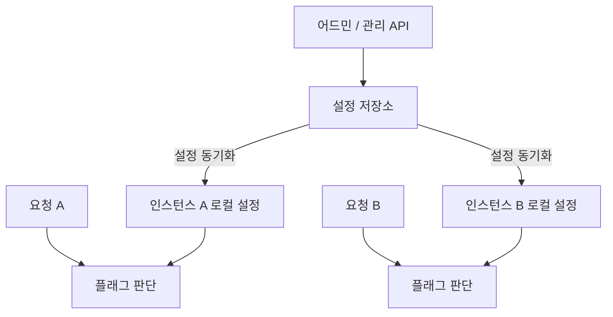

# Feature Toggle — 대규모 서비스에서 기능을 제어하는 방법

서비스를 운영하다 보면 코드에 문제가 없어도 특정 기능을 잠시 꺼야 할 때가 있다. (예를 들어 트래픽이 집중되는 동안 부가 기능의 처리를 줄여야 하거나, 운영 정책에 맞추어 기능의 제공 여부를 바꿔야 하는 경우 등..) 반대로 새 기능을 배포하되 처음부터 모든 사용자에게 공개하고 싶지는 않을 수도 있다.

이런 변경을 매번 코드 수정과 배포로 처리한다면, 기능의 운영 시점이 배포 일정에 묶이게 된다.

이러한 경우 아래와 같은 고민이 생긴다.

> 같은 버전의 애플리케이션을 유지하면서 기능의 실행 여부만 바꿀 수는 없을까?

Feature Toggle은 이 문제를 해결하는 방식이다. (Feature Flag라고도 부르며, 두 용어는 흔히 같은 의미로 사용된다.)

처음에는 설정값 하나를 확인하는 조건문으로 보일 수 있으나, 여러 서버가 동시에 요청을 처리하는 환경에서는 설정을 어디서 읽는지, 언제 반영되는지, 읽지 못하면 어떻게 동작하는지가 중요해진다.

---

## 배포와 기능 활성화를 분리한다

Feature Toggle의 기본 구조는 단순하다. 코드에 준비된 실행 경로 중 어떤 경로를 사용할지 설정을 보고 결정한다.

아래 예시는 특정 라이브러리의 API가 아닌 구조를 설명하기 위한 코드이다.

```java
public FeatureResult execute(FeatureRequest request) {
    boolean enabled = featureFlags.isEnabled("feature-enabled", false);

    if (!enabled) {
        return FeatureResult.disabled();
    }

    return featureService.execute(request);
}
```

개발한 기능은 코드에 포함되어 있지만, 실제 실행 여부는 플래그를 판단하여 결정한다. ON이면 기능을 실행하고, OFF이면 실행하지 않고 비활성 상태를 반환한다. 여기서 `false`는 평가에 실패했을 때 사용할 기본값으로, 해당 기능을 실행하지 않는다는 의미이다.

이처럼 코드를 서버에 올리는 Deployment와 사용자에게 기능을 제공하는 Release를 분리할 수 있다. (다만 플래그를 켠다고 새로운 로직이 만들어지는 것은 아니다. **선택할 실행 경로가 미리 구현되어 있어야 한다.**)

사용 목적에 따라 설계도 달라진다.

| 목적 | 사용 예시 | 설계 시 관심사 |
| --- | --- | --- |
| 새 기능 공개 | 검증 후 점진적으로 활성화 | 공개 대상, 비활성화 시 동작 |
| 운영 제어 | 부하가 큰 부가 기능 일시 중단 | 차단 범위, 반영 지연 |

이 글에서는 그중 백엔드의 실행 경로를 제어할 때 필요한 구조와 운영상의 판단에 집중해보고자 한다.

---

## 설정을 관리하는 곳과 판단하는 곳

어드민은 플래그를 변경하는 인터페이스 중 하나이다. 설정은 DB나 별도의 설정 서비스에 저장할 수 있고, 애플리케이션은 그 설정을 읽어 실행 여부를 판단한다.

여기서는 두 역할을 나눠볼 필요가 있다.

- **설정 관리:** 누가 어떤 환경의 어떤 기능을 켜고 끌 것인가?
- **플래그 판단:** 지금 들어온 요청에 어떤 실행 경로를 적용할 것인가?

전체 ON/OFF라면 저장된 Boolean 값을 읽는 것으로 충분하다. 특정 사용자나 일정 비율에만 기능을 제공하려면 사용자 식별자 같은 요청 정보도 플래그 판단에 사용해야하고, 이를 Evaluation Context라고 한다.

문제는 이 판단이 요청마다 발생할 수 있다는 점이다. 매번 DB나 원격 설정 서비스를 호출한다면, 기능 실행 전에 네트워크 왕복이 추가된다. 요청량이 늘어날수록 설정 조회량도 함께 증가하며, 설정 서비스의 지연이 실제 API 응답 시간에 영향을 줄 수 있다.

대안은 **설정을 주기적으로 받아 로컬에 보관하고, 요청 시점에는 메모리에서 판단하는 방식**이다.



이 방식은 요청마다 원격 설정 조회를 기다리지 않아도 된다는 장점이 있다. 그러나 설정 변경을 각 인스턴스로 캐싱하여 전달하는 문제를 추가로 고려해야 한다.

---

## DB에서 OFF로 바꾸면 모든 서버에서 바로 꺼질까?

개발한 기능이 서버 A와 B에서 실행되고 있고, 각 서버가 DB의 설정을 읽어 메모리에 보관한다고 해보자.

운영자가 어드민에서 `feature-enabled`를 OFF로 변경하더라도, 서버가 계속 메모리의 ON 값을 읽는다면 해당 기능은 계속 실행된다. DB의 값을 바꾸는 것과 서버가 사용하는 값을 바꾸는 것은 서로 다른 작업이기 때문이다.

설정을 다시 읽어오는 시점도 서버마다 다를 수 있다.

| 시점 | DB 설정 | 서버 A의 설정 | 서버 B의 설정 |
| --- | --- | --- | --- |
| 변경 전 | ON | ON | ON |
| 어드민에서 OFF 저장 | OFF | ON | ON |
| 서버 A가 설정 갱신 | OFF | OFF | ON |
| 서버 B도 설정 갱신 | OFF | OFF | OFF |

중간 상태에서는 요청이 서버 A로 가면 기능을 실행하지 않고, 서버 B로 가면 기능을 실행한다. 서버가 여러 대인 환경에서 설정의 반영 시점을 고려해야 하는 이유이다.

가장 단순한 방법은 일정 주기로 DB나 설정 서버에서 값을 다시 읽는 것이다. 이를 Polling이라고 한다. 예를 들어 30초마다 갱신한다면, 정상적으로 갱신되는 상황에서도 다음 조회까지는 이전 값을 사용할 수 있다. (조회 실패나 통신 지연이 있으면 더 오래 걸릴 수 있다.)

이 지연을 허용할 수 없다면 변경 시 각 서버에 알림을 보내 설정을 갱신하도록 구성할 수 있다. 다만 알림을 받지 못한 서버도 있을 수 있으므로, 주기적으로 최신 설정을 다시 확인하는 복구 경로가 필요하다.

따라서 캐시 적용 여부를 결정할 때는 다음 두 가지를 함께 봐야 한다.

- 요청마다 설정을 조회하는 비용을 얼마나 줄여야 하는가?
- 설정 변경 후 기능이 실제로 바뀔 때까지 어느 정도의 지연을 허용할 수 있는가?

**캐시는 설정 조회 비용을 줄여주지만, 변경 사항을 서버에 반영하는 과정까지 없애주지는 않는다.** 특히 기능을 급하게 꺼야 하는 상황을 대비한 토글이라면, 어드민의 저장 성공뿐 아니라 각 서버의 반영 상태도 확인할 수 있어야 한다.

---

## 설정을 읽지 못하면 어떤 기능을 실행해야 할까?

설정을 읽는 과정도 실패할 수 있다. DB 연결에 문제가 생기거나, 설정 서버에 일시적으로 접근하지 못하는 경우다.

설정 조회 오류를 그대로 요청 처리 실패로 이어지게 하면, 설정을 관리하는 시스템의 장애가 해당 기능을 사용하는 서비스에도 영향을 준다. 따라서 설정 조회가 실패했을 때 사용할 동작을 미리 정해야 한다.

앞선 코드의 `false`가 그 역할을 한다.

```java
boolean enabled = featureFlags.isEnabled("feature-enabled", false);
```

이 예시에서는 **활성화 여부를 판단할 수 없으면 개발한 기능을 실행하지 않는다.** 호출한 쪽에서는 반환된 비활성 상태에 맞춰 응답이나 화면을 처리해야 한다. 비활성 상태의 구체적인 동작은 기능의 성격에 따라 정해야 한다.

캐시를 사용하는 경우에는 마지막으로 받은 정상 설정을 계속 사용하는 방법도 있다. 일시적인 통신 장애에는 유용하지만, 오래된 값으로 계속 동작해도 되는지는 별도로 판단해야 한다.

예를 들어 개발한 기능에서 문제가 발생해 OFF로 바꾸었는데, 설정을 갱신하지 못한 서버가 마지막 ON 값을 계속 사용한다면 문제가 있는 기능도 계속 실행된다.

| 대응 방식 | 장점 | 한계 |
| --- | --- | --- |
| 마지막 정상 설정 유지 | 일시적인 통신 실패에도 동작 유지 | 중단해야 할 기능이 계속 실행될 수 있음 |
| 미리 정한 기본값 사용 | 설정이 없어도 실행 경로를 결정 가능 | 기본값에 따라 서비스 동작이 바뀔 수 있음 |

두 방식 중 하나를 모든 상황에 적용할 필요는 없다. 마지막 정상값이 있으면 일정 시간 사용하고, 설정을 한 번도 받지 못했거나 너무 오래 갱신되지 않았다면 기본값을 사용하는 식으로 구분할 수도 있다.

중요한 것은 무조건 ON 또는 OFF로 정하는 것이 아니라, **설정을 알 수 없을 때 어떤 동작이 해당 기능에 더 안전한지**를 정하는 것이다. 실제 라이브러리나 SDK를 사용한다면 동기화 실패 시 캐시를 유지하는지, 어떤 경우에 기본값을 반환하는지도 확인해야 한다.

---

## OFF로 바꾸면 실행 중인 작업도 멈출까?

설정이 모든 서버에 반영되었다고 해도 이미 시작한 작업까지 자동으로 중단되지는 않는다.

다음 순서를 생각해보자.

1. 요청이 들어와 `feature-enabled = ON`을 확인한다.
2. 개발한 기능을 실행하기 시작한다.
3. 운영자가 OFF로 변경하고 서버에도 반영된다.
4. 이미 시작한 작업은 계속 실행되어 완료된다.

조건문은 실행 여부를 판단한 시점에만 동작한다. 이후 설정이 바뀌었다고 이미 실행 중인 메서드가 취소되는 것은 아니다.

일반적인 기능 중단에서는 진행 중인 작업은 완료시키고, 변경된 OFF 설정을 읽는 요청부터 해당 기능을 실행하지 않는 방식으로 충분할 수 있다. 반면 실행 중인 작업까지 멈춰야 한다면 작업 취소나 중단 지점을 별도로 구현해야 한다.

어떤 경로에서 설정을 확인하는지도 중요하다. 화면에서 버튼만 숨기면 API를 직접 호출하는 경우에는 기능이 실행될 수 있다. API에서는 검사하지만 동일한 작업을 수행하는 배치에서는 검사하지 않는 경우도 마찬가지다.

따라서 기능을 끈다는 요구를 구현할 때는 **어떤 진입 경로를 막을지, 이미 시작한 처리는 어떻게 할지**를 함께 정해야 한다.

또한 OFF는 이미 처리된 결과를 되돌리는 기능이 아니다. 해당 기능이 DB에 기록한 데이터는 그대로 남는다. 그 데이터를 취소하거나 변경해야 한다면 별도의 처리 절차가 필요하다.

---

## 배포 없이 바꾸는 설정도 운영 대상이다

Feature Toggle을 사용하면 코드를 배포하지 않고도 서비스의 동작을 바꿀 수 있다. 따라서 장애가 발생했을 때 배포 이력만으로는 원인을 찾기 어려워질 수 있다.

같은 버전의 코드가 실행 중이어도 누군가 토글을 변경했거나, 특정 서버만 이전 설정을 사용하고 있을 수 있기 때문이다.

이런 상황을 확인하려면 누가 언제 어떤 환경의 값을 변경했는지 기록하고, 서버가 실제로 사용하는 설정과 마지막 갱신 시각을 확인할 수 있어야 한다. 운영 설정을 바꿀 수 있는 권한도 필요한 범위로 제한해야 한다.

검증할 때는 ON뿐 아니라 OFF 경로도 확인해야 한다. 개발한 기능이 정상 동작하더라도, 이를 끈 상태에서 호출한 쪽이 비활성 응답을 제대로 처리한다는 보장은 없다. 문제가 생기면 토글을 끄겠다는 계획이 있다면, 기능을 실행하지 않았을 때의 서비스 동작 역시 검증 대상이 된다.

새 기능이 안정화된 이후에는 토글을 계속 유지할지도 결정해야 한다. 공개 과정에서만 필요했던 토글이라면 비활성 분기와 함께 제거하고 기능을 항상 실행하도록 정리할 수 있다. 반면 부하 대응을 위해 계속 필요한 운영 토글이라면 담당자를 정하고 OFF 상태의 동작도 유지·검증해야 한다.

---

## Feature Toggle을 적용할 때 먼저 고려해야할 것

단순한 ON/OFF 몇 개가 필요하다면 DB 설정과 공통 조회 코드에서 시작할 수 있다. 조회량이 많아지면 캐시를 고려하되, 허용 가능한 반영 지연과 갱신 실패 시 동작을 함께 정해야 한다.

처음부터 복잡한 기능 관리 시스템을 만드는 것보다, 다음 질문에 답할 수 있는 구조가 우선이다.

- OFF로 바꾸면 어떤 기능과 실행 경로가 멈추는가?
- 변경한 값이 모든 서버에 반영되기까지 얼마나 걸리는가?
- 설정을 읽지 못하면 어떤 값으로 동작하는가?
- 기능을 끈 상태에서도 서비스가 의도한 대로 동작하는가?

Feature Toggle의 시작은 조건문 하나일 수 있다. 하지만 대규모 서비스에서 그 조건문을 운영에 사용하려면, **설정값이 여러 서버에 전달되고 실제 동작으로 이어지는 과정**까지 함께 설계해야 한다.
