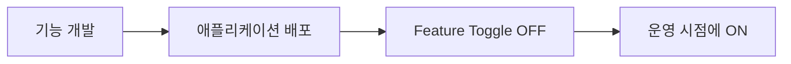
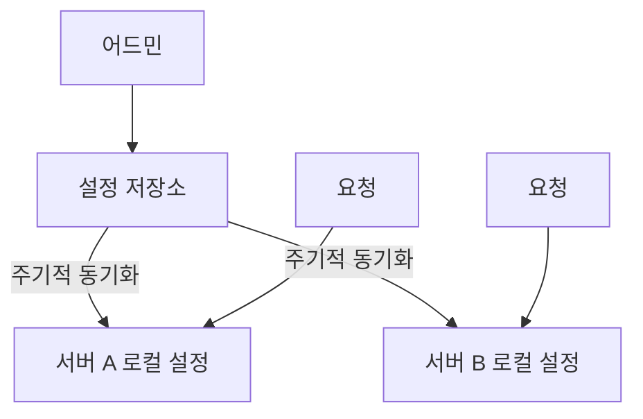
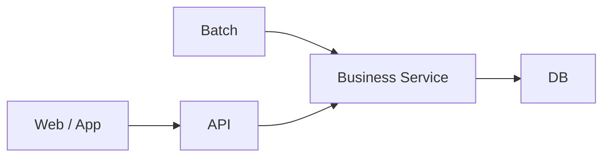
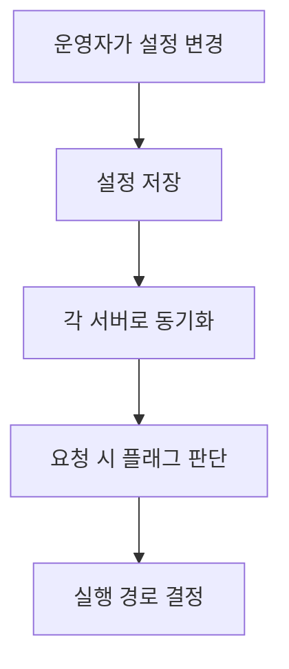

# Feature Toggle - 대규모 서비스에서 기능을 제어하는 방법

서비스를 운영하다 보면 코드에 문제가 없어도 특정 기능을 잠시 꺼야 할 때가 있다. (예를 들어 트래픽이 집중되는 동안 부가 기능의 처리를 줄여야 하거나, 운영 정책에 맞추어 기능의 제공 여부를 바꿔야 하는 경우 등..) 반대로 새 기능을 배포하되 처음부터 모든 사용자에게 공개하고 싶지는 않을 수도 있다.

이런 변경을 매번 코드 수정과 배포로 처리한다면, 기능의 운영 시점이 배포 일정에 묶이게 된다.

이러한 경우 아래와 같은 고민이 생긴다.

> 같은 버전의 애플리케이션을 유지하면서 기능의 실행 여부만 바꿀 수는 없을까?

Feature Toggle은 이 문제를 해결하는 방식이다. (Feature Flag라고도 부르며, 두 용어는 흔히 같은 의미로 사용된다.)

처음에는 설정값 하나를 확인하는 조건문으로 보일 수 있다. 하지만 서버가 여러 대이고, 설정을 운영 중 바꿔야 하는 환경에서는 **설정을 어디서 읽는지, 언제 반영되는지, 읽지 못하면 어떻게 동작하는지**까지 같이 봐야 한다.

---

## 배포와 기능 활성화를 분리한다

Feature Toggle의 기본 구조는 단순하다.

```java
public FeatureResult execute(FeatureRequest request) {
    boolean enabled = featureFlags.isEnabled("feature-enabled", false);

    if (!enabled) {
        return FeatureResult.disabled();
    }

    return featureService.execute(request);
}
```

기능은 코드에 이미 포함되어 있지만, 실제 실행 여부는 플래그를 보고 결정한다.

즉 **Deployment와 Release를 분리할 수 있다.**



다만 플래그를 켠다고 새로운 기능이 생기는 것은 아니다. **선택할 실행 경로는 미리 구현되어 있어야 한다.**

이 구조를 사용하면 새 기능을 먼저 배포해두고 나중에 활성화하거나, 문제가 있는 기능만 빠르게 OFF하는 식의 운영이 가능해진다.

---

## 요청마다 DB에서 설정을 읽어야 할까?

가장 단순한 방법은 요청이 들어올 때마다 DB나 설정 서버에서 값을 읽는 것이다.

하지만 요청량이 많아지면 설정 조회량도 같이 증가한다. 기능 하나를 실행할지 말지 판단하기 위해 매 요청마다 네트워크 왕복이 추가되는 셈이다.

그래서 설정을 주기적으로 받아 **애플리케이션 로컬 메모리에 캐싱하고, 실제 요청에서는 메모리 값을 사용하는 방식**을 생각할 수 있다.



요청마다 원격 설정을 읽지 않아도 된다는 장점이 있지만, 대신 다른 문제가 생긴다.

> DB의 값을 OFF로 바꾸면 모든 서버에서도 바로 OFF가 될까?

---

## DB에서 OFF로 바꿔도 서버는 아직 ON일 수 있다

서버 A와 B가 각각 설정을 캐싱하고 있다고 해보자.

| 시점 | DB | 서버 A | 서버 B |
| --- | --- | --- | --- |
| 변경 전 | ON | ON | ON |
| 어드민에서 OFF | OFF | ON | ON |
| 서버 A 갱신 | OFF | OFF | ON |
| 서버 B 갱신 | OFF | OFF | OFF |

설정이 모든 서버에 반영되기 전까지는 같은 요청이라도 어느 서버로 가느냐에 따라 결과가 달라질 수 있다.

가장 단순한 방법은 일정 주기로 설정을 다시 읽는 Polling이다. 예를 들어 30초마다 갱신한다면 정상 상황에서도 최대 30초 정도는 이전 값을 사용할 수 있다.

반대로 변경 시 각 서버에 알림을 보내 바로 갱신하게 할 수도 있다. 다만 알림을 놓치는 서버가 있을 수 있기 때문에, 주기적으로 최신 값을 다시 확인하는 복구 경로도 필요하다.

결국 캐시를 사용할 때는 아래 두 가지를 같이 봐야 한다.

- 요청마다 설정을 조회하는 비용을 얼마나 줄여야 하는가?
- 설정 변경 후 실제 기능이 바뀌기까지 어느 정도의 지연을 허용할 수 있는가?

**캐시는 조회 비용을 줄여주지만, 변경된 설정을 여러 서버에 반영하는 문제까지 없애주지는 않는다.**

---

## 설정을 읽지 못하면 ON일까, OFF일까?

설정 조회 자체가 실패할 수도 있다.

DB 연결에 문제가 있거나 설정 서버에 접근하지 못했다고 해서, 그 장애가 그대로 실제 서비스 장애로 이어지는 것도 좋은 구조는 아니다.

그래서 설정을 읽지 못했을 때 어떤 값을 사용할지도 정해야 한다.

```java
boolean enabled = featureFlags.isEnabled("feature-enabled", false);
```

위 예시에서는 설정을 판단할 수 없으면 기능을 실행하지 않는다.

하지만 항상 OFF가 정답은 아니다.

캐시를 사용하고 있다면 마지막으로 정상적으로 받은 값을 유지할 수도 있다. 일시적인 장애에는 유용하지만, 기능에 문제가 생겨 OFF로 바꿨는데 특정 서버가 계속 예전 ON 값을 사용한다면 또 다른 문제가 된다.

| 방식 | 장점 | 한계 |
| --- | --- | --- |
| 마지막 정상값 유지 | 일시 장애에도 기존 동작 유지 | 오래된 설정을 계속 사용할 수 있음 |
| 기본값 사용 | 설정이 없어도 실행 경로 결정 가능 | 기본값 선택에 따라 기능 동작이 달라짐 |

중요한 것은 무조건 ON 또는 OFF로 정하는 것이 아니라, **설정을 알 수 없을 때 어떤 동작이 더 안전한지**를 기능별로 정하는 것이다.

---

## OFF로 바꾸면 실행 중인 작업도 멈출까?

설정이 모든 서버에 OFF로 반영되었다고 해도 이미 시작한 작업까지 자동으로 중단되지는 않는다.

1. 요청이 들어와 `feature-enabled = ON`을 확인한다.
2. 기능 실행을 시작한다.
3. 운영자가 OFF로 변경한다.
4. 이미 시작한 요청은 계속 실행된다.

Feature Toggle은 플래그를 확인한 시점의 실행 경로를 결정할 뿐이다.

또한 화면에서 버튼만 숨긴다고 기능이 완전히 꺼지는 것도 아니다. 같은 기능을 API, Batch, 다른 내부 서비스에서도 호출할 수 있기 때문이다.



따라서 기능을 OFF한다는 요구가 있다면 **어느 진입 경로에서 플래그를 확인할지**, 이미 시작한 처리는 어떻게 할지까지 같이 봐야 한다.

그리고 OFF는 이미 저장된 데이터를 되돌리는 기능도 아니다. 이전에 처리된 결과까지 취소해야 한다면 별도의 로직이 필요하다.

---

## Feature Toggle도 운영 대상이다

Feature Toggle을 사용하면 코드 배포 없이도 서비스 동작을 바꿀 수 있다.

반대로 말하면 장애가 발생했을 때 배포 이력만 봐서는 원인을 찾기 어려울 수도 있다.

같은 버전의 코드가 실행 중이어도,

- 누군가 설정을 변경했을 수 있고
- 특정 서버만 이전 설정을 사용하고 있을 수 있고
- OFF 상태의 응답을 호출 측에서 제대로 처리하지 못했을 수도 있다.

그래서 운영에서는 최소한 아래 정도는 확인할 수 있어야 한다.

- 누가 언제 값을 변경했는가?
- 현재 설정값은 무엇인가?
- 각 서버는 언제 마지막으로 설정을 갱신했는가?

그리고 장애 시 기능을 끌 계획이라면 **ON 상태뿐 아니라 OFF 상태도 테스트해야 한다.**

기능 자체는 정상적으로 비활성화되었지만 BFF나 Frontend가 비활성 응답을 처리하지 못한다면, 토글을 끄는 순간 다른 장애가 생길 수도 있기 때문이다.

---

## 결국 조건문보다 중요한 것

Feature Toggle 자체는 결국 아래와 같은 조건문 하나일 수도 있다.

```java
if (featureEnabled) {
    execute();
}
```

하지만 여러 서버가 요청을 처리하는 환경에서는 그 앞뒤에 더 많은 문제가 붙는다.



그래서 Feature Toggle을 적용할 때는 단순히 ON/OFF 값을 어디에 저장할지만 볼 것이 아니라 아래를 먼저 정하는 것이 좋다.

- OFF로 바꾸면 정확히 어떤 기능이 멈추는가?
- 변경한 값이 모든 서버에 반영되기까지 얼마나 걸리는가?
- 설정을 읽지 못하면 어떤 값으로 동작하는가?
- 이미 실행 중인 요청은 어떻게 처리되는가?
- OFF 상태에서도 호출 측이 정상적으로 동작하는가?

Feature Toggle의 시작은 조건문 하나일 수 있으나,

대규모 서비스에서 운영에 사용하려면, **그 설정값이 여러 서버에 어떻게 전달되고 실제 실행 경로를 어떻게 바꾸는지까지 같이 설계해야 한다.**
