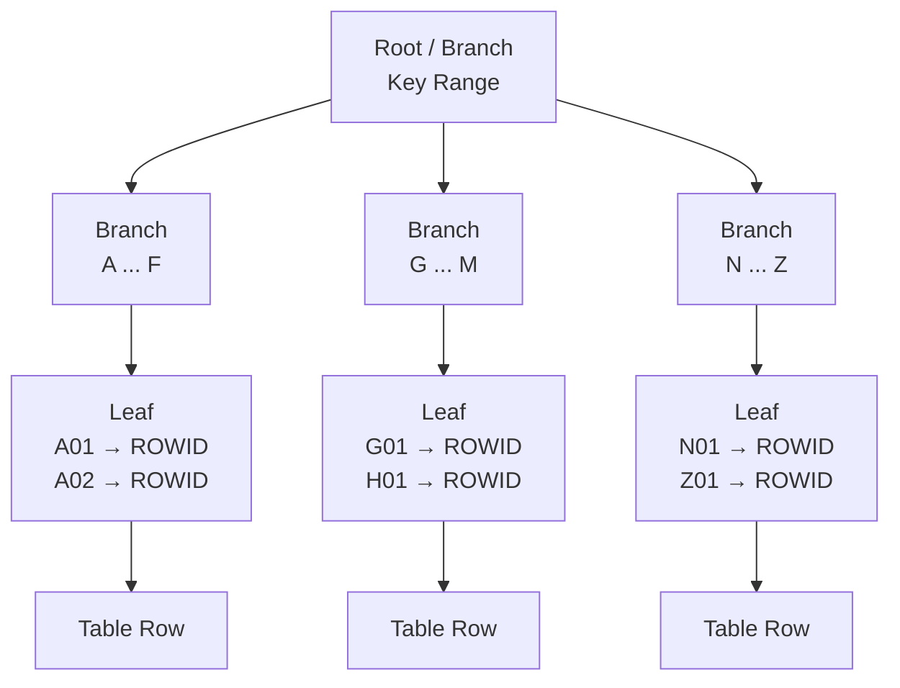
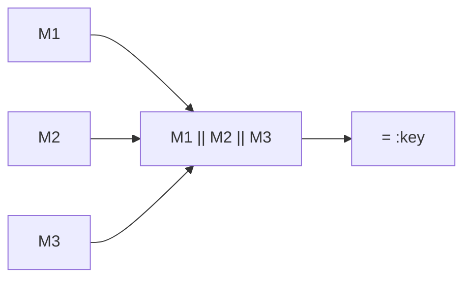
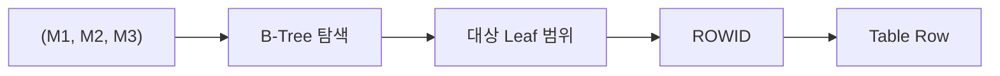
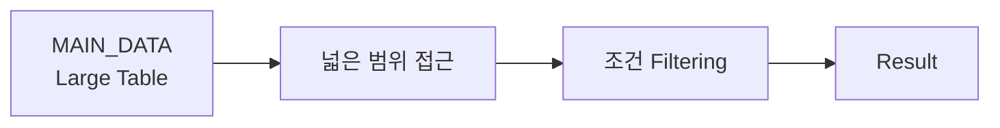
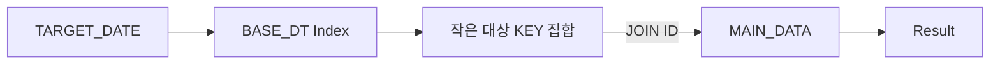
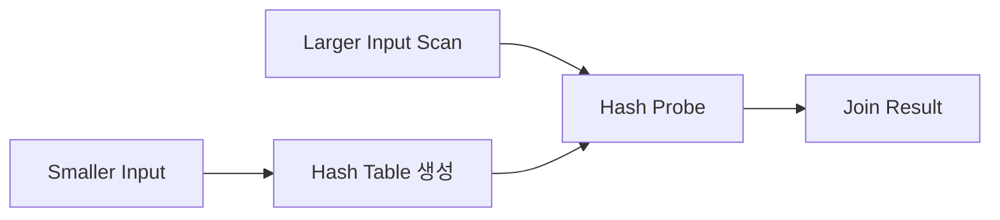
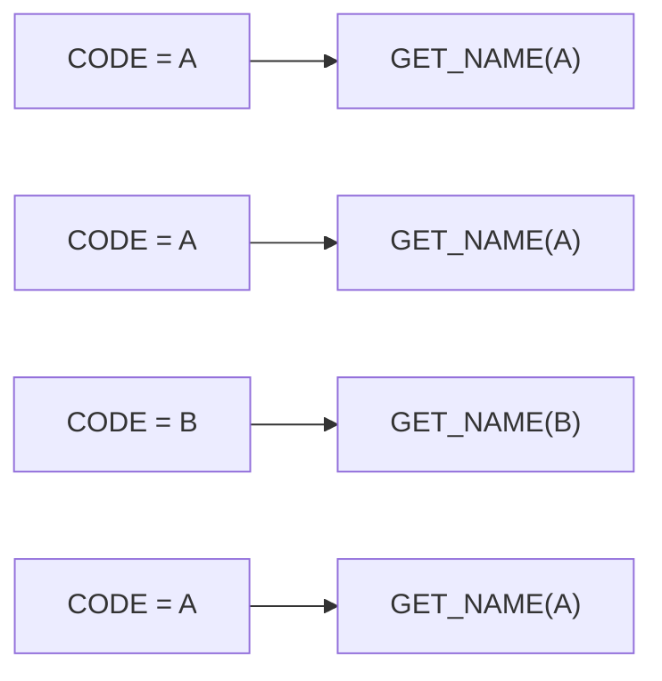
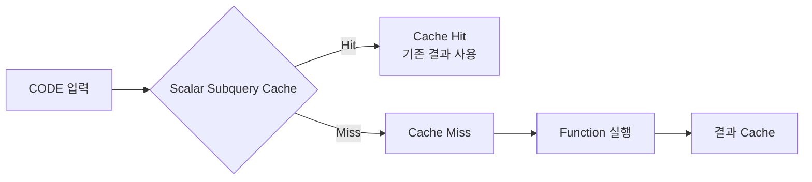
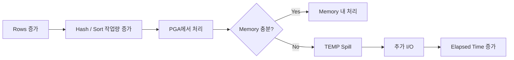
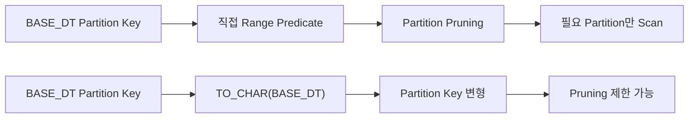

# Oracle SQL 튜닝 - 실행계획에서 병목을 찾는 방법

SQL 성능을 개선할 때 가장 먼저 떠올리는 것은 인덱스이다. 하지만 실제 운영 쿼리를 들여다보면 병목은 인덱스 유무만으로 설명되지 않는다.

- 인덱스는 존재하지만 WHERE 절의 형태 때문에 사용하지 못할 수 있다.
- 잘못된 조인 순서로 불필요하게 많은 데이터를 먼저 읽을 수 있다.
- 동일한 Function이 row마다 반복 실행되면서 CPU를 소비할 수 있다.
- 문자열 검색으로 구현된 조건 때문에 범위 검색이 불가능할 수도 있다.
- Optimizer가 예상한 row 수와 실제 row 수가 크게 달라 잘못된 실행계획을 선택할 수도 있다.

실행계획을 들여다보면 어떤 Operation이 선택됐는지 자체보다, 그 과정에서 어디에서 많은 데이터를 읽고 어떤 작업이 반복되고 있는지가 더 중요해진다.

> **같은 결과를 반환하는데도 SQL마다 작업량이 달라지는 이유는 무엇일까?**

이 글에서는 Oracle 실행계획과 실행 통계를 기준으로, 실제 쿼리를 튜닝하면서 확인했던 병목과 수정 방법을 정리하고자 한다.

## SQL 튜닝에서 무엇을 측정할 것인가

SQL이 느리다고 해서 `ELAPSED_TIME` 하나만 봐서는 원인을 알기 어렵다. 실제 튜닝에서는 주로 다음 지표를 함께 비교했다.

| 지표 | 의미 | 확인하려는 것 |
| --- | --- | --- |
| `BUFFER_GETS` | Buffer Cache에서 논리적으로 블록을 읽은 횟수 | 얼마나 많은 데이터를 탐색했는가 |
| `CPU_TIME` | Parse, Execute, Fetch에 사용된 CPU 시간 | 연산이나 함수 호출 비용이 큰가 |
| `ELAPSED_TIME` | SQL 처리에 걸린 전체 경과 시간 | 실제 처리 시간이 얼마나 걸렸는가 |
| `EXECUTIONS` | Cursor가 실행된 횟수 | 누적 비용이 실행 횟수 때문인가 |

`V$SQLSTATS`의 `BUFFER_GETS`, `CPU_TIME`, `ELAPSED_TIME`은 누적 값이다. 따라서 다음처럼 총량만 비교하면 판단을 잘못할 수 있다.

```text
SQL A
Executions  = 1,000
Buffer Gets = 1,000,000

SQL B
Executions  = 10
Buffer Gets = 100,000
```

총 `BUFFER_GETS`만 보면 SQL A가 훨씬 비싸 보이지만, 실행당 비용을 계산하면 결과가 달라진다.

```text
SQL A
1,000,000 / 1,000
= 1,000 Buffer Gets / Exec

SQL B
100,000 / 10
= 10,000 Buffer Gets / Exec
```

SQL B는 한 번 실행할 때 SQL A보다 훨씬 많은 블록을 읽고 있다. 누적 통계를 비교할 때는 필요에 따라 다음 값을 함께 본다.

```text
BUFFER_GETS / EXECUTIONS
CPU_TIME    / EXECUTIONS
ELAPSED_TIME / EXECUTIONS
```

이렇게 보면 **얼마나 자주 실행되는 SQL인지**와 **한 번 실행할 때 얼마나 비싼 SQL인지**를 분리할 수 있다. 다만 동일한 SQL을 한 번씩 실행하고 `DBMS_XPLAN.DISPLAY_CURSOR(..., 'ALLSTATS LAST')`로 마지막 실행 통계를 직접 비교한다면 굳이 실행당 평균을 계산할 필요는 없다. 핵심은 동일한 조건에서 변경 전과 변경 후의 실제 작업량을 비교하는 것이다.

## EXPLAIN PLAN보다 실제 실행 결과를 본다

`EXPLAIN PLAN`은 Optimizer가 예상한 실행계획을 보여준다. 실제 튜닝에서는 예상한 계획보다 실행 후 실제로 몇 건을 읽었고, 몇 번 실행되었으며, 어느 구간에서 작업량이 커졌는지가 더 중요하다. Oracle에서는 실제 실행된 Cursor의 통계를 `DBMS_XPLAN.DISPLAY_CURSOR`로 확인할 수 있다. 예를 들어 다음과 같이 실행 통계를 수집할 수 있다.

```sql
SELECT /*+ gather_plan_statistics */
       ...
FROM ...
WHERE ...;
```

이후 마지막 실행의 통계를 확인한다.

```sql
SELECT *
FROM TABLE(
    DBMS_XPLAN.DISPLAY_CURSOR(
        NULL,
        NULL,
        'ALLSTATS LAST'
    )
);
```

실제 실행계획은 다음과 비슷한 형태로 확인할 수 있다.

```text
--------------------------------------------------------------------------------
| Id | Operation           | E-Rows | A-Rows | Starts | Buffers | A-Time       |
--------------------------------------------------------------------------------
|  0 | SELECT STATEMENT    |        |    100 |      1 |  82,000 | 00:00:02.31 |
|  1 | HASH JOIN           |    100 |    100 |      1 |  82,000 | 00:00:02.31 |
|  2 | TABLE ACCESS FULL   | 100000 | 120000 |      1 |  70,000 | 00:00:01.90 |
|  3 | INDEX RANGE SCAN    |    100 |    100 |      1 |     300 | 00:00:00.01 |
--------------------------------------------------------------------------------
```

여기서 `TABLE ACCESS FULL`이라는 Operation 이름만 보고 성능을 판단해서는 안 된다.

| 항목 | 의미 |
| --- | --- |
| `E-Rows` | Optimizer가 예상한 row 수 |
| `A-Rows` | 실제로 Operation을 통과한 row 수 |
| `Starts` | 해당 Operation이 시작된 횟수. 값이 크다면 같은 Operation이 반복 실행되고 있는지 확인한다. |
| `Buffers` | 해당 실행 과정에서 발생한 논리적 블록 접근량 |
| `A-Time` | 실제 실행 과정에서 소비된 시간 |

나는 대체로 아래 순서로 실행계획을 확인했다.


실행계획을 읽을 때는 **Rows가 어디에서 늘어나는지 → Buffers가 어디에서 증가하는지 → 어떤 Predicate가 적용되는지 → 왜 이 Access Path가 선택됐는지** 순서로 따라가면 흐름을 잡기 쉽다.

## 인덱스는 있는데 왜 사용하지 않을까

### B-Tree Index의 기본 구조

Oracle에서 가장 일반적으로 사용하는 B-Tree Index는 크게 Branch Block과 Leaf Block으로 구성된다.



Branch Block은 어떤 하위 블록으로 이동할지를 결정하는 데 사용되고, Leaf Block에는 실제 Index Key와 해당 row를 찾기 위한 `ROWID`가 저장된다. 즉 B-Tree Index의 핵심은 **정렬된 Key를 이용해 탐색 범위를 좁히는 것**이다. 인덱스가 존재하는지만 보는 것보다 **WHERE 절이 인덱스의 Key를 그대로 탐색할 수 있는 형태인지**를 함께 봐야 한다.

### 컬럼을 결합한 조건을 분리하기

다음과 같은 복합 인덱스가 있다고 하자.

```text
INDEX (M1, M2, M3)
```

그리고 기존 SQL이 다음과 같은 형태였다고 가정한다.

```sql
WHERE M1 || M2 || M3 = :key
```

SQL의 의미는 세 컬럼을 조합한 값이 특정 Key와 같은 row를 찾는 것이다. 다만 인덱스 관점에서는 조건의 형태가 달라진다.



인덱스는 다음과 같이 정렬된 Key를 가지고 있다.

```text
(M1, M2, M3)
```

하지만 WHERE 절은 새로운 표현식을 만들고 있다.

```text
f(M1, M2, M3)
```

따라서 일반적인 `(M1, M2, M3)` B-Tree Index를 그대로 탐색하기 어려워질 수 있다. 이를 다음처럼 변경했다.

```sql
WHERE M1 = :m1
  AND M2 = :m2
  AND M3 = :m3
```

이제 조건은 Index Key의 형태와 직접 대응한다.



이 변경의 목적은 문자열 결합 연산 자체를 없애는 데 있지 않다. **Predicate를 Index가 탐색할 수 있는 형태로 바꾸는 것**이 핵심이다. 반대로 `M1 || M2 || M3` 형태가 매우 자주 사용되는 검색 조건이라면 SQL을 분해하는 대신 Function-Based Index를 두는 방법도 검토할 수 있다.

```sql
CREATE INDEX IDX_SAMPLE_KEY
ON SAMPLE_TABLE (M1 || M2 || M3);
```

어느 쪽이 맞는지는 실제 조회 패턴과 변경 비용을 보고 결정한다.

### Access Predicate와 Filter Predicate

실행계획의 Predicate Information을 보면 다음과 같이 `access`와 `filter`가 구분될 수 있다.

```text
Predicate Information
---------------------

2 - access("M1"=:M1 AND "M2"=:M2)
3 - filter("STATUS"='Y')
```

`Access Predicate`는 데이터에 접근할 범위를 정하고, `Filter Predicate`는 접근한 데이터에서 조건에 맞지 않는 row를 걸러낸다. 예를 들어 Index Range Scan에서 `access` 조건을 이용해 100건만 읽는 것과, 10만 건을 먼저 읽은 뒤 `filter`로 100건만 남기는 것은 결과가 같아도 작업량이 다르다. 그래서 실행계획에서는 단순히 'INDEX RANGE SCAN이 동작한다.' 보다 '어떤 조건이 Access Predicate인가?', '얼마나 많은 row를 먼저 읽고 있는가?' 를 보는 것이 더 중요하다.

## 데이터를 언제 줄이는가

SQL 튜닝에서는 최종 결과 건수보다 중간 단계에서 얼마나 많은 row를 처리했는지가 더 중요할 때가 많다.

### 조회 범위를 줄이기 위해 JOIN을 추가하기

특정 일자를 기준으로 데이터를 조회해야 했지만, 메인 테이블에는 해당 일자를 기준으로 사용할 수 있는 적절한 Access Path가 없었다. 단순화하면 기존 구조는 다음과 같았다.



반면 다른 테이블에는 일자 기준으로 대상을 먼저 좁힐 수 있는 조건과 인덱스가 존재했다. 그래서 대상 Key를 먼저 얻은 뒤 메인 데이터와 JOIN하도록 구조를 변경했다.

```sql
SELECT
    M.ID,
    M.STATUS,
    M.VALUE
FROM TARGET_DATE T
JOIN MAIN_DATA M
  ON M.ID = T.ID
WHERE T.BASE_DT = :baseDt
  AND M.STATUS = :status;
```

구조는 다음과 같다.



JOIN이 하나 늘면서 SQL 자체는 더 복잡해졌지만, 기존처럼 큰 데이터 집합에서 조건을 적용하는 대신 **선택도가 높은 조건으로 후보 집합을 먼저 줄인 뒤 큰 테이블에 접근**할 수 있게 되었다. JOIN 수를 줄이는 것보다 어떤 경로로 데이터를 먼저 좁히는지가 더 중요했고, 이 경우에는 JOIN을 추가한 쪽이 전체 작업량을 줄였다.

### Alias는 단순한 스타일 문제가 아니다

테이블이 추가되면서 모든 컬럼의 소속을 명확하게 표시했다.

```sql
-- Before
WHERE STATUS = :status
```

```sql
-- After
WHERE M.STATUS = :status
```

복잡한 SQL에서는 Alias가 가독성 이상의 역할을 한다. 실행계획의 Predicate와 실제 SQL을 맞춰볼 때 어떤 테이블의 조건이 후보 row를 줄이는지 빠르게 확인할 수 있다.

## JOIN은 어떤 테이블부터 읽는지도 중요하다

두 쿼리가 같은 결과를 반환하더라도 중간 처리량은 크게 다를 수 있다.

```text
Case A

1,000,000 rows
      ↓ JOIN
     10 rows
```

```text
Case B

10 rows
   ↓ JOIN
1,000,000 rows
```

큰 테이블이 있다는 사실보다 **그 테이블에 접근하기 전에 후보 데이터를 얼마나 줄였는지**가 실제 작업량에 더 큰 영향을 준다.

### Nested Loops와 Hash Join

조인 방식도 처리 데이터의 특성에 따라 달라진다.

#### Nested Loops

개념적으로 다음과 같다.

```text
Outer Row 1
   ↓
Inner Table 탐색

Outer Row 2
   ↓
Inner Table 탐색

Outer Row 3
   ↓
Inner Table 탐색
```

Outer 결과가 작고 Inner Table에 효율적인 Index가 있다면 매우 유리할 수 있다. 반대로 Outer에서 예상보다 많은 row가 나오면 Inner 접근이 반복되면서 비용이 급격하게 증가할 수 있다.

#### Hash Join

두 데이터 집합 중 하나를 기반으로 Hash Table을 만들고 다른 데이터 집합을 비교한다.



많은 데이터를 조인하는 상황에서는 Hash Join이 Nested Loops보다 효율적일 수 있다. 어느 방식이 무조건 낫다고 볼 수는 없고, 실제 row 수와 Access Path를 기준으로 판단해야 한다.

### Hint로 Join Order와 Access Path 조정하기

실행계획을 보다 보니 Optimizer가 기대한 순서와 다르게 테이블을 읽는 경우도 있었다. 이런 경우에는 Hint를 이용해 조인 순서와 Access Path를 조정했다. 예를 들면 다음과 같은 형태다.

```sql
SELECT /*+
          LEADING(A B)
          USE_NL(B)
          INDEX(B IDX_B_01)
       */
       ...
FROM A
JOIN B
  ON A.KEY = B.KEY
WHERE ...
```

각 Hint는 대략 다음 의도를 가진다.

```text
LEADING
→ Join 순서 유도

USE_NL
→ Nested Loops Join 유도

INDEX
→ 특정 Index 사용 유도
```

다만 Hint부터 추가하기보다는 먼저 실행계획이 그렇게 만들어진 이유를 확인하는 편이 낫다.

```text
통계 정보가 적절한가?
        ↓
Cardinality 추정이 맞는가?
        ↓
Predicate가 Index를 사용할 수 있는가?
        ↓
Join 조건이 정상적인가?
        ↓
그래도 계획이 적절하지 않은가?
        ↓
Hint 검토
```

Hint는 Optimizer의 선택에 직접 개입하므로 데이터 분포나 테이블 크기가 바뀐 뒤에도 해당 실행계획이 계속 적절한지 함께 봐야 한다.

## I/O가 아니라 반복 연산이 문제인 경우

SQL 튜닝에서는 Table Scan이나 Index Scan을 먼저 보게 되지만, 실제 병목이 **SQL 안에서 반복 실행되는 Function**인 경우도 있다.

### Function Call과 Scalar Subquery Caching

다음과 같은 SQL이 있다고 하자.

```sql
SELECT
    T.ID,
    GET_NAME(T.CODE)
FROM TARGET T;
```

TARGET에서 100,000개의 row가 조회된다면 `GET_NAME()`도 매우 많은 횟수로 실행될 수 있다. 특히 다음과 같이 동일한 CODE가 반복해서 등장한다고 해보자.

```text
A
A
B
A
B
C
A
...
```

직접 Function을 호출하면 개념적으로 다음과 같다.



이 구조에서는 동일한 입력값에 대해 같은 Function이 반복 호출된다. SQL에서 PL/SQL Function을 호출한다면 SQL Engine과 PL/SQL Engine 사이의 호출 비용도 계속 발생한다. 입력값의 중복도가 높은 경우에는 Scalar Subquery 형태로 바꿔 반복 호출을 줄일 수 있다.

```sql
SELECT
    T.ID,
    (
        SELECT GET_NAME(T.CODE)
        FROM DUAL
    ) AS NAME
FROM TARGET T;
```

개념적으로는 다음과 같다.



동일한 입력값이 반복될수록 Function Call 횟수를 줄이는 효과를 기대할 수 있다. Oracle Ask TOM의 예제에서도 row마다 PL/SQL Function을 직접 호출했을 때보다 Scalar Subquery 형태로 감쌌을 때 호출 횟수가 크게 줄어든다.

#### FAST DUAL이 보인다고 캐싱이 증명되는 것은 아니다

Scalar Subquery에서

```sql
SELECT GET_NAME(T.CODE)
FROM DUAL
```

형태를 사용하면 실행계획에서 `FAST DUAL`을 볼 수도 있다. 하지만 `FAST DUAL`은 DUAL 접근 자체를 최적화한 Operation이므로, 실행계획에 `FAST DUAL`이 보인다는 이유만으로 Scalar Subquery Caching이 동작했다고 판단할 수는 없다. 실제로 확인해야 하는 것은 Function Call 횟수와 작업량의 변화다.

```text
Function Call 횟수
Starts
CPU_TIME
ELAPSED_TIME
```

여기서도 특정 Operation 이름보다 **실제로 반복 연산이 줄었는지**를 보는 편이 정확하다.

## 검색 조건 자체를 다시 설계해야 하는 경우

### INSTR을 Range Predicate로 변경하기

특정 일자가 어떤 기간에 포함되는지를 판단해야 하는 데이터가 있었다. 기존 SQL은 단순화하면 다음과 비슷한 형태였다.

```sql
WHERE INSTR(DATE_RANGE, :targetDate) > 0
```

이 조건에서는 DB가 `DATE_RANGE` 값을 읽은 뒤 각 row마다 `INSTR`을 계산해야 한다. 실제 요구사항을 다시 보면 필요한 것은 문자열 포함 여부가 아니라 특정 일자가 시작일과 종료일 사이에 들어오는지 확인하는 것이었다.

```text
특정 일자가

START_DT
    ↓
targetDate
    ↓
END_DT

범위 안에 존재하는가?
```

따라서 데이터의 의미에 맞게 다음과 같이 변경할 수 있었다.

```sql
WHERE :targetDate BETWEEN START_DT AND END_DT
```

또는 명시적으로 다음처럼 표현할 수도 있다.

```sql
WHERE START_DT <= :targetDate
  AND END_DT >= :targetDate
```

이후 실제 조회 패턴에 맞춰 날짜 기준 Index도 추가했다. 여기서 `INSTR`은 느리고 `BETWEEN`은 빠르다는 식으로 볼 필요는 없다. **데이터가 실제로 기간을 의미한다면 기간으로 조회할 수 있는 구조를 만드는 편이 자연스럽다.** SQL을 튜닝하다 보면 쿼리만의 문제가 아니라 데이터를 표현하는 방식까지 같이 보게 되는 이유다.

## 추가로 자주 확인할 만한 병목

앞에서는 실제로 다뤘던 문제를 중심으로 정리했다. 실행계획을 볼 때는 이외에도 다음 항목을 함께 확인할 만하다.

### E-Rows와 A-Rows가 크게 다른 경우

다음과 같은 실행계획이 있다고 하자.

```text
------------------------------------------------
Operation             E-Rows          A-Rows
------------------------------------------------
TABLE ACCESS               10         150,000
------------------------------------------------
```

Optimizer는 10건 정도를 예상했지만 실제로는 150,000건이 발생했다. 이 차이가 커지면 뒤쪽 Join 방식이나 Access Path 선택까지 영향을 받을 수 있다.

```text
Outer Rows = 10
      ↓
Nested Loops
      ↓
Index Lookup 10회
```

실제로는 다음과 같을 수 있다.

```text
Outer Rows = 150,000
      ↓
Nested Loops
      ↓
Index Lookup 150,000회
```

예상대로 10건만 나왔다면 괜찮은 계획이었겠지만 실제로 150,000건이 나오면 Inner 접근도 그만큼 반복된다. 이런 경우에는 다음 항목을 확인한다.

```text
Statistics가 오래되지 않았는가?
Column의 NDV가 실제 분포를 표현하는가?
Data Skew가 심하지 않은가?
Histogram이 필요한가?
Predicate 간 상관관계가 있는가?
```

이 문제는 SQL 문법만 바꾼다고 해결되지 않을 수 있다. **Optimizer가 왜 row 수를 다르게 예상했는지**부터 확인해야 한다.

### 암묵적 형 변환

다음과 같이 컬럼이 `VARCHAR2`라고 하자.

```text
USER_ID VARCHAR2
```

그런데 SQL에서 Number와 비교하면 다음과 같은 코드가 만들어질 수 있다.

```sql
WHERE USER_ID = 12345
```

상황에 따라 Oracle이 데이터 타입을 맞추기 위해 컬럼 쪽에 암묵적인 변환을 적용할 수 있는데, 개념적으로는 다음과 같은 형태가 된다.

```sql
WHERE TO_NUMBER(USER_ID) = 12345
```

이렇게 되면 `USER_ID` 컬럼을 기준으로 만든 B-Tree Index를 기대한 방식으로 사용하지 못할 수 있다. 그래서 애플리케이션에서 넘기는 Bind Variable의 타입도 같이 확인해야 한다.

```sql
-- 컬럼이 VARCHAR2라면
WHERE USER_ID = :userId
```

`:userId` 역시 컬럼 타입에 맞춰 문자열로 전달하는 편이 자연스럽다. 이 경우도 **Predicate에서 Index Column에 어떤 연산이 적용되는지**가 핵심이다.

### SORT / HASH 작업과 TEMP Spill

실행계획에서 다음 Operation도 자주 볼 수 있다.

```text
SORT ORDER BY
SORT GROUP BY
HASH GROUP BY
HASH JOIN
```

이런 Operation은 메모리가 충분하면 PGA에서 처리되지만, 데이터가 크거나 사용할 수 있는 메모리가 부족하면 작업 일부가 TEMP 영역으로 내려갈 수 있다.



`DBMS_XPLAN`의 `MEMSTATS`를 이용하면 Hash Join이나 Sort와 같은 메모리 집약 Operation에서 메모리 사용 및 disk spill 관련 정보를 확인할 수 있다. `BUFFER_GETS`가 생각보다 크지 않은데 `ELAPSED_TIME`이 높다면 이런 메모리 작업이나 TEMP 사용도 같이 볼 필요가 있다.

### Partition Pruning

대용량 이력 테이블은 날짜 기준 Partition을 사용하는 경우가 많다. 예를 들어 다음과 같이 월 단위로 Partition이 나뉘어 있다고 하자.

```text
[P01][P02][P03][P04][P05][P06]
               ↑──────↑
               조회 대상
```

조건이 Partition Key와 직접 연결된다면 필요한 Partition만 읽을 수 있다.

```sql
WHERE BASE_DT >= :fromDt
  AND BASE_DT <  :toDt
```

실행계획에서는 `PSTART`, `PSTOP` 등을 통해 접근하는 Partition 범위를 확인할 수 있다. 반대로 Partition Key에 함수를 적용하면 Pruning이 제한될 수 있다.

```sql
WHERE TO_CHAR(BASE_DT, 'YYYYMMDD') = :baseDt
```

개념적으로 보면 다음과 같다.



Partition Key에 함수나 암묵적 형 변환이 적용되면 Partition Pruning이 제한될 수 있다. 원리는 앞에서 본 인덱스 문제와 비슷하다. DB가 가지고 있는 물리적인 탐색 기준을 Predicate가 그대로 사용할 수 있는지를 보면 된다.

## 실행계획에서 Operation 이름만 보면 안 되는 이유

처음 실행계획을 보면 다음 Operation 이름이 눈에 들어온다.

```text
TABLE ACCESS FULL
INDEX RANGE SCAN
NESTED LOOPS
HASH JOIN
SORT
FAST DUAL
```

하지만 특정 Operation이 존재한다고 해서 좋은 계획 또는 나쁜 계획이라고 단정할 수 없다.

### Full Scan이 더 나은 경우

테이블 대부분을 읽어야 한다면 Index를 수십만 번 따라가는 것보다 Full Scan이 더 효율적일 수 있다.

### Index Range Scan도 비용이 커질 수 있다

Index Range Scan으로 수십만 건의 `ROWID`를 얻은 뒤 Table Access가 반복되면 Full Scan보다 더 많은 Random I/O가 발생할 수 있다.

### Nested Loops는 Outer Row 수에 민감하다

Outer 결과가 작고 Inner Index가 효율적일 때는 유리하지만, Cardinality 추정이 빗나가 Outer 결과가 커지면 Inner 접근 횟수도 함께 증가한다.

### 많은 데이터를 조인할 때의 Hash Join

많은 데이터를 조인해야 한다면 반복적인 Index Lookup보다 Hash Join이 더 효율적인 경우가 있다. 실행계획은 대체로 아래 흐름으로 보면 정리하기 쉽다.

```text
Predicate
    ↓
Cardinality
    ↓
Access Path
    ↓
Join Order / Join Method
    ↓
Starts
    ↓
Buffers / CPU / Elapsed
```

## 튜닝 전후에는 무엇을 비교할 것인가

SQL을 수정한 뒤에는 변경 전후를 동일한 조건에서 다시 비교해야 한다. 예를 들어 다음과 같이 정리할 수 있다.

| 항목 | Before | After | 확인할 내용 |
| --- | ---: | ---: | --- |
| Buffer Gets / Exec | 100% | 35% | Logical I/O 감소 |
| CPU / Exec | 100% | 42% | 연산량 감소 |
| Elapsed / Exec | 100% | 48% | 전체 실행 시간 감소 |
| A-Rows | - | - | 결과가 동일한가 |
| Plan | Plan A | Plan B | Access Path가 의도대로 변경됐는가 |

실제 수치를 외부에 공개하기 어렵다면 절대값 대신 상대적인 비율로 정리할 수도 있다.

```text
Buffer Gets  : 100 → 31
CPU Time     : 100 → 45
Elapsed Time : 100 → 52
```

실행시간이 줄었다는 결과만 보기보다 **어떤 Operation의 작업량이 줄었고, 그 변화가 왜 전체 비용 감소로 이어졌는지**까지 연결해서 보는 편이 좋다.

## 지금까지의 튜닝을 정리하면

앞에서 다룬 변경을 튜닝 관점에서 정리하면 다음과 같다.

| 변경 내용 | 근본적인 문제 |
| --- | --- |
| 일자 조건을 활용하기 위한 JOIN 추가 | Access Path / Early Filtering |
| `M1 \|\| M2 \|\| M3`를 개별 조건으로 변경 | Predicate / Index 활용 |
| Hint로 Join 순서 및 방식 조정 | Join Order / Join Method |
| Scalar Subquery Caching 활용 | 반복 Function Call / CPU |
| `INSTR`을 `BETWEEN` 기반 조건으로 변경 | SARGability / Data Access Pattern |
| 일자 기준 Index 추가 | Access Path 개선 |

처음에는 서로 다른 SQL 수정처럼 보였지만, 방향은 비슷했다.

```text
DB가 불필요하게 읽는 데이터 줄이기

DB가 불필요하게 반복하는 작업 줄이기

Optimizer가 더 좋은 Access Path를 선택할 수 있는 조건 만들기
```

모두 **DB가 같은 결과를 만들기 위해 해야 하는 일의 양을 줄이는 작업**으로 볼 수 있다.

## 마치며

SQL 튜닝을 처음 보면 Full Scan을 없애거나 Index를 타게 만드는 작업으로 생각하기 쉽다. 하지만 실제 실행계획을 보다 보니 특정 Operation을 없애는 것 자체가 목적은 아니었다. 오히려 다음 질문들이 더 유용했다.

- 왜 이 테이블부터 읽었을까?
- 왜 이 Index를 사용하지 않았을까?
- 왜 이 Operation의 `Starts`가 이렇게 높을까?
- 어디에서 `Buffer Gets`가 급격하게 증가했을까?
- Optimizer가 예상한 Rows와 실제 Rows는 왜 다를까?
- 같은 값을 계산하는 Function이 왜 계속 호출되고 있을까?

이 질문을 따라가다 보면 실행계획은 DB가 선택한 순서를 확인하는 표라기보다 **SQL이 데이터를 어떤 방식으로 처리하고 있는지 보여주는 디버깅 정보**에 가까워진다. SQL 튜닝의 목표도 Index를 사용하거나 Full Scan을 없애는 데만 있지 않다. **같은 결과를 만들기 위해 DB가 수행하는 불필요한 작업을 줄이는 것**, 그리고 실행계획은 그 작업을 어디에서 줄일 수 있는지 찾기 위한 단서이다.
