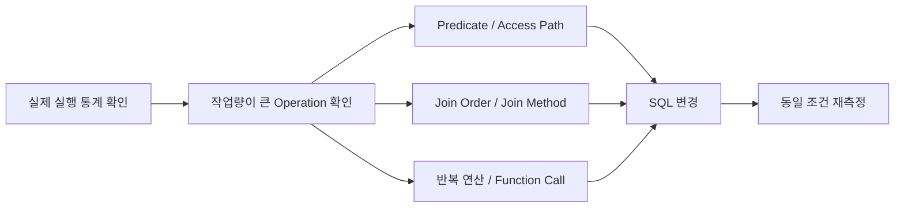
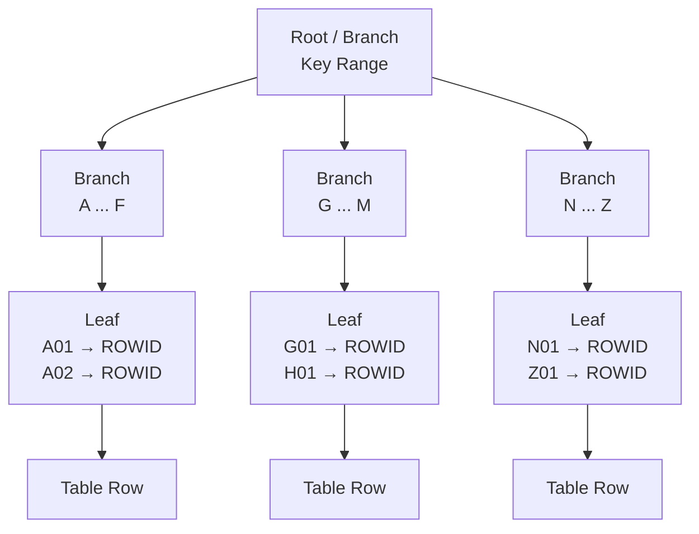
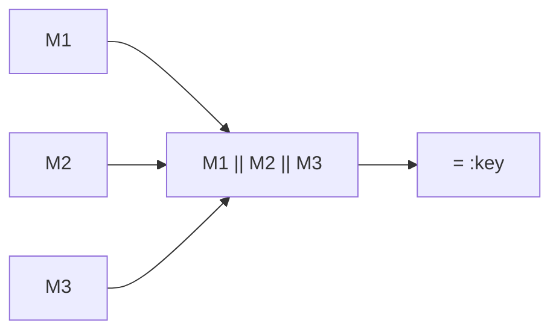
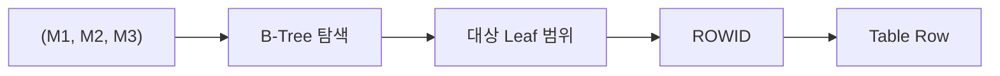
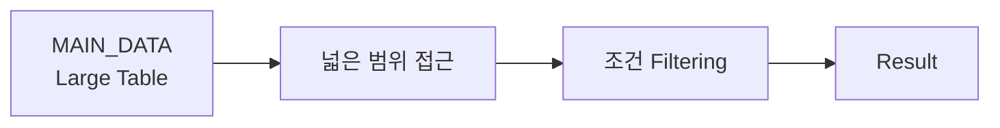
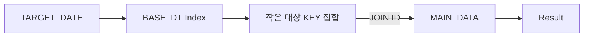
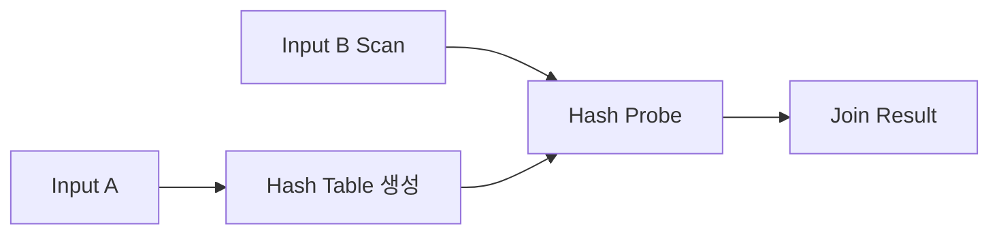
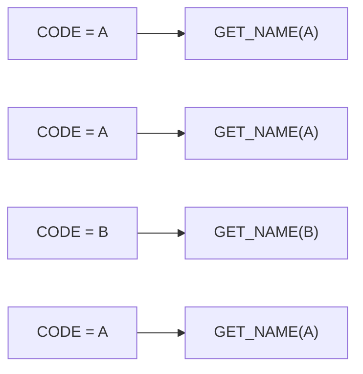
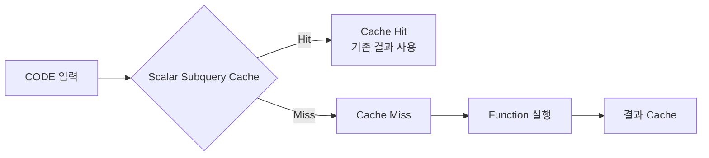

# Oracle SQL 튜닝 - 실행계획에서 병목을 찾는 방법

SQL 성능을 개선할 때 가장 먼저 떠올리는 것은 Index이다. 하지만 운영 중인 쿼리를 들여다보면 DB 병목은 Index 유무만으로 설명되지 않았다.

- Index는 존재하지만 WHERE 절의 형태 때문에 사용하지 못할 수 있다.
- 잘못된 Join 순서로 불필요하게 많은 데이터를 먼저 읽을 수 있다.
- 동일한 Function이 row마다 반복 실행되면서 CPU를 소비할 수 있다.
- 문자열 함수로 처리한 조건 때문에 Index를 활용하기 어려울 수 있다.
- Optimizer가 예상한 row 수와 실제 row 수가 크게 달라 잘못된 실행계획을 선택할 수도 있다.

실행계획에서는 어떤 Operation이 선택됐는지보다, 어디에서 많은 데이터를 읽고 어떤 작업이 반복되는지를 확인해야 한다.

이 글에서는 Oracle 실행계획과 실행 통계를 기준으로, 쿼리를 튜닝하면서 확인했던 병목들과 튜닝 방법들을 정리하고자 한다.

## SQL 튜닝에서 무엇을 측정할 것인가

SQL이 느리다고 해서 ELAPSED_TIME 하나만 봐서는 원인을 알기 어렵다. 튜닝 전후에는 주로 아래와 같은 지표들을 함께 비교했다.

| 지표 | 의미 | 확인하려는 내용 |
| --- | --- | --- |
| `BUFFER_GETS` | Buffer Cache에서 논리적으로 블록을 읽은 횟수 | 얼마나 많은 데이터를 탐색했는가 |
| `CPU_TIME` | Parse, Execute, Fetch에 사용된 CPU 시간 | 연산이나 함수 호출 비용이 큰가 |
| `ELAPSED_TIME` | SQL 처리에 걸린 전체 경과 시간 | 실제 처리 시간이 얼마나 걸렸는가 |
| `EXECUTIONS` | Cursor가 실행된 횟수 | 누적 비용이 실행 횟수 때문인가 |

`V$SQLSTATS`의 BUFFER_GETS, CPU_TIME, ELAPSED_TIME은 누적 값이므로 실행 횟수가 다른 SQL을 비교할 때는 EXECUTIONS도 함께 확인해야 한다.

필요하다면 다음과 같이 실행당 비용으로 환산할 수 있다.

```text
BUFFER_GETS  / EXECUTIONS
CPU_TIME     / EXECUTIONS
ELAPSED_TIME / EXECUTIONS
```

## 실행계획은 실제 실행 통계와 함께 본다

EXPLAIN PLAN은 Optimizer가 예상한 실행계획을 보여준다. 하지만 실제 튜닝에서는 예상한 실행계획만으로 병목을 판단하기 어렵다. 각 Operation에서 실제로 몇 건을 처리했는지, 몇 번 반복 실행됐는지, 어느 구간에서 작업량이 커졌는지까지 함께 확인해야 한다.

Oracle에서는 SQL을 실제로 실행하면서 통계를 수집한 뒤, `DBMS_XPLAN.DISPLAY_CURSOR`를 통해 실행계획과 실제 실행 통계를 함께 확인할 수 있다.

먼저 'gather_plan_statistics' Hint를 사용해 SQL을 실행한다.

```sql
SELECT /*+ gather_plan_statistics */
       ...
FROM ...
WHERE ...;
```

이렇게 실행하면 각 Operation에서 실제로 처리한 row 수와 Buffer 사용량 등의 실행 통계가 함께 수집된다.

이후 `DBMS_XPLAN.DISPLAY_CURSOR`를 이용해 방금 실행한 Cursor의 실행계획을 확인한다.

```sql
SELECT *
FROM TABLE(
    DBMS_XPLAN.DISPLAY_CURSOR(
        NULL,
        NULL,
        'ALLSTATS LAST'
    )
);
```

'ALLSTATS LAST'는 해당 Cursor의 마지막 실행 통계를 포함해서 보여준다. 이를 통해 Optimizer가 예상한 값과 실제 실행 결과를 함께 비교할 수 있다.

실행 결과는 다음과 비슷한 형태로 확인할 수 있다.

```text
--------------------------------------------------------------------------------
| Id | Operation           | E-Rows | A-Rows | Starts | Buffers | A-Time       |
--------------------------------------------------------------------------------
|  0 | SELECT STATEMENT    |        |    100 |      1 |  82,000 | 00:00:02.31 |
|  1 | HASH JOIN           |    100 |    100 |      1 |  82,000 | 00:00:02.31 |
|  2 | TABLE ACCESS FULL   | 100000 | 120000 |      1 |  70,000 | 00:00:01.90 |
|  3 | INDEX RANGE SCAN    |    100 |    100 |      1 |     300 | 00:00:00.01 |
--------------------------------------------------------------------------------
```

여기서 'TABLE ACCESS FULL'과 같은 특정 Operation 하나만 보고 성능을 판단해서는 안 된다. 실제로 얼마나 많은 row를 처리했고, 해당 Operation이 몇 번 반복됐으며, 어느 구간에서 Buffer 사용량이 커졌는지를 함께 봐야 한다.

| 항목        | 의미                           |
| --------- | ---------------------------- |
| `E-Rows`  | Optimizer가 예상한 row 수         |
| `A-Rows`  | 해당 Operation에서 실제로 처리한 row 수 |
| `Starts`  | 해당 Operation이 시작된 횟수         |
| `Buffers` | 실행 과정에서 발생한 논리적 블록 접근량       |
| `A-Time`  | 해당 Operation의 실제 실행 시간       |

예를 들어 Optimizer가 10건을 예상했는데 실제로는 10만 건이 처리됐다면, 그 차이가 뒤쪽 Join Order나 Join Method에 영향을 줄 수 있다. 'Starts'가 지나치게 크다면 특정 Operation이 반복 실행되고 있는지도 확인해야 한다.

실행계획은 다음 흐름으로 확인했다.



먼저 'A-Rows', 'Buffers', 'Starts'를 기준으로 작업량이 커지는 지점을 찾는다. 이후 해당 구간의 Predicate와 Access Path를 확인하고, 필요한 경우 Join Order나 반복 Function Call까지 따라가면서 원인을 좁혀간다.

## Index가 있어도 사용하지 못하는 경우

### B-Tree Index가 데이터를 찾는 방식

WHERE 절과 Index의 관계를 보기 전에, B-Tree Index가 어떤 방식으로 탐색 범위를 줄이는 지 먼저 살펴볼 필요가 있다.

Oracle에서 가장 일반적으로 사용하는 B-Tree Index는 크게 Branch Block과 Leaf Block으로 구성된다.



Branch Block은 다음에 읽을 하위 블록을 찾는 데 사용되고, Leaf Block에는 Index Key와 해당 row의 ROWID가 저장된다. B-Tree Index는 **정렬된 Key를 따라 탐색 범위를 좁히는 구조**다. 따라서 Index 유무뿐 아니라 WHERE 절이 그 Key를 탐색할 수 있는 형태인지 함께 확인해야 한다.

### Case 1. 컬럼을 결합한 조건을 분리하기

다음과 같은 복합 Index가 있다고 하자.

```text
INDEX (M1, M2, M3)
```

B-Tree Index에는 '(M1, M2, M3)' 조합이 하나의 복합 Key로 정렬되어 저장된다.

```text
(A, 01, X)
(A, 01, Y)
(A, 02, A)
(B, 01, A)
...
```

그런데 기존 SQL은 세 컬럼을 결합한 값을 기준으로 조회하고 있었다.

```sql
WHERE M1 || M2 || M3 = :key
```

SQL의 결과값은 같을 수 있지만, WHERE 절에서는 Index에 저장된 '(M1, M2, M3)'를 그대로 비교하지 않고 아래와 같이 새로운 표현식을 만든다.



일반적인 '(M1, M2, M3)' B-Tree Index는 세 컬럼의 조합을 기준으로 정렬되어 있기 때문에, 위와 같이 컬럼을 결합한 표현식은 기존 Index의 Key를 그대로 탐색하는 조건으로 사용하기 어렵다.

그래서 조건을 아래와 같이 분리했다.

```sql
WHERE M1 = :m1
  AND M2 = :m2
  AND M3 = :m3
```

위처럼 조건을 분리할 경우 WHERE 절의 조건과 Index Key가 직접 대응하게 된다.



이 변경의 핵심은 문자열 결합 연산을 없애는 것 자체가 아니라 **Predicate를 기존 Index가 탐색할 수 있는 형태로 변경한 것**이다.

반대로 'M1 || M2 || M3' 형태 자체가 주요 조회 조건이라면 Function-Based Index를 만드는 방법도 있다.

```sql
CREATE INDEX IDX_SAMPLE_KEY
ON SAMPLE_TABLE (M1 || M2 || M3);
```

어떤 방식을 사용할지는 실제 조회 패턴과 Index 추가 비용을 함께 고려해야 한다.

### Access Predicate와 Filter Predicate 구분하기

실행계획에서는 WHERE 절의 모든 조건이 같은 역할을 하는 것은 아니다.

예를 들어 다음과 같은 SQL이 있다고 하자.

```sql
SELECT ...
FROM SAMPLE_TABLE
WHERE M1 = :m1
  AND M2 = :m2
  AND M3 = :m3
  AND STATUS = 'Y';
```

Index가 '(M1, M2, M3)'로 구성되어 있다면 Predicate Information은 개념적으로 아래와 같이 나타날 수 있다.

```text
Predicate Information
---------------------

2 - access("M1"=:M1 AND "M2"=:M2 AND "M3"=:M3)
3 - filter("STATUS"='Y')
```

'Access Predicate'는 **어디를 읽을지 결정하는 조건**이다. 위 예시에서는 '(M1, M2, M3)' 조건을 이용해 Index에서 탐색할 범위를 줄인다.

반면 'Filter Predicate'는 **이미 읽은 데이터 중 무엇을 제외할지 결정하는 조건**이다. Index를 통해 후보 row를 찾은 뒤 'STATUS = 'Y'' 조건으로 최종 결과를 걸러낼 수 있다.

여기서 'Access'와 'Filter'는 단순히 Index 존재 여부로 구분되는 것이 아니다. 같은 조건이라도 선택된 Index와 Access Path에 따라 Access Predicate로 사용될 수도 있고 Filter Predicate로 처리될 수도 있다.

```text
Access Predicate → 어디를 읽을지 결정
Filter Predicate → 읽은 데이터 중 무엇을 제외할지 결정
```

따라서 실행계획에 'INDEX RANGE SCAN' Operation이 보인다면, **어떤 조건이 Access Predicate로 사용됐고 그 결과 실제로 몇 건을 읽었는지**까지 함께 확인해야 한다.

## JOIN 전에 데이터를 얼마나 줄일 수 있는가

최종 결과 건수가 같더라도 중간 단계에서 처리하는 row 수가 다르면 비용도 달라진다.

### Case 2. 조회 범위를 줄이기 위해 JOIN을 추가하기

특정 일자를 기준으로 데이터를 조회해야 했지만, 메인 테이블에는 해당 일자를 기준으로 사용할 수 있는 적절한 Access Path가 없었다. 단순화하면 기존 구조는 아래와 같았다.



반면 다른 테이블에는 일자 기준으로 대상을 먼저 좁힐 수 있는 조건과 Index가 존재했다. 따라서 대상 Key를 먼저 얻은 뒤 메인 데이터와 JOIN하도록 구조를 변경하였다.

```sql
SELECT
    M.ID,
    M.STATUS,
    M.VALUE
FROM TARGET_DATE T
JOIN MAIN_DATA M
  ON M.ID = T.ID
WHERE T.BASE_DT = :baseDt
  AND M.STATUS = :status;
```

이를 구조화 해본다면 아래와 같다.



JOIN이 하나 늘면서 SQL 자체는 더 복잡해졌지만, 기존처럼 큰 데이터 집합에서 조건을 적용하는 대신 **선택도가 높은 조건으로 후보 집합을 먼저 줄인 뒤 큰 테이블에 접근**할 수 있게 되었다. JOIN 수 자체보다 데이터를 어느 시점에 얼마나 줄일 수 있는지가 더 중요했고, 이 경우에는 JOIN을 추가한 쪽이 전체 작업량을 줄였다.

### Join Order와 Join Method

JOIN에서도 어느 시점에 후보 row를 줄이는지에 따라 중간 처리량이 달라진다. 예를 들어 Nested Loops에서 Outer 결과가 충분히 줄어들지 않으면 Inner Table 접근도 그만큼 반복된다.

즉 Join Order를 볼 때는 어떤 테이블을 먼저 읽는지만이 아니라, **다음 Join으로 넘어가는 row가 얼마나 줄어드는지**를 함께 확인해야 한다.

#### Nested Loops

Nested Loops는 Outer에서 row를 하나씩 가져오면서, 해당 row의 Join Key를 이용해 Inner Table을 반복 조회하는 방식이다.

```text
Outer Row 1 → Inner Table 조회
Outer Row 2 → Inner Table 조회
Outer Row 3 → Inner Table 조회
```

Outer 결과가 작고 Inner Table에 효율적인 Index가 있다면 매우 유리할 수 있다. 반대로 Outer에서 예상보다 많은 row가 나오면 Inner 접근이 반복되면서 비용이 급격하게 증가할 수 있다.

#### Hash Join

Hash Join은 한쪽 데이터 집합을 이용해 Hash Table을 만들고, 다른 쪽 데이터를 읽으면서 Join Key를 비교하는 방식이다.

두 데이터 집합 중 하나를 기반으로 Hash Table을 만들고 다른 데이터 집합을 비교한다.



Nested Loops처럼 Inner Table을 row마다 반복 조회하는 구조가 아니기 때문에, Join 대상 데이터가 많은 경우에는 Hash Join이 더 효율적일 수 있다.

반대로 Outer 결과가 매우 작고 Inner Table을 Index로 빠르게 조회할 수 있다면 Nested Loops가 더 적합할 수 있다.

즉 Join Method는 실제 row 수와 각 테이블의 Access Path를 함께 확인해야 한다.

### Case 3. Hint로 Join Order와 Access Path 조정하기

실행계획에서 비효율적인 Join Order나 Access Path가 선택된 경우에는 Hint로 계획을 조정했다.

예를 들어 A에서 먼저 데이터를 충분히 줄인 뒤 B를 Nested Loops로 조회하고, B에서는 특정 Index를 사용하도록 유도하고 싶다면 다음과 같이 작성할 수 있다.

```sql
SELECT /*+
          LEADING(A B)
          USE_NL(B)
          INDEX(B IDX_B_01)
       */
       ...
FROM A
JOIN B
  ON A.KEY = B.KEY
WHERE ...
```

각 Hint는 대략 아래와 같은 의도를 가진다.


```text
LEADING(A B) -> A를 먼저 읽고 B와 Join하도록 Join Order 유도

USE_NL(B) -> B와의 Join에 Nested Loops 사용 유도

INDEX(B IDX_B_01) -> 특정 Index 사용 유도
```

즉 위의 Hint는 개념적으로 'A 조회 > 조건으로 후보 row 축소 > A의 각 row를 기준으로 B 조회 > B는 IDX_B_01 Index를 이용해 탐색' 흐름으로 유도한다.

다만 실행계획이 기대와 다르다고 해서 바로 Hint를 추가하는 것은 아니다. Optimizer가 해당 계획을 선택한 이유부터 확인해야 한다.

```text
통계 정보가 적절한가?
        ↓
Cardinality 추정이 맞는가? (E-Rows와 A-Rows 차이 확인)
        ↓
Predicate가 Index를 사용할 수 있는가?
        ↓
Join 조건과 Access Path가 정상인가?
        ↓
여전히 비효율적인 계획인가?
        ↓
Hint 검토
```

예를 들어 Cardinality 추정이 잘못됐다면 Hint로 Join 순서를 고정하기 전에 통계 정보나 Predicate 구조를 먼저 확인해야 한다.

Hint는 Optimizer의 선택에 직접 개입하기 때문에 현재 데이터에서는 효과적이더라도 데이터 분포나 테이블 크기가 달라지면 같은 계획이 계속 유효하다는 보장은 없다. 따라서 Hint를 적용한 뒤에도 실제 실행 통계를 기준으로 다시 확인해야 한다.

## 반복 Function Call이 병목인 경우

Access Path에 큰 문제가 없어도 **SQL 안에서 반복되는 Function Call**이 병목이 될 수 있다.

### Case 4. Function Call과 Scalar Subquery Caching

다음과 같은 SQL이 있다고 하자.

```sql
SELECT
    T.ID,
    GET_NAME(T.CODE)
FROM TARGET T;
```

TARGET에서 100,000개의 row가 조회된다면 GET_NAME()도 매우 많은 횟수로 실행될 수 있다. 동일한 CODE가 반복적으로 입력된다면 아래와 같이 같은 Function이 반복 호출되게 된다.



SQL에서 PL/SQL Function을 호출한다면 SQL Engine과 PL/SQL Engine 사이의 호출 비용도 계속 발생한다. 이와 같이 입력값이 반복되는 경우 Scalar Subquery 형태로 변경하면 Function Call 횟수를 줄일 수 있다.

```sql
SELECT
    T.ID,
    (
        SELECT GET_NAME(T.CODE)
        FROM DUAL
    ) AS NAME
FROM TARGET T;
```

구조화하면 아래와 같다.



같은 입력값이 반복되는 경우 Scalar Subquery Caching을 통해 Function Call 횟수를 줄일 수 있다.

## 검색 조건을 데이터 구조에 맞추기

### Case 5. INSTR을 Range Predicate로 변경하기

특정 일자가 어떤 기간에 포함되는지를 판단해야 하는 데이터가 있었다. 기존 SQL은 단순화하면 다음과 비슷한 형태였다.

```sql
WHERE INSTR(DATE_RANGE, :targetDate) > 0
```

이 조건에서는 DB가 'DATE_RANGE' 값을 읽은 뒤 각 row마다 'INSTR'을 계산해야 한다. 실제로 필요한 조건은 문자열 포함 여부가 아니라 특정 일자가 시작일과 종료일 사이에 포함되는지 확인하는 것이었다. (특정 일자 targetDate가 START_DT ~ END_DT 범위 안에 존재하는가?)

따라서 데이터의 의미에 맞게 아래와 같이 변경할 수 있었다.

```sql
WHERE :targetDate BETWEEN START_DT AND END_DT

--(또는 명시적으로 아래처럼도 가능)
WHERE START_DT <= :targetDate
  AND END_DT >= :targetDate
```

해당 조건을 사용하는 조회가 반복적으로 수행되고 있었기 때문에, Predicate를 변경한 뒤에는 실제 조회 패턴에 맞춰 날짜 컬럼을 기준으로 Index도 추가했다.

핵심은 INSTR보다 BETWEEN이 빠르다는 것이 아니라, **기간을 의미하는 데이터를 Range Predicate로 조회할 수 있도록 구조를 변경하고, 해당 조회 패턴에 맞는 Access Path를 구성한 것​**이다.

이처럼 SQL 튜닝에서는 쿼리 표현뿐 아니라 데이터의 의미와 실제 조회 패턴, 이를 지원하는 Index 구조까지 함께 고려해야 한다.

## 튜닝 전후에는 무엇을 비교할 것인가

SQL을 수정한 뒤에는 변경 전후를 동일한 조건에서 다시 비교해야 한다. 실행시간만 줄었는지 보는 것이 아니라, 실제 작업량과 실행계획이 어떻게 달라졌는지도 함께 확인한다.

| 항목                   | 확인할 내용                                     |
| -------------------- | ------------------------------------------ |
| Buffer Gets / Exec | 한 번 실행할 때 발생하는 Logical I/O가 감소했는가          |
| CPU / Exec         | 연산이나 Function Call에 사용되는 CPU 비용이 감소했는가     |
| Elapsed / Exec     | 전체 실행 시간이 감소했는가                            |
| A-Rows             | 변경 전후 동일한 결과를 반환하는가                        |
| Starts             | 반복 실행되는 Operation의 횟수가 줄었는가                |
| Plan               | Predicate, Access Path, Join 방식이 어떻게 변경됐는가 |

특히 실행시간만 비교하기보다 **어떤 Operation에서 작업량이 줄었고, 그 변화가 전체 비용 감소로 어떻게 이어졌는지**를 실행계획과 함께 확인해야 한다.

## 튜닝 사례를 정리하면

앞의 사례를 튜닝 관점으로 묶으면 아래와 같다.

| 변경 내용                            | 확인한 문제                          |
| -------------------------------- | ------------------------------- |
| 'M1 \|\| M2 \|\| M3'를 개별 조건으로 변경 | Predicate / Index 활용            |
| 일자 조건을 활용하기 위한 JOIN 추가           | Access Path / Early Filtering   |
| Hint로 Join 순서 및 방식 조정            | Join Order / Join Method        |
| Scalar Subquery Caching 활용       | 반복 Function Call / CPU          |
| 'INSTR'을 Range Predicate로 변경     | Predicate / Data Access Pattern |
| 일자 기준 Index 추가                   | Access Path 개선                  |

각 사례에서 수정한 부분은 달랐지만 방향은 같았다. **불필요하게 읽는 데이터와 반복 작업을 줄이고, 실제 조회 패턴에 맞는 Access Path를 만들기 위한 것**이었다.

## 마치며

SQL 튜닝을 처음 접할 때는 Full Scan을 없애거나 Index를 타게 만드는 작업 정도로 생각하는 경우가 많다. 하지만 실행계획을 분석할수록 특정 Operation 자체보다 왜 그런 계획이 만들어졌는지를 보는 것이 중요했다.

- 왜 이 Access Path가 선택됐을까?
- 어디에서 Rows와 Buffers가 크게 늘어났을까?
- 왜 이 Operation의 Starts가 높을까?
- Optimizer가 예상한 row 수와 실제 row 수는 왜 다를까?

실행계획은 단순히 실행 순서를 확인하는 표가 아니라 **SQL이 데이터를 어떻게 처리하는지 추적하는 디버깅 정보**에 가깝다.

SQL 튜닝의 목표도 특정 Operation을 없애는 것이 아닌, **같은 결과를 만들기 위해 DB가 수행하는 불필요한 작업을 줄이는 것**이고, 실행계획은 그 지점을 찾기 위한 단서가 된다.
