# Oracle SQL 튜닝 - 실행계획에서 병목을 찾는 방법

SQL 성능을 개선할 때 가장 먼저 떠올리는 것은 index이다. 하지만 운영 쿼리를 들여다보면 병목은 인덱스 유무만으로 설명되지 않는다.

- 인덱스는 존재하지만 WHERE 절의 형태 때문에 사용하지 못할 수 있다.
- 잘못된 조인 순서로 불필요하게 많은 데이터를 먼저 읽을 수 있다.
- 동일한 Function이 row마다 반복 실행되면서 CPU를 소비할 수 있다.
- 문자열 함수로 처리한 조건 때문에 인덱스를 활용하기 어려울 수 있다.
- Optimizer가 예상한 row 수와 실제 row 수가 크게 달라 잘못된 실행계획을 선택할 수도 있다.

실행계획에서는 어떤 Operation이 선택됐는지보다, 어디에서 많은 데이터를 읽고 어떤 작업이 반복되는지를 확인해야 한다.

이 글에서는 Oracle 실행계획과 실행 통계를 기준으로, 쿼리를 튜닝하면서 확인했던 병목과 수정 방법을 정리하고자 한다.

## SQL 튜닝에서 무엇을 측정할 것인가

SQL이 느리다고 해서 ELAPSED_TIME 하나만 봐서는 원인을 알기 어렵다. 튜닝 전후에는 주로 다음 지표들을 함께 비교했다.

| 지표 | 의미 | 확인하려는 것 |
| --- | --- | --- |
| `BUFFER_GETS` | Buffer Cache에서 논리적으로 블록을 읽은 횟수 | 얼마나 많은 데이터를 탐색했는가 |
| `CPU_TIME` | Parse, Execute, Fetch에 사용된 CPU 시간 | 연산이나 함수 호출 비용이 큰가 |
| `ELAPSED_TIME` | SQL 처리에 걸린 전체 경과 시간 | 실제 처리 시간이 얼마나 걸렸는가 |
| `EXECUTIONS` | Cursor가 실행된 횟수 | 누적 비용이 실행 횟수 때문인가 |

V$SQLSTATS의 BUFFER_GETS, CPU_TIME, ELAPSED_TIME은 누적 값이다. 따라서 다음처럼 총량만 비교하면 판단을 잘못할 수 있다.

```text
SQL A
Executions  = 1,000
Buffer Gets = 1,000,000

SQL B
Executions  = 10
Buffer Gets = 100,000
```

총 BUFFER_GETS만 보면 SQL A가 훨씬 비싸 보이지만, 실행당 비용을 계산하면 결과가 달라진다.

```text
SQL A
1,000,000 / 1,000
= 1,000 Buffer Gets / EXECUTIONS

SQL B
100,000 / 10
= 10,000 Buffer Gets / EXECUTIONS
```

SQL B는 한 번 실행할 때 SQL A보다 훨씬 많은 블록을 읽는다. 누적 통계를 비교할 때는 필요에 따라 다음 값을 함께 본다.

```text
BUFFER_GETS / EXECUTIONS
CPU_TIME    / EXECUTIONS
ELAPSED_TIME / EXECUTIONS
```

이렇게 하면 **얼마나 자주 실행되는 SQL인지**와 **한 번 실행할 때 얼마나 비싼 SQL인지**를 분리할 수 있다. 

## 실행계획은 실제 실행 통계와 함께 본다

EXPLAIN PLAN은 Optimizer가 예상한 실행계획을 보여준다. 튜닝할 때는 여기에 실제로 몇 건을 읽었는지, 각 Operation이 몇 번 실행됐는지, 어느 구간에서 작업량이 커졌는지를 함께 봐야 한다.

Oracle에서는 실행된 Cursor의 통계를 `DBMS_XPLAN.DISPLAY_CURSOR`로 확인할 수 있다.

```sql
SELECT /*+ gather_plan_statistics */
       ...
FROM ...
WHERE ...;
```

이후 마지막 실행의 통계를 확인한다.

```sql
SELECT *
FROM TABLE(
    DBMS_XPLAN.DISPLAY_CURSOR(
        NULL,
        NULL,
        'ALLSTATS LAST'
    )
);
```

실행 결과는 다음과 비슷한 형태로 확인할 수 있다.

```text
--------------------------------------------------------------------------------
| Id | Operation           | E-Rows | A-Rows | Starts | Buffers | A-Time       |
--------------------------------------------------------------------------------
|  0 | SELECT STATEMENT    |        |    100 |      1 |  82,000 | 00:00:02.31 |
|  1 | HASH JOIN           |    100 |    100 |      1 |  82,000 | 00:00:02.31 |
|  2 | TABLE ACCESS FULL   | 100000 | 120000 |      1 |  70,000 | 00:00:01.90 |
|  3 | INDEX RANGE SCAN    |    100 |    100 |      1 |     300 | 00:00:00.01 |
--------------------------------------------------------------------------------
```

여기서 'TABLE ACCESS FULL'이라는 Operation 하나만 보고 성능을 판단해서는 안 된다.

| 항목 | 의미 |
| --- | --- |
| `E-Rows` | Optimizer가 예상한 row 수 |
| `A-Rows` | 해당 Operation을 실제로 통과한 row 수 |
| `Starts` | 해당 Operation이 시작된 횟수. 값이 크다면 같은 Operation이 반복 실행되고 있는지 확인한다. |
| `Buffers` | 해당 실행 과정에서 발생한 논리적 블록 접근량 |
| `A-Time` | 실제 실행 과정에서 소비된 시간 |

실행계획은 다음 흐름으로 확인했다.

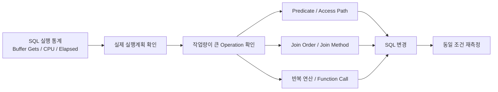

먼저 Rows와 Buffers가 커지는 지점을 찾고, 해당 구간의 Predicate와 Access Path를 확인한다. 이후 Join Order나 반복 호출까지 따라가면서 원인을 좁혀간다.

## 인덱스가 있어도 사용하지 못하는 경우

### B-Tree Index가 데이터를 찾는 방식

Oracle에서 가장 일반적으로 사용하는 B-Tree Index는 크게 Branch Block과 Leaf Block으로 구성된다.

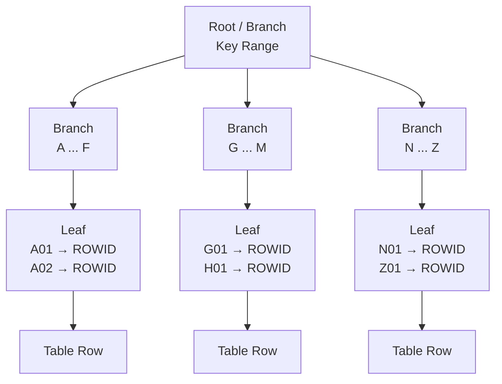

Branch Block은 다음에 읽을 하위 블록을 찾는 데 사용되고, Leaf Block에는 Index Key와 해당 row의 ROWID가 저장된다. B-Tree Index는 **정렬된 Key를 따라 탐색 범위를 좁히는 구조**다. 따라서 인덱스 유무뿐 아니라 WHERE 절이 그 Key를 탐색할 수 있는 형태인지 함께 확인해야 한다.

### Case 1. 컬럼을 결합한 조건을 분리하기

다음과 같은 복합 인덱스가 있다고 하자.

```text
INDEX (M1, M2, M3)
```

그리고 기존 SQL이 다음과 같은 형태였다고 가정한다.

```sql
WHERE M1 || M2 || M3 = :key
```

세 컬럼을 조합한 값으로 row를 찾는 조건이지만, 인덱스에는 (M1, M2, M3)가 각각의 Key로 정렬되어 있다.

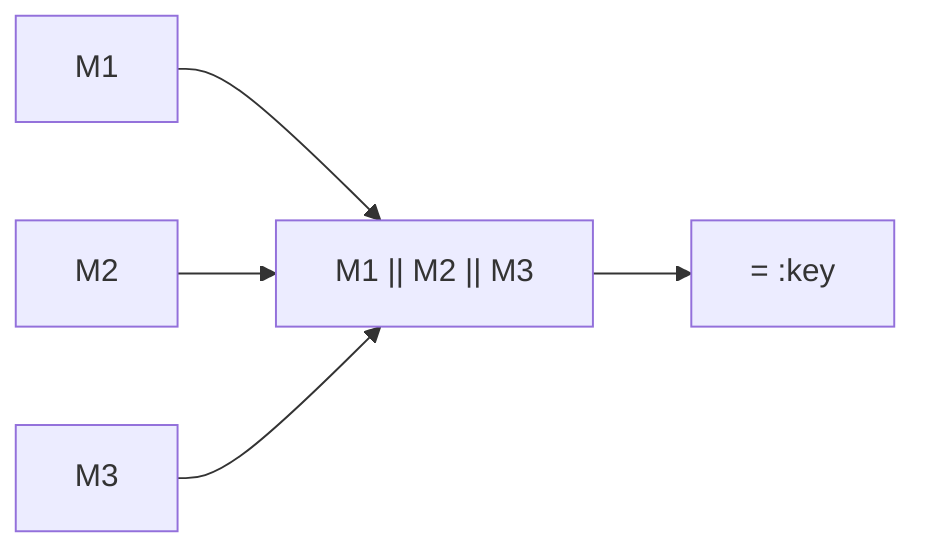

인덱스는 다음 Key를 기준으로 정렬된다.

```text
(M1, M2, M3)
```

반면 WHERE 절에서는 세 컬럼을 결합한 새로운 표현식을 만든다.

```text
f(M1, M2, M3)
```

따라서 일반적인 (M1, M2, M3) B-Tree Index를 그대로 탐색하기 어려워질 수 있다. 이를 다음처럼 변경했다.

```sql
WHERE M1 = :m1
  AND M2 = :m2
  AND M3 = :m3
```

조건을 분리하면 Index Key와 직접 대응할 수 있다.

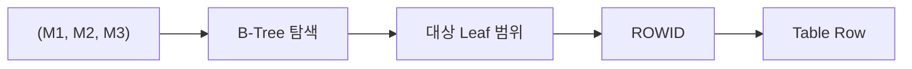

이 변경의 목적은 문자열 결합 연산 자체를 없애는 데 있지 않다. **Predicate를 Index가 탐색할 수 있는 형태로 바꾸는 것**이 핵심이다. 반대로 'M1 \|\| M2 \|\| M3' 형태가 매우 자주 사용되는 검색 조건이라면 SQL을 분해하는 대신 Function-Based Index를 두는 방법도 검토할 수 있다.

```sql
CREATE INDEX IDX_SAMPLE_KEY
ON SAMPLE_TABLE (M1 || M2 || M3);
```

어느 쪽이 적절한지는 조회 패턴과 변경 비용에 따라 달라진다.

### Access Predicate와 Filter Predicate 구분하기

실행계획의 Predicate Information을 보면 다음과 같이 `access`와 `filter`가 구분될 수 있다.

```text
Predicate Information
---------------------

2 - access("M1"=:M1 AND "M2"=:M2)
3 - filter("STATUS"='Y')
```

Access Predicate는 데이터에 접근할 범위를 정하고, Filter Predicate는 읽은 데이터에서 조건에 맞지 않는 row를 걸러낸다. Index Range Scan이 보이더라도 어떤 조건이 `access`에 사용됐는지, 해당 Operation에서 실제로 몇 건을 읽었는지를 같이 봐야 한다.

## JOIN 전에 데이터를 얼마나 줄일 수 있는가

최종 결과 건수가 같더라도 중간 단계에서 처리하는 row 수가 다르면 비용도 달라진다.

### Case 2. 조회 범위를 줄이기 위해 JOIN을 추가하기

특정 일자를 기준으로 데이터를 조회해야 했지만, 메인 테이블에는 해당 일자를 기준으로 사용할 수 있는 적절한 Access Path가 없었다. 단순화하면 기존 구조는 다음과 같았다.

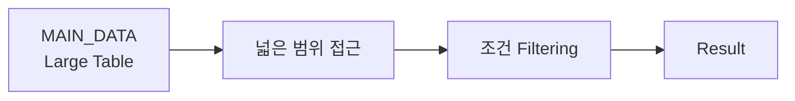

반면 다른 테이블에는 일자 기준으로 대상을 먼저 좁힐 수 있는 조건과 인덱스가 존재했다. 그래서 대상 Key를 먼저 얻은 뒤 메인 데이터와 JOIN하도록 구조를 변경했다.

```sql
SELECT
    M.ID,
    M.STATUS,
    M.VALUE
FROM TARGET_DATE T
JOIN MAIN_DATA M
  ON M.ID = T.ID
WHERE T.BASE_DT = :baseDt
  AND M.STATUS = :status;
```

구조는 다음과 같다.

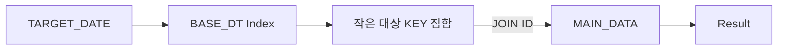

JOIN이 하나 늘면서 SQL 자체는 더 복잡해졌지만, 기존처럼 큰 데이터 집합에서 조건을 적용하는 대신 **선택도가 높은 조건으로 후보 집합을 먼저 줄인 뒤 큰 테이블에 접근**할 수 있게 되었다. JOIN 수 자체보다 데이터를 어느 시점에 얼마나 줄일 수 있는지가 더 중요했고, 이 경우에는 JOIN을 추가한 쪽이 전체 작업량을 줄였다.

### Join Order와 Join Method

JOIN에서도 어느 시점에 후보 row를 줄이는지에 따라 중간 처리량이 달라진다. 예를 들어 Nested Loops에서 Outer 결과가 충분히 줄어들지 않으면 Inner Table 접근도 그만큼 반복된다.

```text
필터링 전

Outer 1,000,000 rows
        ↓
     JOIN 반복
```

```text
필터링 후

조건 적용
   ↓
Outer 10 rows
   ↓
JOIN 반복
```

즉 Join Order를 볼 때는 어떤 테이블을 먼저 읽는지만이 아니라, **다음 Join으로 넘어가는 row가 얼마나 줄어드는지**를 함께 확인해야 한다.

#### Nested Loops

개념적으로 다음과 같다.

```text
Outer Row 1
   ↓
Inner Table 탐색

Outer Row 2
   ↓
Inner Table 탐색

Outer Row 3
   ↓
Inner Table 탐색
```

Outer 결과가 작고 Inner Table에 효율적인 Index가 있다면 매우 유리할 수 있다. 반대로 Outer에서 예상보다 많은 row가 나오면 Inner 접근이 반복되면서 비용이 급격하게 증가할 수 있다.

#### Hash Join

두 데이터 집합 중 하나를 기반으로 Hash Table을 만들고 다른 데이터 집합을 비교한다.

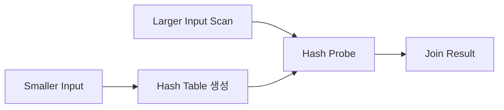

많은 데이터를 조인할 때는 Hash Join이 Nested Loops보다 효율적일 수 있다. Join Method는 실제 row 수와 Access Path를 함께 보고 판단한다.

### Case 3. Hint로 Join Order와 Access Path 조정하기

실행계획에서 의도한 Join Order나 Access Path가 선택되지 않는 경우에는 Hint로 계획을 조정했다. 예를 들면 다음과 같은 형태다.

```sql
SELECT /*+
          LEADING(A B)
          USE_NL(B)
          INDEX(B IDX_B_01)
       */
       ...
FROM A
JOIN B
  ON A.KEY = B.KEY
WHERE ...
```

각 Hint는 대략 다음 의도를 가진다.

```text
LEADING
→ Join 순서 유도

USE_NL
→ Nested Loops Join 유도

INDEX
→ 특정 Index 사용 유도
```

다만 바로 Hint를 넣기 전에 왜 그런 실행계획이 선택됐는지 먼저 확인해야 한다.

```text
통계 정보가 적절한가?
        ↓
Cardinality 추정이 맞는가?
        ↓
Predicate가 Index를 사용할 수 있는가?
        ↓
Join 조건이 정상적인가?
        ↓
그래도 계획이 적절하지 않은가?
        ↓
Hint 검토
```

Hint는 Optimizer의 선택에 직접 개입한다. 따라서 데이터 분포나 테이블 크기가 달라진 뒤에도 같은 계획이 유효한지는 다시 확인해야 한다.

## 반복 Function Call이 병목인 경우

Table Scan이나 Index Scan에 큰 문제가 없어도 **SQL 안에서 반복되는 Function Call**이 병목이 될 수 있다.

### Case 4. Function Call과 Scalar Subquery Caching

다음과 같은 SQL이 있다고 하자.

```sql
SELECT
    T.ID,
    GET_NAME(T.CODE)
FROM TARGET T;
```

TARGET에서 100,000개의 row가 조회된다면 GET_NAME()도 매우 많은 횟수로 실행될 수 있다. 특히 다음과 같이 동일한 CODE가 반복해서 등장한다고 해보자.

```text
A
A
B
A
B
C
A
...
```

직접 Function을 호출하면 개념적으로 다음과 같다.

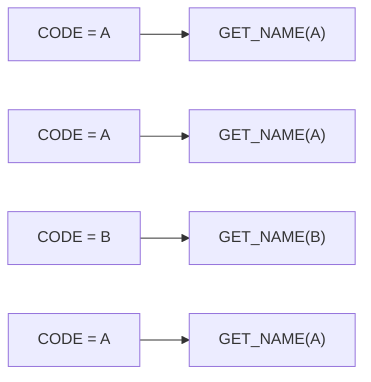

이 구조에서는 동일한 입력값에 대해 같은 Function이 반복 호출된다. SQL에서 PL/SQL Function을 호출한다면 SQL Engine과 PL/SQL Engine 사이의 호출 비용도 계속 발생한다. 입력값이 반복되는 경우 Scalar Subquery 형태로 변경하면 Function Call 횟수를 줄일 수 있다.

```sql
SELECT
    T.ID,
    (
        SELECT GET_NAME(T.CODE)
        FROM DUAL
    ) AS NAME
FROM TARGET T;
```

개념적으로는 다음과 같다.

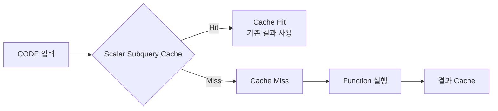

같은 입력값이 반복될수록 Scalar Subquery Caching을 통해 Function Call 횟수를 줄일 수 있다.

#### FAST DUAL은 캐싱 여부를 직접 보여주지 않는다

Scalar Subquery에서

```sql
SELECT GET_NAME(T.CODE)
FROM DUAL
```

형태를 사용하면 실행계획에서 'FAST DUAL'을 볼 수도 있다. 하지만 FAST DUAL은 DUAL 접근 자체를 최적화한 Operation이므로, 실행계획에 FAST DUAL이 보인다는 이유만으로 Scalar Subquery Caching이 동작했다고 판단할 수는 없다. 실제로 확인해야 하는 것은 Function Call 횟수와 작업량의 변화다.

```text
Function Call 횟수
Starts
CPU_TIME
ELAPSED_TIME
```

따라서 FAST DUAL 자체보다 Function Call 횟수와 CPU_TIME, ELAPSED_TIME이 실제로 줄었는지를 확인해야 한다.

## 검색 조건을 데이터 구조에 맞추기

### Case 5. INSTR을 Range Predicate로 변경하기

특정 일자가 어떤 기간에 포함되는지를 판단해야 하는 데이터가 있었다. 기존 SQL은 단순화하면 다음과 비슷한 형태였다.

```sql
WHERE INSTR(DATE_RANGE, :targetDate) > 0
```

이 조건에서는 DB가 'DATE_RANGE' 값을 읽은 뒤 각 row마다 'INSTR'을 계산해야 한다. 실제로 필요한 조건은 문자열 포함 여부가 아니라 특정 일자가 시작일과 종료일 사이에 포함되는지 확인하는 것이었다.

```text
특정 일자가

START_DT
    ↓
targetDate
    ↓
END_DT

범위 안에 존재하는가?
```

따라서 데이터의 의미에 맞게 다음과 같이 변경할 수 있었다.

```sql
WHERE :targetDate BETWEEN START_DT AND END_DT
```

또는 명시적으로 다음처럼 표현할 수도 있다.

```sql
WHERE START_DT <= :targetDate
  AND END_DT >= :targetDate
```

여기에 조회 패턴에 맞는 날짜 기준 Index도 추가했다. 여기서 INSTR은 느리고 BETWEEN은 빠르다는 식으로 볼 필요는 없다. **데이터가 실제로 기간을 의미한다면 기간으로 조회할 수 있는 구조가 더 자연스럽다.** 이처럼 SQL 튜닝은 쿼리만 고치는 작업이 아니라 데이터가 어떤 형태로 저장되고 조회되는지도 함께 보게 된다.

## 실행계획에서 추가로 확인할 것들

앞의 사례 외에도 실행계획에서 자주 확인하는 항목들이 있다.

### E-Rows와 A-Rows 차이가 큰 경우

다음과 같은 실행계획이 있다고 하자.

```text
------------------------------------------------
Operation             E-Rows          A-Rows
------------------------------------------------
TABLE ACCESS               10         150,000
------------------------------------------------
```

Optimizer는 10건 정도를 예상했지만 실제로는 150,000건이 발생했다. 이 차이가 커지면 뒤쪽 Join 방식이나 Access Path 선택까지 영향을 받을 수 있다.

```text
Outer Rows = 10
      ↓
Nested Loops
      ↓
Index Lookup 10회
```

실제로는 다음과 같을 수 있다.

```text
Outer Rows = 150,000
      ↓
Nested Loops
      ↓
Index Lookup 150,000회
```

10건을 기준으로 선택한 계획이 실제 150,000건을 처리하면 Inner 접근도 그만큼 반복된다. 이때는 다음 항목을 확인한다.

```text
Statistics가 오래되지 않았는가?
Column의 NDV가 실제 분포를 표현하는가?
Data Skew가 심하지 않은가?
Histogram이 필요한가?
Predicate 간 상관관계가 있는가?
```

이 경우에는 SQL 문법보다 **Optimizer가 왜 row 수를 잘못 추정했는지**를 먼저 확인해야 한다.

### 암묵적 형 변환

다음과 같이 컬럼이 VARCHAR2라고 하자.

```text
USER_ID VARCHAR2
```

그런데 SQL에서 Number와 비교하면 다음과 같은 코드가 만들어질 수 있다.

```sql
WHERE USER_ID = 12345
```

타입이 다르면 Oracle이 비교를 위해 암묵적 형 변환을 수행할 수 있다. 컬럼 쪽에 변환이 걸리면 다음과 같은 형태가 될 수 있다.

```sql
WHERE TO_NUMBER(USER_ID) = 12345
```

이 경우 USER_ID에 걸린 B-Tree Index를 기대한 방식으로 사용하지 못할 수 있다. 그래서 애플리케이션에서 넘기는 Bind Variable의 타입도 같이 확인해야 한다.

```sql
-- 컬럼이 VARCHAR2라면
WHERE USER_ID = :userId
```

':userId' 역시 컬럼 타입에 맞춰 문자열로 전달하는 것이 자연스럽다. 여기서도 핵심은 **Predicate에서 Index Column이 가공되고 있는지**다.

### SORT / HASH와 TEMP Spill

실행계획에서는 다음과 같은 Operation도 자주 볼 수 있다.

```text
SORT ORDER BY
SORT GROUP BY
HASH GROUP BY
HASH JOIN
```

이런 Operation은 메모리가 충분하면 PGA에서 처리되지만, 데이터가 크거나 사용할 수 있는 메모리가 부족하면 일부 작업이 TEMP 영역으로 내려갈 수 있다.

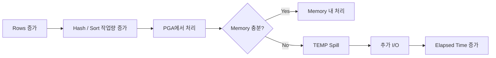

DBMS_XPLAN의 MEMSTATS를 이용하면 Hash Join이나 Sort처럼 메모리 사용량이 큰 Operation의 메모리 사용량과 TEMP Spill 여부를 확인할 수 있다. BUFFER_GETS에 비해 ELAPSED_TIME이 높다면 메모리 작업이나 TEMP 사용도 함께 확인해야 한다.

### Partition Pruning

대용량 이력 테이블은 날짜 기준 Partition을 사용하는 경우가 많다. 예를 들어 다음과 같이 월 단위로 Partition이 나뉘어 있다고 하자.

```text
[P01][P02][P03][P04][P05][P06]
               ↑──────↑
               조회 대상
```

조건이 Partition Key와 직접 연결된다면 필요한 Partition만 읽을 수 있다.

```sql
WHERE BASE_DT >= :fromDt
  AND BASE_DT <  :toDt
```

실행계획에서는 PSTART, PSTOP 등을 통해 접근하는 Partition 범위를 확인할 수 있다. 반대로 Partition Key에 함수를 적용하면 Pruning이 제한될 수 있다.

```sql
WHERE TO_CHAR(BASE_DT, 'YYYYMMDD') = :baseDt
```

개념적으로 보면 다음과 같다.

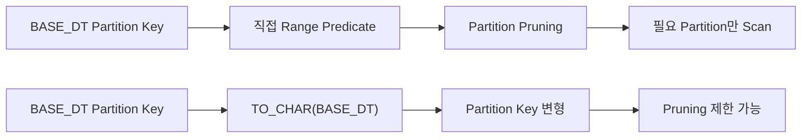

Partition Key에 함수나 암묵적 형 변환이 적용되면 Partition Pruning이 제한될 수 있다. 앞에서 본 인덱스와 마찬가지로 Predicate가 Partition Key를 그대로 사용할 수 있는지가 중요하다.

## Operation만으로 판단하지 않는다

실행계획에 어떤 Operation이 포함됐는지만으로 좋은 계획과 나쁜 계획을 나눌 수는 없다.

| Operation | 확인할 점 |
| --- | --- |
| `TABLE ACCESS FULL` | 테이블 대부분을 읽는다면 Index 접근보다 효율적일 수 있다. |
| `INDEX RANGE SCAN` | 많은 ROWID를 얻은 뒤 Table Access가 반복되면 Random I/O가 커질 수 있다. |
| `NESTED LOOPS` | Outer row 수가 예상보다 커지면 Inner 접근 횟수도 함께 증가한다. |
| `HASH JOIN` | 많은 데이터를 조인할 때 반복적인 Index Lookup보다 유리할 수 있다. |

결국 Operation 보다 Predicate, Cardinality, Access Path, Join Order, Starts, Buffers가 어떻게 이어지는지를 함께 봐야 한다.

## 튜닝 전후에는 무엇을 비교할 것인가

SQL을 수정한 뒤에는 변경 전후를 동일한 조건에서 다시 비교해야 한다. 예를 들어 다음과 같이 정리할 수 있다.

| 항목 | Before | After | 확인할 내용 |
| --- | ---: | ---: | --- |
| Buffer Gets / Exec | 100% | 35% | Logical I/O 감소 |
| CPU / Exec | 100% | 42% | 연산량 감소 |
| Elapsed / Exec | 100% | 48% | 전체 실행 시간 감소 |
| A-Rows | - | - | 결과가 동일한가 |
| Plan | Plan A | Plan B | Access Path가 의도대로 변경됐는가 |

실행시간뿐 아니라 **어떤 Operation의 작업량이 줄었고, 그 변화가 왜 전체 비용 감소로 이어졌는지**까지 확인해야 한다.

## 튜닝 사례를 정리하면

앞의 사례를 튜닝 관점으로 묶으면 다음과 같다.

| 변경 내용 | 근본적인 문제 |
| --- | --- |
| 일자 조건을 활용하기 위한 JOIN 추가 | Access Path / Early Filtering |
| 'M1 \|\| M2 \|\| M3'를 개별 조건으로 변경 | Predicate / Index 활용 |
| Hint로 Join 순서 및 방식 조정 | Join Order / Join Method |
| Scalar Subquery Caching 활용 | 반복 Function Call / CPU |
| INSTR을 BETWEEN 기반 조건으로 변경 | SARGability / Data Access Pattern |
| 일자 기준 Index 추가 | Access Path 개선 |

각 사례의 접근 방식은 달랐지만 공통점은 **불필요하게 읽는 데이터와 반복 작업을 줄이고, Optimizer가 더 나은 Access Path를 선택할 수 있는 조건을 만든 것**이다.

## 마치며

SQL 튜닝을 처음 접할 때는 Full Scan을 없애거나 Index를 타게 만드는 작업으로 생각하는 경우가 많다. 하지만 실행계획을 분석할수록 특정 Operation 자체보다 왜 그런 계획이 만들어졌는지를 보는 것이 중요했다.

- 왜 이 Access Path가 선택됐을까?
- 어디에서 Rows와 Buffers가 크게 늘어났을까?
- 왜 이 Operation의 Starts가 높을까?
- Optimizer가 예상한 row 수와 실제 row 수는 왜 다를까?

실행계획은 단순히 실행 순서를 확인하는 표가 아니라 **SQL이 데이터를 어떻게 처리하는지 추적하는 디버깅 정보**에 가깝다.

SQL 튜닝의 목표도 특정 Operation을 없애는 것이 아닌, **같은 결과를 만들기 위해 DB가 수행하는 불필요한 작업을 줄이는 것**이고, 실행계획은 그 지점을 찾기 위한 단서가 되는 것이다.
